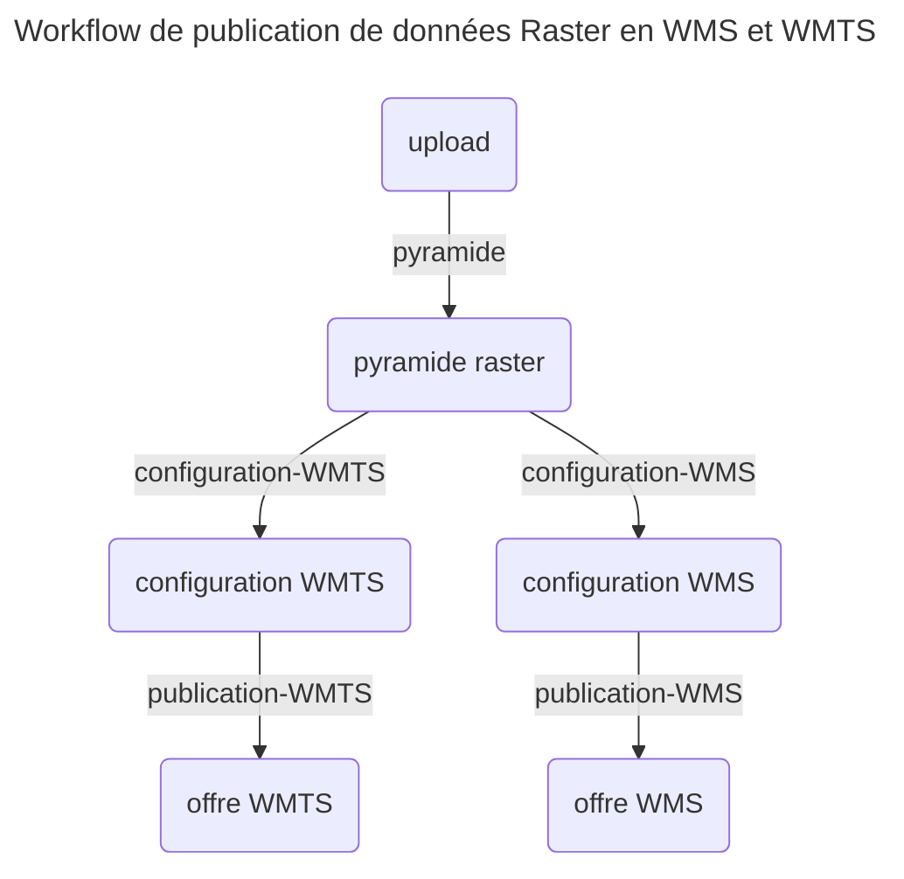

<!--
CE DOCUMENT N'A PAS VOCATION A ÊTRE LU DIRECTEMENT OU VIA GITHUB :
les liens seront cassés, l'affichage ne sera pas correcte. Ne faites ça !

Consultez la doc en ligne ici : https://geoplateforme.github.io/sdk-entrepot/

Le lien vers cette page devrait être : https://geoplateforme.github.io/sdk-entrepot/tutoriel_3_flux_raster/
-->

# Tutoriel 3 : publier un flux raster

La Géoplateforme permet d'héberger des flux raster pour permettre à vos utilisateur de les télécharger/utiliser.

Pour cela, vous devez téléverser des données « raster » sur lesquelles la Géoplateforme va effectuer des traitements.

Pour commencer, nous vous conseillons de suivre ce tutoriel qui vous permet de manipuler des données déjà existantes. Vous pouvez ensuite adapter chaque étape pour livrer vos données.

## Définition de la configuration

Suivez la page [configuration](configuration.md) pour définir le fichier de configuration.

## Récupération du jeu de données

Le jeu de données « 3_dataset_raster » contient des données raster à téléverser.

Récupérez les données en lançant la commande :

```sh
python -m sdk_entrepot_gpf example dataset 3_dataset_raster
```

Observez la structure du fichier :

```text
3_dataset_raster/
├── ain
│   ├── 01-2021-0920-6564-LA93-0M50-E100.tiff
│   ├── 01-2021-0920-6565-LA93-0M50-E100.tiff
│   ├── 01-2021-0921-6564-LA93-0M50-E100.tiff
│   └── 01-2021-0921-6565-LA93-0M50-E100.tiff
└── ain.md5
└── upload_descriptor.jsonc
```

Les données que la Géoplateforme va traiter sont situées dans le dossier `ain`.
Le fichier `ain.md5` permettra de valider les données téléversées côté Géoplateforme.

Enfin, le fichier `upload_descriptor.json` permet de décrire la livraison à effectuer.

## Fichier descripteur de livraison

Ouvrez le fichier `upload_descriptor.json` pour avoir plus de détails.

Il est composé d'une liste de `datasets` représentant chacun une livraison distincte.

Chaque dataset contient :

* la liste des dossiers à téléverser ;
* les informations de la livraison à créer (nom, description, srs et type) ;
* les commentaires et les tags à ajouter à la livraison.

## Livraison des données

Livrez les données en indiquant le chemin du fichier descripteur au programme :

```sh
python -m sdk_entrepot_gpf delivery 3_dataset_raster/upload_descriptor.jsonc
```

Le programme doit vous indiquer que le transfert est en cours, puis qu'il attend la fin des vérification côté API avant de conclure que tout est bon. (Memo : cette partie est assez longue du à des problèmes de performance côté back. Le problème a déjà été remonté.)

## Workflow

Une fois les données livrées, il faut traiter les données avant de les publier (c'est à dire effectuer un (ou plusieurs) géo-traitement(s), puis configurer un géo-service et le rendre accessible).

Ces étapes sont décrites grâces à un workflow.

Vous pouvez récupérer un workflow d'exemple grâce à la commande suivante :

```sh
python -m sdk_entrepot_gpf example workflow generic_raster.jsonc
```

Ouvrez le fichier. Vous trouverez plus de détails dans la [documentation sur les workflows](workflow.md), mais vous pouvez dès à présent voir que le workflow est composé de 4 étapes. Il faudra lancer une commande pour chacune d'elles.



## Traitement et publication

Le workflow « generic_raster » permet de passer de la livraison à un flux WMS servant la donnée. Il comporte les étapes suivantes:

* `pyramide` : création d'une pyramide avec les données téléversées
* `configuration-WMTS` : configuration d'un service de flux WMTS à partir de la pyramide ;
* `publication-WMTS` : publication du service de flux WMTS sur le bon endpoint.
* `configuration-WMS` : configuration d'un service de flux WMS à partir de la pyramide ;
* `publication-WMS` : publication du service de flux WMS sur le bon endpoint.

La partie WMTS et WMS sont indépendantes : elles peuvent être traitées en parallèle ou dans n'importe quel sens.

Les commandes à lancer sont les suivantes :

```sh
# partie création de la pyramide
python -m sdk_entrepot_gpf workflow -f generic_raster.jsonc -s pyramide
# partie publication WMTS
python -m sdk_entrepot_gpf workflow -f generic_raster.jsonc -s configuration-WMTS
python -m sdk_entrepot_gpf workflow -f generic_raster.jsonc -s publication-WMTS
# partie publication WMS
python -m sdk_entrepot_gpf workflow -f generic_raster.jsonc -s configuration-WMS
python -m sdk_entrepot_gpf workflow -f generic_raster.jsonc -s publication-WMS
```

La première commande ne doit pas être instantanée : un traitement est effectué et les logs doivent vous être remontés.

Le deux traitements suivants sont instantanés. A la fin, vous devez voir s'afficher un lien.
