# Security Templates

Pre-built security configurations for common use cases. No YAML configuration required!

## Overview

Security templates provide sensible defaults for different environments, eliminating the need to manually configure allowlists and blocklists. Simply specify a template when initializing SecureShell:

```python
from secureshell import SecureShell

# Use a template - no YAML needed!
shell = SecureShell(template="paranoid")
```

## Available Templates

### Comparison Table

| Template | Use Case | Allowlist | Blocklist | Gatekeeper |
|----------|----------|-----------|-----------|------------|
| **paranoid** | Maximum security | `ls`, `pwd`, `echo`, `cat` | `rm`, `dd`, `chmod`, `chown`, `sudo`, `curl`, `wget` | Required for all others (including `npm`, `pip`) |
| **development** | Local dev work | `ls`, `pwd`, `echo`, `cat`, `git`, `npm`, `pip`, `python`, `node` | `dd`, `mkfs`, `sudo` | Relaxed |
| **production** | Production safe | `ls`, `pwd`, `echo`, `cat` | `rm`, `dd`, `chmod`, `chown`, `sudo`, `mkfs` | Strict for mutations |
| **ci_cd** | CI/CD pipelines | `ls`, `git`, `npm`, `pip`, `docker`, `node`, `python` | `dd`, `mkfs`, `sudo` | Allows build tools |

---

## Template Details

### 🔒 paranoid

**When to use:** Maximum security environments, untrusted agents, or high-risk scenarios.

**Philosophy:** Trust nothing. Only allow the most basic read-only operations. Everything else requires explicit gatekeeper approval.

```python
shell = SecureShell(template="paranoid", provider=OpenAI(api_key="..."))
```

**Configuration:**
- ✅ **Allowlist:** `ls`, `pwd`, `echo`, `cat`
- ❌ **Blocklist:** `rm`, `dd`, `chmod`, `chown`, `sudo`, `curl`, `wget`
- 🤖 **Gatekeeper:** Required for `npm`, `pip`, `git`, and all other commands

**Example scenario:** Running LLM agents with untrusted code or sensitive data.

---

### 🛠️ development

**When to use:** Local development, experimenting with agents, prototyping.

**Philosophy:** Trust the developer. Allow common development tools without friction.

```python
shell = SecureShell(template="development", provider=Anthropic(api_key="..."))
```

**Configuration:**
- ✅ **Allowlist:** `ls`, `pwd`, `echo`, `cat`, `git`, `npm`, `pip`, `python`, `node`
- ❌ **Blocklist:** `dd`, `mkfs`, `sudo`
- 🤖 **Gatekeeper:** Relaxed, only blocks dangerous operations

**Example scenario:** Building and testing AI agents on your local machine.

---

### 🏭 production

**When to use:** Production environments, deployed agents, customer-facing systems.

**Philosophy:** Balanced security. Allow reads, strict review for writes, block dangerous operations.

```python
shell = SecureShell(template="production", provider=Gemini(api_key="..."))
```

**Configuration:**
- ✅ **Allowlist:** `ls`, `pwd`, `echo`, `cat`
- ❌ **Blocklist:** `rm`, `dd`, `chmod`, `chown`, `sudo`, `mkfs`
- 🤖 **Gatekeeper:** Strict review for all mutations (git push, npm install, etc.)

**Example scenario:** Production AI assistants that need to inspect systems but shouldn't modify them freely.

---

### 🚀 ci_cd

**When to use:** CI/CD pipelines, automated builds, deployment workflows.

**Philosophy:** Enable automation. Allow common build/deploy tools while blocking system-level dangers.

```python
shell = SecureShell(template="ci_cd", provider=OpenAI(api_key="..."))
```

**Configuration:**
- ✅ **Allowlist:** `ls`, `git`, `npm`, `pip`, `docker`, `node`, `python`
- ❌ **Blocklist:** `dd`, `mkfs`, `sudo`
- 🤖 **Gatekeeper:** Lenient for build tools, strict for system operations

**Example scenario:** AI-powered CI/CD agents that build, test, and deploy code.

---

## Customizing Templates

### Override with YAML

Templates can be customized by combining them with `secureshell.yaml`:

```python
# Load template, then override with YAML
shell = SecureShell(template="production")
```

Your `secureshell.yaml` settings will **override** the template:

```yaml
# Add additional allowlisted commands
allowlist:
  - "grep"
  - "find"

# Block additional commands
blocklist:
  - "docker"
```

### Override Programmatically

You can also override template settings in code:

```python
from secureshell import SecureShell, SecureShellConfig

# Start with a template
config = SecureShellConfig.load()

# Customize further
config.allowlist.extend(["grep", "find"])
config.blocklist.append("curl")

shell = SecureShell(template="production", config=config)
```

---

## Examples

See [templates_demo.py](templates_demo.py) for a complete working example of all templates.

### Quick comparisons

```python
import asyncio
from secureshell import SecureShell
from secureshell.providers.openai import OpenAI

async def test_templates():
    provider = OpenAI(api_key="sk-...")
    
    # Paranoid: echo is allowed, npm is blocked
    paranoid = SecureShell(template="paranoid", provider=provider)
    await paranoid.execute("echo hello", "testing")  # ✅ Allowed
    await paranoid.execute("npm install", "testing")  # ❌ Requires gatekeeper
    
    # Development: both allowed
    dev = SecureShell(template="development", provider=provider)
    await dev.execute("echo hello", "testing")  # ✅ Allowed
    await dev.execute("npm install axios", "adding dep")  # ✅ Allowed
    
    # Production: echo allowed, npm requires gatekeeper
    prod = SecureShell(template="production", provider=provider)
    await prod.execute("echo hello", "testing")  # ✅ Allowed
    await prod.execute("npm install", "testing")  # ⚠️  Gatekeeper review
```

---

## Choosing a Template

```mermaid
flowchart TD
    Start[Need a template?] --> Q1{What environment?}
    Q1 -->|Production/Untrusted| Paranoid[🔒 paranoid]
    Q1 -->|Local Development| Dev[🛠️ development]
    Q1 -->|Deployed Production| Prod[🏭 production]
    Q1 -->|CI/CD Pipeline| CICD[🚀 ci_cd]
    
    Paranoid --> Note1[Max security<br/>Minimal allowlist]
    Dev --> Note2[Developer friendly<br/>Most permissive]
    Prod --> Note3[Balanced<br/>Safe for production]
    CICD --> Note4[Build tool focused<br/>Automation ready]
```



**Quick decision guide:**

- 🔒 **paranoid**: "I don't trust this agent at all"
- 🛠️ **development**: "I'm building and testing locally"
- 🏭 **production**: "This is running in production"
- 🚀 **ci_cd**: "This is running in CI/CD"

---

## Template Configuration Reference

All templates are defined in [`secureshell/templates.py`](../secureshell/templates.py).

You can view available templates programmatically:

```python
from secureshell.templates import list_templates, get_template

# List all templates
print(list_templates())  # ['paranoid', 'development', 'production', 'ci_cd']

# Get template details
template = get_template("paranoid")
print(template.allowlist)  # ['ls', 'pwd', 'echo', 'cat']
print(template.blocklist)  # ['rm', 'dd', 'chmod', 'chown', 'sudo', 'curl', 'wget']
```
