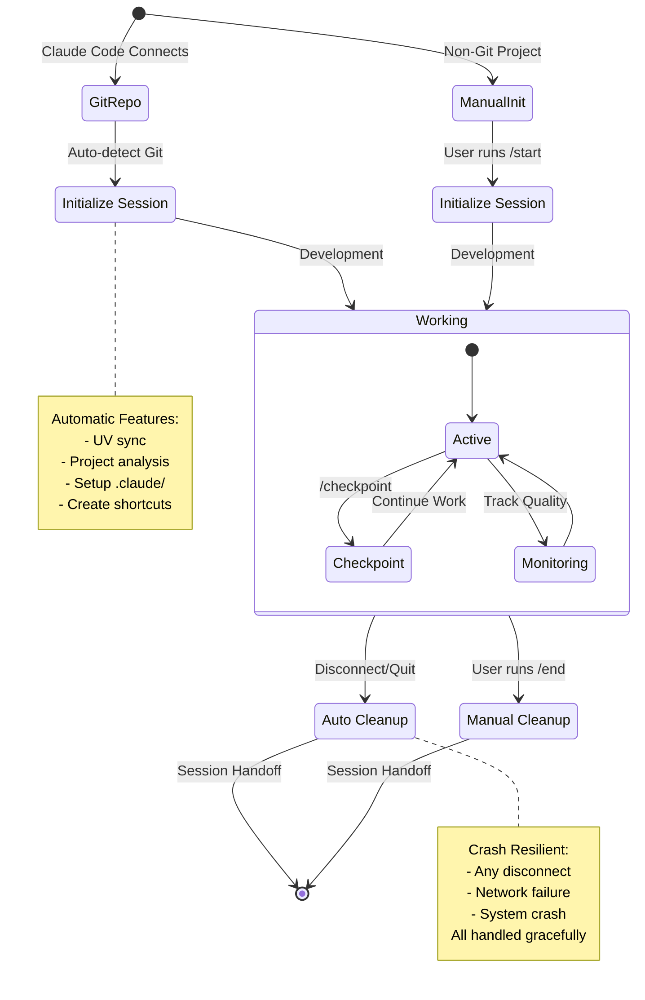

# Session Buddy

A Session Management MCP Server for Claude Code

[](https://github.com/lesleslie/crackerjack)
[](https://www.python.org/downloads/)


A dedicated MCP server that provides comprehensive session management functionality for Claude Code sessions across any project.

## 🌟 What Makes Session Buddy Unique?

Session Buddy isn't just another session management tool—it's an **intelligent development companion** that learns from your work and helps you work smarter across projects:

### 💡 Automatic Knowledge Capture

**Industry-First Feature**: Session Buddy automatically captures educational insights from your conversations using deterministic pattern matching—no manual note-taking required.

```markdown
Just write explanations like this:
`★ Insight ─────────────────────────────────────`
Your insight here...
`─────────────────────────────────────────────────`

And Session Buddy automatically:
✅ Extracts and stores it with semantic embeddings
✅ Prevents duplicate capture (SHA-256 hashing)
✅ Makes it searchable across all future sessions
✅ Requires zero configuration or manual effort
```

**The Result**: Build a personal knowledge base automatically while you work!

### 🌐 Cross-Project Intelligence

**Unique Capability**: Share knowledge across related projects automatically with dependency-aware search.

**Works Great For:**

- 🏗️ **Microservices**: Coordinate patterns across service boundaries
- 📦 **Monorepos**: Share insights across multiple packages/modules
- 🔗 **Multi-Repo**: Track patterns across related repositories
- 👥 **Teams**: Collaborative knowledge filtering with voting

**Example**: Fix an authentication issue in `auth-service`? Next time you work on `user-service` (which depends on `auth-service`), Session Buddy will surface that solution automatically.

### 🔒 Privacy-First Architecture

- ✅ **100% Local Processing**: No external API calls
- ✅ **Local AI Models**: ONNX embeddings run on your machine
- ✅ **Your Data Stays Yours**: Nothing leaves your system
- ✅ **Fast Performance**: \<50ms extraction, \<20ms search

______________________________________________________________________

## Features

### Core Session Management

- **🚀 Session Initialization**: Complete setup with UV dependency management, project analysis, and automation tools
- **🔍 Quality Checkpoints**: Mid-session quality monitoring with workflow analysis and optimization recommendations
- **🏁 Session Cleanup**: Comprehensive cleanup with learning capture and handoff file creation
- **📊 Status Monitoring**: Real-time session status and project context analysis
- **⚡ Auto-Generated Shortcuts**: Automatically creates `/start`, `/checkpoint`, and `/end` Claude Code slash commands

### 🧠 Intelligence Features (Unique to Session Buddy)

Session Buddy includes **industry-first** intelligent knowledge capture and sharing features that transform how you work across projects:

#### 💡 Automatic Insights Capture & Injection

**What It Does:**

- Automatically extracts educational insights from your conversations using deterministic pattern matching
- Stores insights with semantic embeddings for intelligent retrieval
- Prevents duplicate capture through SHA-256 content hashing
- Makes insights available across sessions via semantic search

**How It Works:**

When you use explanatory mode (like this session!), Session Buddy automatically captures insights marked with the `★ Insight ─────` delimiter:

```markdown
Some explanation text.

`★ Insight ─────────────────────────────────────`
Always use async/await for database operations to prevent blocking the event loop
`─────────────────────────────────────────────────`

More text here.
```

**Multi-Point Capture Strategy:**

- **Checkpoint Capture**: Extracts insights during mid-session quality checkpoints
- **Session End Capture**: Additional extraction when session ends
- **Deduplication**: SHA-256 hashing prevents storing duplicate insights
- **Session-Level Tracking**: Maintains hash set across entire session

**Benefits:**

- ✅ **Zero Configuration**: Works automatically with explanatory mode
- ✅ **No Hallucination**: Rule-based extraction (not AI-generated)
- ✅ **High Quality**: Conservative capture (better to miss than to hallucinate)
- ✅ **Fast Performance**: \<50ms extraction, \<20ms semantic search
- ✅ **Privacy-First**: All processing done locally, no external APIs

**Documentation:** See [`docs/features/INSIGHTS_CAPTURE.md`](docs/features/INSIGHTS_CAPTURE.md) for complete details

______________________________________________________________________

#### 🌐 Global Intelligence & Pattern Sharing

**What It Does:**

- Share knowledge across related projects automatically
- Track project dependencies (uses, extends, references, shares_code)
- Search across all projects with dependency-aware ranking
- Coordinate microservices, monorepo modules, or related repositories

**How It Works:**

Create groups of related projects and define their relationships:

```python
# Create project group
group = ProjectGroup(
    name="microservices-app",
    projects=["auth-service", "user-service", "api-gateway"],
    description="Authentication and user management microservices",
)

# Define dependencies
deps = [
    ProjectDependency(
        source_project="user-service",
        target_project="auth-service",
        dependency_type="uses",
        description="User service depends on auth service for validation",
    ),
    ProjectDependency(
        source_project="api-gateway",
        target_project="user-service",
        dependency_type="extends",
        description="Gateway extends user service with rate limiting",
    ),
]
```

**Cross-Project Search:**

- Search across related projects automatically
- Results ranked by dependency relationships
- Understand how solutions propagate across your codebase

**Benefits:**

- ✅ **Knowledge Reuse**: Solutions found in one project help with related projects
- ✅ **Dependency Awareness**: Understand how changes ripple across projects
- ✅ **Coordinated Development**: Work effectively across multiple codebases
- ✅ **Semantic Understanding**: Find patterns even when projects use different terminology

**Use Cases:**

- **Microservices**: Coordinate related services with shared patterns
- **Monorepos**: Manage multiple packages/modules in one repository
- **Multi-Repo**: Track patterns across separate but related repositories

______________________________________________________________________

## 🚀 Automatic Session Management (NEW!)

**For Git Repositories:**

- ✅ **Automatic initialization** when Claude Code connects
- ✅ **Automatic cleanup** when session ends (quit, crash, or network failure)
- ✅ **Intelligent auto-compaction** during checkpoints
- ✅ **Zero manual intervention** required

**For Non-Git Projects:**

- 📝 Use `/start` for manual initialization
- 📝 Use `/end` for manual cleanup
- 📝 Full session management features available on-demand

The server automatically detects git repositories and provides seamless session lifecycle management with crash resilience and network failure recovery. Non-git projects retain manual control for flexible workflow management.

### Session Lifecycle Visualization



### Git Repository Auto-Management Flow

```mermaid
flowchart TD
    Start([Claude Code Connects]) --> Detect{Git Repo?}

    Detect -->|Yes| AutoInit[Auto-Initialize]
    Detect -->|No| Manual{User runs /start?}

    AutoInit --> Setup[Session Setup]
    Setup --> UV[UV Sync]
    UV --> Analysis[Project Analysis]
    Analysis --> CreateDir[Create .claude/]
    CreateDir --> Shortcuts[Create Shortcuts]
    Shortcuts --> Ready([Session Ready])

    Manual -->|Yes| ManualInit[/start Command]
    Manual -->|No| Idle([No Session])
    ManualInit --> Ready

    Ready --> Work[Development Work]
    Work --> Checkpoint{Mid-session?}
    Checkpoint -->|Yes| Compact[Auto-Compact Context]
    Checkpoint -->|No| Continue{Continue?}
    Compact --> Work
    Continue -->|Yes| Work
    Continue -->|No| End

    Work --> End{Disconnect?}
    End -->|Yes| AutoCleanup[Auto Cleanup]
    End -->|No| Work

    AutoCleanup --> Handoff[Create Handoff Doc]
    Handoff --> Complete([Session Complete])

    Idle --> Manual
    Manual --> Complete

    style AutoInit fill:#c8e6c9
    style AutoCleanup fill:#c8e6c9
    style ManualInit fill:#fff9c4
    style Ready fill:#b2dfdb
    style Complete fill:#ffccbc
```

## Available MCP Tools

This server provides **79+ specialized tools** organized into 11 functional categories.
For a complete list of tools, see the [MCP Tools Reference](docs/user/MCP_TOOLS_REFERENCE.md).

### 🧠 Intelligence Tools (What Makes Session Buddy Unique)

**Insights Management:**

- `search_insights` - Search captured insights by topic or query with semantic matching
- `insights_statistics` - View statistics about captured insights (types, topics, confidence scores)
- Wildcard search with `*` to view all captured insights

**Multi-Project Coordination:**

- `create_project_group` - Create groups of related projects for coordinated development
- `add_project_dependency` - Track relationships between projects (uses, extends, references)
- `search_across_projects` - Search across all projects with dependency-aware ranking
- `get_project_insights` - Get cross-project insights and collaboration opportunities

**Team Collaboration:**

- `create_team` - Create teams for knowledge sharing
- `search_team_knowledge` - Search across team reflections with access control
- `get_team_statistics` - View team activity and contribution metrics
- `vote_on_reflection` - Upvote/downvote team reflections for quality filtering

______________________________________________________________________

### Core Session Management

- `start` - Comprehensive session initialization with project analysis and memory setup
- `checkpoint` - Mid-session quality assessment with workflow analysis
- `end` - Complete session cleanup with learning capture
- `status` - Current session overview with health checks

### Memory & Conversation Search

- `store_reflection` - Store insights with tagging and embeddings
- `quick_search` - Fast overview search with count and top results
- `search_summary` - Aggregated insights without individual result details
- `get_more_results` - Pagination support for large result sets
- `search_by_file` - Find conversations tied to a specific file
- `search_by_concept` - Semantic search by concept with optional file context

### Knowledge Graph (DuckPGQ)

- Entity and relationship management for project knowledge
- SQL/PGQ graph queries for complex relationship analysis
- See [Oneiric Migration Guide](docs/migrations/ONEIRIC_MIGRATION_PLAN.md)

All tools use **local processing** for privacy, with **DuckDB vector storage** (FLOAT[384] embeddings) and **ONNX-based semantic search** requiring no external API calls.

## 🚀 Integration with Crackerjack

Session Buddy includes deep integration with [Crackerjack](https://github.com/lesleslie/crackerjack), the AI-driven Python development platform:

**Key Features:**

- **📊 Quality Metrics Tracking**: Automatically captures and tracks quality scores over time
- **🧪 Test Result Monitoring**: Learns from test patterns, failures, and successful fixes
- **🔍 Error Pattern Recognition**: Remembers how specific errors were resolved and suggests solutions

**Example Workflow:**

1. 🚀 **Session Buddy `start`** - Sets up your session with accumulated context from previous work
1. 🔧 **Crackerjack runs** quality checks and applies AI agent fixes to resolve issues
1. 💾 **Session Buddy captures** successful patterns and error resolutions
1. 🧠 **Next session starts** with all accumulated knowledge

For detailed information on Crackerjack integration, see [Crackerjack Integration Guide](docs/CRACKERJACK.md).

## Installation

### From Source

```bash
# Clone the repository
git clone https://github.com/lesleslie/session-buddy.git
cd session-buddy

# Install with all dependencies (development + testing)
uv sync --group dev

# Or install minimal production dependencies only
uv sync

# Or use pip (for production only)
pip install session-buddy
```

### MCP Configuration

Add to your project's `.mcp.json` file:

```json
{
  "mcpServers": {
    "session-buddy": {
      "command": "python",
      "args": ["-m", "session_buddy.server"],
      "cwd": "/path/to/session-buddy",
      "env": {
        "PYTHONPATH": "/path/to/session-buddy"
      }
    }
  }
}
```

### Alternative: Use Script Entry Point

If installed with pip/uv, you can use the script entry point:

```json
{
  "mcpServers": {
    "session-buddy": {
      "command": "session-buddy",
      "args": [],
      "env": {}
    }
  }
}
```

**Dependencies:** Requires Python 3.13+. For a complete list of dependencies, see [pyproject.toml](pyproject.toml).
Recent changes include upgrading FastAPI to the 0.127+ series for improved compatibility and removing sitecustomize.py for faster startup reliability.

### 🧠 Setting Up Semantic Search (Optional)

Session Buddy includes semantic search capabilities using local AI embeddings with **no external API dependencies**.

**Current Status:**

- ✅ **Text Search**: Works out of the box (fast, keyword-based)
- ✅ **Semantic Search**: Works with ONNX model (no PyTorch required!)

**For Text Search (Default):**
No additional setup needed! The system uses full-text search with FTS5 for fast, accurate results.

**For Semantic Search (Optional):**

The system uses pre-converted ONNX models for efficient semantic search without requiring PyTorch:

```bash
# Download the pre-converted ONNX model (one-time setup)
python scripts/download_embedding_model.py
```

This downloads the **Xenova/all-MiniLM-L6-v2** model (~100MB) which includes:

- Pre-converted ONNX model (no PyTorch needed!)
- 384-dimensional embeddings for semantic similarity
- Fast CPU inference with ONNX Runtime

**Note**: Text search is highly effective and recommended for most use cases. Semantic search provides enhanced conceptual matching by understanding meaning beyond keywords.

## Usage

Once configured, the following slash commands become available in Claude Code:

**Primary Session Commands:**

- `/session-buddy:start` - Full session initialization
- `/session-buddy:checkpoint` - Quality monitoring checkpoint with scoring
- `/session-buddy:end` - Complete session cleanup with learning capture
- `/session-buddy:status` - Current status overview with health checks

**Auto-Generated Shortcuts:**
After running `/session-buddy:start` once, these shortcuts are automatically created:

- `/start` → `/session-buddy:start`
- `/checkpoint [name]` → `/session-buddy:checkpoint`
- `/end` → `/session-buddy:end`

> These shortcuts are created in `~/.claude/commands/` and work across all projects

**Memory & Search Commands:**

- `/session-buddy:quick_search` - Fast search with overview results
- `/session-buddy:search_summary` - Aggregated insights without full result lists
- `/session-buddy:get_more_results` - Paginate search results
- `/session-buddy:search_by_file` - Find results tied to a specific file
- `/session-buddy:search_by_concept` - Semantic search by concept
- `/session-buddy:search_code` - Search code-related conversations
- `/session-buddy:search_errors` - Search error and failure discussions
- `/session-buddy:search_temporal` - Search using time expressions
- `/session-buddy:store_reflection` - Store important insights with tagging
- `/session-buddy:reflection_stats` - Stats about the reflection database

For running the server directly in development mode:

```bash
python -m session_buddy.server
# or
session-buddy
```

## Memory System

**Built-in Conversation Memory:**

- **Local Storage**: DuckDB database at `~/.claude/data/reflection.duckdb`
- **Embeddings**: Local ONNX models for semantic search (no external API needed)
- **Privacy**: Everything runs locally with no external dependencies
- **Cross-Project**: Conversations tagged by project context for organized retrieval

**Search Capabilities:**

- **Semantic Search**: Vector similarity matching with customizable thresholds
- **Time Decay**: Recent conversations prioritized in results
- **Filtering**: Search by project context or across all projects

## Data Storage

This server manages its data locally in the user's home directory:

- **Memory Storage**: `~/.claude/data/reflection.duckdb`
- **Session Logs**: `~/.claude/logs/`
- **Configuration**: Uses pyproject.toml and environment variables

## Recommended Session Workflow

1. **Initialize Session**: `/session-buddy:start` - Sets up project context, dependencies, and memory system
1. **Monitor Progress**: `/session-buddy:checkpoint` (every 30-45 minutes) - Quality scoring and optimization
1. **Search Past Work**: `/session-buddy:quick_search` or `/session-buddy:search_summary` - Find relevant past conversations and solutions
1. **Store Important Insights**: `/session-buddy:store_reflection` - Capture key learnings for future sessions
1. **End Session**: `/session-buddy:end` - Final assessment, learning capture, and cleanup

## Benefits

### 🧠 Intelligence & Knowledge Sharing (Unique to Session Buddy)

- **Automatic Insights Capture**: Extracts educational insights from conversations without manual effort
- **Semantic Pattern Discovery**: Find related insights across sessions using vector embeddings
- **Cross-Project Learning**: Share knowledge between related projects automatically
- **Dependency Awareness**: Understand how solutions propagate across your codebase
- **Team Knowledge Base**: Collaborative filtering and voting for best practices
- **No Hallucination**: Rule-based extraction ensures only high-quality insights are captured

### Comprehensive Coverage

- **Session Quality**: Real-time monitoring and optimization
- **Memory Persistence**: Cross-session conversation retention
- **Project Structure**: Context-aware development workflows

### Reduced Friction

- **Single Command Setup**: One `/session-buddy:start` sets up everything
- **Local Dependencies**: No external API calls or services required
- **Intelligent Permissions**: Reduces repeated permission prompts
- **Automated Workflows**: Structured processes for common tasks

### Enhanced Productivity

- **Quality Scoring**: Guides session effectiveness
- **Built-in Memory**: Enables building on past work automatically
- **Project Templates**: Accelerates development setup
- **Knowledge Persistence**: Maintains context across sessions

## Documentation

Complete documentation is available in the `docs/` directory:

### 🧠 Intelligence Features (What Makes Session Buddy Unique)

- **[Intelligence Features Quick Start](docs/features/INTELLIGENCE_QUICK_START.md)** ⭐ **Start Here** - 5-minute practical guide

  - Automatic insights capture (how to use `★ Insight ─────` delimiters)
  - Cross-project intelligence (group related projects)
  - Team collaboration (shared knowledge with voting)
  - Advanced search techniques (semantic, faceted, temporal)
  - Configuration and troubleshooting

- **[Insights Capture & Deduplication](docs/features/INSIGHTS_CAPTURE.md)** ⭐ **Deep Dive**

  - Automatic extraction of educational insights from conversations
  - Multi-point capture strategy (checkpoint + session end)
  - SHA-256 deduplication to prevent duplicate insights
  - Semantic search with wildcard support
  - Complete test coverage (62/62 tests passing)
  - Architecture and implementation details

### User Documentation

- **User Documentation** - Quick start, configuration, and deployment guides
  - [Quick Start Guide](docs/user/QUICK_START.md) - Get started in 5 minutes
  - [Configuration Guide](docs/user/CONFIGURATION.md) - Advanced configuration options
  - [MCP Tools Reference](docs/user/MCP_TOOLS_REFERENCE.md) - Complete tool documentation

### Developer Documentation

- **Developer Documentation** - Architecture, testing, and integration guides
  - [Oneiric Migration Guide](docs/migrations/ONEIRIC_MIGRATION_PLAN.md) - Database migration
  - [Architecture Overview](docs/developer/ARCHITECTURE.md) - System design and patterns

### Feature Guides

- **Feature Guides** - In-depth documentation of specific features
  - [Token Optimization](docs/features/TOKEN_OPTIMIZATION.md) - Context window management
  - [Selective Auto-Store](docs/features/SELECTIVE_AUTO_STORE.md) - Reflection storage policy
  - [Auto Lifecycle](docs/features/AUTO_LIFECYCLE.md) - Automatic session management

### Reference

- **Reference** - MCP schemas and command references

## Troubleshooting

**Common Issues:**

- **Memory/embedding issues**: Ensure all dependencies are installed with `uv sync`
- **Path errors**: Verify `cwd` and `PYTHONPATH` are set correctly in `.mcp.json`
- **Permission issues**: Remove `~/.claude/sessions/trusted_permissions.json` to reset trusted operations

**Debug Mode:**

```bash
# Run with verbose logging
PYTHONPATH=/path/to/session-buddy python -m session_buddy.server --debug
```

For more detailed troubleshooting guidance, see [Configuration Guide](docs/user/CONFIGURATION.md) or [Quick Start Guide](docs/user/QUICK_START.md).
