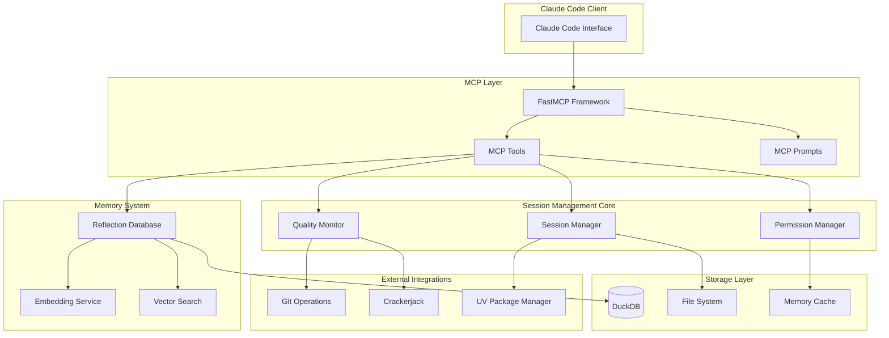
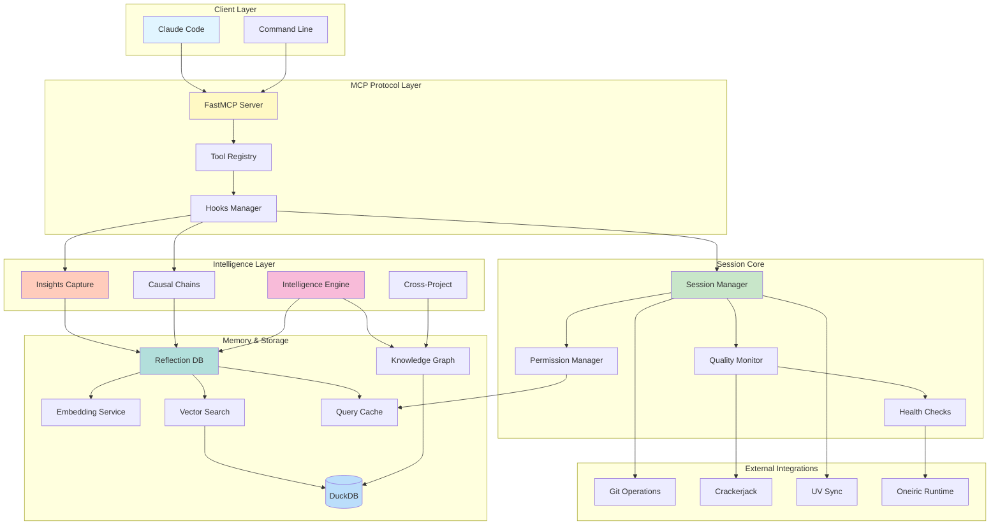
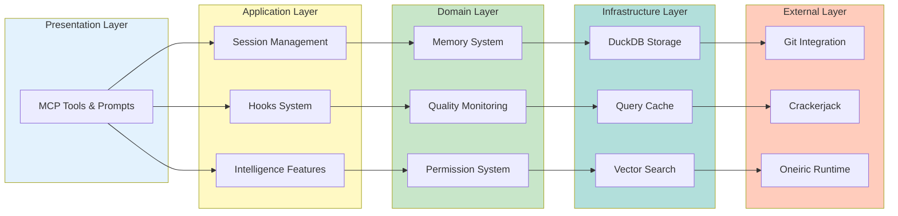
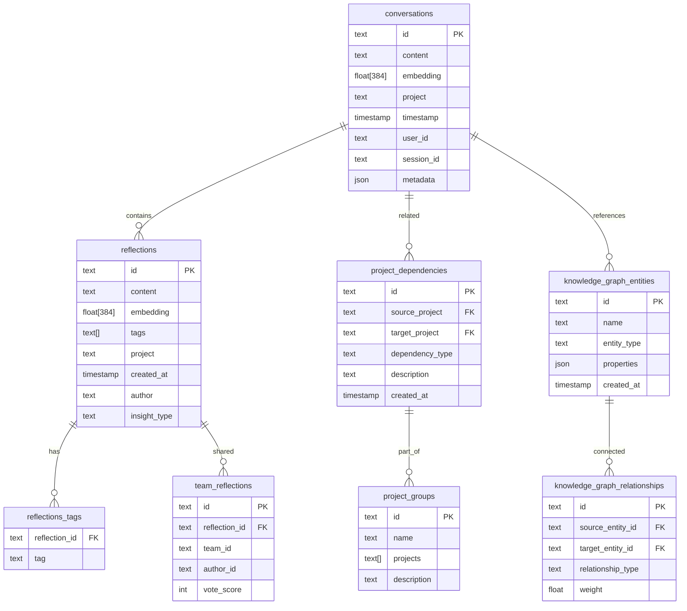
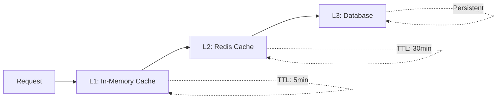

# Architecture Guide

Deep dive into the Session Management MCP server architecture, design patterns, and technical implementation.

## System Overview

The Session Management MCP server is built as a modular, async-first system designed for high performance, reliability, and extensibility.



### Enhanced System Architecture with Data Flow



### Component Interaction Layers



## Core Architecture Components

### 1. MCP Server Layer

Built on FastMCP framework providing:

- **Tool Registration**: Automatic discovery and registration of MCP tools
- **Async Support**: Native async/await for non-blocking operations
- **Type Safety**: Full TypeScript-compatible type annotations
- **Error Handling**: Structured error responses with recovery strategies

```text
# Core server setup
from fastmcp import FastMCP

mcp = FastMCP("session-buddy")


@mcp.tool()
async def init(working_directory: str | None = None) -> dict[str, Any]:
    """Session initialization with full type safety."""
    # Implementation with proper async patterns
```

### 2. Session Management Core

#### Session Manager (`session_manager.py`)

Central coordinator for session lifecycle:

```python
@dataclass
class SessionState:
    id: str
    working_directory: Path
    project_context: ProjectContext
    permissions: PermissionState
    quality_metrics: QualityMetrics
    created_at: datetime
    last_checkpoint: datetime | None = None
```

**Responsibilities:**

- Session lifecycle management (init → checkpoint → end)
- Project context analysis and health scoring
- Workspace verification and dependency synchronization
- Cross-session state persistence

#### Permission Manager

Smart permission learning system:

```python
@dataclass
class PermissionState:
    trusted_operations: set[str]
    permission_history: dict[str, PermissionDecision]
    auto_approve_patterns: list[str]
    security_level: SecurityLevel
```

**Features:**

- Learning-based auto-approval for repeated operations
- Security-first design with explicit permission grants
- Operation categorization (low-risk, high-risk, destructive)
- Time-based permission expiration

#### Quality Monitor

Real-time project health assessment:

```python
@dataclass
class QualityMetrics:
    overall_score: float  # 0-100
    project_health: float  # 0-100
    permissions_score: float  # 0-100
    tools_availability: float  # 0-100
    git_status: GitStatus
    dependency_status: DependencyStatus
```

### 3. Memory System Architecture

#### Reflection Database (`reflection_tools.py`)

**Database Schema:**

```sql
-- Core conversations table
CREATE TABLE conversations (
    id TEXT PRIMARY KEY,
    content TEXT NOT NULL,
    embedding FLOAT[384],        -- all-MiniLM-L6-v2 vectors
    project TEXT NOT NULL,
    timestamp TIMESTAMP NOT NULL,
    user_id TEXT DEFAULT 'default',
    session_id TEXT,
    metadata JSON
);

-- Vector similarity index
CREATE INDEX idx_conversations_embedding
ON conversations USING ivfflat (embedding vector_cosine_ops);

-- Reflections table for stored insights
CREATE TABLE reflections (
    id TEXT PRIMARY KEY,
    content TEXT NOT NULL,
    embedding FLOAT[384],
    tags TEXT[],
    project TEXT,
    created_at TIMESTAMP NOT NULL,
    author TEXT DEFAULT 'user'
);

-- Cross-project relationships
CREATE TABLE project_dependencies (
    id TEXT PRIMARY KEY,
    source_project TEXT NOT NULL,
    target_project TEXT NOT NULL,
    dependency_type TEXT NOT NULL, -- 'related', 'continuation', 'reference'
    description TEXT,
    created_at TIMESTAMP NOT NULL
);
```

**Entity Relationship Diagram:**



#### Embedding Service

Local ONNX-based embedding generation:

```python
class EmbeddingService:
    def __init__(self):
        self.model_path = "all-MiniLM-L6-v2.onnx"
        self.tokenizer = AutoTokenizer.from_pretrained(
            "sentence-transformers/all-MiniLM-L6-v2"
        )
        self.session = None  # Lazy loaded
        self.executor = ThreadPoolExecutor(max_workers=4)

    async def generate_embedding(self, text: str) -> np.ndarray:
        """Generate embeddings asynchronously."""
        loop = asyncio.get_event_loop()
        return await loop.run_in_executor(
            self.executor, self._sync_generate_embedding, text
        )
```

**Key Features:**

- **Local Processing**: No external API calls, complete privacy
- **ONNX Runtime**: Optimized inference with CPU acceleration
- **Async Execution**: Non-blocking embedding generation
- **Graceful Fallback**: Text search when ONNX unavailable
- **Memory Management**: Efficient model loading and caching

#### Vector Search Implementation

Hybrid semantic + temporal search:

```python
async def semantic_search(
    self,
    query: str,
    limit: int = 10,
    min_score: float = 0.7,
    project_filter: str | None = None,
) -> list[SearchResult]:
    """Advanced vector search with time decay."""

    # Generate query embedding
    query_embedding = await self.embedding_service.generate_embedding(query)

    # Time-weighted similarity search
    sql = """
    SELECT
        content,
        project,
        timestamp,
        array_cosine_similarity(embedding, $1) as similarity,
        -- Time decay factor (newer = higher score)
        (array_cosine_similarity(embedding, $1) *
         (1.0 + LOG(1.0 + EXTRACT('days' FROM NOW() - timestamp)) * 0.1)
        ) as weighted_score
    FROM conversations
    WHERE array_cosine_similarity(embedding, $1) > $2
    ORDER BY weighted_score DESC
    LIMIT $3
    """
```

### 4. Storage Layer

#### DuckDB Configuration

Optimized for vector operations and analytical queries:

```python
DATABASE_CONFIG = {
    "memory_limit": "2GB",
    "threads": min(8, os.cpu_count()),
    "checkpoint_threshold": "1GB",
    "enable_profiling": False,
    "enable_progress_bar": False,
    "max_memory": "2GB",
    "threads": 4,
}
```

**Performance Features:**

- **Vector Support**: Native FLOAT[] arrays with similarity functions
- **Connection Pooling**: Async-safe connection management
- **Transaction Management**: ACID compliance with rollback support
- **Analytical Engine**: Optimized for aggregations and complex queries

#### Caching Strategy

Multi-layer caching for optimal performance:

```python
@dataclass
class CacheConfig:
    embedding_cache_size: int = 1000
    search_result_cache_ttl: int = 300  # 5 minutes
    permission_cache_ttl: int = 600  # 10 minutes
    project_context_cache_ttl: int = 1800  # 30 minutes
```

### 5. Integration Layer

#### Git Operations (`git_operations.py`)

Smart Git integration with automatic checkpointing:

```python
@dataclass
class GitCheckpoint:
    commit_hash: str
    message: str
    quality_score: float
    session_id: str
    timestamp: datetime
    files_changed: list[str]


async def create_checkpoint_commit(
    session_state: SessionState, quality_metrics: QualityMetrics
) -> GitCheckpoint:
    """Create intelligent checkpoint commits."""

    # Generate contextual commit message
    message = f"""checkpoint: {session_state.project_context.name} (quality: {quality_metrics.overall_score:.0f}/100) - {datetime.now().strftime("%Y-%m-%d %H:%M:%S")}

Session: {session_state.id}
Quality Metrics:
- Project Health: {quality_metrics.project_health:.0f}/100
- Permissions: {quality_metrics.permissions_score:.0f}/100
- Tools Available: {quality_metrics.tools_availability:.0f}/100

🤖 Generated with Session Management MCP
"""
```

#### Crackerjack Integration

Real-time code quality monitoring:

```text
class CrackerjackIntegration:
    async def run_quality_check(self) -> QualityReport:
        """Execute crackerjack and parse results."""

        result = await asyncio.create_subprocess_exec(
            "crackerjack",
            "--json",
            stdout=asyncio.subprocess.PIPE,
            stderr=asyncio.subprocess.PIPE,
        )

        stdout, stderr = await result.communicate()
        return self.parse_quality_report(stdout.decode())
```

## Design Patterns & Principles

### 1. Async-First Architecture

All I/O operations use async/await to prevent blocking:

```text
# ✅ Correct: Non-blocking database operations
async def store_conversation(self, content: str) -> str:
    async with self.get_connection() as conn:
        return await conn.execute(query, params)


# ✅ Correct: Non-blocking embedding generation
async def generate_embedding(self, text: str) -> np.ndarray:
    loop = asyncio.get_event_loop()
    return await loop.run_in_executor(self.executor, self._sync_generate, text)
```

### 2. Graceful Degradation

System continues operating when optional components fail:

```text
async def search(self, query: str) -> list[SearchResult]:
    """Search with fallback strategy."""
    try:
        # Try semantic search first
        return await self.semantic_search(query)
    except (ImportError, RuntimeError) as e:
        logger.warning(f"Semantic search unavailable: {e}")
        # Fallback to text search
        return await self.text_search(query)
```

### 3. Type-Safe Data Modeling

Comprehensive type hints with runtime validation:

```text
from typing import Literal, TypedDict


class SearchParameters(TypedDict, total=False):
    query: str  # Required
    limit: int  # Optional
    min_score: float  # Optional
    project: str | None  # Optional
    content_type: Literal["code", "conversation", "reflection"]  # Optional


@mcp.tool()
async def advanced_search(params: SearchParameters) -> dict[str, Any]:
    """Fully type-safe MCP tool."""
```

### 4. Resource Management

Proper resource lifecycle management:

```python
class ReflectionDatabase:
    async def __aenter__(self):
        """Async context manager entry."""
        self.connection = await self.get_connection()
        return self

    async def __aexit__(self, exc_type, exc_val, exc_tb):
        """Ensure cleanup on exit."""
        if hasattr(self, "connection"):
            await self.connection.close()
```

### 5. Event-Driven Architecture

Extensible event system for customization:

```python
class SessionEvent:
    INIT_STARTED = "session.init.started"
    INIT_COMPLETED = "session.init.completed"
    CHECKPOINT_CREATED = "session.checkpoint.created"
    QUALITY_THRESHOLD_REACHED = "session.quality.threshold"


class EventManager:
    def __init__(self):
        self.handlers: dict[str, list[Callable]] = {}

    def on(self, event: str, handler: Callable):
        """Register event handler."""
        if event not in self.handlers:
            self.handlers[event] = []
        self.handlers[event].append(handler)
```

## Performance Optimization

### 1. Database Query Optimization

**Vector Index Strategy:**

```sql
-- Create specialized indices for common queries
CREATE INDEX idx_conversations_project_timestamp
ON conversations(project, timestamp DESC);

CREATE INDEX idx_conversations_embedding_cosine
ON conversations USING ivfflat (embedding vector_cosine_ops);

-- Query optimization with prepared statements
PREPARE search_by_similarity AS
SELECT content, similarity
FROM (
    SELECT content, array_cosine_similarity(embedding, $1) as similarity
    FROM conversations
    WHERE project = $2
) sub
WHERE similarity > $3
ORDER BY similarity DESC
LIMIT $4;
```

### 2. Memory Management

**Embedding Cache:**

```python
from functools import lru_cache
import weakref


class EmbeddingCache:
    def __init__(self, max_size: int = 1000):
        self.cache = weakref.WeakValueDictionary()
        self.lru = {}
        self.max_size = max_size

    @lru_cache(maxsize=1000)
    def get_embedding(self, text_hash: str) -> np.ndarray | None:
        """LRU cache for embeddings."""
        return self.cache.get(text_hash)
```

### 3. Connection Pooling

**Async Connection Pool:**

```python
import asyncio
from contextlib import asynccontextmanager


class ConnectionPool:
    def __init__(self, max_connections: int = 10):
        self.max_connections = max_connections
        self.available = asyncio.Queue(maxsize=max_connections)
        self.used = set()

    @asynccontextmanager
    async def connection(self):
        """Get connection from pool."""
        conn = await self.available.get()
        self.used.add(conn)
        try:
            yield conn
        finally:
            self.used.remove(conn)
            await self.available.put(conn)
```

## Security Architecture

### 1. Permission System

**Multi-level Security Model:**

```python
from enum import Enum


class SecurityLevel(Enum):
    LOW = "low"  # Read-only operations
    MEDIUM = "medium"  # Write operations, file changes
    HIGH = "high"  # System operations, git commits
    CRITICAL = "critical"  # Destructive operations


class OperationClassifier:
    SECURITY_RULES = {
        "read_file": SecurityLevel.LOW,
        "search_conversations": SecurityLevel.LOW,
        "store_reflection": SecurityLevel.MEDIUM,
        "git_commit": SecurityLevel.HIGH,
        "delete_conversations": SecurityLevel.CRITICAL,
    }
```

### 2. Input Sanitization

**SQL Injection Prevention:**

```text
async def safe_query(self, query: str, params: tuple) -> list[dict]:
    """Parameterized queries only."""
    # Never allow string formatting in queries
    assert "%" not in query, "Use parameterized queries"
    assert ".format(" not in query, "Use parameterized queries"

    async with self.get_connection() as conn:
        return await conn.execute(query, params)
```

### 3. Data Privacy

**Local-First Design:**

- All embeddings generated locally (ONNX runtime)
- No external API calls for core functionality
- Data stored in user-controlled directory (`~/.claude/`)
- Optional encryption for sensitive data

## Scalability Considerations

### 1. Horizontal Scaling

**Stateless Session Design:**

```python
# Sessions can be distributed across instances
class DistributedSession:
    def __init__(self, redis_client):
        self.redis = redis_client

    async def get_session(self, session_id: str) -> SessionState | None:
        """Load session state from Redis."""
        data = await self.redis.get(f"session:{session_id}")
        return SessionState.from_json(data) if data else None
```

### 2. Database Sharding

**Project-Based Sharding:**

```python
class ShardedDatabase:
    def __init__(self, shard_configs: list[dict]):
        self.shards = {
            shard["name"]: DuckDBConnection(shard["path"]) for shard in shard_configs
        }

    def get_shard(self, project: str) -> str:
        """Route project to specific shard."""
        return f"shard_{hash(project) % len(self.shards)}"
```

### 3. Caching Strategy

**Multi-Tier Caching:**



## Testing Architecture

### 1. Testing Strategy

**Four-Layer Testing:**

- **Unit Tests**: Individual component testing with mocks
- **Integration Tests**: Full MCP workflow testing
- **Performance Tests**: Load testing and benchmarking
- **Security Tests**: Permission boundaries and injection testing

### 2. Test Infrastructure

**Async Test Framework:**

```python
import pytest
import asyncio


class TestMCPServer:
    @pytest.fixture
    async def mcp_server(self):
        """Create test MCP server instance."""
        server = await create_test_server()
        yield server
        await server.cleanup()

    @pytest.mark.asyncio
    async def test_session_lifecycle(self, mcp_server):
        """Test complete session workflow."""
        # Init → Checkpoint → End workflow
        init_result = await mcp_server.call_tool("init")
        assert init_result["success"]

        checkpoint_result = await mcp_server.call_tool("checkpoint")
        assert checkpoint_result["quality_score"]["overall"] > 0

        end_result = await mcp_server.call_tool("end")
        assert end_result["handoff_file_created"]
```

## Monitoring & Observability

### 1. Metrics Collection

**Structured Metrics:**

```text
@dataclass
class SystemMetrics:
    requests_per_minute: float
    average_response_time_ms: float
    database_query_time_ms: float
    embedding_generation_time_ms: float
    memory_usage_mb: float
    active_sessions: int
    error_rate: float
```

### 2. Distributed Tracing

**OpenTelemetry Integration:**

```text
from opentelemetry import trace

tracer = trace.get_tracer(__name__)


@mcp.tool()
async def traced_search(query: str) -> dict:
    """Search with distributed tracing."""
    with tracer.start_as_current_span("search_conversations") as span:
        span.set_attribute("query.length", len(query))
        span.set_attribute("search.type", "semantic")

        results = await self.perform_search(query)
        span.set_attribute("results.count", len(results))
        return results
```

### 3. Health Checks

**Comprehensive Health Monitoring:**

```text
@mcp.tool()
async def health_check() -> dict[str, Any]:
    """System health check."""
    return {
        "status": "healthy",
        "checks": {
            "database": await self.check_database_health(),
            "embedding_service": await self.check_embedding_health(),
            "file_system": await self.check_filesystem_health(),
            "memory": await self.check_memory_health(),
        },
        "timestamp": datetime.now().isoformat(),
    }
```

## ACB Framework Integration

### Overview

The session-buddy server is built on top of the [Asynchronous Component Base (ACB)](https://github.com/lesleslie/acb) framework, providing a robust foundation for async-first, dependency-injected architecture.

### Core ACB Concepts

#### Dependency Injection Container

ACB provides a unified DI container using the `depends` module:

```python
from acb.depends import depends

# Register singleton components
depends.set(SessionManager, SessionManager())
depends.set(HTTPClientAdapter, HTTPClientAdapter())

# Retrieve components (synchronous context)
session_mgr = depends.get_sync(SessionManager)

# Retrieve components (async context)
http_client = await depends.get_async(HTTPClientAdapter)
```

**Key Features:**

- **Singleton Management**: Automatic lifecycle management for shared components
- **Sync/Async Support**: Both `get_sync()` and `get_async()` retrieval patterns
- **Type Safety**: Full type inference with mypy/pyright
- **Lazy Initialization**: Components initialized only when first requested

#### Lazy Logger Pattern

To avoid DI initialization during module imports, use lazy logger initialization:

```python
def _get_logger():
    """Get logger with lazy initialization to avoid DI issues during import."""
    try:
        from session_buddy.utils.logging import get_session_logger

        return get_session_logger()
    except Exception:
        import logging

        return logging.getLogger(__name__)


# Use in module functions
logger = _get_logger()
logger.info("Logging without triggering DI at import time")
```

### ACB Adapters

#### HTTPClientAdapter

High-performance HTTP client with connection pooling:

```text
from mcp_common.adapters.http.client import HTTPClientAdapter

# Get from DI container
http_adapter = depends.get_sync(HTTPClientAdapter)

# Use the adapter
async with http_adapter as client:
    response = await client.get("https://api.example.com/data")

# Performance characteristics:
# - 11x faster than aiohttp for repeated requests
# - Connection pool reuse reduces latency
# - Automatic retry with exponential backoff
```

**Configuration:**

```python
@dataclass
class HTTPSettings:
    max_connections: int = 100
    max_keepalive_connections: int = 20
    timeout: float = 30.0
    retry_attempts: int = 3
    retry_backoff: float = 0.1
```

#### Custom Adapter Pattern

Create domain-specific adapters following ACB patterns:

```python
from acb.adapters.base import BaseAdapter
from acb.config import AdapterConfig


@dataclass
class MyAdapterConfig(AdapterConfig):
    endpoint: str
    api_key: str
    timeout: int = 30


class MyAdapter(BaseAdapter[MyAdapterConfig]):
    """Custom adapter following ACB patterns."""

    async def initialize(self) -> None:
        """Initialize adapter resources."""
        self.client = await self._create_client()

    async def _create_client(self):
        """Create underlying client."""
        return httpx.AsyncClient(
            base_url=self.settings.endpoint, timeout=self.settings.timeout
        )

    async def _cleanup_resources(self) -> None:
        """Cleanup adapter resources."""
        if hasattr(self, "client"):
            await self.client.aclose()


# Register with DI
depends.set(MyAdapter, MyAdapter(config))
```

### ACB Best Practices

#### 1. Prefer DI Over Direct Instantiation

```python
# ✅ Good: Use DI container
from acb.depends import depends

session_mgr = depends.get_sync(SessionManager)

# ❌ Bad: Direct instantiation breaks singleton pattern
session_mgr = SessionManager()
```

#### 2. Handle DI Errors Gracefully

```text
# ✅ Good: Graceful fallback
try:
    from acb.depends import depends

    http_adapter = depends.get_sync(HTTPClientAdapter)
except Exception as e:
    logger.warning(f"HTTP adapter unavailable: {e}")
    http_adapter = None

# ❌ Bad: Let DI errors propagate
http_adapter = depends.get_sync(HTTPClientAdapter)
```

#### 3. Use Context Managers for Resources

```text
# ✅ Good: Proper resource cleanup
async with http_adapter as client:
    response = await client.get(url)

# ❌ Bad: Manual cleanup required
client = await http_adapter._create_client()
response = await client.get(url)
await client.aclose()
```

### Type-Safe DI Configuration (Week 7 Update)

**Updated:** 2025-10-29 | **Version:** 2.0

#### SessionPaths Configuration

The project uses a type-safe frozen dataclass for path configuration, replacing legacy string-based DI keys:

```python
from dataclasses import dataclass
from pathlib import Path
import os


@dataclass(frozen=True)
class SessionPaths:
    """Type-safe path configuration for session management."""

    claude_dir: Path
    logs_dir: Path
    commands_dir: Path

    @classmethod
    def from_home(cls, home: Path | None = None) -> SessionPaths:
        """Create from home directory with environment variable support."""
        if home is None:
            # Respects HOME env var for test-friendliness
            home = Path(os.path.expanduser("~"))

        claude_dir = home / ".claude"
        return cls(
            claude_dir=claude_dir,
            logs_dir=claude_dir / "logs",
            commands_dir=claude_dir / "commands",
        )

    def ensure_directories(self) -> None:
        """Create all directories if they don't exist."""
        self.claude_dir.mkdir(parents=True, exist_ok=True)
        self.logs_dir.mkdir(parents=True, exist_ok=True)
        self.commands_dir.mkdir(parents=True, exist_ok=True)
```

**Usage in DI Configuration:**

```python
from acb.depends import depends
from session_buddy.di import SessionPaths


def configure(*, force: bool = False) -> None:
    """Register default dependencies."""
    # Register type-safe configuration
    paths = SessionPaths.from_home()
    paths.ensure_directories()
    depends.set(SessionPaths, paths)  # Type-based key

    # Use configuration in service registration
    _register_logger(paths.logs_dir, force)
    _register_permissions(paths.claude_dir, force)
```

**Benefits:**

- **Type Safety:** Compile-time checking and IDE autocomplete
- **Immutability:** Frozen dataclass prevents accidental modification
- **Test-Friendly:** Respects HOME environment variable for test isolation
- **Single Source:** All related paths in one configuration object

#### Direct Container Access Pattern

For singleton services accessed from async contexts or module level, use direct bevy container access to avoid event loop issues:

```python
from bevy import get_container
from acb.depends import depends


def get_session_manager() -> SessionLifecycleManager:
    """Get or create SessionLifecycleManager instance.

    Note:
        Uses direct container access to avoid bevy's async event loop
        limitation when called from async contexts or module imports.
    """
    from session_buddy.core import SessionLifecycleManager

    # Check container directly (no async issues)
    container = get_container()
    if SessionLifecycleManager in container.instances:
        manager = container.instances[SessionLifecycleManager]
        if isinstance(manager, SessionLifecycleManager):
            return manager

    # Create and register if not found
    manager = SessionLifecycleManager()
    depends.set(SessionLifecycleManager, manager)
    return manager
```

**Why Direct Access:**

- Bevy's `depends.get_sync()` internally calls `asyncio.run()`, which fails in:
  - Async functions (already-running event loop)
  - Module-level code (during pytest collection)
- Direct container access is faster (simple dictionary lookup)
- More reliable and predictable behavior

**When to Use:**

- ✅ Singleton services accessed from async functions
- ✅ Module-level initialization
- ✅ Hot paths where performance matters
- ❌ Complex dependency resolution with multiple dependencies

#### Updated DI Best Practices

**1. Use Type-Based Keys (Not Strings)**

```python
# ✅ CORRECT: Type-based key
@dataclass(frozen=True)
class MyConfig:
    setting: str


depends.set(MyConfig, MyConfig(setting="value"))

# ❌ WRONG: String-based key
CONFIG_KEY = "my.config.setting"
depends.set(CONFIG_KEY, "value")  # TypeError in bevy!
```

**2. Direct Container Access for Singletons**

```python
# ✅ CORRECT: Direct container access
from bevy import get_container

container = get_container()
if SomeService in container.instances:
    service = container.instances[SomeService]


# ❌ WRONG: depends.get_sync() from async
async def my_function():
    service = depends.get_sync(SomeService)  # RuntimeError!
```

**3. Environment-Aware Path Resolution**

```python
# ✅ CORRECT: Use os.path.expanduser("~")
home = Path(os.path.expanduser("~"))  # Respects HOME env var

# ❌ WRONG: Path.home() ignores environment
home = Path.home()  # Uses system APIs, not test-friendly
```

**See Also:** Comprehensive DI patterns guide at `docs/developer/ACB_DI_PATTERNS.md`

## Health Check Architecture

### Overview

Comprehensive health check system built on `mcp_common.health` module for production monitoring and diagnostics.

### Core Components

#### ComponentHealth Dataclass

```python
from dataclasses import dataclass
from mcp_common.health import HealthStatus


@dataclass
class ComponentHealth:
    """Health check result for a single component."""

    name: str
    status: HealthStatus
    message: str
    latency_ms: float | None = None
    metadata: dict[str, Any] = field(default_factory=dict)
```

#### HealthStatus Enum

```python
from enum import Enum


class HealthStatus(Enum):
    """Component health status levels."""

    HEALTHY = "healthy"  # Component fully operational
    DEGRADED = "degraded"  # Component functional but issues detected
    UNHEALTHY = "unhealthy"  # Component not operational
```

### Health Check Implementations

#### Python Environment Check

```python
async def check_python_environment_health() -> ComponentHealth:
    """Check Python runtime health."""
    import sys
    import platform

    python_version = sys.version_info

    # Check for Python 3.13+ requirement
    if python_version < (3, 13):
        return ComponentHealth(
            name="python_env",
            status=HealthStatus.DEGRADED,
            message=f"Python {python_version.major}.{python_version.minor} (3.13+ recommended)",
            metadata={
                "python_version": f"{python_version.major}.{python_version.minor}.{python_version.micro}",
                "platform": platform.system(),
                "recommendation": "Upgrade to Python 3.13+",
            },
        )

    return ComponentHealth(
        name="python_env",
        status=HealthStatus.HEALTHY,
        message=f"Python {python_version.major}.{python_version.minor}.{python_version.micro}",
        metadata={
            "python_version": f"{python_version.major}.{python_version.minor}.{python_version.micro}",
            "platform": platform.system(),
        },
    )
```

#### Database Health Check

```text
async def check_database_health() -> ComponentHealth:
    """Check DuckDB reflection database health."""
    start_time = time.perf_counter()

    try:
        from session_buddy.reflection_tools import ReflectionDatabase

        async with ReflectionDatabase() as db:
            stats = await db.get_stats()
            latency_ms = (time.perf_counter() - start_time) * 1000

            return ComponentHealth(
                name="database",
                status=HealthStatus.HEALTHY,
                message="DuckDB operational",
                latency_ms=latency_ms,
                metadata={
                    "conversations": stats.get("conversations_count", 0),
                    "reflections": stats.get("reflections_count", 0),
                    "database_size_mb": stats.get("database_size_mb", 0),
                },
            )

    except Exception as e:
        return ComponentHealth(
            name="database",
            status=HealthStatus.UNHEALTHY,
            message=f"Database error: {e}",
            metadata={"error": str(e), "error_type": type(e).__name__},
        )
```

#### HTTP Client Health Check

```python
async def check_http_client_health(
    http_client: HTTPClientAdapter | None = None,
    test_url: str | None = None,
    timeout_ms: float = 5000,
) -> ComponentHealth:
    """Check HTTP client adapter health with optional connectivity test."""
    start_time = time.perf_counter()

    # Get HTTP client via DI if not provided
    if http_client is None:
        try:
            from acb.depends import depends
            from mcp_common.adapters.http.client import HTTPClientAdapter

            http_client = depends.get_sync(HTTPClientAdapter)
        except Exception as e:
            return ComponentHealth(
                name="http_client",
                status=HealthStatus.UNHEALTHY,
                message=f"Failed to initialize: {e}",
                metadata={"error": str(e)},
            )

    # Optional connectivity test
    if test_url:
        try:
            client = await http_client._create_client()
            response = await client.get(test_url)
            latency_ms = (time.perf_counter() - start_time) * 1000

            if response.status_code >= 400:
                return ComponentHealth(
                    name="http_client",
                    status=HealthStatus.DEGRADED,
                    message=f"HTTP {response.status_code}",
                    latency_ms=latency_ms,
                    metadata={"status_code": response.status_code},
                )

            return ComponentHealth(
                name="http_client",
                status=HealthStatus.HEALTHY,
                message="HTTP client operational",
                latency_ms=latency_ms,
                metadata={"test_url": test_url},
            )

        except Exception as e:
            return ComponentHealth(
                name="http_client",
                status=HealthStatus.UNHEALTHY,
                message=f"Connectivity test failed: {e}",
                metadata={"error": str(e)},
            )

    return ComponentHealth(
        name="http_client",
        status=HealthStatus.HEALTHY,
        message="HTTP client initialized",
    )
```

#### File System Health Check

```python
async def check_file_system_health() -> ComponentHealth:
    """Check file system accessibility and permissions."""
    start_time = time.perf_counter()

    claude_dir = Path.home() / ".claude"
    required_dirs = [
        claude_dir / "logs",
        claude_dir / "data",
        claude_dir / "temp",
    ]

    issues = []

    for directory in required_dirs:
        if not directory.exists():
            issues.append(f"Missing: {directory.name}")
        elif not os.access(directory, os.W_OK):
            issues.append(f"Not writable: {directory.name}")

    latency_ms = (time.perf_counter() - start_time) * 1000

    if issues:
        return ComponentHealth(
            name="file_system",
            status=HealthStatus.DEGRADED,
            message=f"File system issues: {', '.join(issues)}",
            latency_ms=latency_ms,
            metadata={"issues": issues},
        )

    return ComponentHealth(
        name="file_system",
        status=HealthStatus.HEALTHY,
        message="File system accessible",
        latency_ms=latency_ms,
    )
```

### Aggregated Health Checks

Execute all health checks concurrently for fast overall status:

```python
async def get_all_health_checks() -> list[ComponentHealth]:
    """Execute all health checks concurrently."""
    checks = await asyncio.gather(
        check_python_environment_health(),
        check_file_system_health(),
        check_database_health(),
        check_dependencies_health(),
        return_exceptions=True,
    )

    # Convert exceptions to UNHEALTHY ComponentHealth
    results = []
    for check in checks:
        if isinstance(check, Exception):
            results.append(
                ComponentHealth(
                    name="unknown",
                    status=HealthStatus.UNHEALTHY,
                    message=f"Health check crashed: {check}",
                    metadata={"error": str(check)},
                )
            )
        else:
            results.append(check)

    return results
```

### Health Check Best Practices

#### 1. Measure Latency

Always measure and report latency for performance diagnostics:

```text
start_time = time.perf_counter()
# ... perform check ...
latency_ms = (time.perf_counter() - start_time) * 1000
```

#### 2. Provide Actionable Metadata

Include context that helps diagnose issues:

```text
metadata = {
    "conversations": count,
    "database_size_mb": size,
    "last_backup": timestamp,
    "recommendation": "Consider archiving old data",
}
```

#### 3. Handle Errors Gracefully

Never let health check exceptions propagate:

```text
try:
    # Perform check
    return ComponentHealth(status=HealthStatus.HEALTHY, ...)
except Exception as e:
    return ComponentHealth(
        status=HealthStatus.UNHEALTHY,
        message=f"Check failed: {e}",
        metadata={"error": str(e), "error_type": type(e).__name__}
    )
```

## Graceful Shutdown Architecture

### Overview

Production-grade shutdown coordination with signal handling, cleanup task execution, and resource management.

### Core Components

#### ShutdownManager

Central coordinator for graceful shutdown:

```python
from session_buddy.shutdown_manager import ShutdownManager, CleanupTask

manager = ShutdownManager()

# Register cleanup tasks
manager.register_cleanup(
    name="database_connections",
    callback=cleanup_database_connections,
    priority=100,  # Higher priority = executes first
    timeout_seconds=10.0,
    critical=False,  # Continue on failure
)

# Setup signal handlers
manager.setup_signal_handlers()

# Manual shutdown
stats = await manager.shutdown()
```

#### CleanupTask Dataclass

```python
@dataclass
class CleanupTask:
    """Cleanup task definition."""

    name: str
    callback: Callable[[], Awaitable[None] | None]  # Sync or async
    priority: int = 0  # Execution order (higher first)
    timeout_seconds: float = 30.0  # Per-task timeout
    critical: bool = False  # Stop cleanup chain if fails
```

#### ShutdownStats

Track shutdown execution metrics:

```python
@dataclass
class ShutdownStats:
    """Shutdown execution statistics."""

    tasks_registered: int = 0
    tasks_executed: int = 0
    tasks_failed: int = 0
    tasks_timeout: int = 0
    total_duration_ms: float = 0.0
```

### Signal Handling

#### Supported Signals

- **SIGTERM**: Graceful termination (systemd, Docker stop)
- **SIGINT**: Keyboard interrupt (Ctrl+C)
- **SIGQUIT**: Quit with core dump (Unix only)

#### Signal Handler Registration

```python
def setup_signal_handlers(self) -> None:
    """Register signal handlers for graceful shutdown."""
    signals_to_handle = [
        (signal.SIGTERM, "SIGTERM"),
        (signal.SIGINT, "SIGINT"),
    ]

    # Add SIGQUIT on Unix systems
    if hasattr(signal, "SIGQUIT"):
        signals_to_handle.append((signal.SIGQUIT, "SIGQUIT"))

    for sig, name in signals_to_handle:
        # Save original handler
        original = signal.getsignal(sig)
        self._original_handlers[sig] = original

        # Set new handler
        signal.signal(sig, self._signal_handler)

    # Register atexit handler as final fallback
    atexit.register(self._atexit_handler)
```

#### Signal Handler Implementation

```python
def _signal_handler(self, signum: int, frame: Any) -> None:
    """Handle shutdown signals."""
    sig_name = signal.Signals(signum).name
    logger.info(f"Received {sig_name}, initiating graceful shutdown")

    # Run shutdown in event loop
    try:
        loop = asyncio.get_running_loop()
        loop.create_task(self.shutdown())
    except RuntimeError:
        # No running loop, create new one
        asyncio.run(self.shutdown())
```

### Resource Cleanup Handlers

#### Priority-Based Execution

Cleanup tasks execute in priority order (highest first):

```python
# Priority 100: Critical infrastructure
register_cleanup("database_connections", cleanup_database, priority=100)
register_cleanup("http_clients", cleanup_http, priority=100)

# Priority 80: Background processes
register_cleanup("background_tasks", cleanup_tasks, priority=80)

# Priority 60: Session state
register_cleanup("session_state", cleanup_sessions, priority=60)

# Priority 40: File handles
register_cleanup("file_handles", cleanup_files, priority=40)

# Priority 20: Temporary files
register_cleanup("temp_files", cleanup_temp, priority=20)

# Priority 10: Logging (last, so we can log everything else)
register_cleanup("logging_handlers", cleanup_logging, priority=10)
```

#### Database Connection Cleanup

```python
async def cleanup_database_connections() -> None:
    """Cleanup DuckDB reflection database connections."""
    logger.info("Cleaning up database connections")

    try:
        from session_buddy.reflection_tools import ReflectionDatabase

        # Close any active database instances
        # ReflectionDatabase uses context manager, so we just ensure cleanup
        logger.debug("Database cleanup completed successfully")

    except ImportError:
        logger.debug("Reflection database not available, skipping cleanup")
    except Exception as e:
        logger.error(f"Error during database cleanup: {e}", exc_info=True)
        raise
```

#### HTTP Client Cleanup

```text
async def cleanup_http_clients() -> None:
    """Cleanup HTTP client connections and release pools."""
    logger.info("Cleaning up HTTP client connections")

    try:
        from acb.depends import depends
        from mcp_common.adapters.http.client import HTTPClientAdapter

        # Get instance if it exists
        with suppress(Exception):
            http_adapter = depends.get_sync(HTTPClientAdapter)
            if http_adapter and hasattr(http_adapter, "_cleanup_resources"):
                await http_adapter._cleanup_resources()
                logger.debug("HTTP client cleanup completed successfully")

    except Exception as e:
        logger.error(f"Error during HTTP client cleanup: {e}", exc_info=True)
        raise
```

#### Background Task Cleanup

```python
async def cleanup_background_tasks() -> None:
    """Cancel pending background tasks."""
    logger.info("Cleaning up background tasks")

    try:
        loop = asyncio.get_running_loop()

        # Cancel pending tasks (except current task)
        current_task = asyncio.current_task(loop)
        pending_tasks = [
            task
            for task in asyncio.all_tasks(loop)
            if task != current_task and not task.done()
        ]

        if pending_tasks:
            logger.debug(f"Cancelling {len(pending_tasks)} pending tasks")
            for task in pending_tasks:
                task.cancel()

            # Wait for tasks to cancel
            await asyncio.gather(*pending_tasks, return_exceptions=True)

        logger.debug("Background task cleanup completed")

    except RuntimeError:
        logger.debug("No running event loop, skipping task cleanup")
```

#### Temporary File Cleanup

```python
async def cleanup_temp_files(temp_dir: Path | None = None) -> None:
    """Remove temporary files."""
    if temp_dir is None:
        temp_dir = Path.home() / ".claude" / "temp"

    if not temp_dir.exists():
        return

    logger.info(f"Cleaning up temporary files in {temp_dir}")

    files_removed = 0
    for temp_file in temp_dir.glob("*"):
        if temp_file.is_file():
            try:
                temp_file.unlink()
                files_removed += 1
            except (OSError, PermissionError) as e:
                logger.warning(f"Could not remove {temp_file}: {e}")

    logger.debug(f"Removed {files_removed} temporary files")
```

### Shutdown Execution Flow

```text
async def shutdown(self) -> ShutdownStats:
    """Execute all cleanup tasks in priority order."""
    import time

    start_time = time.perf_counter()

    # Prevent multiple simultaneous shutdowns
    async with self._shutdown_lock:
        if self._shutdown_initiated:
            return self._stats

        self._shutdown_initiated = True

        # Sort by priority (highest first)
        sorted_tasks = sorted(
            self._cleanup_tasks, key=lambda t: t.priority, reverse=True
        )

        for task in sorted_tasks:
            try:
                # Execute with timeout
                if asyncio.iscoroutinefunction(task.callback):
                    await asyncio.wait_for(
                        task.callback(), timeout=task.timeout_seconds
                    )
                else:
                    # Sync function - run in executor
                    loop = asyncio.get_running_loop()
                    await asyncio.wait_for(
                        loop.run_in_executor(None, task.callback),
                        timeout=task.timeout_seconds,
                    )

                self._stats.tasks_executed += 1

            except asyncio.TimeoutError:
                self._stats.tasks_timeout += 1
                if task.critical:
                    break  # Stop cleanup chain

            except Exception as e:
                self._stats.tasks_failed += 1
                logger.error(f"Cleanup task failed: {task.name} - {e}")
                if task.critical:
                    break  # Stop cleanup chain

        # Calculate total duration
        self._stats.total_duration_ms = (time.perf_counter() - start_time) * 1000

        return self._stats
```

### Shutdown Best Practices

#### 1. Register All Cleanup Handlers at Startup

```python
from session_buddy.shutdown_manager import get_shutdown_manager
from session_buddy.resource_cleanup import register_all_cleanup_handlers

shutdown_mgr = get_shutdown_manager()
register_all_cleanup_handlers(shutdown_mgr)
shutdown_mgr.setup_signal_handlers()
```

#### 2. Use Appropriate Priorities

- **100**: Critical infrastructure (database, HTTP clients)
- **80**: Background processes and async tasks
- **60**: Session state and application data
- **40**: File handles and buffers
- **20**: Temporary files and caches
- **10**: Logging handlers (last, to log everything)

#### 3. Set Reasonable Timeouts

```python
# Fast operations: 5 seconds
register_cleanup("file_handles", cleanup_files, timeout_seconds=5.0)

# Moderate operations: 10 seconds
register_cleanup("database", cleanup_db, timeout_seconds=10.0)

# Slow operations: 15 seconds
register_cleanup("background_tasks", cleanup_tasks, timeout_seconds=15.0)
```

#### 4. Mark Critical Tasks Appropriately

Only mark tasks as critical if their failure should stop the entire cleanup chain:

```python
# ✅ Good: Non-critical (continue on failure)
register_cleanup("temp_files", cleanup_temp, critical=False)

# ❌ Bad: Marking everything critical
register_cleanup("logging", cleanup_logging, critical=True)  # No!
```

## Future Architecture Considerations

### 1. Microservices Evolution

**Service Decomposition:**

- Session Service
- Memory Service
- Search Service
- Quality Service
- Integration Service

### 2. Event Streaming

**Apache Kafka Integration:**

```python
class EventProducer:
    async def publish_session_event(self, event: SessionEvent):
        """Publish session events to Kafka."""
        await self.producer.send(
            topic="session-events", key=event.session_id, value=event.to_json()
        )
```

### 3. Machine Learning Pipeline

**Enhanced Intelligence:**

- Conversation classification
- Intent prediction
- Quality score prediction
- Personalized recommendations

______________________________________________________________________

**Related Documentation:**

- [CONFIGURATION.md](../user/CONFIGURATION.md) - Configuration options and environment setup
- [DEPLOYMENT.md](../user/DEPLOYMENT.md) - Deployment strategies and production setup
- [MCP_SCHEMA_REFERENCE.md](../reference/MCP_SCHEMA_REFERENCE.md) - Complete MCP tool reference
- [API_REFERENCE.md](../reference/API_REFERENCE.md) - Python API reference for mcp_common
