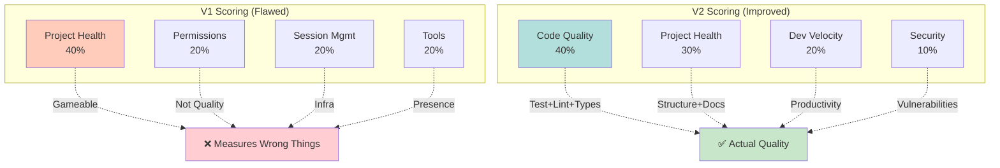
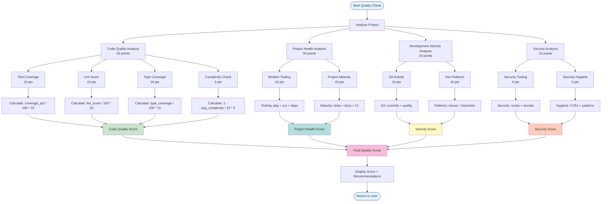
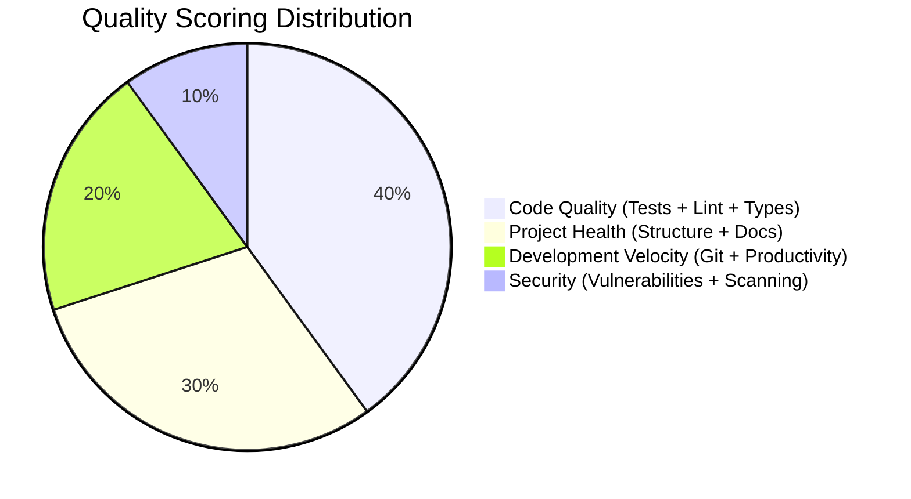

# Quality Scoring Algorithm V2

## Problem Statement

The current quality scoring system (V1) has critical flaws:

1. **Measures Wrong Things**: 50% of score based on permissions and session tools (not code quality)
1. **Penalizes Modern Tooling**: Missing requirements.txt reduces score even when using UV
1. **Gameable**: Trust 4 operations = instant +20 points regardless of code quality
1. **Binary Indicators**: One missing file = -5.7 points, no gradation
1. **Ignores Actual Quality**: Doesn't check test coverage, lint scores, or code health

### Current Algorithm (Flawed)

```text
# V1 Scoring (Total: 100 points)
project_health = (indicators / 7) * 40  # 40% - Binary file checks
permissions = min(trusted_ops * 5, 20)  # 20% - Gameable, not quality
session_mgmt = 20 if available else 5  # 20% - Infrastructure, not quality
tools = 20 if uv_available else 10  # 20% - Tool presence, not usage

# Result: 73/100 for excellent projects missing requirements.txt
```

## New Algorithm Design (V2)

### V1 vs V2 Scoring Comparison



### Core Principle

**Measure what matters: actual code quality, not file existence or tool availability.**

### New Formula (Total: 100 points)

```text
# V2 Scoring - Actual Code Quality
code_quality     = 40%  # Test coverage, lint scores, type checking
project_health   = 30%  # Structure, documentation, CI/CD
dev_velocity     = 20%  # Commit patterns, issue tracking, productivity
security         = 10%  # Dependency audits, secret scanning, vulnerabilities

# Permissions/tools moved to separate "Trust Score" metric (not in quality)
```

### Detailed Breakdown

#### 1. Code Quality (40 points) - PRIMARY METRIC

Integrates with Crackerjack quality metrics:

```text
# Sub-components:
test_coverage    = 15 points  # From Crackerjack CODE_COVERAGE
lint_score       = 10 points  # From Crackerjack LINT_SCORE
type_coverage    = 10 points  # From pyright/mypy via Crackerjack
complexity       = 5 points   # From Crackerjack COMPLEXITY (inverse)

# Calculation:
code_quality_score = (
    (test_coverage_pct / 100) * 15 +      # 85% coverage = 12.75 pts
    (lint_score / 100) * 10 +              # Crackerjack normalized 0-100
    (type_coverage_pct / 100) * 10 +       # Type hints coverage
    (1 - (avg_complexity / 15)) * 5        # Lower complexity = higher score
)
```

#### 2. Project Health (30 points) - STRUCTURAL QUALITY

Modernized indicators with smart detection:

```text
# Modern tooling (15 points):
package_management = 5 pts   # pyproject.toml + (uv.lock OR requirements.txt)
version_control    = 5 pts   # .git + meaningful commit history
dependency_mgmt    = 5 pts   # Lockfile present + recent updates

# Project maturity (15 points):
testing_infra      = 5 pts   # tests/ + conftest.py + >10 tests
documentation      = 5 pts   # README + docs/ OR inline docstrings >50%
ci_cd_pipeline     = 5 pts   # .github/workflows + passing status

# Calculation:
project_health_score = (
    _calculate_tooling_score() +      # 0-15 points
    _calculate_maturity_score()       # 0-15 points
)
```

#### 3. Development Velocity (20 points) - PRODUCTIVITY METRICS

Measures development health:

```text
# Git activity (10 points):
commit_frequency   = 5 pts   # Regular commits (not too sparse, not spam)
commit_quality     = 5 pts   # Conventional commits, meaningful messages

# Development patterns (10 points):
issue_tracking     = 5 pts   # Issues referenced in commits
branch_strategy    = 5 pts   # Feature branches, PR workflow

# Calculation:
velocity_score = (
    _analyze_git_activity() +         # 0-10 points
    _analyze_dev_patterns()           # 0-10 points
)
```

#### 4. Security (10 points) - SAFETY METRICS

Critical security indicators:

```text
# Security tooling (5 points):
dependency_scan    = 3 pts   # Bandit/safety checks via Crackerjack
secret_detection   = 2 pts   # No hardcoded secrets/keys

# Security hygiene (5 points):
vuln_free_deps     = 3 pts   # No critical CVEs in dependencies
secure_patterns    = 2 pts   # No eval(), exec(), SQL injection patterns

# Calculation:
security_score = (
    _run_security_checks() +          # 0-5 points
    _check_security_hygiene()         # 0-5 points
)
```

### Separate: Trust Score (Not in Quality)

Permissions and session management moved to separate metric:

```text
# Trust Score (separate from quality, 0-100)
trusted_operations   = 40 pts  # Number of trusted operations
session_availability = 30 pts  # Session management features
tool_ecosystem       = 30 pts  # Available MCP tools and integrations

# This measures "how much the system trusts your environment"
# NOT "how good your code is"
```

### Quality Scoring Calculation Flow



### Scoring Category Breakdown



## Implementation Strategy

### Phase 1: Crackerjack Integration

1. Use existing `CrackerjackIntegration.get_quality_metrics_history()`
1. Extract: test_pass_rate, code_coverage, lint_score, security_score, complexity_score
1. Cache results for 5 minutes to avoid re-running Crackerjack on every checkpoint

### Phase 2: Git Analysis

1. Parse git log for commit patterns
1. Analyze commit messages for conventional commits format
1. Check for branch strategy (feature branches vs main-only)

### Phase 3: Project Structure Analysis

1. Smart detection: UV OR requirements.txt (not penalizing modern tools)
1. Documentation quality: count docstrings, not just README existence
1. CI/CD: check workflow status via GitHub API or file timestamps

### Phase 4: Security Integration

1. Run bandit/safety via Crackerjack if not cached
1. Check for .env in .gitignore
1. Scan for hardcoded secrets patterns

## Scoring Examples

### Example 1: Modern Python Project (This Repository)

```text
# Code Quality (40 points)
test_coverage:    31.6% → 4.7 points   # Low coverage hurts
lint_score:       100   → 10 points    # Clean code
type_coverage:    90%   → 9 points     # Good type hints
complexity:       avg 8 → 3.7 points   # Low complexity

# Project Health (30 points)
tooling:          15 points  # pyproject.toml + uv.lock + git
maturity:         13 points  # tests/ + docs/ + README (no CI/CD -2)

# Development Velocity (20 points)
git_activity:     9 points   # Regular commits, good messages
dev_patterns:     7 points   # Feature branches, some issue refs

# Security (10 points)
security_tools:   5 points   # Crackerjack security checks
hygiene:         4 points   # Clean patterns

# TOTAL: 4.7 + 10 + 9 + 3.7 + 15 + 13 + 9 + 7 + 5 + 4 = 81/100
# (Up from 73, now reflects actual quality with test coverage penalty)
```

### Example 2: Excellent Project

```text
# Code Quality: 38/40 (95% coverage, perfect lint, 100% types, low complexity)
# Project Health: 28/30 (full tooling, CI/CD, excellent docs)
# Dev Velocity: 18/20 (active development, good patterns)
# Security: 10/10 (all checks pass)
# TOTAL: 94/100 (Achievable with actual quality, not by gaming permissions)
```

### Example 3: Quick Script (Low Quality Expected)

```text
# Code Quality: 8/40 (no tests, some lint issues)
# Project Health: 8/30 (just .py files, no structure)
# Dev Velocity: 5/20 (few commits)
# Security: 6/10 (some basic checks)
# TOTAL: 27/100 (Honest assessment of code quality)
```

## Migration Plan

1. **Implement new algorithm** as `calculate_quality_score_v2()`
1. **Run both algorithms** in parallel for comparison
1. **Log differences** to analyze scoring changes
1. **Switch default** after validation period
1. **Deprecate V1** after 1 month

## Benefits

✅ **Measures Real Quality**: Test coverage, lint scores, actual code metrics
✅ **Modern Tooling**: UV-first, not penalized for skipping requirements.txt
✅ **Not Gameable**: Can't boost score by just trusting operations
✅ **Actionable**: Score directly correlates to code improvements
✅ **Integrated**: Leverages existing Crackerjack infrastructure
✅ **Honest**: Low score means low quality, high score earned through quality

## API Changes

```text
# Old API (deprecated)
quality_data = await calculate_quality_score()
# Returns: {"total_score": 73, "breakdown": {...}}

# New API
quality_data = await calculate_quality_score_v2()
# Returns:
{
    "total_score": 81,
    "version": "2.0",
    "breakdown": {
        "code_quality": {"score": 27.4, "max": 40, "details": {...}},
        "project_health": {"score": 28, "max": 30, "details": {...}},
        "dev_velocity": {"score": 16, "max": 20, "details": {...}},
        "security": {"score": 9, "max": 10, "details": {...}},
    },
    "trust_score": {
        "score": 85,
        "breakdown": {
            "trusted_operations": 32,
            "session_availability": 28,
            "tool_ecosystem": 25,
        },
    },
    "recommendations": [...],
}
```

## Next Steps

1. Implement `calculate_quality_score_v2()` in `session_buddy/utils/quality_utils_v2.py`
1. Add Crackerjack integration with caching
1. Implement git analysis utilities
1. Create comprehensive test suite
1. Update MCP tools to use V2
