# Intelligence Features Quick Start Guide

**Session Buddy's unique intelligence features**: Automatic knowledge capture and cross-project pattern sharing

**Time to get started**: 5 minutes

______________________________________________________________________

## 1. 💡 Automatic Insights Capture

### What It Does

Session Buddy automatically extracts educational insights from your conversations when you use the `★ Insight ─────` delimiter pattern.

### How to Use It

**Step 1: Write explanations in explanatory mode**

When you explain something to users (or when Claude explains something to you), mark key insights:

```markdown
You should use async/await for database operations.

`★ Insight ─────────────────────────────────────`
Always use async/await for database operations to prevent blocking the event loop and maintain responsiveness
`─────────────────────────────────────────────────`

This pattern ensures your application remains responsive during I/O operations.
```

**Step 2: Run checkpoints**

Session Buddy automatically extracts insights at two points:

```bash
# Checkpoint during work
/checkpoint

# End session
/end
```

**Step 3: Search your insights**

```bash
# Search for insights about async patterns
/session-buddy:search_insights "async database"

# View all captured insights
/session-buddy:search_insights "*"

# View statistics
/session-buddy:insights_statistics
```

### Example Workflow

```bash
# 1. Start your session
/start

# 2. Work normally, use ★ Insight delimiters for key points

# 3. Mid-work checkpoint (extracts insights)
/checkpoint

# 4. Continue working...

# 5. End session (extracts more insights, deduplicates)
/end

# 6. Next session: Search past insights
/session-buddy:search_insights "topic you're working on"
```

### Insight Capture Flow

```mermaid
flowchart TD
    Start([Start Session]) --> Work[Work with Explanatory Mode]
    Work --> Write[Write ★ Insight Delimiters]
    Write --> Work

    Work --> Checkpoint{Run Checkpoint?}
    Checkpoint -->|Yes| Extract1[Extract Insights]
    Checkpoint -->|No| Continue[Continue Work]
    Continue --> Work

    Extract1 --> Hash1[Calculate SHA-256]
    Hash1 --> Dedupe1{Duplicate?}
    Dedupe1 -->|No| Store1[Store with Embeddings]
    Dedupe1 -->|Yes| Skip1[Skip Duplicate]
    Store1 --> Work
    Skip1 --> Work

    Work --> End{End Session?}
    End -->|Yes| Extract2[Extract Final Insights]
    End -->|No| Work

    Extract2 --> Hash2[Calculate SHA-256]
    Hash2 --> Dedupe2{Duplicate?}
    Dedupe2 -->|No| Store2[Store with Embeddings]
    Dedupe2 -->|Yes| Skip2[Skip Duplicate]

    Store2 --> Search[Available for Search]
    Skip2 --> Search

    Search --> Query[Query: search_insights]
    Query --> Semantic[Semantic Search]
    Semantic --> Results[Ranked Results]

    style Start fill:#e1f5ff
    style Work fill:#fff9c4
    style Extract1 fill:#c8e6c9
    style Extract2 fill:#c8e6c9
    style Store1 fill:#b2dfdb
    style Store2 fill:#b2dfdb
    style Search fill:#ffccbc
    style Results fill:#f8bbd9
```



Session Buddy captures insights when:

1. **You run `/checkpoint`**: Extracts insights from conversation so far
1. **You end session**: Extracts any new insights (duplicates are filtered out)
1. **Quality threshold**: Only captures insights with confidence ≥0.5 (configurable)
1. **Rate limiting**: Max 10 insights per checkpoint (configurable)

### Configuration

Edit `~/.claude/settings/session-buddy.yaml`:

```yaml
enable_insight_extraction: true  # Enable/disable
insight_extraction_confidence_threshold: 0.5  # Minimum confidence
insight_extraction_max_per_checkpoint: 10  # Rate limiting
```

______________________________________________________________________

## 2. 🌐 Cross-Project Intelligence

### What It Does

Share knowledge across related projects with dependency-aware search and coordination.

### How to Use It

**Step 1: Create project groups**

```python
# In Claude Code, ask to create a project group
"I want to create a project group called 'microservices-app'
with projects: auth-service, user-service, api-gateway"
```

Or use the MCP tool directly:

```python
from session_buddy.multi_project_coordinator import ProjectGroup

group = ProjectGroup(
    name="microservices-app",
    projects=["auth-service", "user-service", "api-gateway"],
    description="Authentication and user management microservices"
)
```

**Step 2: Define dependencies**

```python
from session_buddy.multi_project_coordinator import ProjectDependency

deps = [
    ProjectDependency(
        source_project="user-service",
        target_project="auth-service",
        dependency_type="uses",
        description="User service depends on auth service"
    ),
    ProjectDependency(
        source_project="api-gateway",
        target_project="user-service",
        dependency_type="extends",
        description="Gateway extends user service"
    )
]
```

**Step 3: Search across projects**

```bash
# Search across all related projects
/session-buddy:search_across_projects "authentication pattern" "microservices-app"

# Get project insights
/session-buddy:get_project_insights ["auth-service", "user-service"]
```

### Cross-Project Dependency Visualization


### Cross-Project Knowledge Sharing Flow


### Example Use Cases

#### Use Case 1: Microservices Architecture

**Scenario**: You have 5 microservices that share authentication patterns.

**Setup**:

```python
# Create group
microservices = ProjectGroup(
    name="api-platform",
    projects=["auth-service", "user-service", "payment-service",
              "notification-service", "audit-service"]
)

# Define dependencies
deps = [
    ProjectDependency("user-service", "auth-service", "uses"),
    ProjectDependency("payment-service", "auth-service", "uses"),
    ProjectDependency("notification-service", "user-service", "extends"),
    # ... more dependencies
]
```

**Benefit**: Fix an auth bug once, all dependent services learn about it automatically.

#### Use Case 2: Monorepo with Multiple Packages

**Scenario**: You have a monorepo with frontend, backend, shared packages.

**Setup**:

```python
monorepo = ProjectGroup(
    name="web-app",
    projects=["frontend", "backend", "shared-utils", "types"]
)
```

**Benefit**: API changes in backend automatically surface when working on frontend.

#### Use Case 3: Multi-Repo Related Projects

**Scenario**: Separate repos for client, server, and shared contracts.

**Setup**:

```python
distributed = ProjectGroup(
    name="distributed-system",
    projects=["client-app", "server-api", "shared-contracts"]
)
```

**Benefit**: Contract changes in shared-contracts alert both client and server teams.

### Dependency Types

- **`uses`**: Direct dependency (imports, API calls)
- **`extends`**: Enhancement or wrapper (adds functionality)
- **`references`**: Loose coupling (documentation, patterns)
- **`shares_code`**: Code sharing (common libraries, utilities)

______________________________________________________________________

## 3. 👥 Team Collaboration

### What It Does

Create teams for shared knowledge with collaborative filtering and voting.

### How to Use It

**Step 1: Create a team**

```python
from session_buddy.core.team_management import Team

team = Team(
    team_id="platform-team",
    name="Platform Team",
    description="Backend platform development team",
    owner_id="user-123"
)
```

**Step 2: Share knowledge**

When team members store reflections with `team_id`, they become searchable:

```bash
/session-buddy:store_reflection
  content="Use Redis for session caching with 5-minute TTL"
  team_id="platform-team"
  tags=["caching", "redis", "performance"]
```

**Step 3: Search team knowledge**

```bash
# Search team reflections
/session-buddy:search_team_knowledge
  query="caching strategies"
  user_id="user-123"
  team_id="platform-team"
```

**Step 4: Vote on quality**

```bash
# Upvote helpful reflections
/session-buddy:vote_on_reflection
  reflection_id="abc-123"
  user_id="user-123"
  vote_delta=1  # Upvote
```

**Benefit**: High-quality reflections float to the top through community voting.

______________________________________________________________________

## 4. 🔍 Advanced Search Techniques

### Semantic Search

Find insights by meaning, not just keywords:

```bash
# Find insights about "async patterns" even if not exact match
/session-buddy:search_insights "concurrent database operations"

# Wildcard to see everything
/session-buddy:search_insights "*"
```

### Faceted Search

Combine filters for precise results:

```bash
# Search by file
/session-buddy:search_by_file "database.py"

# Search by concept with file context
/session-buddy:search_by_concept "error handling" "src/api/"

# Search errors only
/session-buddy:search_errors "database connection timeout"

# Temporal search
/session-buddy:search_temporal "last week insights about testing"
```

### Search Summary

Get aggregated insights without full result lists:

```bash
/session-buddy:search_summary "authentication"
# Returns:
# - Total count: 23 insights found
# - Top topics: JWT, session management, OAuth
# - Quality trends: Improving over time
# - No full result list (faster)
```

______________________________________________________________________

## 5. 📊 Analytics & Statistics

### Insights Statistics

View what's been captured:

```bash
/session-buddy:insights_statistics
```

Returns:

- Total insights captured
- Breakdown by type (pattern, architecture, best_practice, gotcha)
- Top topics
- Confidence score distribution
- Usage statistics (most referenced)

### Reflection Stats

```bash
/session-buddy:reflection_stats
```

Returns:

- Total reflections stored
- Projects with most reflections
- Search trends
- Database size and performance

### Team Statistics

```bash
/session-buddy:get_team_statistics
  team_id="platform-team"
  user_id="user-123"
```

Returns:

- Team member contributions
- Most voted reflections
- Activity trends
- Knowledge coverage

______________________________________________________________________

## 6. ⚙️ Configuration

### Feature Flags

Edit `~/.claude/settings/session-buddy.yaml`:

```yaml
# Insights capture
enable_insight_extraction: true
insight_extraction_confidence_threshold: 0.5  # 0.3-0.7
insight_extraction_max_per_checkpoint: 10  # Rate limiting

# Search settings
search_similarity_threshold: 0.7  # Semantic search threshold
search_max_results: 20  # Default results limit
```

### Environment Variables

```bash
# Disable insight extraction
export SESSION_BUDDY_ENABLE_INSIGHT_EXTRACTION="false"

# Custom database path
export SESSION_BUDDY_DATABASE_PATH="/custom/path/reflection.duckdb"

# Adjust confidence threshold
export SESSION_BUDDY_INSIGHT_CONFIDENCE="0.7"
```

______________________________________________________________________

## 7. 🎯 Best Practices

### Writing Better Insights

**DO** ✅:

- Be specific and actionable
- Include context and rationale
- Use concrete examples
- Mark truly valuable insights

```markdown
`★ Insight ─────────────────────────────────────`
Always validate user input at the API boundary, not just in business logic. This prevents invalid data from entering your system and provides clearer error messages to clients.
`─────────────────────────────────────────────────`
```

**DON'T** ❌:

- Mark every statement as an insight
- Capture trivial information
- Be vague or overly general
- Duplicate existing insights

```markdown
# Too trivial
`★ Insight ─────────────────────────────────────`
Use functions to organize code.
`─────────────────────────────────────────────────`

# Too vague
`★ Insight ─────────────────────────────────────`
Write good code.
`─────────────────────────────────────────────────`
```

### Organizing Projects

**DO** ✅:

- Group related projects meaningfully
- Define accurate dependencies
- Use descriptive project names
- Document relationships

**DON'T** ❌:

- Group unrelated projects together
- Create circular dependencies
- Use cryptic abbreviations
- Over-depend on other projects

### Team Collaboration

**DO** ✅:

- Vote on high-quality reflections
- Tag with relevant topics
- Share across teams appropriately
- Document team-specific knowledge

**DON'T** ❌:

- Spam with low-quality reflections
- Over-tag everything
- Share sensitive information publicly
- Duplicate existing team knowledge

______________________________________________________________________

## 8. 🐛 Troubleshooting

### Insights Not Being Captured

**Problem**: No insights appear after checkpoint/session_end

**Checks**:

1. **Verify feature is enabled**:

   ```bash
   grep enable_insight_extraction ~/.claude/settings/session-buddy.yaml
   ```

1. **Check conversation has insights**:

   - Look for `★ Insight ─────` delimiters
   - Ensure proper formatting (exact delimiters required)

1. **Check confidence threshold**:

   - Insights below threshold (default: 0.5) are filtered out
   - Lower threshold temporarily: `export SESSION_BUDDY_INSIGHT_CONFIDENCE="0.3"`

1. **Check logs**:

   ```bash
   tail -f ~/.claude/logs/session-buddy.log | grep -i insight
   ```

### Cross-Project Search Not Working

**Problem**: Results don't include related projects

**Checks**:

1. **Verify project group exists**:

   ```python
   # Check in Python
   from session_buddy.multi_project_coordinator import MultiProjectCoordinator
   coordinator = MultiProjectCoordinator()
   groups = await coordinator.list_project_groups()
   ```

1. **Check dependencies are defined**:

   ```python
   deps = await coordinator.list_dependencies(
       source_project="user-service"
   )
   ```

1. **Verify projects share knowledge**:

   - Ensure reflections are tagged with project names
   - Check `search_insights` with `project="*"` (search all)

### Search Returns No Results

**Problem**: `search_insights` returns empty list

**Checks**:

1. **Wildcard search**:

   ```bash
   /session-buddy:search_insights "*"
   ```

   If this returns results, your data is there, just not matching your query.

1. **Lower threshold**:

   ```bash
   /session-buddy:search_insights "your query" min_similarity=0.5
   ```

1. **Check database**:

   ```python
   import duckdb
   conn = duckdb.connect("~/.claude/data/reflection.duckdb")
   result = conn.execute("SELECT COUNT(*) FROM default_reflections WHERE insight_type IS NOT NULL")
   print(result.fetchone())  # Should be > 0
   ```

______________________________________________________________________

## 9. 📚 Further Reading

- **[Insights Capture & Deduplication](INSIGHTS_CAPTURE.md)** - Complete technical details
- **[MCP Tools Reference](../user/MCP_TOOLS_REFERENCE.md)** - All intelligence tools

<!-- - **[Claude Flow V2 Integration](../archive/implementation-plans/CLAUDE_FLOW_INTEGRATION_PLAN_V2.md)** - Future roadmap (file not found) -->

- **[Architecture Overview](../developer/ARCHITECTURE.md)** - System design

______________________________________________________________________

## 10. 🚀 Quick Reference

### Essential Commands

```bash
# Capture insights automatically
/checkpoint  # Captures at mid-point
/end         # Captures at end, deduplicates

# Search insights
/session-buddy:search_insights "topic"        # Semantic search
/session-buddy:search_insights "*"             # View all
/session-buddy:insights_statistics             # View stats

# Cross-project
/session-buddy:create_project_group ...         # Create group
/session-buddy:add_project_dependency ...       # Add dependency
/session-buddy:search_across_projects "query" "group"  # Search related

# Team
/session-buddy:create_team ...                  # Create team
/session-buddy:search_team_knowledge ...        # Team search
/session-buddy:vote_on_reflection ...          # Vote on quality
```

### Common Workflows

**New Feature Development**:

```bash
/start → Work with ★ Insight delimiters → /checkpoint →
Continue → /end → /search_insights "new feature"
```

**Bug Investigation**:

```bash
/search_errors "error message" → Review solutions →
/store_reflection "fix approach" → Vote on quality
```

**Multi-Project Coordination**:

```bash
/create_project_group → /add_project_dependency →
/search_across_projects "pattern" "group"
```

______________________________________________________________________

**Last Updated**: January 10, 2026
**Status**: Production Ready ✅
**Test Coverage**: 62/62 tests passing (100%)
