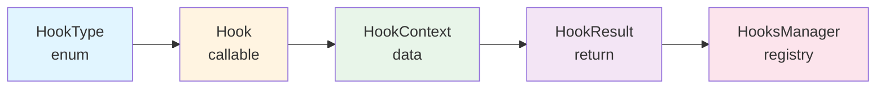
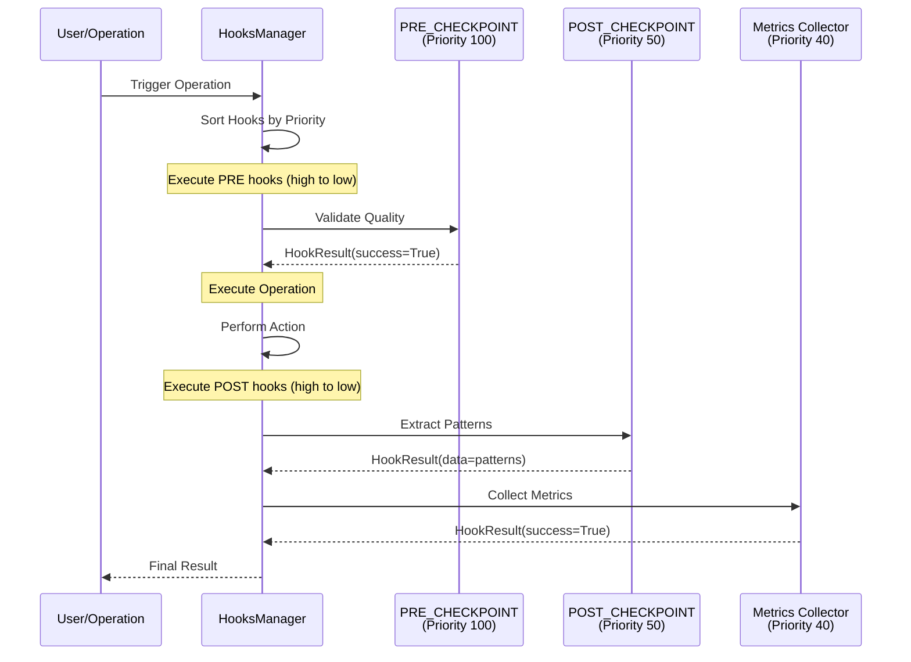

# Hooks System - Developer Guide

## Overview

The Hooks System provides a comprehensive event-driven architecture for session lifecycle management in Session Buddy. It allows you to register custom callbacks that execute at specific points during the development workflow.

## Architecture

### Component Flow



### Hook Execution Sequence



### Core Components

1. **HookType**: Enumeration of hook points (PRE_CHECKPOINT, POST_ERROR, etc.)
1. **Hook**: Callable with metadata (name, priority, enabled status)
1. **HookContext**: Data passed to hooks (session_id, timestamp, file_path, etc.)
1. **HookResult**: Return value with success status, causal_chain_id, and modifications
1. **HooksManager**: Central registry and executor for all hooks

## Hook Types

### Pre-Operation Hooks

Execute **before** an operation occurs:

- `PRE_CHECKPOINT` - Before quality checkpoint
- `PRE_TOOL_EXECUTION` - Before MCP tool execution
- `PRE_REFLECTION_STORE` - Before storing a reflection
- `PRE_SESSION_END` - Before session cleanup

**Use Cases**: Validation, context modification, operation cancellation

### Post-Operation Hooks

Execute **after** an operation completes:

- `POST_CHECKPOINT` - After quality checkpoint
- `POST_TOOL_EXECUTION` - After MCP tool execution
- `POST_FILE_EDIT` - After file modification
- `POST_REFLECTION_STORE` - After storing a reflection
- `POST_ERROR` - After error occurrence

**Use Cases**: Metrics collection, learning, notifications, cleanup

### Session Boundary Hooks

Execute at session start/end:

- `SESSION_START` - When session initializes
- `SESSION_END` - When session terminates

**Use Cases**: Setup, teardown, reporting

## Usage Examples

### Registering a Custom Hook

```python
from session_buddy.core.hooks import HooksManager, HookType, Hook

async def my_pre_checkpoint_hook(context: HookContext) -> HookResult:
    """Validate code quality before checkpoint."""
    # Access context data
    session_id = context.session_id
    quality_score = context.quality_score

    # Custom logic
    if quality_score < 50:
        return HookResult(
            success=False,
            error="Quality too low",
            modifications={"should_cancel": True}
        )

    return HookResult(success=True)

# Register hook
manager = HooksManager()
await manager.initialize()

manager.register_hook(
    HookType.PRE_CHECKPOINT,
    Hook(
        name="quality_gate",
        func=my_pre_checkpoint_hook,
        priority=100,  # Higher = executes earlier
    )
)
```

### Accessing Hook Context

```python
async def log_hook(context: HookContext) -> HookResult:
    # Context fields
    session_id = context.session_id
    timestamp = context.timestamp
    file_path = context.file_path
    quality_score = context.quality_score
    error_info = context.error_info

    # Log the event
    logger.info(f"Hook {context.hook_type} at {timestamp}")

    return HookResult(success=True)
```

### Modifying Context for Later Hooks

```python
async def enrich_context_hook(context: HookContext) -> HookResult:
    # Add custom data
    context.metadata["custom_field"] = "value"

    # Later hooks can access this via context.metadata
    return HookResult(
        success=True,
        modifications={"metadata": context.metadata}
    )
```

### Disabling Hooks

```python
# Disable specific hook
manager.disable_hook(HookType.POST_CHECKPOINT, "auto_format")

# Re-enable hook
manager.enable_hook(HookType.POST_CHECKPOINT, "auto_format")

# Unregister completely
manager.unregister_hook(HookType.POST_CHECKPOINT, "auto_format")
```

## Built-in Hooks

Session Buddy includes several default hooks:

### 1. Learn from Checkpoint (POST_CHECKPOINT)

**Priority**: 50
**Purpose**: Extract patterns and update intelligence engine

```python
# Automatically registered
- Analyzes checkpoint quality and context
- Stores successful patterns for future learning
- Updates skill library
```

### 2. Collect Workflow Metrics (POST_CHECKPOINT)

**Priority**: 40
**Purpose**: Track development workflow statistics

```python
# Collects:
- Quality score trends
- Commit frequency
- Tool usage patterns
- Session duration
```

### 3. Auto Format (POST_FILE_EDIT)

**Priority**: 30
**Purpose**: Automatically format Python files

```python
# Runs crackerjack lint --fix on .py files
# Can be disabled if unwanted
```

### 4. Track Error Fix Chain (POST_ERROR)

**Priority**: 90 (high priority)
**Purpose**: Track error resolution with causal chains

```python
# Records:
- Error message and context
- Fix attempts
- Resolution time
- Success/failure outcome
```

### 5. Quality Validation (PRE_CHECKPOINT)

**Priority**: 100 (highest)
**Purpose**: Validate quality before checkpoint

```python
# Checks:
- Minimum quality threshold
- Required metrics present
- No critical errors
```

## Hook Execution Order

Hooks execute in **priority order** (highest to lowest):

```python
# Example: POST_CHECKPOINT hooks execution order
1. Quality Validation (priority 100) - validates first
2. Track Error Fix (priority 90) - error tracking
3. Learn from Checkpoint (priority 50) - pattern learning
4. Collect Metrics (priority 40) - metrics collection
5. Auto Format (priority 30) - auto-formatting last
```

## Error Handling

Hooks are **isolated** - one hook's failure doesn't prevent others from executing:

```python
async def risky_hook(context: HookContext) -> HookResult:
    try:
        # Risky operation
        result = await some_operation()
        return HookResult(success=True, data=result)
    except Exception as e:
        # Return failure but don't raise
        return HookResult(
            success=False,
            error=str(e)
        )
        # Other hooks still execute
```

## Best Practices

### 1. Use Appropriate Hook Types

```python
# ❌ Wrong: Using POST_FILE_EDIT for checkpoint logic
@hook(HookType.POST_FILE_EDIT)
async def checkpoint_hook(context):
    pass  # This won't work as expected

# ✅ Correct: Using POST_CHECKPOINT for checkpoint logic
@hook(HookType.POST_CHECKPOINT)
async def checkpoint_hook(context):
    pass
```

### 2. Return Proper HookResult

```python
# ❌ Wrong: Not returning result
async def bad_hook(context):
    # Do work but don't return
    pass

# ✅ Correct: Always return HookResult
async def good_hook(context) -> HookResult:
    # Do work
    return HookResult(success=True)
```

### 3. Handle Errors Gracefully

```python
# ❌ Wrong: Raising exceptions
async def bad_hook(context):
    raise ValueError("Something went wrong")

# ✅ Correct: Return error in result
async def good_hook(context) -> HookResult:
    return HookResult(
        success=False,
        error="Something went wrong"
    )
```

### 4. Use Descriptive Hook Names

```python
# ❌ Wrong: Vague names
manager.register_hook(HookType.POST_CHECKPOINT, Hook(
    name="hook1",
    func=func
))

# ✅ Correct: Descriptive names
manager.register_hook(HookType.POST_CHECKPOINT, Hook(
    name="collect_session_metrics",
    func=func
))
```

## Testing Hooks

```python
import pytest
from session_buddy.core.hooks import HooksManager, HookContext, HookType

@pytest.mark.asyncio
async def test_custom_hook():
    manager = HooksManager()
    await manager.initialize()

    # Track executions
    executions = []

    async def test_hook(context: HookContext) -> HookResult:
        executions.append(context.hook_type)
        return HookResult(success=True)

    # Register hook
    manager.register_hook(
        HookType.POST_CHECKPOINT,
        Hook(name="test", func=test_hook, priority=50)
    )

    # Execute hooks
    context = HookContext(
        hook_type=HookType.POST_CHECKPOINT,
        session_id="test-123",
        timestamp=datetime.now(UTC)
    )

    results = await manager.execute_hooks(
        HookType.POST_CHECKPOINT, context
    )

    # Verify
    assert len(executions) == 1
    assert executions[0] == HookType.POST_CHECKPOINT
    assert all(r.success for r in results)
```

## Performance Considerations

1. **Keep hooks fast** - They execute synchronously in the workflow
1. **Use async I/O** - Database calls, HTTP requests should be async
1. **Avoid heavy computation** - Move to background tasks if needed
1. **Set appropriate priorities** - Critical validation should execute first

## Troubleshooting

### Hook Not Executing

```python
# Check 1: Is hook registered?
hooks = manager.list_hooks()
print(hooks.get(HookType.POST_CHECKPOINT))

# Check 2: Is hook enabled?
for h in hooks.get(HookType.POST_CHECKPOINT, []):
    print(f"{h['name']}: enabled={h.get('enabled', True)}")

# Check 3: Is hook type correct?
# Make sure you're executing the right hook type
```

### Hook Failing Silently

```python
# Enable debug logging
import logging
logging.getLogger("session_buddy.core.hooks").setLevel(logging.DEBUG)

# Check hook results
results = await manager.execute_hooks(HookType.POST_CHECKPOINT, context)
for result in results:
    if not result.success:
        print(f"Hook {result.hook_name} failed: {result.error}")
```

### Context Modifications Not Propagating

```python
# Make sure to return modifications
return HookResult(
    success=True,
    modifications={
        "metadata": {"custom": "value"},
        "quality_score": 85
    }
)
```

## API Reference

See `session_buddy/core/hooks.py` for complete API documentation.

### HooksManager

```python
class HooksManager:
    async def initialize(self) -> None:
        """Initialize hooks system and register default hooks."""

    def register_hook(self, hook_type: HookType, hook: Hook) -> None:
        """Register a new hook."""

    def unregister_hook(self, hook_type: HookType, hook_name: str) -> None:
        """Unregister a hook."""

    def enable_hook(self, hook_type: HookType, hook_name: str) -> None:
        """Enable a disabled hook."""

    def disable_hook(self, hook_type: HookType, hook_name: str) -> None:
        """Disable a hook (without unregistering)."""

    def list_hooks(self) -> Dict[HookType, List[Dict]]:
        """List all registered hooks."""

    async def execute_hooks(
        self, hook_type: HookType, context: HookContext
    ) -> List[HookResult]:
        """Execute all hooks for a given type."""
```

### Hook

```python
@dataclass(frozen=True)
class Hook:
    name: str
    func: Callable[[HookContext], Awaitable[HookResult]]
    priority: int = 50
    enabled: bool = True
```

### HookContext

```python
@dataclass
class HookContext:
    hook_type: HookType
    session_id: str
    timestamp: datetime
    file_path: str | None = None
    quality_score: int | None = None
    error_info: dict[str, Any] | None = None
    metadata: dict[str, Any] = field(default_factory=dict)
```

### HookResult

```python
@dataclass
class HookResult:
    success: bool
    error: str | None = None
    data: dict[str, Any] = field(default_factory=dict)
    modifications: dict[str, Any] = field(default_factory=dict)
    causal_chain_id: str | None = None
    hook_name: str | None = None
```

## See Also

- [Causal Chains Tracking](causal_chains.md) - Error tracking with hooks
