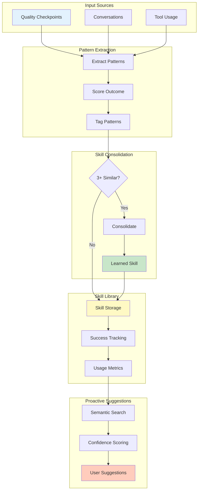
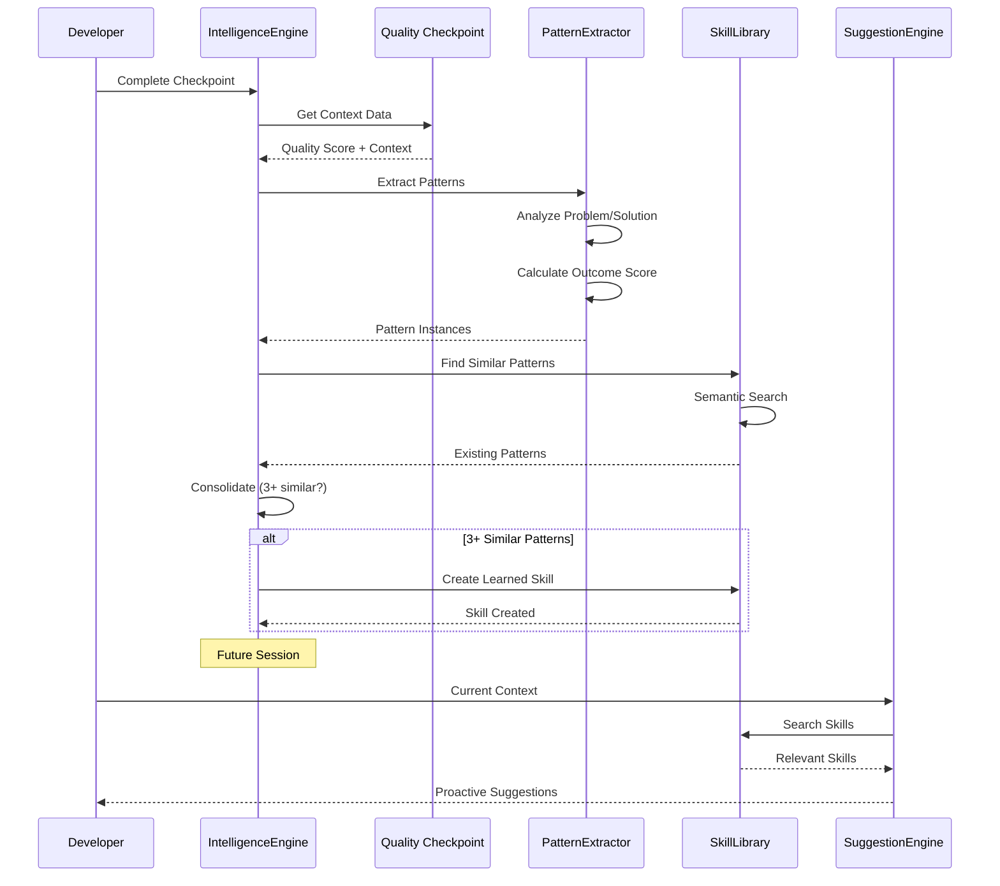

# Intelligence Engine - Pattern Recognition System

## Overview

The Intelligence Engine learns from your development sessions to provide proactive guidance. It extracts patterns from checkpoints, conversations, and tool usage, then consolidates them into reusable skills.

## Architecture

### Intelligence Pipeline Overview



### Learning Process Flow



### Core Components

1. **IntelligenceEngine**: Main orchestrator for learning and suggestions
1. **LearnedSkill**: Consolidated pattern with metadata
1. **PatternInstance**: Individual pattern occurrence
1. **SkillLibrary**: Storage and retrieval of learned skills

## Key Features

### 1. Pattern Extraction

```python
from session_buddy.core.intelligence import IntelligenceEngine

engine = IntelligenceEngine()
await engine.initialize()

# Extract patterns from checkpoint
patterns = await engine.extract_patterns_from_checkpoint(
    session_id="session-123",
    quality_score=85,
    context={
        "problem": "Bug in authentication",
        "solution": "Fixed JWT validation",
        "tools_used": ["test", "lint"],
        "files_modified": ["auth.py"]
    }
)
```

### 2. Skill Consolidation

When 3+ similar patterns occur, they're consolidated into a skill:

```python
# Automatically triggered during checkpoint
skill = await engine.consolidate_patterns_to_skill(
    pattern_instances=[
        pattern1, pattern2, pattern3
    ],
    skill_name="jwt_validation_fix"
)

# Skill metadata:
# - success_rate: 0.95 (95% success rate)
# - invocations: 3 (used 3 times)
# - learned_from: ["session-123", "session-456", ...]
# - tags: ["authentication", "security", "jwt"]
```

### 3. Proactive Suggestions

```python
# Get suggestions for current context
suggestions = await engine.get_proactive_suggestions(
    current_context={
        "problem": "Authentication failing",
        "file_type": "python",
        "error_message": "JWT validation error"
    },
    limit=5
)

for suggestion in suggestions:
    print(f"Skill: {suggestion['name']}")
    print(f"Confidence: {suggestion['confidence']}")
    print(f"Suggestion: {suggestion['description']}")
    print(f"Success rate: {suggestion['success_rate']}")
```

## Data Models

### LearnedSkill

```python
@dataclass(frozen=True, slots=True)
class LearnedSkill:
    id: str
    name: str
    description: str
    success_rate: float  # 0.0 to 1.0
    invocations: int  # Number of times used
    pattern: dict[str, Any]  # The consolidated pattern
    learned_from: list[str]  # Session IDs where pattern was found
    created_at: datetime
    last_used: datetime | None
    tags: list[str]
```

### PatternInstance

```python
@dataclass(frozen=True, slots=True)
class PatternInstance:
    id: str
    pattern_type: str  # "solution", "anti-pattern", "workflow"
    context: dict[str, Any]
    solution: dict[str, Any]
    outcome_score: float  # 0.0 to 1.0
    application_count: int
    tags: list[str]
```

## Learning Process

### Phase 1: Pattern Extraction

During checkpoints, the engine extracts:

```python
# From checkpoint context:
{
    "pattern_type": "solution",  # or "anti-pattern", "workflow"
    "context": {
        "problem": "Bug description",
        "file_type": "python",
        "error_type": "ImportError"
    },
    "solution": {
        "action": "Fix import statement",
        "code_change": "+ import missing_module",
        "tools_used": ["test", "lint"]
    },
    "outcome_score": 0.95,  # Based on quality improvement
    "application_count": 1,  # Incremented on reuse
    "tags": ["imports", "beginner"]
}
```

### Phase 2: Pattern Consolidation

Similar patterns are consolidated when:

```python
# Consolidation criteria:
# - 3+ patterns with similarity >= 0.8
# - Same pattern_type (solution, anti-pattern, workflow)
# - Successful outcomes (outcome_score >= 0.7)

consolidated = engine.consolidate_patterns_to_skill(
    pattern_instances=[p1, p2, p3],
    skill_name="import_error_fix"
)
```

### Phase 3: Skill Library Management

```python
# Load skill library
await engine.load_skill_library()

# Skills are indexed by name for fast lookup:
engine.skill_library = {
    "jwt_validation_fix": LearnedSkill(...),
    "import_error_fix": LearnedSkill(...),
    "test_driven_development": LearnedSkill(...)
}
```

## Cross-Project Learning

The engine learns patterns across multiple projects:

```python
# Extract pattern with project context
pattern = {
    "pattern_type": "solution",
    "project_id": "project-alpha",
    "context": {"problem": "API rate limiting"},
    "solution": {"action": "Implement redis cache"},
    "outcome_score": 0.92
}

# Store in cross-project patterns table
await engine.db.store_cross_project_pattern(
    pattern_type="solution",
    project_id="project-alpha",
    context_snapshot={"problem": "API rate limiting"},
    solution_snapshot={"action": "Implement redis cache"},
    outcome_score=0.92,
    tags=["api", "caching", "redis"]
)
```

### Querying Cross-Project Patterns

```python
# Find similar patterns from other projects
similar = await engine.search_similar_patterns(
    current_context={"problem": "API rate limiting"},
    pattern_type="solution",
    limit=5
)

for pattern in similar:
    print(f"Project: {pattern['project_id']}")
    print(f"Solution: {pattern['solution']}")
    print(f"Success rate: {pattern['outcome_score']}")
```

## Usage Patterns

### Pattern 1: Proactive Error Resolution

```python
async def handle_error_with_intelligence(error: Exception) -> bool:
    """Use learned patterns to fix errors."""
    engine = await get_intelligence_engine()

    # Get suggestions for this error
    suggestions = await engine.get_proactive_suggestions(
        current_context={
            "problem": str(error),
            "error_type": type(error).__name__
        },
        limit=3
    )

    # Try suggested solutions
    for suggestion in suggestions:
        if suggestion['confidence'] >= 0.7:
            print(f"Trying: {suggestion['description']}")
            result = await apply_suggestion(suggestion)

            if result.success:
                # Record successful application
                await engine.record_skill_application(
                    skill_name=suggestion['name'],
                    success=True
                )
                return True

    return False
```

### Pattern 2: Workflow Optimization

```python
async def optimize_workflow() -> list[str]:
    """Get workflow improvement suggestions."""
    engine = await get_intelligence_engine()

    # Analyze current workflow
    current_context = {
        "workflow": "test-driven-development",
        "tools_used": ["pytest", "coverage"],
        "avg_quality": 78
    }

    # Get workflow suggestions
    suggestions = await engine.get_proactive_suggestions(
        current_context=current_context,
        limit=5
    )

    tips = []
    for suggestion in suggestions:
        if suggestion['pattern_type'] == "workflow":
            tips.append(f"{suggestion['description']}: {suggestion['success_rate']}% success")

    return tips
```

### Pattern 3: Skill Discovery

```python
async def discover_skills() -> dict[str, LearnedSkill]:
    """Find all learned skills."""
    engine = await get_intelligence_engine()
    await engine.load_skill_library()

    # Group skills by tags
    by_tag = {}
    for skill_name, skill in engine.skill_library.items():
        for tag in skill.tags:
            if tag not in by_tag:
                by_tag[tag] = []
            by_tag[tag].append(skill_name)

    return {
        "total_skills": len(engine.skill_library),
        "by_tag": by_tag,
        "top_skills": sorted(
            engine.skill_library.items(),
            key=lambda x: x[1].success_rate,
            reverse=True
        )[:10]
    }
```

## Best Practices

### 1. Provide Rich Context

```python
# ❌ Wrong: Minimal context
await engine.extract_patterns_from_checkpoint(
    session_id="session-123",
    quality_score=85,
    context={"fixed": "bug"}
)

# ✅ Correct: Rich context
await engine.extract_patterns_from_checkpoint(
    session_id="session-123",
    quality_score=85,
    context={
        "problem": "Authentication JWT validation failing",
        "solution": "Added signature verification",
        "file_type": "python",
        "tools_used": ["test", "lint", "typecheck"],
        "files_modified": ["auth.py", "tests/test_auth.py"],
        "duration_minutes": 15,
        "error_type": "jwt.InvalidSignatureError",
        "quality_before": 65,
        "quality_after": 92
    }
)
```

### 2. Tag Patterns Meaningfully

```python
# ❌ Wrong: Generic tags
tags = ["fix", "code", "change"]

# ✅ Correct: Specific, searchable tags
tags = [
    "authentication",     # Domain
    "jwt",                # Technology
    "security",           # Category
    "validation",         # Action
    "intermediate"        # Difficulty level
]
```

### 3. Record Skill Applications

```python
# When a suggested skill is applied:
await engine.record_skill_application(
    skill_name="jwt_validation_fix",
    success=True,
    context={
        "session_id": "session-456",
        "duration_minutes": 10
    }
)

# This updates:
# - skill.invocations += 1
# - skill.last_used = now()
# - skill.success_rate recalculated
```

## Database Schema

### intelligence_learned_skills Table

```sql
CREATE TABLE intelligence_learned_skills (
    id TEXT PRIMARY KEY,
    name TEXT UNIQUE NOT NULL,
    description TEXT,
    success_rate FLOAT,
    invocations INTEGER DEFAULT 0,
    pattern TEXT,  -- JSON
    learned_from TEXT,  -- JSON array
    created_at DATETIME,
    last_used DATETIME,
    tags TEXT  -- JSON array
);
```

### intelligence_cross_project_patterns Table

```sql
CREATE TABLE intelligence_cross_project_patterns (
    id TEXT PRIMARY KEY,
    pattern_type TEXT,
    project_id TEXT,
    context_snapshot TEXT,  -- JSON
    solution_snapshot TEXT,  -- JSON
    outcome_score FLOAT,
    application_count INTEGER DEFAULT 1,
    tags TEXT,  -- JSON array
    created_at DATETIME DEFAULT CURRENT_TIMESTAMP
);
```

## Performance Considerations

1. **Skill Library Caching**: Skills are cached in memory after loading
1. **Semantic Search**: Uses embeddings for pattern matching
1. **Incremental Learning**: Patterns extracted per checkpoint
1. **Lazy Consolidation**: Skills consolidated when needed, not eagerly

## Troubleshooting

### No Patterns Being Extracted

```python
# Problem: Empty pattern library
await engine.load_skill_library()
print(len(engine.skill_library))  # 0

# Solution 1: Verify checkpoint quality
# Patterns only extracted from quality >= 70 checkpoints

# Solution 2: Check extraction logs
# Enable debug logging
import logging
logging.getLogger("session_buddy.core.intelligence").setLevel(logging.DEBUG)
```

### Skills Not Being Suggested

```python
# Problem: No suggestions returned
suggestions = await engine.get_proactive_suggestions(...)
# Returns: []

# Solution 1: Check skill library has relevant skills
await engine.load_skill_library()
for skill_name, skill in engine.skill_library.items():
    print(f"{skill_name}: {skill.tags}")

# Solution 2: Adjust threshold
# Default confidence threshold is 0.7, try lowering:
suggestions = await engine.get_proactive_suggestions(
    current_context=...,
    threshold=0.5  # Lower threshold
)
```

### Consolidation Not Triggering

```python
# Problem: Patterns not consolidating into skills

# Solution: Verify consolidation criteria
# - 3+ patterns needed
# - Similarity >= 0.8
# - Same pattern_type
# - Outcome score >= 0.7

# Check pattern count:
patterns = await engine.get_similar_patterns(...)
print(f"Pattern count: {len(patterns)}")

# If < 3, consolidation won't trigger
```

## API Reference

### IntelligenceEngine

```python
class IntelligenceEngine:
    async def initialize(self) -> None:
        """Initialize engine and database connection."""

    async def extract_patterns_from_checkpoint(
        self,
        session_id: str,
        quality_score: int,
        context: dict[str, Any]
    ) -> list[PatternInstance]:
        """Extract patterns from checkpoint data."""

    async def consolidate_patterns_to_skill(
        self,
        pattern_instances: list[PatternInstance],
        skill_name: str
    ) -> LearnedSkill:
        """Consolidate 3+ patterns into a reusable skill."""

    async def get_proactive_suggestions(
        self,
        current_context: dict[str, Any],
        limit: int = 5,
        threshold: float = 0.7
    ) -> list[dict[str, Any]]:
        """Get relevant skill suggestions for current context."""

    async def load_skill_library(self) -> None:
        """Load all learned skills from database."""

    async def record_skill_application(
        self,
        skill_name: str,
        success: bool,
        context: dict[str, Any] | None = None
    ) -> None:
        """Record skill application and update statistics."""

    async def search_similar_patterns(
        self,
        current_context: dict[str, Any],
        pattern_type: str | None = None,
        limit: int = 5
    ) -> list[dict[str, Any]]:
        """Search for similar patterns from other projects."""
```

## See Also

- [Hooks System](hooks_system.md) - Pattern extraction via POST_CHECKPOINT hook
- [Causal Chains](causal_chains.md) - Error pattern learning
