# Session Buddy - Quick Start Guide

Get up and running with the Session Management MCP server in under 5 minutes.

## What You'll Get

- **🚀 One-command session initialization** with project analysis and dependency management
- **🧠 Cross-session memory** with semantic search through all your conversations
- **📊 Quality monitoring** with automatic checkpoints and workflow optimization
- **🔧 Zero-configuration setup** that works with any project structure

## Installation

### Option 1: From Source (Recommended)

```bash
# Clone and install
git clone https://github.com/lesleslie/session-buddy.git
cd session-buddy
uv sync

# Or install with development/testing tools
uv sync --group dev

# Verify installation
python -c "from session_buddy.server import mcp; print('✅ Ready to go!')"
```

### Option 2: With pip

```bash
# Install from PyPI
pip install session-buddy
```

## Search Capabilities

Session Buddy includes two search modes for finding past conversations:

**Text Search (Default ✅)**

- Fast keyword-based search using DuckDB FTS5
- Works out of the box with no additional setup
- Highly effective for most use cases

**Semantic Search (Optional ✅)**

- Concept-based search using AI embeddings
- **No PyTorch required** - uses pre-converted ONNX models
- Enhanced for finding conceptually similar content

**Setup for Semantic Search:**

```bash
python scripts/download_embedding_model.py
```

This downloads the Xenova/all-MiniLM-L6-v2 model (~100MB) for semantic search.

**Note**: Text search is the default and works excellently. Semantic search is an optional enhancement that provides conceptual understanding beyond keywords.

## Configure Claude Code

Add to your `.mcp.json` configuration:

```json
{
  "mcpServers": {
    "session-buddy": {
      "command": "python",
      "args": ["-m", "session_buddy.server"],
      "cwd": "/path/to/session-buddy",
      "env": {
        "PYTHONPATH": "/path/to/session-buddy"
      }
    }
  }
}
```

> **💡 Pro Tip**: Use absolute paths to avoid configuration issues

## First Session

### 1. Initialize Your Session

```
/session-buddy:start
```

This single command:

- ✅ Analyzes your project structure and health
- ✅ Syncs all dependencies (UV, npm, etc.)
- ✅ Sets up conversation memory system
- ✅ Configures automated quality checkpoints

### 2. Work Normally

Code, debug, and develop as usual. The MCP server silently:

- 🧠 **Remembers everything** - All conversations are stored with semantic search
- 📊 **Monitors quality** - Tracks project health and workflow efficiency
- 🔧 **Reduces friction** - Learns your permissions to minimize prompts

### 3. Get Smart Recommendations

```
/session-buddy:checkpoint
```

Every 30-45 minutes, get:

- Real-time quality scoring and optimization tips
- Workflow drift detection and corrections
- Automatic git checkpoints with progress tracking

### 4. Search Your History

```
/session-buddy:quick_search how did I implement authentication last week?
```

Instantly find:

- 🎯 **Relevant conversations** using semantic similarity (not just keywords)
- 📅 **Recent context** with time-decay prioritization
- 🔗 **Cross-project insights** from related work

### 5. End Gracefully

```
/session-buddy:end
```

Automatic cleanup with:

- 📊 Final quality assessment and session summary
- 🧠 Learning capture with insights extraction
- 📝 Handoff documentation for next session
- 🧹 Complete cleanup of session artifacts

### Complete User Experience Flow

```mermaid
flowchart TD
    Start([🚀 Start Claude Code]) --> Config{Session Buddy<br/>Configured?}

    Config -->|No| Install[Install & Configure]
    Config -->|Yes| Detect{Git Repo?}

    Install --> Detect

    Detect -->|Yes| Auto[Auto-Initialize]
    Detect -->|No| Manual[/start Command]

    Auto --> Setup[Session Setup]
    Manual --> Setup

    Setup --> Init[✅ Project Analysis<br/>✅ Dependency Sync<br/>✅ Memory Setup<br/>✅ Shortcuts Created]

    Init --> Work[💻 Development Work]

    Work --> Monitor{Quality Monitoring}

    Monitor -->|Normal| Work
    Monitor -->|Checkpoint| CP[Run Checkpoint]

    CP --> Quality[📊 Quality Score<br/>🔧 Optimization Tips<br/>📝 Git Commit]
    Quality --> Work

    Work --> Search{Need Context?}

    Search -->|Yes| Query[Search History]
    Search -->|No| Work

    Query --> Results[🎯 Semantic Results<br/>📅 Time-Ordered<br/>🔗 Cross-Project]
    Results --> Work

    Work --> End{Session End?}

    End -->|Yes| Final[Run /end]
    End -->|No| Work

    Final --> Cleanup[🧹 Auto Cleanup<br/>📊 Final Assessment<br/>🧠 Extract Insights<br/>📝 Handoff Doc]

    Cleanup --> Complete([✅ Session Complete])

    style Start fill:#e1f5ff
    style Setup fill:#c8e6c9
    style Work fill:#fff9c4
    style CP fill:#ffccbc
    style Query fill:#b2dfdb
    style Cleanup fill:#f8bbd9
    style Complete fill:#c8e6c9
```

### Key User Interactions

```mermaid
sequenceDiagram
    participant User as 👤 Developer
    participant SB as Session Buddy
    participant Memory as 🧠 Memory System
    participant Quality as 📊 Quality Monitor
    participant Git as 🔧 Git Integration

    Note over User: First Time Setup
    User->>SB: /start
    SB->>SB: Analyze Project
    SB->>SB: Sync Dependencies
    SB-->>User: ✅ Session Ready

    Note over User,SB: Development Loop
    loop Every 30-45 min
        User->>Quality: /checkpoint
        Quality->>Quality: Calculate Score
        Quality->>Git: Create Commit
        Quality-->>User: 📊 Quality Report
    end

    Note over User,Memory: Need Context
    User->>Memory: Search "authentication"
    Memory->>Memory: Semantic Search
    Memory-->>User: 🎯 Ranked Results

    Note over User: Session End
    User->>SB: /end
    SB->>Memory: Extract Insights
    SB->>Quality: Final Assessment
    SB-->>User: 📝 Handoff Document
```



## Advanced Features

- 📋 **Handoff documentation** for session continuity
- 🎓 **Learning capture** across key insight categories
- 🧹 **Workspace optimization** and memory persistence

## Essential Commands

| Command | Purpose | When to Use |
|---------|---------|-------------|
| `/session-buddy:start` | Full session setup | Start of every session |
| `/session-buddy:checkpoint` | Quality monitoring | Every 30-45 minutes |
| `/session-buddy:quick_search` | Search conversations | When you need past context |
| `/session-buddy:store_reflection` | Save important insights | After solving tough problems |
| `/session-buddy:end` | Session cleanup | End of every session |

## Power User Features

### Smart Memory System

- **Local embeddings** - No external API calls, complete privacy
- **Vector search** - Semantic similarity, not just text matching
- **Cross-project history** - Find insights across all your repositories
- **Automatic tagging** - Content is intelligently organized

### Workflow Intelligence

- **Quality scoring** - Real-time project health monitoring
- **Permission learning** - Reduces repetitive permission prompts
- **Context preservation** - Maintains state across interruptions
- **Git integration** - Automatic checkpoints with meaningful commit messages

### Advanced Search

```
/session-buddy:quick_search Redis caching strategies
/session-buddy:search_by_file src/auth/middleware.py
/session-buddy:search_by_concept "error handling patterns"
```

## Troubleshooting

### Memory/Embeddings Not Working

```bash
# Ensure all dependencies are installed (embeddings are included by default)
uv sync

# Or reinstall with pip
pip install session-buddy
```

### Server Won't Start

```bash
# Check imports
python -c "import session_buddy; print('Import successful')"

# Verify path in .mcp.json
ls /path/to/session-buddy/session_buddy/server.py
```

### No Conversations Found

- Run `/session-buddy:start` first to initialize the database
- Check `~/.claude/data/` directory exists and is writable

## What's Next?

- 📚 **[MCP Tools Reference](MCP_TOOLS_REFERENCE.md)** - Complete guide to all available commands
- 🏗️ **[Architecture Guide](../developer/ARCHITECTURE.md)** - Deep dive into how it all works
- 🔧 **[Configuration Reference](CONFIGURATION.md)** - Advanced setup options
- 🤝 **[Integration Guide](../developer/INTEGRATION.md)** - Connect with your existing tools

## Support

- 🐛 **Issues**: [GitHub Issues](https://github.com/lesleslie/session-buddy/issues)
- 💬 **Discussions**: [GitHub Discussions](https://github.com/lesleslie/session-buddy/discussions)
- 📖 **Documentation**: [Full Documentation](../../README.md)

______________________________________________________________________

**Ready to supercharge your Claude Code sessions?** Run `/session-buddy:start` and experience the difference! 🚀
