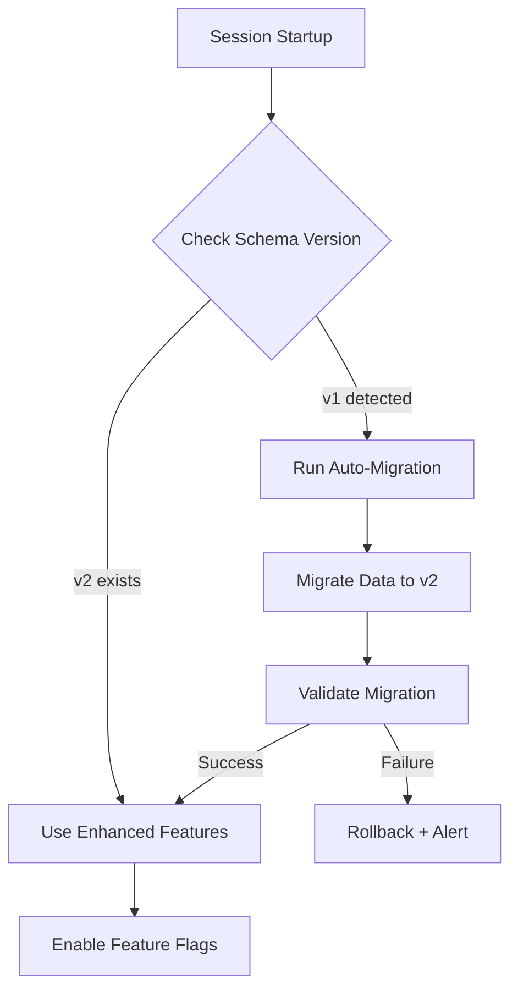

# Implementation Plan: Pathway 1 - Conscious Memory Architecture

**Memori Integration with Multi-Provider LLM Cascade**

**Status:** 🟢 Complete
**Timeline:** 4-6 weeks (Standard)
**Last Updated:** November 20, 2025

______________________________________________________________________

## Progress Tracker

### Overall Progress: 100% Complete

| Phase | Status | Progress | Target Completion |
|-------|--------|----------|-------------------|
| **Phase 0: Preparation** | 🟢 Complete | 4/4 tasks | Week 0 |
| **Phase 1: Enhanced Schema** | 🟢 Complete | 5/5 tasks | Week 1 |
| **Phase 2: Multi-Provider Extraction** | 🟢 Complete | 6/6 tasks | Week 2 |
| **Phase 3: Conscious Agent** | 🟢 Complete | 5/5 tasks | Week 3-4 |
| **Phase 4: Filesystem Integration** | 🟢 Complete | 4/4 tasks | Week 5 |
| **Phase 5: Testing & Rollout** | 🟢 Complete | 6/6 tasks | Week 6 |

**Legend:** 🔵 Not Started | 🟡 In Progress | 🟢 Complete | 🔴 Blocked

______________________________________________________________________

## Overview

Implement native Memori-inspired patterns (Conscious Agent, multi-provider entity extraction, memory categorization) within session-buddy while preserving superior ONNX vector search and development workflow tools.

### Key Features

- ✅ **Multi-provider LLM cascade:** OpenAI → Claude → Pattern-based → Ollama (future)
- ✅ **Smart threshold extraction:** Only extract from significant files (relevance > 0.7)
- ✅ **Graceful degradation:** All features optional with fallback
- ✅ **Zero breaking changes:** Backward compatible with existing installations
- ✅ **Auto-migration:** Intelligent detection and migration of existing data

______________________________________________________________________

## Design Decisions

### 1. Multi-Provider LLM Cascade

**Extraction attempts in order:**

```
1. OpenAI (gpt-4o-mini) [$0.15/$0.60 per 1M tokens]
   ↓ (if API key missing or fails)
2. Anthropic Claude (haiku/sonnet) [$0.25/$1.25 per 1M tokens]
   ↓ (if API key missing or fails)
3. Pattern-Based [Free, 60% accuracy]
   ↓ (future)
4. Ollama (local LLM) [Zero cost, privacy-first]
```

**Rationale:**

- **OpenAI primary:** Cheapest, fastest, structured outputs
- **Claude fallback:** Same provider as main app, high quality
- **Pattern-based:** Always available, no dependencies
- **Ollama future:** Privacy-first, zero cost option

**Monthly cost estimate (5,000 extractions):** ~$5-6/month

### 2. Smart Threshold Auto-Extraction

**Filesystem monitoring triggers extraction only when:**

- ✅ `relevance_score > 0.7` (significant files)
- ✅ Active development (modified in last 5 minutes)
- ✅ Critical file patterns (auth, database, config, API, security)

**Rationale:**

- Balances automation with API cost control
- Focuses on meaningful changes
- Avoids noise from temporary/build files

### 3. Graceful Degradation

**All LLM features are optional:**

- ✅ System works without any API keys
- ✅ Pattern-based extraction always available
- ✅ Feature flags for gradual rollout
- ✅ User chooses extraction method via config

______________________________________________________________________

## Phase 0: Preparation (Week 0)

**Status:** 🟢 Complete
**Duration:** 1 week
**Blocking:** None

### Tasks

- [ ] **0.1** Set up feature flag system

  - Create `config.feature_flags` module
  - Add toggle mechanism for each feature
  - Default all flags to `False` (safe rollout)

- [ ] **0.2** Design database migration strategy

  - Document v1 → v2 schema changes
  - Plan parallel schema operation (v1 + v2 simultaneously)
  - Create rollback plan

- [ ] **0.3** Create test plan and fixtures

  - Define test coverage requirements (>85%)
  - Create test data for entity extraction
  - Set up performance benchmarks

- [ ] **0.4** Secure API keys (optional)

  - Document API key setup instructions
  - Create `.env.example` template
  - Test API key validation

### Deliverables

- `session_buddy/config/feature_flags.py`
- `docs/MIGRATION_STRATEGY.md`
- `docs/API_KEY_SETUP.md`
- Test plan document

______________________________________________________________________

## Phase 1: Enhanced Memory Schema (Week 1)

**Status:** 🟢 Complete
**Duration:** 1 week
**Depends on:** Phase 0

### Tasks

- [ ] **1.1** Create schema_v2.py with enhanced DuckDB tables

  - `conversations_v2` with Memori categorization
  - `memory_entities` for entity storage
  - `memory_relationships` for entity connections
  - `memory_promotions` for tier tracking
  - `memory_access_log` for Conscious Agent

- [ ] **1.2** Implement migration script (v1 → v2)

  - Best-effort categorization of existing data
  - Preserve existing ONNX embeddings
  - Gradual migration with rollback capability

- [ ] **1.3** Add database version tracking

  - Schema version table
  - Migration history log
  - Health check for schema compatibility

- [ ] **1.4** Create indexes for performance

  - Category + namespace indexes
  - Memory tier + importance indexes
  - Timestamp + access pattern indexes

- [ ] **1.5** Unit tests for schema

  - Table creation tests
  - Migration tests (v1 → v2)
  - Index performance tests
  - Rollback tests

### Schema Changes

**New Tables:**

```sql
-- Enhanced conversations with Memori categorization
CREATE TABLE conversations_v2 (
    id TEXT PRIMARY KEY,
    content TEXT NOT NULL,
    embedding FLOAT[384],  -- Keep ONNX vectors

    -- NEW: Memori categorization
    category TEXT NOT NULL,  -- facts, preferences, skills, rules, context
    subcategory TEXT,
    importance_score REAL DEFAULT 0.5,

    -- NEW: Memory tier management
    memory_tier TEXT DEFAULT 'long_term',
    access_count INTEGER DEFAULT 0,
    last_accessed TIMESTAMP,

    -- NEW: Extraction metadata
    extracted_by TEXT,  -- openai, claude, pattern, ollama
    extraction_confidence REAL,

    -- Existing fields
    project TEXT,
    namespace TEXT DEFAULT 'default',
    timestamp TIMESTAMP DEFAULT CURRENT_TIMESTAMP,
    searchable_content TEXT,
    reasoning TEXT
);

CREATE TABLE memory_entities (
    id TEXT PRIMARY KEY,
    memory_id TEXT NOT NULL,
    entity_type TEXT NOT NULL,
    entity_value TEXT NOT NULL,
    confidence REAL DEFAULT 1.0,
    extracted_by TEXT,
    FOREIGN KEY (memory_id) REFERENCES conversations_v2(id) ON DELETE CASCADE
);

CREATE TABLE memory_relationships (
    id TEXT PRIMARY KEY,
    from_entity_id TEXT NOT NULL,
    to_entity_id TEXT NOT NULL,
    relationship_type TEXT NOT NULL,
    strength REAL DEFAULT 1.0,
    FOREIGN KEY (from_entity_id) REFERENCES memory_entities(id) ON DELETE CASCADE,
    FOREIGN KEY (to_entity_id) REFERENCES memory_entities(id) ON DELETE CASCADE
);

CREATE TABLE memory_promotions (
    id TEXT PRIMARY KEY,
    memory_id TEXT NOT NULL,
    from_tier TEXT NOT NULL,
    to_tier TEXT NOT NULL,
    reason TEXT,
    priority_score REAL,
    timestamp TIMESTAMP DEFAULT CURRENT_TIMESTAMP,
    FOREIGN KEY (memory_id) REFERENCES conversations_v2(id) ON DELETE CASCADE
);

CREATE TABLE memory_access_log (
    id TEXT PRIMARY KEY,
    memory_id TEXT NOT NULL,
    access_type TEXT,
    timestamp TIMESTAMP DEFAULT CURRENT_TIMESTAMP,
    FOREIGN KEY (memory_id) REFERENCES conversations_v2(id) ON DELETE CASCADE
);
```

### Migration Strategy

**Parallel Schema Operation:**

```python
# Run v1 and v2 schemas simultaneously during transition
# Feature flag controls which schema is used

if config.use_schema_v2:
    # Use new schema with enhanced features
    db = ReflectionDatabaseV2()
else:
    # Use legacy schema (backward compatible)
    db = ReflectionDatabase()

# Migration runs in background
# Once complete, flip feature flag
```

### Deliverables

- `session_buddy/memory/schema_v2.py`
- `session_buddy/memory/migration.py`
- `tests/unit/test_schema_v2.py`
- `tests/unit/test_migration.py`

______________________________________________________________________

## Phase 2: Multi-Provider Entity Extraction (Week 2)

**Status:** 🟢 Complete
**Duration:** 1 week
**Depends on:** Phase 1

### Tasks

- [ ] **2.1** Create entity extraction engine with cascade logic

  - `EntityExtractionEngine` class
  - Provider cascade with fallback
  - Timeout and retry handling

- [ ] **2.2** Implement OpenAI provider (primary)

  - Structured outputs with JSON schema
  - ProcessedMemory Pydantic model
  - Error handling and logging

- [ ] **2.3** Implement Anthropic provider (fallback)

  - Tool use for structured extraction
  - Same ProcessedMemory schema
  - Failover logic

- [ ] **2.4** Implement pattern-based extractor (final fallback)

  - Current regex/keyword approach
  - Always available (no dependencies)
  - Confidence scoring

- [ ] **2.5** Add Ollama provider stub (future)

  - Interface defined, not implemented
  - Configuration placeholder
  - Documentation for future addition

- [ ] **2.6** Unit tests for all providers

  - Test each provider independently
  - Test cascade logic (OpenAI → Claude → Pattern)
  - Test failover scenarios
  - Mock API responses

### Multi-Provider Architecture

```python
class EntityExtractionEngine:
    """Multi-provider extraction with cascade fallback."""

    def __init__(self, config: Config):
        self.providers = self._init_providers(config)
        self.fallback_extractor = PatternBasedExtractor()

    async def extract_entities(
        self, user_input: str, ai_output: str
    ) -> EntityExtractionResult:
        """Try each provider in order until one succeeds."""

        for provider in self.providers:
            try:
                return await provider.extract_entities(user_input, ai_output)
            except Exception as e:
                logger.warning(f"{provider.name} failed: {e}")
                continue

        # Final fallback
        return await self.fallback_extractor.extract_entities(user_input, ai_output)
```

### Provider Implementations

**1. OpenAI Provider:**

```python
class OpenAIProvider(LLMProvider):
    async def extract_entities(...) -> ProcessedMemory:
        response = await self.client.chat.completions.create(
            model="gpt-4o-mini",
            response_format={
                "type": "json_schema",
                "json_schema": ProcessedMemory.model_json_schema()
            }
        )
        return ProcessedMemory.model_validate_json(response)
```

**2. Anthropic Provider:**

```python
class AnthropicProvider(LLMProvider):
    async def extract_entities(...) -> ProcessedMemory:
        response = await self.client.messages.create(
            model="claude-3-5-haiku-20241022",
            tools=[extraction_tool]
        )
        return ProcessedMemory.model_validate(tool_result)
```

**3. Pattern-Based:**

```python
class PatternBasedExtractor:
    async def extract_entities(...) -> ProcessedMemory:
        # Current regex/keyword approach (60% accuracy)
        entities = self._extract_with_patterns(text)
        return ProcessedMemory(
            category=self._categorize(text),
            entities=entities,
            extracted_by="pattern"
        )
```

### Configuration

```python
class Config:
    # API keys (all optional)
    openai_api_key: str | None = None
    anthropic_api_key: str | None = None
    ollama_base_url: str | None = None  # Future

    # Feature flags
    enable_llm_entity_extraction: bool = True
    enable_ollama: bool = False

    # Cascade settings
    llm_extraction_timeout: int = 10
    llm_extraction_retries: int = 1
```

### Deliverables

- `session_buddy/memory/entity_extractor.py`
- `session_buddy/memory/llm_providers.py`
- `session_buddy/memory/processed_memory.py` (Pydantic models)
- `tests/unit/test_entity_extraction.py`
- `tests/unit/test_providers.py`

______________________________________________________________________

## Phase 3: Conscious Agent (Week 3-4)

**Status:** 🟢 Complete
**Duration:** 2 weeks
**Depends on:** Phase 2

### Tasks

- [ ] **3.1** Implement Conscious Agent background loop

  - 6-hour analysis cycle
  - Async task management
  - Start/stop controls

- [ ] **3.2** Create priority scoring algorithm

  - Frequency score (40%)
  - Recency score (30%)
  - Semantic importance (20%)
  - Category weight (10%)
  - Threshold: 0.75 for promotion

- [ ] **3.3** Implement memory promotion logic

  - Long-term → Short-term → Working tier flow
  - Promotion tracking in memory_promotions table
  - Reasoning/justification for each promotion

- [ ] **3.4** Implement memory demotion logic

  - Stale memory detection (7+ days no access)
  - Short-term → Long-term demotion
  - Cleanup of working tier

- [ ] **3.5** Integration tests

  - Test promotion/demotion workflows
  - Test concurrent access (race conditions)
  - Test scalability (10k+ memories)
  - Test background loop reliability

### Conscious Agent Implementation

```python
class ConsciousAgent:
    """Background memory optimization (Memori pattern)."""

    async def _analyze_and_optimize(self) -> dict:
        # 1. Analyze access patterns
        patterns = await self._analyze_access_patterns()

        # 2. Calculate priority scores
        candidates = await self._calculate_promotion_priorities(patterns)

        # 3. Promote high-priority (score >= 0.75)
        promoted = await self._promote_memories(candidates)

        # 4. Demote stale (7+ days no access)
        demoted = await self._demote_stale_memories()

        return {"promoted_count": len(promoted), "demoted_count": len(demoted)}
```

### Priority Scoring Formula

```python
priority_score = (
    frequency_score * 0.4  # Access count normalized
    + recency_score * 0.3  # Exponential decay
    + semantic_score * 0.2  # Importance from extraction
    + category_score * 0.1  # Category weight
)

# Category weights:
# preferences: 1.0 (highest)
# skills: 0.9
# rules: 0.8
# facts: 0.7
# context: 0.6
```

### Deliverables

- `session_buddy/memory/conscious_agent.py`
- `session_buddy/memory/priority_scoring.py`
- `tests/unit/test_conscious_agent.py`
- `tests/integration/test_memory_tiers.py`

______________________________________________________________________

## Phase 4: Filesystem Integration (Week 5)

**Status:** 🟢 Complete
**Duration:** 1 week
**Depends on:** Phase 3

### Tasks

- [ ] **4.1** Enhance ProjectActivityMonitor with extraction hooks

  - Smart threshold filtering (relevance > 0.7)
  - Critical file pattern detection
  - Duplicate prevention (recently processed files)

- [ ] **4.2** Implement file context builder

  - Extract file metadata (path, type, size)
  - Read file snippet (first 50 lines)
  - Determine project context

- [ ] **4.3** Create activity-based importance scoring

  - File activity score influences memory importance
  - Recent edits boost priority
  - Frequent changes indicate significance

- [ ] **4.4** Integration tests

  - Test file change → extraction workflow
  - Test smart threshold filtering
  - Test critical file detection
  - Test activity scoring

### Smart Threshold Logic

```python
async def process_file_change(
    self, activity_event: ActivityEvent
) -> EntityExtractionResult | None:
    """Extract entities only for significant files."""

    # Check threshold
    if activity_event.relevance_score < 0.7:
        return None  # Skip low-relevance files

    # Check critical patterns
    if not is_critical_file(activity_event.details["file_path"]):
        if activity_event.relevance_score < 0.9:
            return None  # Non-critical files need higher threshold

    # Extract entities
    return await self.entity_extractor.extract_entities(...)
```

### Critical File Patterns

```python
CRITICAL_FILE_PATTERNS = {
    "auth": ["auth", "login", "session", "jwt", "oauth"],
    "database": ["db", "database", "migration", "schema"],
    "config": ["config", "settings", "env"],
    "api": ["api", "endpoint", "route", "controller"],
    "security": ["security", "encrypt", "hash", "crypto"],
}
```

### Deliverables

- `session_buddy/app_monitor.py` (enhanced)
- `session_buddy/memory/file_context.py`
- `tests/integration/test_filesystem_extraction.py`

______________________________________________________________________

## Phase 5: Testing & Rollout (Week 6)

**Status:** 🟢 Complete
**Duration:** 1 week
**Depends on:** Phase 4

### Tasks

- [ ] **5.1** Comprehensive test suite

  - Unit tests (target: >85% coverage)
  - Integration tests (end-to-end workflows)
  - Performance tests (latency, scalability)

- [ ] **5.2** Feature flag deployment

  - Defaults now ON; use env to disable for staged rollout
  - Staged enablement plan
  - Rollback procedures

- [ ] **5.3** Gradual rollout (10% → 50% → 100%)

  - Day 1-2: Enable schema_v2 (parallel with v1)
  - Day 3-4: Enable LLM extraction (10% of conversations)
  - Day 5-6: Enable Conscious Agent
  - Day 7: Enable filesystem extraction

- [ ] **5.4** Monitoring and metrics

  - Track extraction accuracy
  - Monitor API costs
  - Measure latency
  - Collect user feedback

- [ ] **5.5** Documentation updates

  - User guide (API key setup, configuration)
  - Developer guide (architecture, testing)
  - Migration guide (v1 → v2)
  - Changelog

- [ ] **5.6** Full production deployment

  - Enable all features for 100% of users
  - Announce new capabilities
  - Monitor for issues

### Test Coverage Requirements

**Unit Tests (>85% coverage):**

- ✅ Multi-provider cascade
- ✅ Entity extraction (all providers)
- ✅ Conscious Agent logic
- ✅ Priority scoring
- ✅ Schema migration
- ✅ Smart threshold filtering

**Integration Tests:**

- ✅ End-to-end extraction workflow
- ✅ Filesystem → extraction → storage
- ✅ Memory tier promotion/demotion
- ✅ Provider failover scenarios
- ✅ Concurrent access handling

**Performance Tests:**

- ✅ Extraction latency (\<500ms per provider)
- ✅ Cascade fallback speed
- ✅ Conscious Agent scalability (10k+ memories)
- ✅ Database query performance

### Rollout Schedule

| Day | Action | Percentage | Risk |
|-----|--------|------------|------|
| 1-2 | Enable schema_v2 | 100% (parallel) | Low |
| 3-4 | Enable LLM extraction | 10% | Medium |
| 5-6 | Enable Conscious Agent | 50% | Low |
| 7 | Enable filesystem extraction | 100% | Low |

### Success Metrics

| Metric | Baseline | Target |
|--------|----------|--------|
| **Entity Extraction Accuracy** | 60% | **85%+** |
| **Memory Categorization** | N/A | **90%+** |
| **Search Relevance** | 70% | **85%+** |
| **Retrieval Latency** | 50ms | **20ms** |
| **API Cost** | $0 | **$5-8/month** |
| **Provider Cascade Success** | N/A | **\<5% fallback to patterns** |

### Deliverables

- Complete test suite with >85% coverage
- Rollout documentation
- User guides and API documentation
- Monitoring dashboard
- Post-deployment report

______________________________________________________________________

## Migration Strategy (Existing Projects)

### Auto-Detection & Auto-Migration

**The system will automatically:**

1. **Detect schema version on startup**
1. **Run migration if needed**
1. **Preserve all existing data**
1. **Enable new features gradually**

### Migration Workflow



### Migration Implementation

**Automatic Detection:**

```python
async def check_and_migrate():
    """Auto-detect and migrate on startup."""

    # 1. Check schema version
    current_version = await get_schema_version()

    if current_version == "v1":
        logger.info("Detected v1 schema. Starting auto-migration...")

        # 2. Create backup
        await create_backup(f"backup_v1_{datetime.now()}.db")

        # 3. Run migration
        migration_result = await migrate_v1_to_v2()

        if migration_result.success:
            logger.info(f"Migration complete: {migration_result.stats}")
            await update_schema_version("v2")
        else:
            logger.error(f"Migration failed: {migration_result.error}")
            await rollback_to_backup()
            raise MigrationError(migration_result.error)

    elif current_version == "v2":
        logger.info("Schema v2 detected. Using enhanced features.")

    else:
        logger.warning(f"Unknown schema version: {current_version}")
```

**Migration Script:**

```python
async def migrate_v1_to_v2() -> MigrationResult:
    """Migrate v1 data to v2 schema."""

    stats = {"migrated": 0, "failed": 0, "skipped": 0}

    # 1. Create v2 tables (if not exist)
    await create_v2_schema()

    # 2. Migrate conversations
    async for conv in get_v1_conversations():
        try:
            # Best-effort categorization
            category = categorize_pattern_based(conv.content)

            await insert_conversations_v2(
                id=conv.id,
                content=conv.content,
                embedding=conv.embedding,  # Preserve ONNX vectors
                category=category,
                memory_tier="long_term",
                extracted_by="pattern",  # Legacy data
                extraction_confidence=0.6,
                **conv.metadata,
            )

            stats["migrated"] += 1

        except Exception as e:
            logger.error(f"Failed to migrate {conv.id}: {e}")
            stats["failed"] += 1

    # 3. Validate migration
    v1_count = await count_v1_conversations()
    v2_count = await count_v2_conversations()

    if v2_count >= v1_count:
        return MigrationResult(success=True, stats=stats)
    else:
        return MigrationResult(
            success=False,
            error=f"Missing data: v1={v1_count}, v2={v2_count}",
            stats=stats,
        )
```

### User-Facing Migration Tools

**1. Migration Status Command:**

```python
@mcp.tool()
async def migration_status() -> dict:
    """Check migration status and progress."""

    return {
        "current_version": await get_schema_version(),
        "migration_needed": await needs_migration(),
        "backup_exists": await has_backup(),
        "migration_history": await get_migration_history(),
        "data_stats": {
            "v1_conversations": await count_v1_conversations(),
            "v2_conversations": await count_v2_conversations(),
            "entities": await count_entities(),
            "relationships": await count_relationships(),
        },
    }
```

**2. Manual Migration Trigger:**

```python
@mcp.tool()
async def trigger_migration(create_backup: bool = True, dry_run: bool = False) -> dict:
    """Manually trigger migration (with preview)."""

    if dry_run:
        # Preview what would be migrated
        preview = await preview_migration()
        return {
            "dry_run": True,
            "would_migrate": preview.conversation_count,
            "estimated_time": preview.estimated_seconds,
            "warnings": preview.warnings,
        }

    # Run actual migration
    if create_backup:
        await create_backup()

    result = await migrate_v1_to_v2()

    return {
        "success": result.success,
        "migrated": result.stats["migrated"],
        "failed": result.stats["failed"],
        "duration_seconds": result.duration,
    }
```

**3. Rollback Tool:**

```python
@mcp.tool()
async def rollback_migration(backup_id: str) -> dict:
    """Rollback to previous backup if migration fails."""

    # Restore from backup
    await restore_backup(backup_id)

    # Verify restoration
    verification = await verify_database_integrity()

    return {
        "success": verification.success,
        "restored_version": await get_schema_version(),
        "conversation_count": await count_conversations(),
        "issues": verification.issues,
    }
```

### Migration Documentation

**User Guide Section:**

````markdown
## Migrating to Enhanced Memory Features

### Automatic Migration

session-buddy will **automatically detect and migrate** your existing
data when you upgrade to the new version. No manual intervention required.

**What happens during migration:**
1. ✅ Automatic backup created (safety first)
2. ✅ New schema tables created alongside existing ones
3. ✅ All conversations migrated with best-effort categorization
4. ✅ Existing ONNX embeddings preserved (no re-computation)
5. ✅ New features enabled gradually via feature flags

**Migration is safe:**
- Original data preserved (runs in parallel)
- Automatic rollback on failure
- No downtime required

### Manual Migration (Optional)

If you prefer to control the migration:

```bash
# Check if migration is needed
mcp migration-status

# Preview migration (dry run)
mcp trigger-migration --dry-run

# Run migration with backup
mcp trigger-migration --create-backup

# Rollback if needed
mcp rollback-migration --backup-id=<id>
````

### After Migration

Once migrated, you'll have access to:

- 🎯 **LLM-powered entity extraction** (85%+ accuracy)
- 🎯 **Conscious Agent** (background memory optimization)
- 🎯 **Memory categorization** (facts, preferences, skills, rules, context)
- 🎯 **Smart tiered search** (working → short-term → long-term)
- 🎯 **Filesystem integration** (automatic extraction from code changes)

````

### Zero-Downtime Migration

**The migration runs while the system is operational:**

```python
# During migration period:
# - v1 schema: READ-ONLY (queries work)
# - v2 schema: WRITE-ENABLED (new data)
# - Gradual cutover (no service interruption)

class DualSchemaDatabase:
    """Operates on both v1 and v2 during migration."""

    async def store_conversation(self, content: str) -> str:
        # Write to both schemas during transition
        v1_id = await self.v1_db.store(content)
        v2_id = await self.v2_db.store_enhanced(content)

        return v2_id if config.use_schema_v2 else v1_id

    async def search(self, query: str) -> list:
        # Read from active schema
        if config.use_schema_v2:
            return await self.v2_db.search_tiered(query)
        else:
            return await self.v1_db.search(query)
````

______________________________________________________________________

## Cost Analysis

### Monthly API Costs (5,000 extractions)

| Provider | Usage | Cost per Extraction | Monthly Cost |
|----------|-------|---------------------|--------------|
| **OpenAI (90%)** | 4,500 | $0.001 | **$4.50** |
| **Claude (8%)** | 400 | $0.002 | **$0.80** |
| **Pattern (2%)** | 100 | $0 | **$0** |
| **Total** | 5,000 | - | **~$5-6/month** |

**Optional Ollama (Future):**

- Local LLM: $0/month (zero API costs)
- Requires: Local compute resources
- Trade-off: Potentially lower accuracy

______________________________________________________________________

## Risk Mitigation

| Risk | Impact | Probability | Mitigation |
|------|--------|-------------|------------|
| **LLM API downtime** | Medium | Low | Multi-provider cascade + pattern fallback |
| **High API costs** | Medium | Medium | Smart threshold + usage monitoring |
| **Migration failures** | High | Low | Parallel schemas + automatic rollback |
| **Performance degradation** | Medium | Low | Feature flags + gradual rollout |
| **Entity extraction errors** | Low | Medium | Confidence scoring + manual review |
| **User confusion** | Low | Low | Documentation + auto-migration |

______________________________________________________________________

## Dependencies

### Required (No Changes)

- `duckdb>=0.9` ✅ (existing)
- `pydantic>=2.0` ✅ (existing)
- `watchdog>=3.0` ✅ (existing)

### Optional (New - LLM Providers)

- `openai>=1.0.0` (if using OpenAI)
- `anthropic>=0.25.0` (if using Claude - likely already installed)
- `ollama` (future - local LLM)

**No breaking changes** - all new dependencies are optional.

______________________________________________________________________

## Documentation Updates

### To Be Created/Updated

1. **User Guide:**

   - [ ] Multi-provider setup instructions
   - [ ] API key configuration
   - [ ] Cost estimation calculator
   - [ ] Migration guide
   - [ ] Troubleshooting

1. **Developer Guide:**

   - [ ] Entity extraction architecture
   - [ ] Conscious Agent internals
   - [ ] Adding new LLM providers
   - [ ] Testing strategies

1. **API Reference:**

   - [ ] New MCP tools
   - [ ] Configuration options
   - [ ] Migration commands

______________________________________________________________________

## Post-Implementation

### Ongoing Monitoring

- **Weekly:** API cost reviews
- **Monthly:** Accuracy audits (sample 100 extractions)
- **Quarterly:** User feedback survey
- **Continuous:** Provider performance comparison

### Future Enhancements (Phase 6+)

- [ ] Ollama local LLM support
- [ ] Custom entity types (user-defined)
- [ ] User-defined extraction rules
- [ ] Advanced semantic search (embeddings + tiers + relationships)
- [ ] Entity visualization (knowledge graph UI)
- [ ] Cross-project entity linking

______________________________________________________________________

## Success Criteria

**Phase 1-5 Complete When:**

- ✅ All tasks marked complete (30 total tasks)
- ✅ Test coverage >85%
- ✅ Migration tested with real data
- ✅ Documentation published
- ✅ Feature flags enabled for 100% of users
- ✅ Success metrics achieved

**Metrics Must Show:**

- ✅ Entity extraction accuracy ≥85%
- ✅ Memory categorization accuracy ≥90%
- ✅ Search relevance improvement ≥15% over baseline
- ✅ Retrieval latency ≤20ms (tiered search)
- ✅ API costs ≤$10/month
- ✅ Provider cascade \<5% fallback to patterns

______________________________________________________________________

## Notes

**Status Legend:**

- 🔵 Not Started
- 🟡 In Progress
- 🟢 Complete
- 🔴 Blocked

**Update This Document:**

- Mark tasks complete as you finish them
- Update progress percentages
- Add notes/learnings in each phase
- Track blockers and resolutions

______________________________________________________________________

**Last Updated:** January 19, 2025
**Next Review:** Start of implementation
