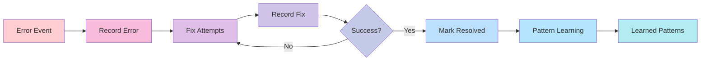
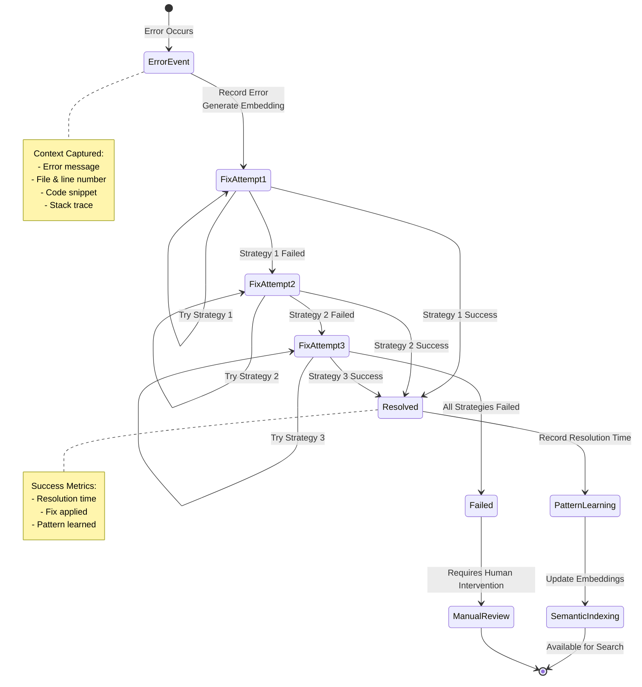

# Causal Chains - Error Tracking System

## Overview

The Causal Chains system provides intelligent error tracking and resolution pattern learning. It tracks errors from occurrence through fix attempts, capturing the causal chain of events that lead to successful resolutions.

## Architecture

### Error Tracking Pipeline



### Error Resolution Lifecycle



### Core Components

1. **CausalChainTracker**: Main orchestrator for error tracking
1. **ErrorEvent**: Initial error occurrence record
1. **FixAttempt**: Actions taken to resolve the error
1. **CausalChain**: Complete timeline from error to resolution
1. **Semantic Search**: Find similar past errors with embeddings

## Key Features

### 1. Error Recording

```python
from session_buddy.core.causal_chains import CausalChainTracker

tracker = CausalChainTracker()
await tracker.initialize()

# Record error occurrence
chain_id = await tracker.record_error_event(
    error="ImportError: module not found",
    context={
        "file": "main.py",
        "line": 42,
        "code": "import missing_module"
    },
    session_id="session-123"
)
```

### 2. Fix Attempt Tracking

```python
# Record fix attempt
await tracker.record_fix_attempt(
    causal_chain_id=chain_id,
    action_taken="Installed missing_module via pip",
    code_changes="+ import missing_module",
    session_id="session-123"
)
```

### 3. Resolution Marking

```python
# Mark as resolved
await tracker.mark_resolved(
    causal_chain_id=chain_id,
    resolution_time_minutes=15,
    successful_fix_id=fix_attempt_id
)
```

## Data Models

### ErrorEvent

```python
@dataclass
class ErrorEvent:
    id: str
    error_message: str
    context: dict[str, Any]
    session_id: str
    timestamp: datetime
    embedding: list[float] | None = None
```

### FixAttempt

```python
@dataclass
class FixAttempt:
    id: str
    causal_chain_id: str
    action_taken: str
    code_changes: str | None = None
    timestamp: datetime
    successful: bool = False
```

### CausalChain

```python
@dataclass
class CausalChain:
    id: str
    error_event: ErrorEvent
    fix_attempts: list[FixAttempt]
    resolution_time_minutes: int | None = None
    successful_fix_id: str | None = None
    resolved: bool = False
```

## Semantic Search

### Finding Similar Past Errors

```python
# Search for similar errors
similar = await tracker.query_similar_failures(
    current_error="ImportError: module not found",
    limit=5
)

for result in similar:
    print(f"Similar error: {result['error_message']}")
    print(f"Fix: {result['fix_action_taken']}")
    print(f"Success: {result['successful']}")
    print(f"Time: {result['resolution_time_minutes']} minutes")
```

### How It Works

1. **Embedding Generation**: Error messages are converted to 384-dimensional vectors
1. **Cosine Similarity**: Compare current error with historical errors
1. **Ranking**: Sort by similarity and resolution time
1. **Return**: Top N most similar successful fixes

## Integration with Hooks

The Causal Chains system integrates with the Hooks system:

```python
# POST_ERROR hook automatically records errors
async def track_error_fix_chain(context: HookContext) -> HookResult:
    error_info = context.error_info
    error_message = error_info.get("error_message")

    chain_id = await tracker.record_error_event(
        error=error_message,
        context=error_info.get("context", {}),
        session_id=context.session_id
    )

    return HookResult(
        success=True,
        causal_chain_id=chain_id
    )
```

## Database Schema

### causal_error_events Table

```sql
CREATE TABLE causal_error_events (
    id TEXT PRIMARY KEY,
    error_message TEXT NOT NULL,
    context TEXT,  -- JSON
    session_id TEXT,
    timestamp DATETIME DEFAULT CURRENT_TIMESTAMP,
    embedding FLOAT[384],
    resolved BOOLEAN DEFAULT FALSE
);
```

### causal_fix_attempts Table

```sql
CREATE TABLE causal_fix_attempts (
    id TEXT PRIMARY KEY,
    causal_chain_id TEXT NOT NULL,
    action_taken TEXT NOT NULL,
    code_changes TEXT,
    timestamp DATETIME DEFAULT CURRENT_TIMESTAMP,
    successful BOOLEAN DEFAULT FALSE,
    FOREIGN KEY (causal_chain_id) REFERENCES causal_error_events(id)
);
```

## Usage Patterns

### Pattern 1: Track and Learn from Errors

```python
async def handle_error(error: Exception, context: dict):
    """Track error and learn from it."""
    tracker = await get_causal_tracker()

    # Record error
    chain_id = await tracker.record_error_event(
        error=str(error),
        context=context,
        session_id=current_session_id
    )

    # Try fixes and record attempts
    for fix_strategy in generate_fix_strategies(error):
        try:
            result = await apply_fix(fix_strategy)
            await tracker.record_fix_attempt(
                causal_chain_id=chain_id,
                action_taken=fix_strategy.description,
                code_changes=result.code_changes
            )

            if result.success:
                await tracker.mark_resolved(
                    causal_chain_id=chain_id,
                    resolution_time_minutes=result.duration,
                    successful_fix_id=result.fix_id
                )
                break
        except Exception as e:
            # Try next strategy
            continue
```

### Pattern 2: Query Similar Errors Before Fixing

```python
async def smart_fix(error: Exception) -> bool:
    """Query past successful fixes before attempting new ones."""
    tracker = await get_causal_tracker()

    # Find similar past errors
    similar = await tracker.query_similar_failures(
        current_error=str(error),
        limit=3
    )

    # Try previously successful fixes first
    for past_error in similar:
        if past_error['successful']:
            fix_action = past_error['action_taken']
            result = await try_fix(fix_action)

            if result.success:
                return True

    # Fall back to generic fix strategies
    return await generic_fix(error)
```

### Pattern 3: Analyze Error Patterns

```python
async def analyze_error_trends() -> dict:
    """Analyze common error patterns."""
    tracker = await get_causal_tracker()

    # Get all unresolved errors
    unresolved = await tracker.get_unresolved_chains(limit=100)

    # Group by error type
    error_types = {}
    for chain in unresolved:
        error_type = chain.error_message.split(":")[0]
        error_types[error_type] = error_types.get(error_type, 0) + 1

    # Find most common errors
    sorted_errors = sorted(
        error_types.items(),
        key=lambda x: x[1],
        reverse=True
    )

    return {
        "most_common_errors": sorted_errors[:10],
        "total_unresolved": len(unresolved)
    }
```

## Best Practices

### 1. Always Provide Context

```python
# ❌ Wrong: No context
await tracker.record_error_event(
    error="ImportError"
)

# ✅ Correct: Rich context
await tracker.record_error_event(
    error="ImportError: module not found",
    context={
        "file": "main.py",
        "line": 42,
        "code_snippet": "import missing_module",
        "stack_trace": traceback.format_exc(),
        "reproduction_steps": "Run main.py"
    }
)
```

### 2. Record All Fix Attempts

```python
# ❌ Wrong: Only recording successful fix
if fix_success:
    await tracker.record_fix_attempt(...)

# ✅ Correct: Record all attempts
await tracker.record_fix_attempt(
    causal_chain_id=chain_id,
    action_taken="Strategy 1: Install module",
    code_changes=changes,
    successful=False  # Record failure too!
)

# Try next strategy
await tracker.record_fix_attempt(
    causal_chain_id=chain_id,
    action_taken="Strategy 2: Fix import path",
    code_changes=changes,
    successful=True
)
```

### 3. Mark Resolution Time

```python
import time

start_time = time.time()

# ... perform fixes ...

end_time = time.time()
duration_minutes = int((end_time - start_time) / 60)

await tracker.mark_resolved(
    causal_chain_id=chain_id,
    resolution_time_minutes=duration_minutes,
    successful_fix_id=fix_id
)
```

## Performance Considerations

1. **Embedding Cache**: Error embeddings are cached to avoid regenerating
1. **Async Operations**: All database operations are async
1. **Limit Query Results**: Always use reasonable `limit` values (1-100)
1. **Batch Operations**: Record multiple events in sequence when needed

## Troubleshooting

### No Similar Errors Found

```python
# Problem: Empty results
similar = await tracker.query_similar_failures("some error", limit=5)
# Returns: []

# Solution 1: Check if database has errors
all_chains = await tracker.get_all_chains(limit=10)
print(f"Total chains: {len(all_chains)}")

# Solution 2: Verify embedding generation
error_event = await tracker.record_error_event(...)
print(f"Embedding: {error_event.embedding[:5]}...")  # Should have values
```

### Fix Attempts Not Associated

```python
# Problem: Fix attempt has no causal_chain_id
# Solution: Ensure chain_id is valid
chain = await tracker.get_causal_chain(chain_id)
if not chain:
    print(f"Invalid chain_id: {chain_id}")
```

### Resolution Not Marked

```python
# Problem: Error still marked unresolved
# Solution: Verify mark_resolved was called
await tracker.mark_resolved(
    causal_chain_id=chain_id,
    resolution_time_minutes=15,
    successful_fix_id=fix_id
)

# Verify
chain = await tracker.get_causal_chain(chain_id)
assert chain.resolved == True
```

## API Reference

### CausalChainTracker

```python
class CausalChainTracker:
    async def initialize(self) -> None:
        """Initialize tracker and database connection."""

    async def record_error_event(
        self,
        error: str,
        context: dict[str, Any],
        session_id: str
    ) -> str:
        """Record error occurrence and return causal_chain_id."""

    async def record_fix_attempt(
        self,
        causal_chain_id: str,
        action_taken: str,
        code_changes: str | None = None,
        session_id: str | None = None
    ) -> str:
        """Record fix attempt and return fix_id."""

    async def mark_resolved(
        self,
        causal_chain_id: str,
        resolution_time_minutes: int,
        successful_fix_id: str
    ) -> None:
        """Mark error chain as resolved."""

    async def query_similar_failures(
        self,
        current_error: str,
        limit: int = 5
    ) -> list[dict[str, Any]]:
        """Find similar past errors with successful fixes."""

    async def get_causal_chain(
        self, causal_chain_id: str
    ) -> CausalChain | None:
        """Get complete causal chain by ID."""

    async def get_unresolved_chains(
        self, limit: int = 50
    ) -> list[CausalChain]:
        """Get all unresolved error chains."""
```

## See Also

- [Hooks System](hooks_system.md) - Error tracking via POST_ERROR hook
