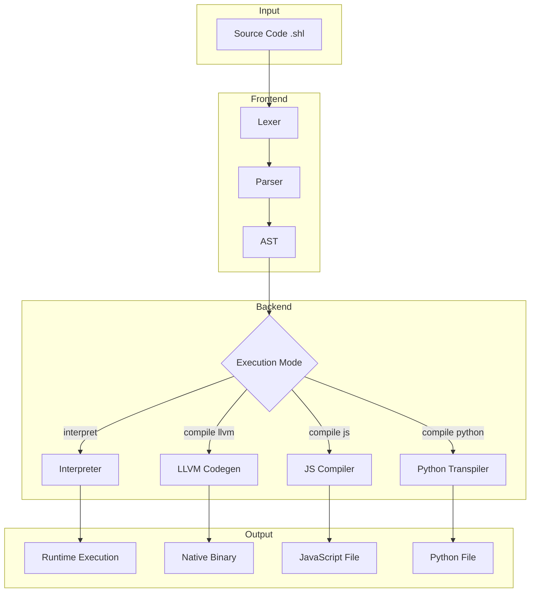
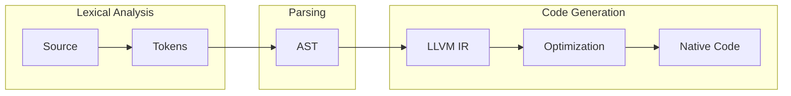
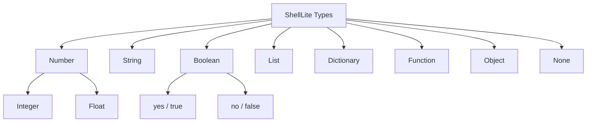
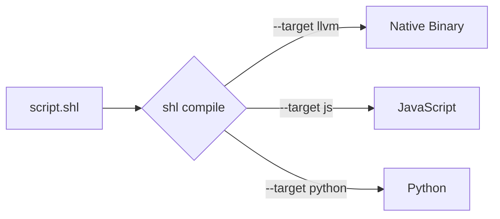
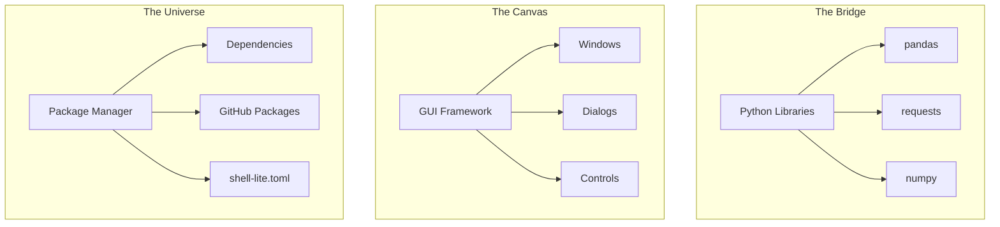

# ShellLite

**The English-Like Programming Language**

ShellLite is a modern programming language designed to prioritize human readability. It replaces complex syntax with natural English commands, making software development accessible and maintainable. With version 0.05.0, ShellLite now supports native compilation via LLVM alongside its interpreted mode.

[](LICENSE)
[]()

---

## Table of Contents

- [Features](#features)
- [Architecture](#architecture)
- [Installation](#installation)
- [Quick Start](#quick-start)
- [Language Overview](#language-overview)
- [Compilation](#compilation)
- [The Three Pillars](#the-three-pillars)
- [CLI Reference](#cli-reference)
- [Project Structure](#project-structure)
- [Documentation](#documentation)
- [Ecosystem](#ecosystem)
- [License](#license)

---

## Features

| Feature | Description |
|:--------|:------------|
| **Natural Syntax** | Write code that reads like English |
| **Dynamic Typing** | No type declarations required |
| **Multi-Target Compilation** | Compile to LLVM, JavaScript, or Python |
| **Python Integration** | Use any Python library via The Bridge |
| **GUI Framework** | Build desktop apps with The Canvas |
| **Package Manager** | Manage dependencies with The Universe |
| **Web Framework** | Built-in HTTP server and routing |
| **Interactive REPL** | Explore and test code interactively |

---

## Architecture



### Compilation Pipeline



---

## Installation

### Via PyPI (Recommended)

```bash
pip install shell-lite
```

### From Source

```bash
git clone https://github.com/Shrey-N/ShellLite.git
cd ShellLite
pip install -e .
```

### Windows Installer

Download the latest `shl.exe` from the [Releases](https://github.com/Shrey-N/ShellLite/releases) page.

### Verify Installation

```bash
shl --version
```

---

## Quick Start

### Hello World

Create a file named `hello.shl`:

```
say "Hello, World"
```

Run it:

```bash
shl hello.shl
```

### Interactive REPL

```bash
shl
```

```
ShellLite REPL - English Syntax
========================================
>>> say "Hello"
Hello
>>> 5 + 5
10
>>> exit
```

---

## Language Overview

### Type System



### Syntax Examples

**Variables and Constants**
```
name = "Alice"
age = 30
const PI = 3.14159
```

**Control Flow**
```
if score > 90
    say "Excellent"
elif score > 70
    say "Good"
else
    say "Keep trying"
```

**Functions**
```
to greet name
    say "Hello, " + name
    give "Greeted " + name

result = greet "World"
```

**Classes**
```
thing Car
    has speed = 0
    
    can accelerate amount
        speed += amount
        say "Speed: " + str(speed)

my_car = new Car
my_car.accelerate 50
```

### Natural Language Comparisons

| Symbol | Natural Form |
|:------:|:-------------|
| `==` | `is`, `equals` |
| `!=` | `is not` |
| `>` | `is more than` |
| `<` | `is less than` |
| `>=` | `is at least` |
| `<=` | `is at most` |

---

## Compilation

### Compilation Targets



### Commands

```bash
# Compile to native code (default)
shl compile script.shl

# Compile to JavaScript
shl compile script.shl --target js

# Compile to Python
shl compile script.shl --target python
```

### Performance Comparison

| Mode | Relative Speed | Use Case |
|:-----|:---------------|:---------|
| Interpreted | 1x | Development |
| Python Compiled | ~1.2x | Integration |
| JavaScript | ~2-5x | Web deployment |
| LLVM Native | ~10-50x | Production |

---

## The Three Pillars

ShellLite v0.05.0 introduces three major features:



### The Bridge - Python Integration

Import and use any Python library directly:

```
use "pandas" as pd
use "requests"

data = pd.read_csv("data.csv")
response = requests.get("https://api.example.com")
```

### The Canvas - GUI Applications

Build native desktop applications:

```
app "My App" size 400, 300

column
    heading "Welcome"
    button "Click Me" on_click handle_click

to handle_click
    alert "Button clicked!"
```

### The Universe - Package Management

```bash
# Initialize project
shl init

# Install dependencies
shl install

# Install from GitHub
shl get username/repo
```

**shell-lite.toml**
```toml
[project]
name = "my-app"
version = "1.0.0"

[dependencies]
Shrey-N/shl-utils = "main"
```

---

## CLI Reference

| Command | Description |
|:--------|:------------|
| `shl <file.shl>` | Run a ShellLite script |
| `shl` | Start the interactive REPL |
| `shl compile <file>` | Compile to native code (LLVM) |
| `shl compile <file> --target js` | Compile to JavaScript |
| `shl compile <file> --target python` | Compile to Python |
| `shl init` | Initialize a new project |
| `shl install` | Install project dependencies |
| `shl get <user/repo>` | Install a package from GitHub |
| `shl fmt <file>` | Format a script |
| `shl check <file>` | Lint a file (JSON output) |
| `shl help` | Show help message |

---

## Project Structure

```
my-project/
├── main.shl              # Entry point
├── shell-lite.toml       # Project configuration
├── modules/
│   ├── utils.shl         # Utility functions
│   └── api.shl           # API handlers
├── tests/
│   └── test_main.shl     # Test files
└── public/
    └── index.html        # Static files (web)
```

---

## Documentation

### Language Guide

| Chapter | Topic |
|:--------|:------|
| [01](docs/01_Getting_Started.md) | Getting Started |
| [02](docs/02_Language_Basics.md) | Language Basics |
| [03](docs/03_Control_Flow.md) | Control Flow |
| [04](docs/04_Data_Structures.md) | Data Structures |
| [05](docs/05_Functions_and_OOP.md) | Functions and OOP |
| [06](docs/06_Modules_and_StdLib.md) | Modules and Standard Library |
| [07](docs/07_System_Mastery.md) | System Mastery |
| [08](docs/08_Web_Development.md) | Web Development |

### Advanced Topics

| Chapter | Topic |
|:--------|:------|
| [09](docs/09_Advanced_Features.md) | Advanced Features |
| [10](docs/10_Compilation_and_Performance.md) | Compilation and Performance |
| [11](docs/11_Testing_and_Debugging.md) | Testing and Debugging |
| [12](docs/12_API_Reference.md) | API Reference |

### Guides and Resources

| Chapter | Topic |
|:--------|:------|
| [13](docs/13_Security_Guide.md) | Security Guide |
| [14](docs/14_Migration_Guide.md) | Migration Guide |
| [15](docs/15_Troubleshooting.md) | Troubleshooting |
| [16](docs/16_Examples_and_Tutorials.md) | Examples and Tutorials |
| [17](docs/17_Best_Practices.md) | Best Practices |

---

## Ecosystem

| Tool | Description | Link |
|:-----|:------------|:-----|
| **Book** | Language design, compiler construction, and architecture guide | [Book](https://books2read.com/b/mVpoXM) |
| **ShellDesk** | Official IDE for ShellLite | [GitHub](https://github.com/Shrey-N/ShellDesk) |
| **VS Code Extension** | Syntax highlighting and snippets | [Marketplace](https://marketplace.visualstudio.com/items?itemName=ShellLite.shelllite-hello) |
| **Research Artifact** | Published on Zenodo by CERN | [Zenodo](https://doi.org/10.5281/zenodo.18228699) |
| **Research Artifact - Geometric Binding Parser** | Published on Zenodo by CERN | [Zenodo](https://doi.org/10.5281/zenodo.18385614) |
---

## Contributing

See [CONTRIBUTING.md](CONTRIBUTING.md) for guidelines on how to contribute to ShellLite.

## Security

See [SECURITY.md](SECURITY.md) for reporting security vulnerabilities.

## License

MIT License - See [LICENSE](LICENSE) for details.

---

**ShellLite** - Making programming accessible through natural language.

Created by Shrey Naithani
