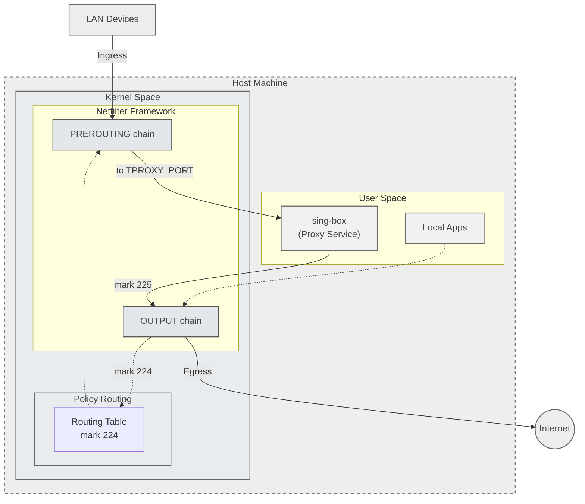

# 架构设计

本文档详细说明 sing-box-tproxy 的技术架构, 透明代理原理以及各组件交互机制.

## 目录

- [架构概览](#architecture-overview)
- [透明代理原理](#transparent-proxy-mechanism)
- [核心配置解析](#configuration-analysis)
- [部署模式](#deployment-modes)
- [常见问题 FAQ](#faq)

## 架构概览 {#architecture-overview}

sing-box-tproxy 利用 Linux 内核的 TPROXY 特性, 结合 nftables 和策略路由, 实现对本机及局域网流量的透明代理.

### 组件交互



### 核心组件

| 组件           | 职责                                   | 实现方式                                   |
| -------------- | -------------------------------------- | ------------------------------------------ |
| sing-box       | 代理服务, 协议处理                     | systemd service (监听 TPROXY 端口)         |
| nftables       | 流量识别, 打标记 (fwmark), TPROXY 转向 | `inet` table, `prerouting`/`output` chains |
| Policy Routing | 基于 fwmark 的路由决策                 | `ip rule`, `ip route` (table 224)          |

## 透明代理原理 {#transparent-proxy-mechanism}

### 流量路径详解

#### 1. 转发流量 (LAN Devices)

适用于 Gateway 模式.

流量路径为实线所示: `LAN -> Prerouting -> TPROXY -> sing-box`.

1. Prerouting: 流量进入 `prerouting_tproxy` 链.
2. Filtering: 排除本地保留地址, 自定义绕过地址.
3. TPROXY: 命中 `tproxy` 规则, 被重定向到 sing-box 监听的 TPROXY 端口 (7895), 并打上 `fwmark 224`.
4. Routing: 策略路由根据 `fwmark 224` 查表, 但此时流量已被 TPROXY 劫持, 内核直接将数据包分发给 sing-box socket.

#### 2. 本机流量 (Local Apps)

适用于 Local 模式.

流量路径为虚线所示: `Local App -> Output -> Routing -> Loopback -> Prerouting -> TPROXY -> sing-box`.

本机应用程序发出的流量处理流程较为复杂, 需要通过环回机制才能被 TPROXY 处理:

1. Output: 流量进入 `output_tproxy` 链 (mangle 表的 output hook).
2. Marking: 排除 sing-box 自身流量 (防回环) 和保留地址后, 数据包被打上 `fwmark 224`. 注意此时仅标记, 无法直接应用 TPROXY (内核限制 TPROXY 只能用于 PREROUTING).
3. Reroute: 由于 fwmark 改变, 内核触发重路由检查 (Reroute Check).
4. Policy Routing: `ip rule` 匹配到 `fwmark 224`, 查询路由表 224.
5. Loopback: 路由表 224 中的 `local default dev eth0` 路由被匹配. `type local` 告诉内核该数据包的目标是"本机", 即使原始目标是外部地址. 这会触发内核将数据包从出站路径 (OUTPUT) 转向入站路径 (INPUT).
6. Prerouting: 环回的数据包作为入站流量再次触发 `prerouting_tproxy` 链.
7. TPROXY: 此时流量已位于 PREROUTING 链, 命中 `tproxy` 规则, 最终被重定向到 sing-box.

### 防回环机制 (Loop Prevention)

为了防止 sing-box 发出的代理流量再次被代理形成死循环, 项目采用了双 fwmark 机制:

- `PROXY_MARK` (224): 标记需要被代理的流量 (普通应用).
- `ROUTE_DEFAULT_MARK` (225): 标记 sing-box 自身发出的出站流量.

处理流程:

1. sing-box 以独立用户 `proxy` (UID 13) 运行.
2. `output_tproxy` 链首先检查 UID:
   ```nft
   meta skuid 13 meta mark set 225 accept
   ```
3. sing-box 的流量被打上 225 标记并直接放行 (Accept), 跳过后续的 224 打标规则.
4. 策略路由中没有针对 fwmark 225 的特殊规则, 流量走默认路由表 (main) 直连互联网.

## 核心配置解析 {#configuration-analysis}

### 策略路由 (Policy Routing)

配置位于 `/etc/netplan/99-sing_box_tproxy.yaml`.

```yaml
routing-policy:
  - from: 0.0.0.0/0
    mark: 224
    table: 224
```

路由表 224:

```shell
# ip route show table 224
local default dev eth0 proto static scope host
```

关键配置解析:

- `type local`: 告诉内核将匹配的数据包视为目标是"本机"的流量, 触发内核环回 (loopback), 将出站流量转向入站路径, 使得流量重新经过 PREROUTING 钩子, 从而可以被 TPROXY 处理. 没有这个配置, 本机透明代理无法工作.
- `default` (0.0.0.0/0): 匹配所有目标地址, 确保所有被标记 fwmark 224 的流量都会触发环回.
- `dev eth0`: 指定关联接口, 流量实际上是在内核内部环回, 不会真正经过物理接口, 但某些内核检查需要指定接口.
- `scope host`: 限定为主机范围, 表示这是本地路由, 不会传播到其他主机.

### nftables 规则 (nftables Rules)

#### prerouting_tproxy (入站/环回)

负责处理两种类型的流量:

1. 来自 LAN 设备的转发流量 (gateway 模式)
2. 本机环回的流量 (local 模式, 通过策略路由和 local 路由触发的环回)

规则处理顺序:

1. DNS 劫持: `udp/tcp dport 53 tproxy to :7895`. 必须最先执行, 确保所有 DNS 请求被捕获, 对本机和 LAN 流量同等重要.
2. 防直接访问: 拒绝直接访问 7895 端口的非 TPROXY 流量, 防止应用直接连接 TPROXY 端口造成回环.
3. 绕过本机目标: 放行 `fib daddr type local` (目标是本机地址的流量), 例如访问本机服务 (SSH, Web 等).
4. 绕过保留地址: 放行 RFC 1918 私有地址, 组播地址等.
5. 绕过自定义地址: 放行用户自定义的绕过地址.
6. TPROXY 捕获: `meta mark set 224 tproxy to :7895`. 捕获剩余的所有 TCP/UDP 流量, 重定向到 sing-box 的 TPROXY socket.

为什么这个链对本机流量至关重要?

- 本机流量在 `output_tproxy` 链只能打标记, 不能使用 TPROXY
- 必须通过环回机制重新进入 `prerouting_tproxy` 链
- 如果缺少这个链, 本机流量会因为无法被 TPROXY 处理而透明代理失败

#### output_tproxy (本机出站)

负责处理本机发出的流量.

1. 接口过滤: 仅处理默认出口接口的流量.
2. 防回环: `meta skuid 13 accept`. 至关重要.
3. DNS 标记: 显式标记 DNS 流量 (防止被后续的保留地址规则排除).
4. 绕过规则: 放行本地和保留地址.
5. 打标记: `meta mark set 224`. 仅打标记, 不做 TPROXY (交由策略路由处理).

### IPv6 支持

项目完整支持 IPv6 透明代理.

- 地址集合: 独立定义 `reserved_ip6` (包含 `::1`, `fe80::/10`, `ff00::/8` 以及 `fd00::/8` 等). 注意: `fc00::/18` (sing-box fakeip) 不在排除列表中.
- 策略路由: 添加 IPv6 版本的 rule 和 route (`ip -6 rule`, `ip -6 route`).
- nftables: 使用 `inet` 表同时处理 IPv4/IPv6, 或使用 `meta nfproto ipv6` 区分特定规则.

特殊注意事项:

- Link-Local (fe80::/10): 自动排除, 不进行代理.
- Multicast (ff00::/8): 自动排除.
- IPv4-mapped IPv6 (::ffff:0:0/96): 排除以避免重复处理.

## 部署模式 {#deployment-modes}

| 模式    | 适用场景        | 特点              | 关键差异                                           |
| ------- | --------------- | ----------------- | -------------------------------------------------- |
| gateway | 家庭/办公室网关 | 代理 LAN 所有设备 | 开启 IP Forwarding, 监听 `0.0.0.0`                 |
| local   | 个人工作站/VPS  | 仅代理本机        | 关闭 IP Forwarding, 监听 `127.0.0.1` (TPROXY 除外) |
| mixed   | 开发/测试环境   | 手动配置代理      | 无 nftables/路由规则, 仅作为普通代理服务器         |

_注: 在 gateway 模式下, sing-box TPROXY 入站必须监听 `::` (或 `0.0.0.0`), 因为来自 LAN 的流量目标地址不是本机._

## 常见问题 FAQ {#faq}

### Q1: TPROXY 和 IP_TRANSPARENT 是什么?

TPROXY 是 Netfilter 提供的透明代理机制, IP_TRANSPARENT 是应用程序需要设置的 socket 选项.

#### TPROXY 工作机制

1. Netfilter TPROXY 模块: 当 nftables 规则执行 `tproxy to :7895` 时, Netfilter 的 TPROXY 模块修改数据包的目标地址和端口, 将数据包标记为"透明代理"状态, 重定向到本机的 7895 端口.

2. Socket 查找: 内核网络协议栈查找监听 7895 端口的 socket. sing-box 创建 socket 时使用了 `IP_TRANSPARENT` 选项, 这个选项允许 socket 接收目标地址不是本机地址的数据包. 内核将 TPROXY 标记的数据包传递给这个 socket.

3. 保留原始地址: TPROXY 的特性在于数据包的原始源地址和目标地址被保留, sing-box 可以通过 socket API 获取原始目标地址, 从而知道应用真正想访问的目标, 进行透明代理.

#### IP_TRANSPARENT 的作用

- 不是流量重定向机制, 而是一个 socket 选项
- 允许应用绑定到非本机 IP 地址
- 允许应用接收目标不是本机的数据包
- 必须配合 Netfilter TPROXY 规则使用

#### 流程总结

```
应用流量 → Netfilter (TPROXY 规则) → 修改并标记数据包
    → 内核 socket 查找 → sing-box socket (IP_TRANSPARENT)
    → sing-box 读取原始目标地址 → 建立代理连接
```

### Q2: 为什么 `local default` 路由能触发环回?

#### 路由类型

Linux 支持多种路由类型 (通过 `ip route` 的 `type` 参数):

- `unicast` (默认): 正常的单播路由, 将数据包发送到下一跳或接口
- `local`: 表示目标是本机地址, 触发本地接收
- `blackhole`: 丢弃数据包
- `unreachable`: 返回 ICMP 不可达

#### `type local` 的特殊性

当数据包匹配到 `type local` 路由时:

1. 内核判定: 内核认为这个数据包的目标是"本机"
2. 路径切换: 即使数据包原本在 OUTPUT 路径 (出站), 内核也会将其转向 INPUT 路径 (入站)
3. 触发 PREROUTING: 转向 INPUT 路径时, 数据包会经过 PREROUTING 钩子
4. TPROXY 机会: 这就给了 `prerouting_tproxy` 链处理本机流量的机会

#### 配置示例

```shell
# 查看路由表 224
ip route show table 224
# 输出: local default dev eth0 proto static scope host

# 这条路由的含义:
# - type: local (未显式指定, 但 "local" 关键字表明了类型)
# - target: default (0.0.0.0/0, 匹配所有地址)
# - dev: eth0 (关联接口, 主要用于满足语法)
# - scope: host (本机范围)
```

#### 为什么不用 `unicast` 路由?

如果使用 `unicast default via xxx table 224`, 数据包会被正常转发到下一跳, 不会触发环回, 不会重新进入 PREROUTING, 无法被 TPROXY 处理.

只有 `type local` 路由才能实现本机流量的透明代理.

### Q3: 如何调试和验证流量路径?

#### 使用 nftables trace

```shell
# 在 nftables 规则中添加 trace
nft add rule inet sing_box_tproxy output_tproxy meta nftrace set 1

# 查看 trace 日志
nft monitor trace
```

#### 使用 conntrack

```shell
# 查看连接跟踪表
conntrack -L

# 过滤 sing-box 相关连接
conntrack -L | grep 7895
```

#### 检查路由决策

```shell
# 模拟路由查询 (带 fwmark)
ip route get 8.8.8.8 mark 224

# 查看策略路由规则
ip rule show

# 查看路由表 224
ip route show table 224
```

#### 使用 tcpdump/wireshark

```shell
# 捕获 loopback 接口流量
tcpdump -i lo -n

# 捕获特定端口
tcpdump -i any port 7895 -n
```

#### 检查 sing-box 日志

```shell
# 查看 systemd 日志
journalctl -u sing-box -f

# 检查 sing-box 是否正确接收 TPROXY 流量
# 日志中应该显示原始目标地址, 而不是 127.0.0.1:7895
```
