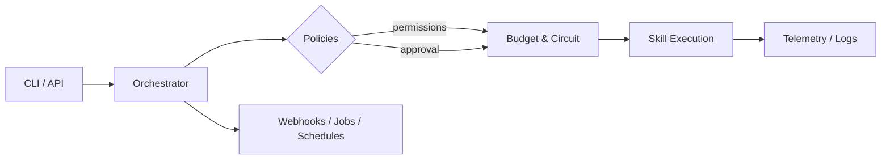

# SkillOS

[](https://github.com/AlexeyPevz/SkillOS/actions/workflows/tests.yml)
[](LICENSE)

SkillOS — self‑hosted фреймворк для оркестрации навыков (skills). Он помогает превращать разрозненные функции и интеграции в управляемую систему: с политиками доступа, утверждениями, бюджетами, дедупликацией, вебхуками и наблюдаемостью.

## Зачем нужен SkillOS

Когда навыков становится много (внутренние сервисы, внешние API, LLM‑агенты, автоматизации), появляются типичные проблемы:

- нельзя контролировать, кто и что может выполнять;
- сложно организовать подтверждения на рискованные действия;
- нет лимитов затрат и прозрачной стоимости;
- события приходят повторно (webhook‑storm), нужны idempotency и дедупликация;
- много ручной glue‑логики и слабая повторяемость процессов.

SkillOS дает единый слой оркестрации и контроля, не привязываясь к облаку — всё работает на вашем сервере.

## Для кого

- Команды, которые строят **self‑hosted** автоматизации.
- Проекты с **навыками/инструментами**: обработка заявок, интеграции, задачи для LLM.
- Компании, где важны **политики доступа**, **бюджет**, **безопасность** и **наблюдаемость**.

## Use cases (примеры)

- **Служба поддержки**: классификация тикетов → маршрутизация → безопасное выполнение действий через approvals.
- **Финансовые операции**: строгие permission/approval политики и лимиты затрат.
- **Интеграции**: входящие вебхуки с идемпотентностью и вложениями.
- **LLM‑оркестрация**: контроль модели/бюджета и прозрачная трассировка.

## Ключевые преимущества

- **Контроль рисков**: approvals, permissions, policy‑rules.
- **Экономика**: бюджеты и контроль затрат на запрос.
- **Надежность**: idempotency, DLQ, circuit breaker.
- **Безопасность**: JWT, HMAC, лимиты вложений.
- **Масштабируемость**: маршрутизация и параллельные пайплайны.
- **Self‑hosted**: полный контроль над инфраструктурой.

## Что внутри

- **Маршрутизация запросов** к навыкам (keyword/vector/hybrid, веса).
- **Композиции** и **пайплайны** с параллельными группами.
- **Zero-YAML SDK**: декоратор `@skill` и авто‑дискавери Python‑навыков.
- **SkillFlow**: циклы и state‑machine для многошаговых навыков.
- **Политики доступа** (roles/permissions) и **утверждения**.
- **Бюджетирование** и контроль затрат.
- **Вебхуки** с проверкой подписи и вложениями.
- **Идемпотентность**, **джобы**, **расписания**.
- **Health checks**, метрики и трассировка.

## Как это работает (вкратце)

1. Запрос приходит через CLI или API.
2. Оркестратор выбирает навык (routing).
3. Проверяются policies (permissions/approvals).
4. Проверяются бюджеты и circuit breaker.
5. Навык исполняется, результат логируется.

## Схема потока



## Установка

Через pip (после публикации в PyPI):

```bash
python -m pip install skillos
skillos --help
```

Через Docker:

```bash
docker build -t skillos .
docker run --rm -p 8000:8000 -v "$PWD/skills:/app/skills" skillos
```

Dev‑установка (Poetry):

```bash
pip install poetry
poetry install
```

## Быстрый старт

```bash
# создать навык
skillos add-skill travel/search_flights --root ./skills

# запустить запрос
skillos run "Find flights to Sochi" --root ./skills
```

Для dev‑режима можно использовать `poetry run`:

```bash
poetry run skillos add-skill travel/search_flights --root ./skills
poetry run skillos run "Find flights to Sochi" --root ./skills
```

Запуск API:

```bash
poetry run uvicorn skillos.api:app --host 0.0.0.0 --port 8000
```

## Dev Mode и Zero‑YAML

Создай файл `skills/implementations/hello.py`:

```python
from skillos.sdk import skill

@skill(name="hello", description="Simple greeting")
def hello(payload: str):
    return f"Hello, {payload}"
```

Запусти без YAML и внешних зависимостей:

```python
from skillos.orchestrator import Orchestrator

output = Orchestrator.run_simple("hello", "./skills")
print(output)
```

### SkillFlow (циклы и state‑machine)

```python
from skillos.flow import SkillFlow

flow = SkillFlow("counter")

@flow.start
def start(state):
    state["count"] = state.get("count", 0) + 1
    return state

def loop_condition(state):
    if state["count"] < 3:
        return "start"
    return "__end__"

flow.add_edge("start", loop_condition)

result = flow.run({"count": 0})
print(result["count"])  # 3
```

## Архитектура и структура каталога

```text
skills/
  metadata/         # YAML-описания навыков
  implementations/  # Python-реализации навыков
  policies/         # approval/permission политики
  runtime/          # служебные файлы (circuit breaker, idempotency и др.)
  attachments/      # файлы вложений вебхуков
  triggers/         # webhook-триггеры
  connectors/       # определения коннекторов
  secrets/          # секреты (например, .env)
```

## Основные понятия

- **Skill** — атомарное действие с YAML‑метаданными и Python‑реализацией.
- **Composition** — набор шагов с последовательным или параллельным исполнением.
- **Pipeline** — оркестрация набора шагов, включая параллельные группы (`skillA|skillB`).
- **Policies** — правила доступа и утверждений.
- **Budget** — лимиты стоимости запросов и контроль модели.

## CLI (основные команды)

```bash
# оркестратор
poetry run skillos run "Find flights to Sochi" --root ./skills --execute

# пайплайн
poetry run skillos pipeline run --root ./skills --step ops/first --step ops/second --payload "start"

# вебхук
poetry run skillos webhook handle --id sample-hook --path ./payload.json --signature "t=...,v1=..." --root ./skills
```

Полный список и примеры: `docs/cli.md`.

## API

- `GET /health` — статус системы (503 при `unhealthy`).
- `POST /run` — выполнение запроса.
- `POST /validate` — валидация навыков.
- `POST /skills/{id}/deprecate` — депрекейт.
- `POST /skills/{id}/undeprecate` — отмена депрекейта.

Пример:

```bash
curl -X POST http://localhost:8000/run \
  -H "Content-Type: application/json" \
  -d '{"query":"Find flights to Sochi","execute":false}'
```

## Вебхуки и вложения

- Подписи HMAC обязательны по умолчанию. Можно разрешить unsigned через `SKILLOS_WEBHOOK_ALLOW_UNSIGNED=1`.
- Вложения передаются как base64 и сохраняются в `attachments/`.

Пример payload:

```json
{
  "payload": "hello",
  "attachments": [
    {
      "filename": "image.png",
      "content_type": "image/png",
      "data": "<base64>"
    }
  ]
}
```

Ограничения:

- Допустимые content-type: `application/json`, `application/pdf`, `text/plain`, `text/csv`, `text/markdown`, `text/html`, `image/*`.
- Максимальный размер: `SKILLOS_ATTACHMENT_MAX_SIZE_BYTES` (по умолчанию 10MB).

## Rate limiting

Есть два режима:

- **Best-effort** (по умолчанию): без обязательного Redis.
- **Strict**: атомарный Redis‑лимитер, включается `SKILLOS_RATE_LIMIT_STRICT=1`.

В strict‑режиме Redis обязателен (`SKILLOS_REDIS_URL`/`REDIS_URL`). Если Redis не настроен — ошибка.

## Хранилище

Два варианта:

- `file` (по умолчанию) — локальные JSON/SQLite файлы.
- `postgres` — прод‑режим с изоляцией по tenant.

Переменные:

- `SKILLOS_STORAGE_BACKEND=postgres`
- `SKILLOS_POSTGRES_DSN` или `DATABASE_URL`
- `SKILLOS_POSTGRES_SCHEMA` (опционально)

## Безопасность

- JWT: `SKILLOS_JWT_*` (алгоритм, issuer, audience, clock skew).
- Approval policies: `policies/approval_policies.json`.
- Permission policies: `policies/permission_policies.json`.

## Production чеклист (кратко)

1. Выбрать backend (`file`/`postgres`).
2. Настроить секреты и политики.
3. Включить строгий rate‑limit при необходимости.
4. Прогнать тесты: `poetry run pytest -q`.
5. Запустить API.

Подробно: `docs/deployment.md`.

## Документация

- `docs/quickstart.md` — быстрый старт.
- `docs/concepts.md` — концепции и архитектура.
- `docs/deployment.md` — прод‑обкатка и настройки.
- `docs/cli.md` — справочник по CLI.

## Вклад

См. `CONTRIBUTING.md` и `CODE_OF_CONDUCT.md`.

## Лицензия

MIT — см. `LICENSE`.
