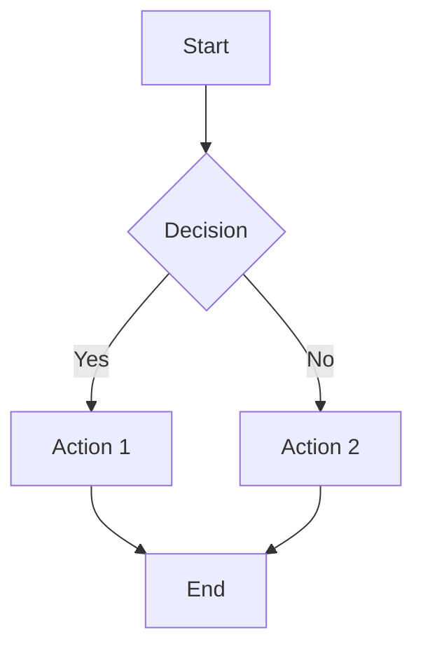
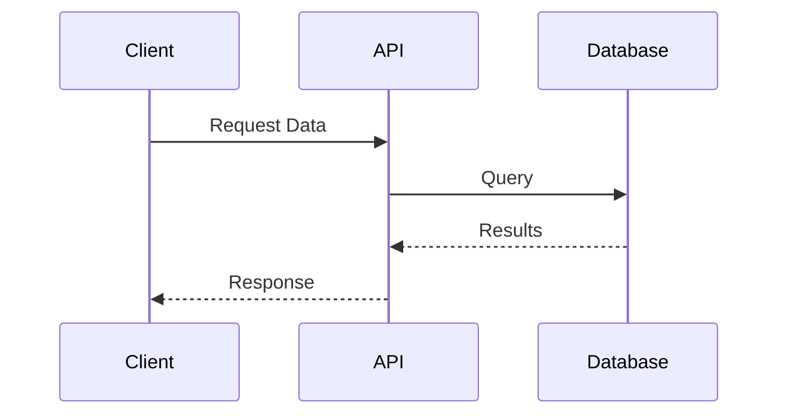

# Sample Confluence Page

This is a sample Markdown file demonstrating various elements that can be converted to Confluence Wiki Markup.

## Text Formatting

You can use **bold text**, *italic text*, and ~~strikethrough text~~.

You can also use `inline code` for technical terms.

## Lists

### Unordered List

- First item
- Second item
  - Nested item 2.1
  - Nested item 2.2
    - Deep nested item
- Third item

### Ordered List

1. First step
2. Second step
   1. Sub-step 2.1
   2. Sub-step 2.2
3. Third step

### Task List

- [ ] Uncompleted task
- [x] Completed task
- [ ] Another task

## Code Examples

Here's a Python code example:

```python
def fibonacci(n):
    """Calculate the nth Fibonacci number."""
    if n <= 1:
        return n
    return fibonacci(n-1) + fibonacci(n-2)

# Calculate first 10 Fibonacci numbers
for i in range(10):
    print(f"F({i}) = {fibonacci(i)}")
```

And a JavaScript example:

```javascript
const greet = (name) => {
    return `Hello, ${name}!`;
};

console.log(greet("World"));
```

## Tables

| Feature | Markdown | Wiki Markup | Supported |
|---------|----------|-------------|-----------|
| Bold | `**text**` | `*text*` | ✓ |
| Italic | `*text*` | `_text_` | ✓ |
| Code | `` `text` `` | `{{text}}` | ✓ |
| Links | `[text](url)` | `[text\|url]` | ✓ |

## Links

- [Internal Page Link](HomePage)
- [External Link](https://www.example.com)
- [Link with custom text](https://www.example.com)

## Images


## Blockquotes

> This is a blockquote.
> It can span multiple lines.

> **Info:** This is an informational callout that should be converted to an info macro.

> **Tip:** This is a helpful tip that should be converted to a tip macro.

> **Warning:** This is a warning that should be converted to a warning macro.

## Mermaid Diagram



## Sequence Diagram



## Horizontal Rule

---

## Advanced Features

### Definition List

**API Endpoint**
A specific URL path that handles HTTP requests.

**Authentication**
The process of verifying a user's identity.

### Nested Blockquote

> This is a blockquote.
>
> > This is a nested blockquote.

### Complex Table

| Status | Priority | Assignee | Due Date |
|--------|----------|----------|----------|
| In Progress | High | John Doe | 2025-01-30 |
| Blocked | Critical | Jane Smith | 2025-01-25 |
| Completed | Medium | Bob Wilson | 2025-01-20 |

## Footnotes

This text has a footnote reference[^1].

Here's another footnote[^2].

[^1]: This is the first footnote.
[^2]: This is the second footnote.

## Summary

This sample demonstrates:

1. Various text formatting options
2. Lists (ordered, unordered, task lists)
3. Code blocks with syntax highlighting
4. Tables with headers and alignment
5. Links (internal and external)
6. Images
7. Blockquotes and callouts
8. Mermaid diagrams
9. Horizontal rules
10. Advanced features like footnotes

All of these elements can be converted to Confluence Wiki Markup using the conversion scripts provided with this skill.

## Next Steps

- Convert this file to Wiki Markup using `convert_markdown_to_wiki.py`
- Render Mermaid diagrams using `render_mermaid.py`
- Add mark metadata using `generate_mark_metadata.py`
- Upload to Confluence using the Atlassian MCP tools

---

*Last updated: 2025-01-21*
