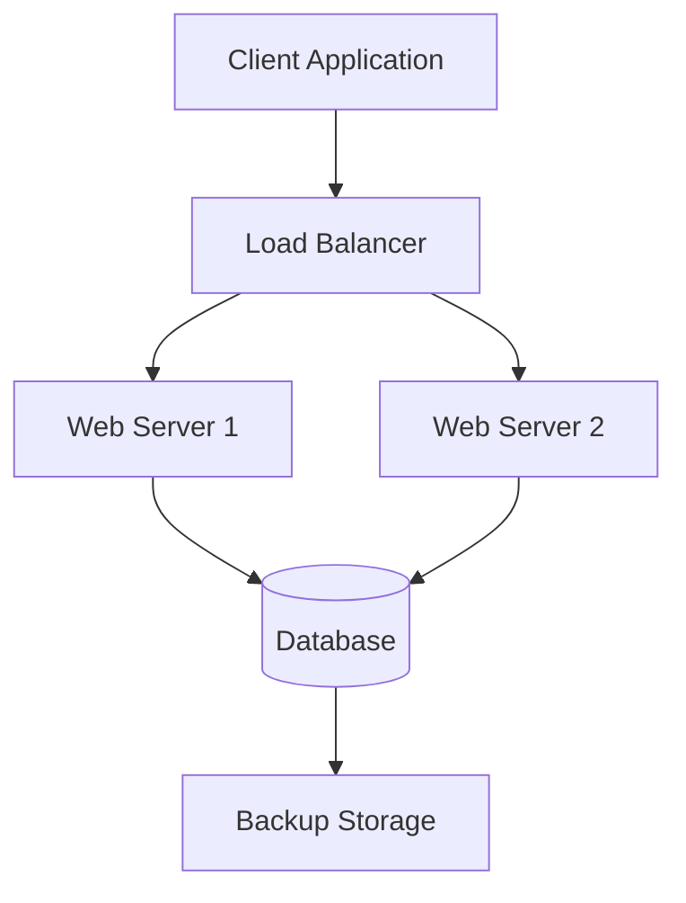
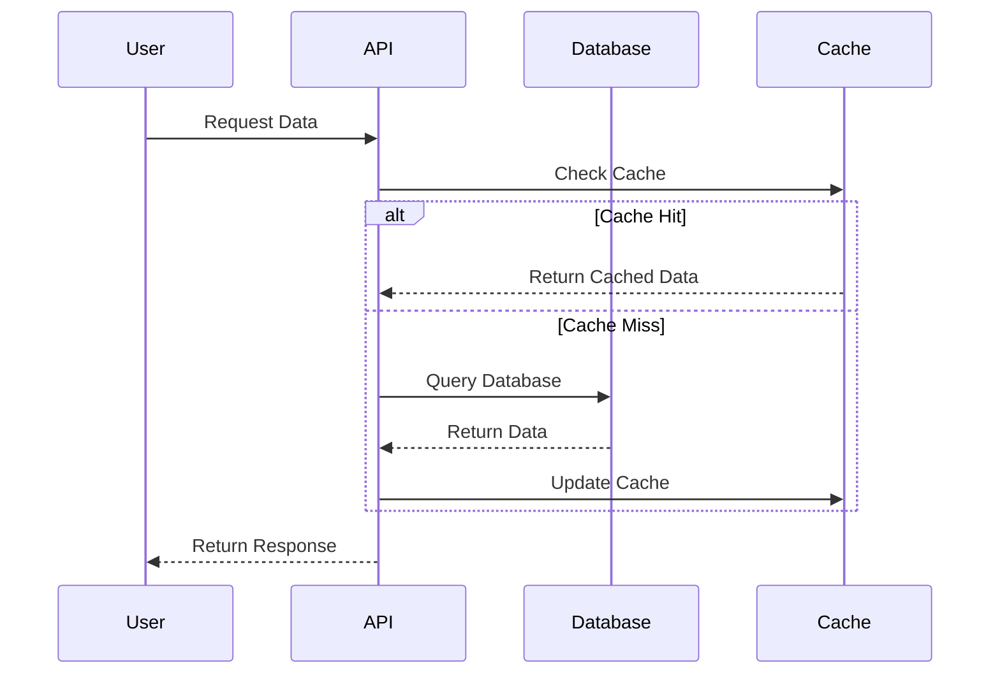
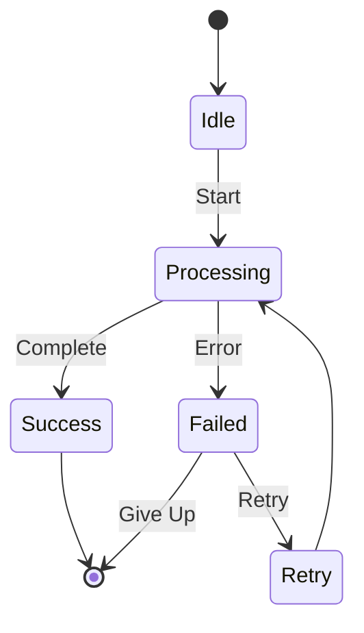

# Example Page with Mermaid Diagrams

This is a sample page demonstrating upload functionality with Mermaid diagram support.

## Overview

This page shows how to create Confluence pages from Markdown with:
- **Mermaid diagrams** that are automatically rendered to SVG
- **Code blocks** with syntax highlighting
- **Tables** and formatted text
- **YAML frontmatter** for metadata

## System Architecture

Here's a simple architecture diagram using Mermaid:



## Data Flow



## Code Example

Here's a Python example with syntax highlighting:

```python
def process_data(input_data):
    """Process input data and return results."""
    results = []

    for item in input_data:
        # Transform the data
        transformed = {
            'id': item.get('id'),
            'value': item.get('value', 0) * 2,
            'status': 'processed'
        }
        results.append(transformed)

    return results

# Usage
data = [{'id': 1, 'value': 10}, {'id': 2, 'value': 20}]
output = process_data(data)
print(f"Processed {len(output)} items")
```

## Configuration Table

| Environment | URL | Database | Cache |
|-------------|-----|----------|-------|
| Development | https://dev.example.com | dev-db | dev-redis |
| Staging | https://staging.example.com | staging-db | staging-redis |
| Production | https://example.com | prod-db | prod-redis |

## Features

### Text Formatting

- **Bold text** for emphasis
- *Italic text* for subtle emphasis
- `inline code` for technical terms
- ~~Strikethrough~~ for deprecated items

### Lists

1. First ordered item
2. Second ordered item
   - Nested unordered item
   - Another nested item
3. Third ordered item

### Blockquotes

> This is a blockquote example.
> It can span multiple lines.
>
> — Author Name

## State Machine



## Conclusion

This example demonstrates all the key features of the upload functionality:

- ✅ Frontmatter metadata for page configuration
- ✅ Mermaid diagrams automatically rendered to images
- ✅ Code blocks with syntax highlighting
- ✅ Tables and text formatting
- ✅ Proper Markdown structure

To upload this page, run:

```bash
# Smart upload (reads frontmatter)
python3 upload_confluence.py upload_example.md

# Create in specific space
python3 upload_confluence.py upload_example.md --space DEMO

# Update existing page
python3 upload_confluence.py upload_example.md --id 789012

# Dry-run preview
python3 upload_confluence.py upload_example.md --dry-run
```
