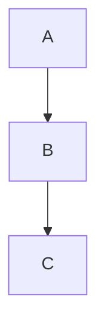

# Markdown ↔ Wiki Markup Conversion Guide

This guide provides detailed conversion rules and examples for converting between Markdown and Confluence Wiki Markup.

## Conversion Matrix

### Text Formatting

| Description | Markdown | Wiki Markup | Notes |
|-------------|----------|-------------|-------|
| Bold | `**text**` or `__text__` | `*text*` | Markdown has two syntaxes |
| Italic | `*text*` or `_text_` | `_text_` | Markdown has two syntaxes |
| Bold+Italic | `***text***` | `*_text_*` | Combine both |
| Strikethrough | `~~text~~` | `-text-` | GFM extension |
| Code | `` `text` `` | `{{text}}` | Inline code |
| Underline | N/A | `+text+` | No Markdown equivalent |
| Superscript | N/A | `^text^` | No standard Markdown |
| Subscript | N/A | `~text~` | No standard Markdown |
| Monospace | `` `text` `` | `{{text}}` | Same as code |

### Headings

| Level | Markdown | Wiki Markup |
|-------|----------|-------------|
| H1 | `# Heading` | `h1. Heading` |
| H2 | `## Heading` | `h2. Heading` |
| H3 | `### Heading` | `h3. Heading` |
| H4 | `#### Heading` | `h4. Heading` |
| H5 | `##### Heading` | `h5. Heading` |
| H6 | `###### Heading` | `h6. Heading` |

**Alternative Markdown H1/H2:**
```markdown
Heading 1
=========

Heading 2
---------
```

### Lists

#### Unordered Lists

**Markdown:**
```markdown
- Item 1
- Item 2
  - Sub-item 2.1
  - Sub-item 2.2
    - Deep sub-item
- Item 3
```

**Wiki Markup:**
```wiki
* Item 1
* Item 2
** Sub-item 2.1
** Sub-item 2.2
*** Deep sub-item
* Item 3
```

**Conversion Rule:**
- Replace `-` or `*` with `*`
- Replace indentation (2 or 4 spaces) with additional `*`

#### Ordered Lists

**Markdown:**
```markdown
1. Step 1
2. Step 2
   1. Sub-step 2.1
   2. Sub-step 2.2
3. Step 3
```

**Wiki Markup:**
```wiki
# Step 1
# Step 2
## Sub-step 2.1
## Sub-step 2.2
# Step 3
```

**Conversion Rule:**
- Replace `1.` with `#`
- Replace indentation with additional `#`

#### Mixed Lists

**Markdown:**
```markdown
1. Ordered item
   - Unordered sub-item
   - Another unordered
2. Next ordered
```

**Wiki Markup:**
```wiki
# Ordered item
#* Unordered sub-item
#* Another unordered
# Next ordered
```

### Links

#### Internal/Page Links

**Markdown:**
```markdown
[Page Title](PageTitle)
```

**Wiki Markup:**
```wiki
[Page Title]
```

**Conversion Rule:**
- Wiki Markup doesn't need URL for internal pages
- Extract link text and use as page reference

#### External Links

**Markdown:**
```markdown
[Link Text](http://example.com)
[http://example.com](http://example.com)
```

**Wiki Markup:**
```wiki
[Link Text|http://example.com]
[http://example.com]
```

**Conversion Rule:**
- Replace `[text](url)` with `[text|url]`

#### Reference Links

**Markdown:**
```markdown
[link text][ref]

[ref]: http://example.com
```

**Wiki Markup:**
```wiki
[link text|http://example.com]
```

**Conversion Rule:**
- Resolve reference and convert to inline link

### Images

**Markdown:**
```markdown


```

**Wiki Markup:**
```wiki
!image.png|alt=Alt Text!
!http://example.com/image.png|alt=Alt Text!
```

**Conversion Rule:**
- Replace `` with `!url|alt=alt!`
- Handle optional title attribute

**With Attributes:**

**Markdown (HTML):**
```html

```

**Wiki Markup:**
```wiki
!image.png|width=300,align=center!
```

### Tables

**Markdown:**
```markdown
| Header 1 | Header 2 | Header 3 |
|----------|----------|----------|
| Cell 1.1 | Cell 1.2 | Cell 1.3 |
| Cell 2.1 | Cell 2.2 | Cell 2.3 |
```

**Wiki Markup:**
```wiki
||Header 1||Header 2||Header 3||
|Cell 1.1|Cell 1.2|Cell 1.3|
|Cell 2.1|Cell 2.2|Cell 2.3|
```

**Conversion Rule:**
- Replace header row `| Header |` with `||Header||`
- Replace separator row (ignore)
- Replace data rows `| Cell |` with `|Cell|`

**Alignment:**

**Markdown:**
```markdown
| Left | Center | Right |
|:-----|:------:|------:|
| L1   |   C1   |    R1 |
```

**Wiki Markup:**
```wiki
||Left||Center||Right||
|L1|C1|R1|
```

**Note:** Wiki Markup doesn't support column alignment in basic syntax. Use styling or HTML for alignment.

### Code Blocks

**Markdown:**
````markdown
```python
def hello():
    print("Hello")
```
````

**Wiki Markup:**
```wiki
{code:language=python}
def hello():
    print("Hello")
{code}
```

**Conversion Rule:**
- Replace ` ```language ` with `{code:language=language}`
- Replace closing ` ``` ` with `{code}`

**Inline Code:**

**Markdown:**
```markdown
Use `git commit` to save changes.
```

**Wiki Markup:**
```wiki
Use {{git commit}} to save changes.
```

**Conversion Rule:**
- Replace `` `code` `` with `{{code}}`

### Blockquotes

**Markdown:**
```markdown
> This is a quote.
> It can span multiple lines.
```

**Wiki Markup:**
```wiki
bq. This is a quote.
It can span multiple lines.
```

**Alternative (Quote Macro):**
```wiki
{quote}
This is a quote.
It can span multiple lines.
{quote}
```

**Conversion Rule:**
- Replace `> ` prefix with `bq. ` for first line
- Remove `> ` from continuation lines
- Or wrap entire quote in `{quote}...{quote}`

### Horizontal Rules

**Markdown:**
```markdown
---
***
___
```

**Wiki Markup:**
```wiki
----
```

**Conversion Rule:**
- Replace any `---`, `***`, or `___` with `----`

### Task Lists (GitHub Flavored Markdown)

**Markdown:**
```markdown
- [ ] Unchecked task
- [x] Checked task
- [ ] Another task
```

**Wiki Markup:**
```wiki
[] Unchecked task
[x] Checked task
[] Another task
```

**Conversion Rule:**
- Replace `- [ ]` with `[]`
- Replace `- [x]` with `[x]`

## Advanced Conversions

### Mermaid Diagrams

**Markdown:**
````markdown

````

**Wiki Markup (after rendering):**
```wiki
!diagram-flowchart.png|width=600!

h4. Figure: System Flow
```

**Conversion Process:**
1. Extract Mermaid code block
2. Render to PNG or SVG using mermaid-cli
3. Upload as attachment to Confluence
4. Replace code block with image reference

### HTML in Markdown

**Markdown:**
```html
<div style="background: #f0f0f0; padding: 10px;">
  Custom styled content
</div>
```

**Wiki Markup:**
```wiki
{div:style=background: #f0f0f0; padding: 10px;}
Custom styled content
{div}
```

**Conversion Rule:**
- Try to convert to Wiki Markup macros
- If no equivalent, preserve HTML (may work in Confluence)

### Footnotes (Markdown Extension)

**Markdown:**
```markdown
Text with footnote[^1].

[^1]: This is the footnote.
```

**Wiki Markup:**
```wiki
Text with footnote{sup}1{sup}.

----
1. This is the footnote.
```

**Conversion Rule:**
- Convert footnote reference to superscript
- Move footnote definitions to end with numbered list

### Definition Lists (Markdown Extension)

**Markdown:**
```markdown
Term 1
: Definition 1

Term 2
: Definition 2a
: Definition 2b
```

**Wiki Markup:**
```wiki
*Term 1*
Definition 1

*Term 2*
Definition 2a
Definition 2b
```

**Conversion Rule:**
- Format term as bold
- List definitions as regular paragraphs

## Macros and Special Elements

### Info/Tip/Note/Warning Blocks

**Markdown (Admonitions):**
```markdown
> **Info:** This is important information.

> **Tip:** This is a helpful tip.

> **Warning:** Be careful!
```

**Wiki Markup:**
```wiki
{info}
This is important information.
{info}

{tip}
This is a helpful tip.
{tip}

{warning}
Be careful!
{warning}
```

**Conversion Rule:**
- Detect blockquote starting with **Info:**, **Tip:**, etc.
- Convert to appropriate macro

### Table of Contents

**Markdown (Extension):**
```markdown
[TOC]
```

**Wiki Markup:**
```wiki
{toc}
```

**Conversion Rule:**
- Replace `[TOC]` with `{toc}`

### Anchor Links

**Markdown:**
```markdown
## Section Name {#custom-id}

[Jump to section](#custom-id)
```

**Wiki Markup:**
```wiki
h2. Section Name
{anchor:custom-id}

[Jump to section|#custom-id]
```

**Conversion Rule:**
- Extract custom ID from heading
- Add `{anchor}` macro after heading
- Convert link to Wiki Markup format

## Edge Cases and Special Handling

### Escaping Special Characters

**Markdown:**
```markdown
\*Not bold\*
\[Not a link\]
```

**Wiki Markup:**
```wiki
\*Not bold\*
\[Not a link\]
```

**Conversion Rule:**
- Preserve backslash escapes
- May need to adjust based on Wiki Markup parsing

### Nested Formatting

**Markdown:**
```markdown
**Bold with `code` inside**
*Italic with [link](url) inside*
```

**Wiki Markup:**
```wiki
*Bold with {{code}} inside*
_Italic with [link|url] inside_
```

**Conversion Rule:**
- Parse nested elements carefully
- Convert each element according to its type
- Maintain nesting order

### Mixed Lists with Paragraphs

**Markdown:**
```markdown
1. First item

   Additional paragraph for first item.

2. Second item
```

**Wiki Markup:**
```wiki
# First item
#
# Additional paragraph for first item.
#
# Second item
```

**Conversion Rule:**
- Empty list items for paragraph breaks
- Or use panels/macros for complex content

### URLs with Special Characters

**Markdown:**
```markdown
[Link](http://example.com/path?param=value&other=value)
```

**Wiki Markup:**
```wiki
[Link|http://example.com/path?param=value&other=value]
```

**Conversion Rule:**
- URL encode if necessary
- Preserve query parameters

## Conversion Algorithm Pseudocode

### Markdown → Wiki Markup

```python
def markdown_to_wiki(markdown_text):
    # 1. Extract and render Mermaid diagrams
    diagrams = extract_mermaid_blocks(markdown_text)
    for diagram in diagrams:
        image_path = render_mermaid(diagram)
        markdown_text = replace_diagram_with_image(markdown_text, diagram, image_path)

    # 2. Convert headings
    markdown_text = convert_headings(markdown_text)

    # 3. Convert lists
    markdown_text = convert_lists(markdown_text)

    # 4. Convert code blocks
    markdown_text = convert_code_blocks(markdown_text)

    # 5. Convert tables
    markdown_text = convert_tables(markdown_text)

    # 6. Convert links
    markdown_text = convert_links(markdown_text)

    # 7. Convert images
    markdown_text = convert_images(markdown_text)

    # 8. Convert inline formatting
    markdown_text = convert_bold_italic(markdown_text)
    markdown_text = convert_inline_code(markdown_text)
    markdown_text = convert_strikethrough(markdown_text)

    # 9. Convert blockquotes
    markdown_text = convert_blockquotes(markdown_text)

    # 10. Convert horizontal rules
    markdown_text = convert_hr(markdown_text)

    # 11. Handle special elements
    markdown_text = convert_admonitions(markdown_text)

    return markdown_text
```

### Wiki Markup → Markdown

```python
def wiki_to_markdown(wiki_text):
    # 1. Convert headings
    wiki_text = convert_headings_to_md(wiki_text)

    # 2. Convert lists
    wiki_text = convert_lists_to_md(wiki_text)

    # 3. Convert code blocks and inline code
    wiki_text = convert_code_to_md(wiki_text)

    # 4. Convert tables
    wiki_text = convert_tables_to_md(wiki_text)

    # 5. Convert links
    wiki_text = convert_links_to_md(wiki_text)

    # 6. Convert images
    wiki_text = convert_images_to_md(wiki_text)

    # 7. Convert inline formatting
    wiki_text = convert_bold_italic_to_md(wiki_text)
    wiki_text = convert_strikethrough_to_md(wiki_text)

    # 8. Convert blockquotes
    wiki_text = convert_blockquotes_to_md(wiki_text)

    # 9. Convert horizontal rules
    wiki_text = convert_hr_to_md(wiki_text)

    # 10. Handle macros
    wiki_text = convert_macros_to_md(wiki_text)

    return wiki_text
```

## Testing Conversions

### Sample Document for Testing

**Input (Markdown):**
````markdown
# API Documentation

## Overview

This document describes the **REST API** for our application.

### Authentication

Use `Bearer` tokens for authentication:

```bash
curl -H "Authorization: Bearer TOKEN" https://api.example.com
```

### Endpoints

| Method | Endpoint | Description |
|--------|----------|-------------|
| GET    | /users   | List users  |
| POST   | /users   | Create user |

> **Info:** All endpoints require authentication.

See the [API Reference](APIReference) for details.
````

**Expected Output (Wiki Markup):**
```wiki
h1. API Documentation

h2. Overview

This document describes the *REST API* for our application.

h3. Authentication

Use {{Bearer}} tokens for authentication:

{code:language=bash}
curl -H "Authorization: Bearer TOKEN" https://api.example.com
{code}

h3. Endpoints

||Method||Endpoint||Description||
|GET|/users|List users|
|POST|/users|Create user|

{info}
All endpoints require authentication.
{info}

See the [API Reference] for details.
```

## Best Practices

### For Markdown → Wiki Markup

1. **Test conversions** with sample documents first
2. **Render Mermaid diagrams** before conversion
3. **Preserve line breaks** in appropriate contexts
4. **Handle attachments** separately from content
5. **Use macros** for enhanced formatting when possible
6. **Validate output** in Confluence preview before publishing

### For Wiki Markup → Markdown

1. **Document macro conversions** that lose functionality
2. **Preserve formatting** as much as possible
3. **Convert macros to equivalents** when available (admonitions, etc.)
4. **Handle images carefully** - may need to download attachments
5. **Test rendered output** to ensure readability
6. **Keep original** for reference if significant data loss occurs

### General

1. **Version control** both formats when possible
2. **Automate repetitive** conversions with scripts
3. **Document custom** conversion rules for your organization
4. **Review manually** for critical documents
5. **Keep diagrams** in source format (e.g., .mmd files)

---

**Version**: 1.0.0
**Last Updated**: 2025-01-21
