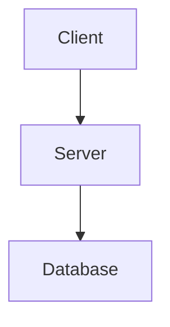

# Mastering Confluence - AI Agent Skill

A comprehensive AI agent skill for managing Confluence documentation, including Wiki Markup mastery, Markdown conversion, Mermaid diagram integration, and seamless interaction with the Atlassian MCP server.

[](https://agentskills.io/)
[](https://opensource.org/licenses/MIT)
[](https://skillzwave.ai/skill/SpillwaveSolutions__mastering-confluence-agent-skill__mastering-confluence__SKILL/)

## Key Features

- **Upload/Download**: Seamlessly sync Markdown files with Confluence pages
- **Format Conversion**: Convert between Markdown and Wiki Markup formats
- **Diagram Support**: Render Mermaid/PlantUML diagrams and embed in pages
- **Image Handling**: Automatic image upload and attachment management
- **CQL Search**: Advanced Confluence Query Language support
- **Git Integration**: Sync documentation from Git repos using mark CLI
- **No Size Limits**: Upload large documents without API restrictions

---

## Installing with Skilz (Universal Installer)

The recommended way to install this skill is using the [skilz](https://github.com/SpillwaveSolutions/skilz-cli) universal installer, which supports 14+ AI coding agents.

### Step 1: Install Skilz

```bash
pip install skilz
```

### Step 2: Install the Skill

**From SkillzWave Marketplace (Recommended):**

```bash
# Claude Code (user-level, available in all projects)
skilz install SpillwaveSolutions_mastering-confluence-agent-skill/mastering-confluence

# Claude Code (project-level only)
skilz install SpillwaveSolutions_mastering-confluence-agent-skill/mastering-confluence --project
```

**From GitHub:**

```bash
# Using HTTPS
skilz install -g https://github.com/SpillwaveSolutions/mastering-confluence-agent-skill

# Using SSH
skilz install --git git@github.com:SpillwaveSolutions/mastering-confluence-agent-skill.git
```

### Other AI Agents

```bash
# OpenCode
skilz install SpillwaveSolutions_mastering-confluence-agent-skill/mastering-confluence --agent opencode

# OpenAI Codex
skilz install SpillwaveSolutions_mastering-confluence-agent-skill/mastering-confluence --agent codex

# Gemini CLI
skilz install SpillwaveSolutions_mastering-confluence-agent-skill/mastering-confluence --agent gemini

# Cursor
skilz install SpillwaveSolutions_mastering-confluence-agent-skill/mastering-confluence --agent cursor

# Add --project flag for project-level installation
```

### Supported Platforms

This skill follows the [Agent Skill Standard](https://agentskills.io/) and supports 14+ coding agents including:
Claude Code, OpenAI Codex, OpenCode, Cursor, Gemini CLI, GitHub Copilot CLI, Windsurf, Qwen Code, Aidr, and more.

**Resources:**
- [SkillzWave Marketplace Listing](https://skillzwave.ai/skill/SpillwaveSolutions__mastering-confluence-agent-skill__mastering-confluence__SKILL/)
- [All Supported Platforms](https://skillzwave.ai/platforms/)
- [Skilz CLI Documentation](https://github.com/SpillwaveSolutions/skilz-cli)

---

## What is a Skill?

A **skill** is an instruction manual that teaches Claude Code how to use MCP (Model Context Protocol) tools effectively. Think of it this way:

- **MCP Server** (Atlassian MCP) = The tool that provides access to Confluence APIs
- **Skill** (this repository) = The instruction manual that guides Claude on best practices, conversion patterns, and workflows for using that tool

Claude Code can discover and use MCP tools automatically, but skills provide the critical context, workflows, and domain expertise that make interactions efficient, reliable, and consistent with documentation best practices.

## How This Skill Works

This skill works hand-in-glove with the **Atlassian MCP server** (`mcp__atlassian`). The MCP provides raw access to Confluence's API capabilities, while this skill provides:

- **Format conversion expertise** for Markdown ↔ Wiki Markup transformations
- **Diagram rendering workflows** for Mermaid to PNG/SVG conversion
- **CQL query construction** guidance and examples
- **mark CLI integration** for Git-to-Confluence synchronization
- **Best practices** for page creation, updates, and content organization
- **Troubleshooting guides** for common errors and edge cases

When you ask Claude Code to work with Confluence, this skill ensures operations follow proven patterns, handle format conversions correctly, and maintain documentation quality.

## Installation Levels

This skill can be installed at multiple levels depending on your organizational structure and needs:

### 1. Global Installation (User Level)

Install in your home directory for use across all projects:

```bash
~/.claude/skills/confluence/
```

**Use case**: You work with a single Confluence instance across all projects.

### 2. Project-Level Installation

Install within a specific project directory:

```bash
/path/to/project/.claude/skills/confluence/
```

**Use case**: Project-specific Confluence configuration, custom templates, or documentation workflows that differ from other projects.

### 3. Workspace-Level Installation

Install at a workspace directory that groups multiple related projects:

```bash
~/workspace/acme-corp/.claude/skills/confluence/
~/workspace/tech-startup/.claude/skills/confluence/
```

**Use case**:
- **Client-based workspaces**: Different documentation standards for different clients
- **Department-based workspaces**: Engineering vs Product vs Support documentation patterns
- **Company-based workspaces**: Multiple clients with different Confluence instances

### Installation Priority

Claude Code follows this priority order when loading skills:
1. **Project-level** (`.claude/skills/` in current directory)
2. **Workspace-level** (`.claude/skills/` in parent directories)
3. **Global-level** (`~/.claude/skills/` in home directory)

This allows project-specific customizations to override workspace or global defaults.

## Multi-Instance Confluence Support

For organizations that need to connect to multiple Confluence instances (multiple clients, acquisitions, different departments), you can configure the Atlassian MCP at different levels using `.mcp.json` files.

### Example: Multiple Client Workspaces

**Scenario**: You're a consultant managing documentation for multiple clients, each with their own Atlassian instance.

```bash
# Client 1 workspace
~/clients/acme-industries/
├── .mcp.json                     # Confluence config for acme-industries.atlassian.net
├── .claude/
│   ├── skills/confluence/        # Client-specific templates (optional)
│   └── settings.local.json
├── project-alpha/
│   └── docs/
└── project-beta/
    └── docs/

# Client 2 workspace
~/clients/globex-corp/
├── .mcp.json                     # Confluence config for globex.atlassian.net
├── .claude/
│   ├── skills/confluence/        # Client-specific templates (optional)
│   └── settings.local.json
├── web-app/
│   └── documentation/
└── mobile-app/
    └── documentation/
```

### Example: Department-Based Workspaces

**Scenario**: Large organization with different Confluence spaces per department.

```bash
# Engineering workspace
~/workspaces/engineering/
├── .mcp.json                     # Confluence config focused on DEV space
├── .claude/skills/confluence/    # Engineering documentation patterns
├── backend-services/
│   └── docs/
└── frontend-apps/
    └── docs/

# Product workspace
~/workspaces/product/
├── .mcp.json                     # Confluence config focused on PRODUCT space
├── .claude/skills/confluence/    # Product documentation patterns
├── feature-specs/
└── roadmap/
```

### .mcp.json Configuration

Each workspace can have its own `.mcp.json` file with Confluence credentials:

```json
{
  "mcpServers": {
    "atlassian": {
      "command": "npx",
      "args": ["-y", "@modelcontextprotocol/server-atlassian"],
      "env": {
        "CONFLUENCE_URL": "https://acme-industries.atlassian.net/wiki",
        "CONFLUENCE_API_TOKEN": "your-api-token-here",
        "CONFLUENCE_EMAIL": "your-email@acme-industries.com",
        "CONFLUENCE_SPACES_FILTER": "DEV,API,DOCS"
      }
    }
  }
}
```

### Configuration Priority

Claude Code uses this priority for `.mcp.json` files:
1. **Project directory** (most specific)
2. **Workspace directory** (parent directories)
3. **Global config** (`~/.claude/mcp.json`)

This allows you to:
- Connect to different Confluence instances per workspace
- Use different credentials per client/department
- Override global Confluence settings for specific projects
- Maintain separate Confluence configurations without conflicts

## Prerequisites

### Required MCP Server

The **Atlassian MCP server** must be configured in Claude Code:

```bash
npm install -g @modelcontextprotocol/server-atlassian
```

Configure in `~/.claude/mcp.json` or workspace-level `.mcp.json`:

```json
{
  "mcpServers": {
    "atlassian": {
      "command": "npx",
      "args": ["-y", "@modelcontextprotocol/server-atlassian"],
      "env": {
        "CONFLUENCE_URL": "https://your-domain.atlassian.net/wiki",
        "CONFLUENCE_API_TOKEN": "your-api-token",
        "CONFLUENCE_EMAIL": "your-email@example.com",
        "CONFLUENCE_SPACES_FILTER": "DEV,DOCS"
      }
    }
  }
}
```

### Confluence API Token

Generate a Confluence API token:
1. Go to https://id.atlassian.com/manage-profile/security/api-tokens
2. Click "Create API token"
3. Copy the token and add to your `.mcp.json` configuration

### Permissions

Ensure your Confluence account has appropriate permissions for:
- Creating/updating pages
- Searching content
- Managing spaces
- Adding labels and comments
- Uploading attachments

### Optional Tools

For full functionality, install these optional tools:

```bash
# mark CLI for Git-to-Confluence synchronization
brew install kovetskiy/mark/mark
# OR
go install github.com/kovetskiy/mark@latest

# Mermaid CLI for diagram rendering
npm install -g @mermaid-js/mermaid-cli

# Additional conversion tools (optional)
npm install -g markdown2confluence
```

## Quick Start

### 1. Install the Skill

```bash
# Global installation
mkdir -p ~/.claude/skills/
cd ~/.claude/skills/
git clone <repository-url> confluence

# OR workspace installation
mkdir -p ~/workspace/acme-corp/.claude/skills/
cd ~/workspace/acme-corp/.claude/skills/
git clone <repository-url> confluence

# OR project installation
mkdir -p /path/to/project/.claude/skills/
cd /path/to/project/.claude/skills/
git clone <repository-url> confluence
```

### 2. Configure Atlassian MCP

Create or update `.mcp.json` at the appropriate level:

```json
{
  "mcpServers": {
    "atlassian": {
      "command": "npx",
      "args": ["-y", "@modelcontextprotocol/server-atlassian"],
      "env": {
        "CONFLUENCE_URL": "https://your-domain.atlassian.net/wiki",
        "CONFLUENCE_API_TOKEN": "your-token-here",
        "CONFLUENCE_EMAIL": "your-email@example.com"
      }
    }
  }
}
```

### 3. Start Using Confluence with Claude Code

Simply ask Claude Code to work with Confluence:

```
"Create a Confluence page from this Markdown document in the DEV space"
"Search Confluence for pages about API authentication"
"Convert this Wiki Markup to Markdown"
"Update the 'Getting Started' page with this new content"
"Render these Mermaid diagrams and upload to Confluence"
```

Claude Code will automatically:
- Validate space keys
- Convert between Markdown and Wiki Markup
- Render Mermaid diagrams to images
- Construct proper CQL queries
- Handle page hierarchies
- Follow best practices from this skill

## Uploading Markdown to Confluence

The skill includes a powerful upload script (`scripts/upload_confluence.py`) that converts Markdown files to Confluence pages.

### Quick Upload Examples

**Smart upload (reads metadata from frontmatter):**
```bash
python3 ~/.claude/skills/confluence/scripts/upload_confluence.py page.md
```

**Update specific page by ID:**
```bash
python3 ~/.claude/skills/confluence/scripts/upload_confluence.py page.md --id 450855912
```

**Create new page in a space:**
```bash
python3 ~/.claude/skills/confluence/scripts/upload_confluence.py page.md --space ARCP --parent-id 123456
```

**Preview without uploading:**
```bash
python3 ~/.claude/skills/confluence/scripts/upload_confluence.py page.md --dry-run
```

### Download → Edit → Upload Workflow

The most powerful feature is the seamless workflow for updating existing pages:

```bash
# 1. Download a page (gets frontmatter with all metadata)
python3 ~/.claude/skills/confluence/scripts/download_confluence.py 450855912

# 2. Edit the markdown file locally
vim Data_Source_Registry_Manager_API.md

# 3. Upload changes (reads everything from frontmatter - zero configuration!)
python3 ~/.claude/skills/confluence/scripts/upload_confluence.py Data_Source_Registry_Manager_API.md
```

The frontmatter from the download contains:
- Page ID (for updates)
- Space key
- Current version number (auto-increments)
- Parent page ID
- Title

### Mermaid Diagram Support

Mermaid diagrams in your Markdown are automatically rendered to SVG images and uploaded as attachments:

```markdown
## Architecture Diagram


```

Requirements:
```bash
npm install -g @mermaid-js/mermaid-cli
```

### Credential Discovery

The upload script searches for credentials in this order:

1. Environment variables (`CONFLUENCE_URL`, `CONFLUENCE_USERNAME`, `CONFLUENCE_API_TOKEN`)
2. `.env` in current directory
3. `.env.confluence` in current directory
4. `.env.jira` in current directory
5. `.env.atlassian` in current directory
6. Walk up parent directories for above files
7. MCP config (`~/.config/mcp/.mcp.json`)

Create a `.env` file with your credentials:
```bash
CONFLUENCE_URL=https://your-domain.atlassian.net
CONFLUENCE_USERNAME=your.email@example.com
CONFLUENCE_API_TOKEN=your_api_token_here
```

See `examples/.env.confluence.example` for a template.

### Upload CLI Options

```
usage: upload_confluence.py [-h] [--id PAGE_ID] [--space SPACE] [--title TITLE]
                            [--parent-id PARENT_ID] [--ignore-frontmatter]
                            [--dry-run] [--env-file ENV_FILE]
                            [--update-frontmatter] [--output-dir OUTPUT_DIR]
                            file

positional arguments:
  file                  Markdown file to upload

options:
  --id PAGE_ID          Page ID (for updates)
  --space SPACE         Space key (required for new pages)
  --title TITLE         Page title (overrides frontmatter/H1)
  --parent-id PARENT_ID Parent page ID (specify parent to move page)
  --ignore-frontmatter  Ignore parent_id in frontmatter (update page in place without moving)
  --dry-run             Preview without uploading
  --env-file ENV_FILE   Path to .env file with credentials
  --update-frontmatter  Update markdown file frontmatter after upload
  --output-dir OUTPUT_DIR Directory for generated diagrams
```

**Parent Relationship Control** ⚠️ IMPORTANT

The script's handling of parent relationships requires attention during migrations:

- **Default behavior**: Uses `parent.id` from YAML frontmatter if present
- **`--ignore-frontmatter`**: Ignores frontmatter parent, updates content only
- **`--parent-id`**: Explicitly sets parent (overrides frontmatter)
- **Combined**: `--ignore-frontmatter --parent-id X` = full control

**Common Scenarios**:

```bash
# Content-only update (no parent change)
python3 upload_confluence.py --id 123456 --ignore-frontmatter page.md

# Content update + explicit move to new parent
python3 upload_confluence.py --id 123456 --parent-id 789012 --ignore-frontmatter page.md

# Use frontmatter parent (legacy behavior)
python3 upload_confluence.py --id 123456 page.md
```

**⚠️ Critical Warning**: When restoring content from backup files after moving pages, always use `--ignore-frontmatter` to prevent inadvertent moves back to original parents. See [PARENT_RELATIONSHIP_GUIDE.md](PARENT_RELATIONSHIP_GUIDE.md) for details.

### Frontmatter Example

When you download a page, it includes complete metadata:

```yaml
---
title: Data Source Registry Manager API
confluence:
  id: '450855912'
  space: ARCP
  type: page
  version: 2
confluence_url: https://your-domain.atlassian.net/wiki/spaces/ARCP/pages/450855912
parent:
  id: '438862162'
  title: PDR Components
  file: PDR_Components.md
breadcrumb:
  - id: '205127682'
    title: Platform Home
  - id: '438862162'
    title: PDR Components
  - id: '450855912'
    title: Data Source Registry Manager API
exported_at: '2025-11-06 12:03:44'
exported_by: confluence_downloader
---
```

On upload, the script:
- Reads `confluence.id` → Updates existing page
- Reads `confluence.version` → Auto-increments to version 3
- Reads `confluence.space` → Uses for creation if no ID
- Reads `parent.id` → Sets parent page relationship

### Installation

Install Python dependencies:
```bash
cd ~/.claude/skills/confluence/scripts
pip3 install -r requirements.txt
```

Optional (for Mermaid diagrams):
```bash
npm install -g @mermaid-js/mermaid-cli
```

## Features

### Page Management
- Create pages with proper hierarchy
- Update existing pages
- Search with CQL (Confluence Query Language)
- Get page details and content
- Delete pages
- Manage page children and relationships

### Format Conversion
- Markdown → Confluence Wiki Markup
- Wiki Markup → Markdown
- Preserve formatting and structure
- Handle nested elements (lists, tables, code blocks)
- Convert inline formatting (bold, italic, code)

### Diagram Integration
- Render Mermaid diagrams to PNG/SVG
- Extract diagrams from Markdown files
- Upload diagrams as attachments
- Embed diagrams in Confluence pages
- Support all Mermaid diagram types (flowchart, sequence, class, etc.)

### Git Integration (mark CLI)
- Sync Markdown files from Git to Confluence
- Automatic metadata management
- CI/CD integration patterns
- Batch synchronization workflows

### Content Organization
- Add labels to pages
- Create page hierarchies with parent/child relationships
- Manage comments
- Search with advanced CQL queries
- Organize content with proper structure

### Batch Operations
- Create multiple pages from directory structure
- Sync entire documentation repositories
- Bulk label management
- Mass updates with version control

## File Structure

```
~/.claude/skills/confluence/
├── CLAUDE.md                         # Architecture guide for Claude Code
├── README.md                         # This file
├── SKILL.md                          # Detailed skill documentation
├── QUICK_REFERENCE.md                # Command cheat sheet
├── INSTALLATION.md                   # Installation guide
├── PARENT_RELATIONSHIP_GUIDE.md      # Parent relationship handling guide (⚠️ CRITICAL)
├── scripts/
│   ├── upload_confluence.py          # Upload Markdown to Confluence
│   ├── download_confluence.py        # Download Confluence pages to Markdown
│   ├── convert_markdown_to_wiki.py   # Markdown → Wiki Markup converter
│   ├── render_mermaid.py             # Mermaid diagram renderer
│   └── generate_mark_metadata.py     # mark metadata generator
├── references/
│   ├── wiki_markup_guide.md          # Complete Wiki Markup reference
│   ├── conversion_guide.md           # Conversion rules and edge cases
│   └── mark_tool_guide.md            # mark CLI documentation
├── examples/
│   └── sample-confluence-page.md     # Example Markdown document
└── assets/
    └── (diagram examples)
```

## Key Documentation

### SKILL.md (Primary Reference)
Comprehensive workflow documentation including:
- Page creation and update workflows
- Format conversion patterns
- Mermaid diagram integration
- mark CLI usage and CI/CD integration
- CQL query patterns
- Troubleshooting guide
- Best practices

### QUICK_REFERENCE.md
Quick command reference for:
- Common tasks
- Format conversion cheat sheet
- CQL search examples
- mark CLI commands
- Python script usage

### PARENT_RELATIONSHIP_GUIDE.md ⚠️ CRITICAL
**Essential reading for migrations and content restoration:**
- Root cause analysis of parent relationship issues
- New `--ignore-frontmatter` and `--parent-id` options
- Usage examples and decision matrix
- Migration workflow patterns
- Troubleshooting parent move issues
- PDR migration case study

**Read this guide before**:
- Large-scale documentation restructures
- Content restoration after moves
- Batch page migrations
- Any operation involving parent relationships

### references/wiki_markup_guide.md
Complete Wiki Markup syntax reference:
- Text formatting
- Headings and lists
- Tables and code blocks
- Macros (panels, info boxes, code blocks)
- Images and links
- Advanced formatting

### references/conversion_guide.md
Detailed conversion rules:
- Markdown → Wiki Markup mappings
- Edge cases and limitations
- Nested structure handling
- Special character escaping

### references/mark_tool_guide.md
Comprehensive mark CLI guide:
- Installation and configuration
- Metadata header format
- CI/CD integration examples
- Best practices for Git-to-Confluence workflows

### scripts/
Python utilities for automation:
- `convert_markdown_to_wiki.py` - Format conversion
- `render_mermaid.py` - Diagram rendering
- `generate_mark_metadata.py` - Metadata management

### CLAUDE.md
Architecture and patterns guide for Claude Code instances, documenting:
- Core conversion patterns
- MCP tool usage workflows
- Format conversion reference
- Common task patterns

## Common Workflows

### Creating Pages from Markdown

```
"Create a Confluence page from this Markdown in the DEV space titled 'API Guide'"
"Convert this Markdown document with Mermaid diagrams to Confluence"
"Create a page under 'Documentation' parent with this content"
```

### Searching Confluence

```
"Search Confluence for pages about authentication in the DEV space"
"Find all pages labeled 'api' created this month"
"Show me pages in DEV space modified in the last 7 days"
```

### Format Conversion

```
"Convert this Wiki Markup to Markdown"
"Convert this Markdown to Confluence format"
"Show me how to write a table in Wiki Markup"
```

### Diagram Rendering

```
"Render this Mermaid diagram and create a Confluence page"
"Extract all diagrams from this Markdown and upload to Confluence"
"Create a page with this flowchart diagram"
```

### Git-to-Confluence Sync

```
"Add mark metadata to this Markdown file for syncing to DEV space"
"Help me sync this docs/ folder to Confluence using mark"
"Set up CI/CD to sync Markdown docs to Confluence"
```

### Updating Pages

```
"Update the 'Getting Started' page in DEV space with this new content"
"Find and update the authentication guide with these changes"
"Add this section to the API documentation page"
```

## Best Practices

### 1. Validate Space Keys
Always verify space keys before operations:
```
"What Confluence spaces are available?"
```

### 2. Use Proper Page Hierarchies
Organize content with parent-child relationships:
```
"Create this page under 'Documentation > API Guides' in DEV space"
```

### 3. Apply Consistent Labels
Use labels for organization and discovery:
```
"Create this page with labels: api, documentation, authentication"
```

### 4. Test Conversions on Samples
Verify format conversions before bulk operations:
```
"Convert this small section first to verify the formatting"
```

### 5. Keep Diagram Sources in Git
Always commit .mmd files alongside Markdown:
```bash
docs/
├── architecture.md
└── diagrams/
    ├── architecture-overview.mmd
    └── data-flow.mmd
```

### 6. Use mark for Documentation-as-Code
Automate Confluence updates from Git:
```
"Set up mark CLI to sync this repository's docs to Confluence"
```

### 7. Add Version Comments
Track changes with meaningful version comments:
```
"Update this page with version comment: Updated API authentication flow"
```

## Troubleshooting

### "Space not found"
- Use `"What Confluence spaces are available?"` to see available spaces
- Check `CONFLUENCE_SPACES_FILTER` environment variable in `.mcp.json`
- Verify space key is exact (case-sensitive)

### "Permission denied"
- Check Confluence permissions for your account
- Verify API token is valid and not expired
- Ensure you have edit permissions in the target space

### Format conversion issues
- Review conversion guide for edge cases
- Test problematic sections separately
- Check for unsupported Markdown extensions
- Verify nested formatting is properly structured

### Mermaid rendering fails
- Verify mermaid-cli is installed: `mmdc --version`
- Test diagram syntax at https://mermaid.live
- Check for syntax errors in diagram code
- Try SVG format if PNG fails

### mark CLI sync issues
- Verify mark is installed: `mark --version`
- Check metadata headers are properly formatted
- Test with `--dry-run` first
- Ensure base_url includes `/wiki` suffix
- Verify API token matches the instance

### Multiple Confluence instances
- Verify correct `.mcp.json` is loaded for workspace/project
- Check `CONFLUENCE_URL` in environment configuration
- Ensure API token matches the Confluence instance
- Use workspace isolation to prevent conflicts

## Integration with Other Skills

This Confluence skill can work alongside other Claude Code skills:

### JIRA Skill
Link documentation to JIRA issues:
```
"Create remote link from JIRA ticket ENG-123 to this Confluence page"
```

### Project Documentation Skills
Maintain project-specific documentation:
```
"Create Confluence pages from the project's README and architecture docs"
```

### Meeting Notes Skills
Convert meeting notes to documentation:
```
"Create Confluence page from these meeting notes in the TEAM space"
```

## Advanced Usage

### Custom CQL Queries
See `SKILL.md` for:
- Complex search patterns
- Date/time functions
- Label-based queries
- Creator/contributor filters
- Historical search capabilities

### Batch Synchronization
See `scripts/` for automation:
- Bulk page creation from directory structure
- Automated diagram rendering and upload
- CI/CD integration examples
- Git repository synchronization

### Custom Conversion Rules
Extend conversion scripts for:
- Project-specific macros
- Custom Wiki Markup extensions
- Special formatting requirements
- Domain-specific patterns

## CI/CD Integration Example

Automatically sync documentation to Confluence when docs change:

```yaml
# .github/workflows/sync-confluence.yml
name: Sync to Confluence

on:
  push:
    paths:
      - 'docs/**/*.md'
    branches:
      - main

jobs:
  sync:
    runs-on: ubuntu-latest
    steps:
      - uses: actions/checkout@v3

      - name: Install mark
        run: |
          curl -LO https://github.com/kovetskiy/mark/releases/latest/download/mark
          chmod +x mark
          sudo mv mark /usr/local/bin/

      - name: Install mermaid-cli
        run: npm install -g @mermaid-js/mermaid-cli

      - name: Sync to Confluence
        env:
          CONFLUENCE_USERNAME: ${{ secrets.CONFLUENCE_USERNAME }}
          CONFLUENCE_PASSWORD: ${{ secrets.CONFLUENCE_API_TOKEN }}
          CONFLUENCE_BASE_URL: ${{ secrets.CONFLUENCE_BASE_URL }}
        run: |
          for file in docs/**/*.md; do
            # Render any Mermaid diagrams
            python scripts/render_mermaid.py --extract-from-markdown "$file" --output-dir diagrams/

            # Sync to Confluence
            mark -u "$CONFLUENCE_USERNAME" \
                 -p "$CONFLUENCE_PASSWORD" \
                 --base-url "$CONFLUENCE_BASE_URL" \
                 -f "$file"
          done
```

## Updates and Maintenance

### Updating the Skill

```bash
cd ~/.claude/skills/confluence  # or workspace/project path
git pull origin main
```

### Customizing for Your Team

You can customize this skill by:
1. **Modifying conversion scripts** for project-specific patterns
2. **Adding custom CQL patterns** to references
3. **Documenting team workflows** in SKILL.md
4. **Creating custom templates** for common page types
5. **Adding automation scripts** for recurring tasks

### Version Control

Keep skill customizations in version control:
```bash
cd ~/.claude/skills/confluence  # or workspace path
git remote add team-fork https://github.com/your-org/confluence-skill-fork.git
git push team-fork main
```

This allows sharing customizations across your team.

## Support

For issues or questions:

1. **Check SKILL.md** for detailed workflows
2. **Review QUICK_REFERENCE.md** for common commands
3. **Review references/** for Wiki Markup and conversion help
4. **Consult Atlassian MCP documentation**
5. **Verify .mcp.json configuration**
6. **Check Confluence permissions** for your account
7. **Review CLAUDE.md** for architecture patterns

## Contributing

To improve this skill:

1. Document new workflows in `SKILL.md`
2. Add conversion patterns to `references/conversion_guide.md`
3. Create example files in `examples/`
4. Share automation scripts in `scripts/`
5. Update best practices based on experience
6. Add CQL patterns for common searches

## License

This skill is designed for use with Claude Code and the Atlassian MCP server.

## Related Resources

- [Claude Code Documentation](https://docs.claude.com/claude-code)
- [Model Context Protocol](https://modelcontextprotocol.io/)
- [Atlassian Confluence Documentation](https://support.atlassian.com/confluence/)
- [Confluence Wiki Markup Reference](https://confluence.atlassian.com/doc/confluence-wiki-markup-251003035.html)
- [mark CLI Tool](https://github.com/kovetskiy/mark)
- [Mermaid Diagram Syntax](https://mermaid.js.org/)
- [Atlassian MCP Server](https://github.com/modelcontextprotocol/servers/tree/main/src/atlassian)
