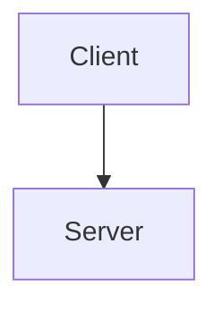

# Image Handling Best Practices for Confluence

**Purpose:** Guidelines for correctly handling images when uploading to Confluence.

## ⚠️ CRITICAL: DO NOT USE MCP FOR PAGE UPLOADS

**MCP has size limits** and cannot upload large documents with images. Always use the REST API directly via the confluence skill's upload scripts.

## Image Type Support

The confluence skill supports multiple image types:

1. **Regular Images** - PNG, JPG, GIF, SVG files
2. **Mermaid Diagrams** - Convert to PNG/SVG first using `design-doc-mermaid` skill
3. **PlantUML Diagrams** - Convert to PNG/SVG using `plantuml` skill
4. **External Images** - Referenced via URL (not uploaded as attachments)

## Workflow for Each Image Type

### Regular Images (PNG, JPG, SVG, etc.)

**Use Case:** Screenshots, logos, photos, hand-drawn diagrams

**Workflow:**
1. Place image files in a directory (e.g., `./images/`)
2. Reference in markdown using standard syntax:
   ```markdown
   
   
   ```
3. Upload using `upload_confluence_v2.py`:
   ```bash
   python3 upload_confluence_v2.py document.md --id 780369923
   ```

**What Happens:**
- md2cf detects image paths and converts to: `<ac:image><ri:attachment ri:filename="logo.png"/></ac:image>`
- Image paths added to `renderer.attachments` list
- Upload script uploads images as page attachments
- Images render inline in Confluence

### Mermaid Diagrams

**Use Case:** Architecture diagrams, flowcharts, sequence diagrams, state machines

**Option 1: Use design-doc-mermaid Skill (Recommended)**

The `design-doc-mermaid` skill provides comprehensive Mermaid diagram support.

**Workflow:**
1. Invoke skill: `Skill: "design-doc-mermaid"`
2. Follow skill prompts to convert Mermaid code to images
3. Reference generated images in markdown:
   ```markdown
   
   ```
4. Upload to Confluence using this skill's upload script

**Option 2: Manual Conversion**

```bash
# Install mermaid-cli if needed
npm install -g @mermaid-js/mermaid-cli

# Convert Mermaid to PNG
mmdc -i architecture.mmd -o architecture.png -b transparent

# Convert Mermaid to SVG
mmdc -i architecture.mmd -o architecture.svg -b transparent
```

**Reference in Markdown:**
```markdown


*Figure 1: System Architecture*
```

**Do NOT:**
- ❌ Use Mermaid code blocks in markdown when uploading to Confluence
- ❌ Use `MermaidConfluenceRenderer` directly (it breaks regular images)
- ❌ Put raw `<ac:image>` XML in markdown (gets escaped as literal text)

### PlantUML Diagrams

**Use Case:** UML diagrams, component diagrams, deployment diagrams, ER diagrams

**Use plantuml Skill (Recommended)**

The `plantuml` skill provides complete PlantUML diagram support.

**Workflow:**
1. Invoke skill: `Skill: "plantuml"`
2. Follow skill prompts to convert PlantUML code to images
3. Reference generated images in markdown:
   ```markdown
   
   ```
4. Upload to Confluence using this skill's upload script

**Manual Conversion (Alternative):**

```bash
# Install PlantUML if needed
# See plantuml skill documentation

# Convert PlantUML to PNG
plantuml diagram.puml -tpng

# Convert PlantUML to SVG
plantuml diagram.puml -tsvg
```

**Reference in Markdown:**
```markdown


*Figure 2: Component Architecture*
```

### External Images (URLs)

**Use Case:** Images hosted elsewhere, CDN images, remote resources

**Workflow:**
1. Reference external URL directly in markdown:
   ```markdown
   
   ```

**Note:** External images are NOT uploaded as attachments. Confluence embeds them via URL reference.

## The md2cf Conversion Process

### How ConfluenceRenderer Handles Images

**Input (Markdown):**
```markdown

```

**Processing:**
1. `ConfluenceRenderer` detects markdown image syntax
2. Extracts alt text: "Architecture Diagram"
3. Extracts path: "./diagrams/architecture.png"
4. Adds path to `renderer.attachments` list (as string)
5. Generates storage format XML

**Output (Storage Format):**
```xml
<ac:image ac:alt="Architecture Diagram">
  <ri:attachment ri:filename="architecture.png"/>
</ac:image>
```

**Attachments List:**
```python
renderer.attachments = ['./diagrams/architecture.png']
```

### Image Syntax Support

**Standard Markdown (Supported):**
```markdown

  # Alt text optional
  # Relative paths OK
```

**With Width/Height (NOT Supported by Standard Markdown):**

To control image size in Confluence, you need to:
1. Upload image first
2. Manually adjust size in Confluence UI
3. Or use Confluence wiki markup in source (advanced)

## Common Mistakes and Fixes

### ❌ Mistake 1: Using Raw Confluence XML

**Wrong:**
```markdown
<ac:image ac:align="center" ac:width="800">
  <ri:attachment ri:filename="diagram.png"/>
</ac:image>
```

**What Happens:** Text appears literally as escaped HTML:
```
&lt;ac:image&gt;...&lt;/ac:image&gt;
```

**Fix:** Use markdown image syntax:
```markdown

```

### ❌ Mistake 2: Using Mermaid Code Blocks

**Wrong:**
```markdown
# Architecture


```

**What Happens:**
- If using base `ConfluenceRenderer`: Appears as code block, not diagram
- If using `MermaidConfluenceRenderer`: Breaks regular image handling

**Fix:** Convert Mermaid to PNG first:
```bash
# Use design-doc-mermaid skill OR manually:
mmdc -i arch.mmd -o arch.png

# Then reference in markdown:

```

### ❌ Mistake 3: Using MermaidConfluenceRenderer with Regular Images

**Wrong (in upload script):**
```python
from mermaid_renderer import MermaidConfluenceRenderer

renderer = MermaidConfluenceRenderer()  # ❌ Breaks regular images!
```

**What Happens:** `MermaidConfluenceRenderer` overwrites parent's `attachments` attribute, breaking regular markdown image detection.

**Fix:** Use base `ConfluenceRenderer`:
```python
from md2cf.confluence_renderer import ConfluenceRenderer

renderer = ConfluenceRenderer()  # ✅ Works with all images
```

Then convert diagrams to images separately using appropriate skill.

### ❌ Mistake 4: Forgetting to Upload Attachments

**Wrong:**
```python
# Only upload page content
confluence.update_page(
    page_id=page_id,
    body=storage_html,
    representation='storage'
)
# Missing: attachment upload!
```

**What Happens:** Confluence shows placeholder icons or broken image links.

**Fix:** Upload attachments after page content:
```python
# Upload page
confluence.update_page(...)

# Upload attachments
for image_path in attachments:
    confluence.attach_file(
        filename=image_path,
        page_id=page_id,
        ...
    )
```

## Recommended Workflow (Complete Example)

**Goal:** Upload technical document with Mermaid diagrams and screenshots to Confluence.

**Step 1: Prepare Images**

```bash
# Convert Mermaid diagrams to PNG using design-doc-mermaid skill
# (or manually with mmdc)

# Place screenshots in images directory
mkdir -p ./images
cp ~/screenshots/*.png ./images/

# Organize generated diagrams
mkdir -p ./diagrams
mv *.png ./diagrams/
```

**Step 2: Write Markdown with Image References**

```markdown
# Technical Architecture Document

## Overview

This document describes our system architecture.

## Architecture Diagram


*Figure 1: High-Level System Architecture (C4 Container Style)*

## User Interface

Here's a screenshot of the main dashboard:


*Figure 2: Main Dashboard Interface*

## Deployment Diagram


*Figure 3: Deployment Architecture on AWS*
```

**Step 3: Upload to Confluence**

```bash
# Use upload_confluence_v2.py script
python3 ~/.claude/skills/confluence/scripts/upload_confluence_v2.py \
    document.md \
    --id 780369923 \
    --env-file /path/to/.env.jira
```

**What Happens:**
1. Script reads markdown file
2. md2cf converts markdown to storage format
3. md2cf detects 3 images and adds to attachments list
4. Script uploads page content via REST API
5. Script uploads 3 image files as attachments
6. Confluence renders images inline in page

**Result:** ✅ Complete document with all images rendering correctly!

## Skill Integration

### Using design-doc-mermaid Skill

**When to Use:**
- Creating architecture diagrams from Mermaid code
- Generating multiple diagram types (sequence, class, state, etc.)
- Need comprehensive Mermaid diagram support

**Workflow:**
```markdown
1. Invoke skill: Skill: "design-doc-mermaid"
2. Provide Mermaid diagram code when prompted
3. Skill generates PNG/SVG images
4. Reference generated images in your markdown
5. Upload to Confluence using this confluence skill
```

**See:** `~/.claude/skills/design-doc-mermaid/SKILL.md` for complete documentation.

### Using plantuml Skill

**When to Use:**
- Creating UML diagrams (class, component, deployment, etc.)
- ER diagrams, activity diagrams
- Complex diagram types not supported by Mermaid

**Workflow:**
```markdown
1. Invoke skill: Skill: "plantuml"
2. Provide PlantUML diagram code when prompted
3. Skill generates PNG/SVG images
4. Reference generated images in your markdown
5. Upload to Confluence using this confluence skill
```

**See:** `~/.claude/skills/plantuml/SKILL.md` for complete documentation.

## Size Limits and Performance

### MCP Size Limits (CRITICAL)

**DO NOT USE MCP FOR CONFLUENCE PAGE UPLOADS.**

- ❌ `mcp__atlassian__confluence_update_page` - Has size limits
- ❌ `mcp__atlassian__confluence_create_page` - Has size limits

**Use REST API Instead:**
- ✅ `upload_confluence_v2.py` - No size limits, handles large documents

### Image File Size Recommendations

- **PNG Screenshots:** Keep under 500KB (optimize with tools like pngquant)
- **PNG Diagrams:** Usually small (< 100KB)
- **SVG Diagrams:** Very small (< 50KB), preferred for diagrams
- **JPG Photos:** Keep under 1MB, use 80-85% quality

### Page Size Guidelines

- **Small Pages:** < 50KB - No issues
- **Medium Pages:** 50KB - 500KB - Use REST API, avoid MCP
- **Large Pages:** > 500KB - Use REST API, test thoroughly
- **Very Large:** > 1MB - Consider splitting into multiple pages

## Troubleshooting

**Problem:** Images appear as literal `<ac:image>` text

**Solution:** You put raw XML in markdown. Use `` syntax instead.

---

**Problem:** Images show as broken icons/placeholders

**Solution:** Attachments weren't uploaded. Verify `attach_file()` calls completed.

---

**Problem:** "String indices must be integers" error

**Solution:** API response structure issue. Use `upload_confluence_v2.py` which handles this correctly.

---

**Problem:** MCP size limit error

**Solution:** Don't use MCP. Use `upload_confluence_v2.py` script instead.

---

**Problem:** Regular images stopped working after adding Mermaid support

**Solution:** Don't use `MermaidConfluenceRenderer`. Use base `ConfluenceRenderer` and convert diagrams separately.

## References

- [confluence_storage_format.md](./confluence_storage_format.md) - Storage format details
- [troubleshooting_guide.md](./troubleshooting_guide.md) - Common errors and fixes
- `~/.claude/skills/design-doc-mermaid/SKILL.md` - Mermaid diagram skill
- `~/.claude/skills/plantuml/SKILL.md` - PlantUML diagram skill
