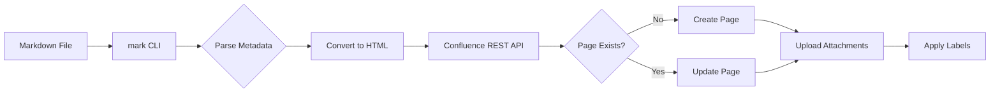

# Complete Guide to the mark Tool

> **mark** - A command-line tool for syncing Markdown documentation to Atlassian Confluence
>
> **GitHub**: https://github.com/kovetskiy/mark
> **Purpose**: Documentation-as-Code workflow for Confluence

## Table of Contents

- [Overview](#overview)
- [Installation](#installation)
- [Configuration](#configuration)
- [Markdown Metadata](#markdown-metadata)
- [Basic Usage](#basic-usage)
- [Advanced Features](#advanced-features)
- [File Uploads and Attachments](#file-uploads-and-attachments)
- [CI/CD Integration](#cicd-integration)
- [Best Practices](#best-practices)
- [Troubleshooting](#troubleshooting)

## Overview

### What is mark?

`mark` is a CLI tool that:
- **Converts** Markdown files to Confluence pages
- **Synchronizes** content between Git repositories and Confluence
- **Manages** page hierarchies and relationships
- **Uploads** attachments referenced in Markdown
- **Creates** pages and parent pages automatically
- **Updates** existing pages with new content
- **Applies** labels for organization

### Key Benefits

1. **Documentation-as-Code**: Keep docs in Git with your code
2. **Automation-Friendly**: Perfect for CI/CD pipelines
3. **Single Source of Truth**: Markdown in Git, auto-sync to Confluence
4. **Version Control**: Track documentation changes alongside code
5. **Collaboration**: Team can review docs via pull requests
6. **Consistency**: Maintain formatting standards via templates

### How It Works



## Installation

### macOS (Homebrew)

```bash
brew install kovetskiy/mark/mark
```

### Linux/macOS (Go)

```bash
go install github.com/kovetskiy/mark@latest
```

### Docker

```bash
docker pull kovetskiy/mark

# Run with Docker
docker run --rm -v $(pwd):/docs kovetskiy/mark -f /docs/README.md
```

### From Source

```bash
git clone https://github.com/kovetskiy/mark.git
cd mark
go build -o mark
sudo mv mark /usr/local/bin/
```

### Direct Download

```bash
# Download latest release
curl -LO https://github.com/kovetskiy/mark/releases/latest/download/mark

# Make executable
chmod +x mark

# Move to PATH
sudo mv mark /usr/local/bin/
```

### Verify Installation

```bash
mark --version
```

## Configuration

### Configuration File

Create `~/.config/mark` (or `~/.config/mark.toml`):

```toml
# Confluence credentials
username = "your-email@example.com"
password = "your-api-token-here"

# Confluence instance URL (include /wiki for Cloud)
base_url = "https://your-instance.atlassian.net/wiki"

# Optional: Default space
space = "DEV"

# Optional: Enable debug logging
debug = false

# Optional: Dry run mode (preview without making changes)
dry_run = false
```

### Environment Variables

Alternatively, use environment variables:

```bash
export CONFLUENCE_USERNAME="your-email@example.com"
export CONFLUENCE_PASSWORD="your-api-token-here"
export CONFLUENCE_BASE_URL="https://your-instance.atlassian.net/wiki"
```

### API Token Generation

**For Confluence Cloud:**

1. Go to https://id.atlassian.com/manage-profile/security/api-tokens
2. Click "Create API token"
3. Give it a name (e.g., "mark CLI")
4. Copy the token (save it securely!)
5. Use your email as username, token as password

**For Confluence Server/Data Center:**

Use your username and password, or configure SSO/OAuth if required.

## Markdown Metadata

### Required Metadata

Every Markdown file synced with mark must include metadata in HTML comments:

```markdown
<!-- Space: DEV -->
<!-- Title: My Page Title -->

# My Page Title

Content goes here...
```

### Metadata Fields

#### Space (Required)

```markdown
<!-- Space: DEV -->
```

The Confluence space key where the page will be created.

#### Title (Optional)

```markdown
<!-- Title: API Documentation -->
```

Page title. If omitted, mark will infer from the first H1 heading.

#### Parent (Optional, Multiple Allowed)

```markdown
<!-- Parent: API Guides -->
```

Create page hierarchy. Multiple `Parent` lines create nested structure:

```markdown
<!-- Space: DEV -->
<!-- Parent: Documentation -->
<!-- Parent: API Guides -->
<!-- Parent: REST API -->
<!-- Title: Authentication -->
```

This creates:
```
Documentation/
  └── API Guides/
      └── REST API/
          └── Authentication
```

**Important**: Parents are specified from outermost to innermost.

#### Label (Optional, Multiple Allowed)

```markdown
<!-- Label: api -->
<!-- Label: documentation -->
<!-- Label: authentication -->
```

Add labels to the page for organization and searchability.

#### Attachment (Optional, Multiple Allowed)

```markdown
<!-- Attachment: diagrams/architecture.png -->
<!-- Attachment: files/api-spec.yaml -->
```

Upload local files as attachments. Paths are relative to the Markdown file location.

### Complete Example

```markdown
<!-- Space: DEV -->
<!-- Parent: Documentation -->
<!-- Parent: API Guides -->
<!-- Title: REST API Authentication Guide -->
<!-- Label: api -->
<!-- Label: authentication -->
<!-- Label: security -->
<!-- Attachment: diagrams/auth-flow.png -->
<!-- Attachment: examples/auth-example.json -->

# REST API Authentication Guide

This guide explains how to authenticate with our REST API.

## Overview

We use OAuth 2.0 for authentication...

## Architecture


## Example

See the example request in [auth-example.json](examples/auth-example.json).
```

## Basic Usage

### Sync a Single File

```bash
mark -f documentation.md
```

### Specify Credentials

```bash
mark -u user@example.com -p api-token -f documentation.md
```

### Use Custom Config File

```bash
mark -c ~/.config/mark-production -f documentation.md
```

### Dry Run (Preview)

```bash
mark --dry-run -f documentation.md
```

This shows what would happen without making actual changes.

### Verbose Output

```bash
mark -v -f documentation.md
```

### Debug Mode

```bash
mark --debug -f documentation.md
```

## Advanced Features

### Automatic Page Creation

If the target page doesn't exist, mark will:
1. Create the page
2. Create parent pages if they don't exist
3. Set up the correct hierarchy

### Automatic Updates

If the page already exists, mark will:
1. Update the content
2. Increment the version number
3. Preserve page history
4. Maintain page ID and URL

### Version Comments

Pass a commit message or version comment:

```bash
mark -f documentation.md --version-message "Updated API endpoints"
```

In CI/CD:

```bash
mark -f documentation.md --version-message "$CI_COMMIT_MESSAGE"
```

### Multiple Files

Sync multiple files in a directory:

```bash
for file in docs/**/*.md; do
  mark -f "$file"
done
```

Or use a script:

```bash
#!/bin/bash
find docs/ -name "*.md" -type f | while read file; do
  echo "Syncing $file..."
  mark -f "$file"
done
```

## File Uploads and Attachments

### How Attachments Work

1. Reference files in the `Attachment` metadata
2. mark uploads them to Confluence
3. Files become page attachments
4. Reference attachments in Markdown

### Attachment Metadata

```markdown
<!-- Attachment: path/to/file.pdf -->
<!-- Attachment: images/diagram.png -->
<!-- Attachment: data/sample.csv -->
```

**Important**: Paths are relative to the Markdown file location.

### Referencing Attachments in Content

**Images:**
```markdown

```

**Links:**
```markdown
Download the [API specification](files/api-spec.yaml).
```

### Supported File Types

Mark supports all file types that Confluence accepts:
- Images: PNG, JPG, GIF, SVG
- Documents: PDF, DOCX, XLSX, PPTX
- Code: JSON, YAML, XML, TXT
- Archives: ZIP, TAR.GZ
- And more...

### Attachment Updates

When you re-run mark:
- Existing attachments are updated if the file changed
- New attachments are uploaded
- Removed attachments remain on the page (mark doesn't delete)

### Example with Multiple Attachments

```markdown
<!-- Space: PROJ -->
<!-- Title: Project Documentation -->
<!-- Attachment: diagrams/architecture.png -->
<!-- Attachment: diagrams/workflow.png -->
<!-- Attachment: specs/requirements.pdf -->
<!-- Attachment: data/metrics.csv -->

# Project Documentation

## Architecture


## Workflow


## Requirements

See [requirements.pdf](specs/requirements.pdf) for detailed specifications.

## Metrics

Latest metrics are available in [metrics.csv](data/metrics.csv).
```

## CI/CD Integration

### GitHub Actions Example

```yaml
name: Sync Documentation to Confluence

on:
  push:
    paths: ['docs/**/*.md']
    branches: [main]

jobs:
  sync:
    runs-on: ubuntu-latest
    steps:
      - uses: actions/checkout@v3
      - name: Install and sync
        env:
          CONFLUENCE_USERNAME: ${{ secrets.CONFLUENCE_USERNAME }}
          CONFLUENCE_PASSWORD: ${{ secrets.CONFLUENCE_API_TOKEN }}
          CONFLUENCE_BASE_URL: ${{ secrets.CONFLUENCE_BASE_URL }}
        run: |
          curl -sLO https://github.com/kovetskiy/mark/releases/latest/download/mark
          chmod +x mark && sudo mv mark /usr/local/bin/
          for file in docs/**/*.md; do
            mark -u "$CONFLUENCE_USERNAME" -p "$CONFLUENCE_PASSWORD" \
                 --base-url "$CONFLUENCE_BASE_URL" -f "$file" \
                 --version-message "Commit ${{ github.sha }}"
          done
```

**Other CI/CD platforms:** See [mark GitHub repository](https://github.com/kovetskiy/mark#cicd) for GitLab CI, Jenkins, Azure DevOps, and CircleCI examples.

## Best Practices

### 1. Directory Structure

Organize documentation in a clear structure:

```
docs/
├── api/
│   ├── authentication.md
│   ├── endpoints.md
│   └── errors.md
├── guides/
│   ├── getting-started.md
│   └── advanced.md
├── diagrams/
│   ├── architecture.png
│   └── workflow.png
└── templates/
    └── page-template.md
```

### 2. Consistent Metadata

Create a template for consistent metadata:

```markdown
<!-- Space: DEV -->
<!-- Parent: Documentation -->
<!-- Parent: [Section Name] -->
<!-- Title: [Page Title] -->
<!-- Label: documentation -->
<!-- Label: [additional-labels] -->

# [Page Title]

[Content here...]
```

### 3. Version Control

- Commit documentation alongside code changes
- Use meaningful commit messages (they become version comments)
- Review docs in pull requests
- Tag releases to sync documentation versions

### 4. Automation Strategy

- **On PR merge**: Sync to Confluence automatically
- **Daily sync**: Catch any manual updates
- **Release sync**: Update version-specific documentation
- **Dry run on PRs**: Validate before merging

### 5. Page Hierarchy Planning

Plan your Confluence structure before adding metadata:

```
Space: DEV
└── Documentation (parent page, created manually or by mark)
    ├── Getting Started
    │   ├── Installation
    │   └── Quick Start
    ├── API Guides
    │   ├── Authentication
    │   ├── Endpoints
    │   └── Error Handling
    └── Architecture
        ├── Overview
        └── Diagrams
```

### 6. Attachment Management

- Keep attachments in subdirectories (e.g., `diagrams/`, `files/`)
- Use descriptive filenames
- Optimize image sizes before committing
- Use SVG for diagrams when possible
- Version control all attachments

### 7. Label Strategy

Use consistent labeling:

```markdown
<!-- Label: documentation -->  # All docs
<!-- Label: api -->            # API-related
<!-- Label: guide -->          # User guides
<!-- Label: v2.0 -->           # Version tags
<!-- Label: draft -->          # Work in progress
```

### 8. Testing

Before mass deployment:

1. Test with `--dry-run` first
2. Sync a single test file
3. Verify in Confluence
4. Then automate for all files

### 9. Monitoring

- Log mark output in CI/CD
- Alert on failures
- Track sync success/failure metrics
- Periodically audit Confluence vs Git

## Troubleshooting

### Issue: Authentication Failed

**Symptoms:**
```
Error: 401 Unauthorized
```

**Solutions:**
1. Verify API token is valid
2. Check username is your email (for Cloud)
3. Ensure base_url includes `/wiki` for Cloud
4. Regenerate API token if needed

**Test credentials:**
```bash
curl -u "email@example.com:API_TOKEN" \
  https://your-instance.atlassian.net/wiki/rest/api/space
```

### Issue: Page Not Found

**Symptoms:**
```
Error: Parent page not found
```

**Solutions:**
1. Verify space key is correct (case-sensitive)
2. Check parent page exists
3. Ensure parent page title matches exactly
4. Create parent pages manually first

### Issue: Attachments Not Uploading

**Symptoms:**
Attachments missing from Confluence page

**Solutions:**
1. Verify file paths are relative to Markdown file
2. Check files exist at specified paths
3. Ensure file sizes are within Confluence limits
4. Check file permissions (readable by mark)

**Debug:**
```bash
mark --debug -f documentation.md 2>&1 | grep -i attachment
```

### Issue: Markdown Not Converting Properly

**Symptoms:**
Formatting looks wrong in Confluence

**Solutions:**
1. Check Markdown syntax is standard
2. Avoid custom extensions not supported by mark
3. Test conversion with smaller sections
4. Review mark's supported Markdown features

### Issue: Slow Syncing

**Symptoms:**
mark takes a long time to sync

**Solutions:**
1. Optimize image sizes (compress before uploading)
2. Reduce number of attachments per page
3. Use `--dry-run` to test without uploading
4. Batch sync files in parallel (carefully)

### Issue: Duplicate Pages Created

**Symptoms:**
Multiple pages with same title

**Solutions:**
1. Ensure Title metadata is consistent
2. Check for special characters in titles
3. Verify space key is correct
4. Delete duplicates manually in Confluence

## Command Reference

### Common Commands

```bash
# Basic sync
mark -f file.md

# With credentials
mark -u user@example.com -p token -f file.md

# Custom base URL
mark --base-url https://instance.atlassian.net/wiki -f file.md

# Dry run (preview)
mark --dry-run -f file.md

# Verbose output
mark -v -f file.md

# Debug mode
mark --debug -f file.md

# Custom config
mark -c ~/.config/mark-prod -f file.md

# With version comment
mark -f file.md --version-message "Updated content"

# Help
mark --help
```

### Configuration Options

```toml
# ~/.config/mark

username = "email@example.com"
password = "api-token"
base_url = "https://instance.atlassian.net/wiki"
space = "DEV"
debug = false
dry_run = false
```

## Limitations and Considerations

### What mark Does NOT Do

1. **Does not delete pages**: Removing a Markdown file won't delete the Confluence page
2. **No bidirectional sync**: Changes in Confluence won't sync back to Markdown
3. **Limited macro support**: Complex Confluence macros may not be supported
4. **No attachment deletion**: Old attachments remain when removed from metadata

### Supported Markdown Features

✅ **Supported:**
- Headings (H1-H6)
- Bold, italic, strikethrough
- Lists (ordered, unordered, nested)
- Code blocks with syntax highlighting
- Tables
- Links
- Images
- Blockquotes
- Horizontal rules

❌ **Not Supported:**
- Some GitHub-flavored Markdown extensions
- Footnotes
- Definition lists
- Task lists (may render incorrectly)
- Some advanced table features

## Additional Resources

- **GitHub Repository**: https://github.com/kovetskiy/mark
- **Issue Tracker**: https://github.com/kovetskiy/mark/issues
- **Releases**: https://github.com/kovetskiy/mark/releases
- **Confluence REST API**: https://developer.atlassian.com/cloud/confluence/rest/

## Integration with Claude Code Confluence Skill

This guide is part of the Claude Code Confluence skill. Use mark in combination with:

1. **Claude Code MCP tools**: For interactive page management
2. **Conversion scripts**: To prepare Markdown for mark
3. **Mermaid rendering**: To generate diagrams before syncing
4. **Metadata generation**: To automatically add mark metadata

### Workflow Example

```bash
# 1. Add metadata using skill script
python scripts/generate_mark_metadata.py README.md \
  --space DEV \
  --parent "Documentation" \
  --labels documentation,api

# 2. Render Mermaid diagrams
python scripts/render_mermaid.py --extract-from-markdown README.md

# 3. Sync to Confluence with mark
mark -f README.md

# 4. Verify using MCP tools (via Claude Code)
# "Search for the page we just created and show me the result"
```

---

**Version**: 1.0.0
**Last Updated**: 2025-01-21
**Part of**: Claude Code Confluence Skill
