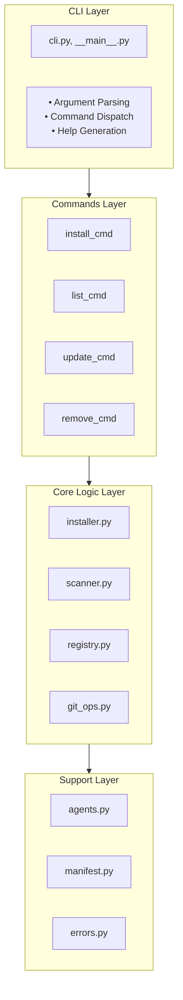
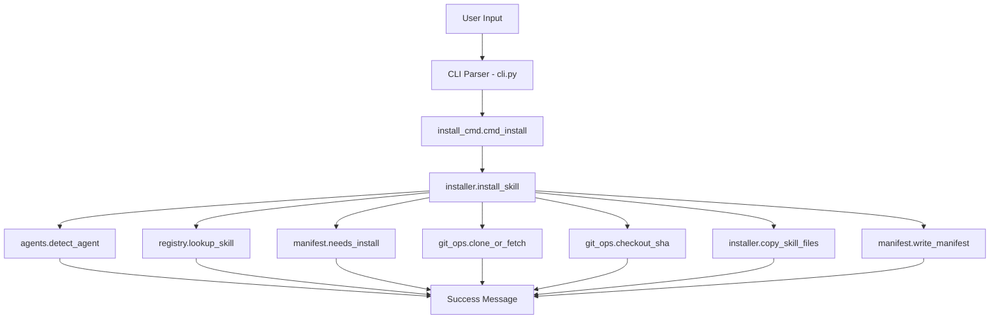
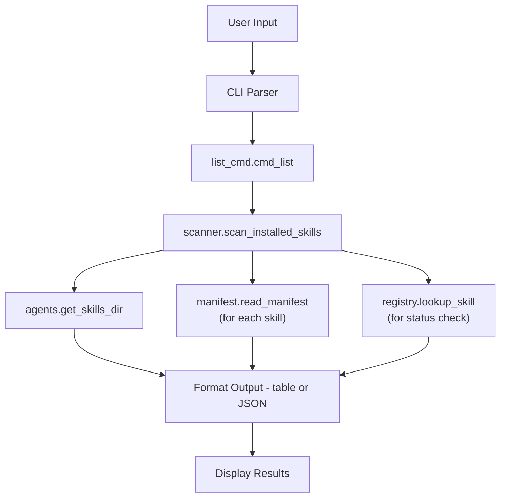
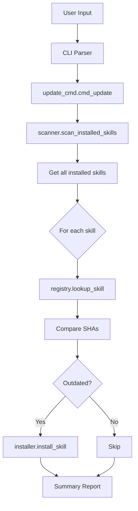
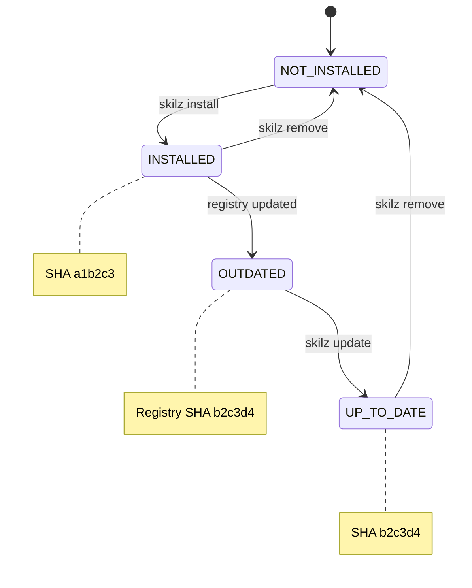
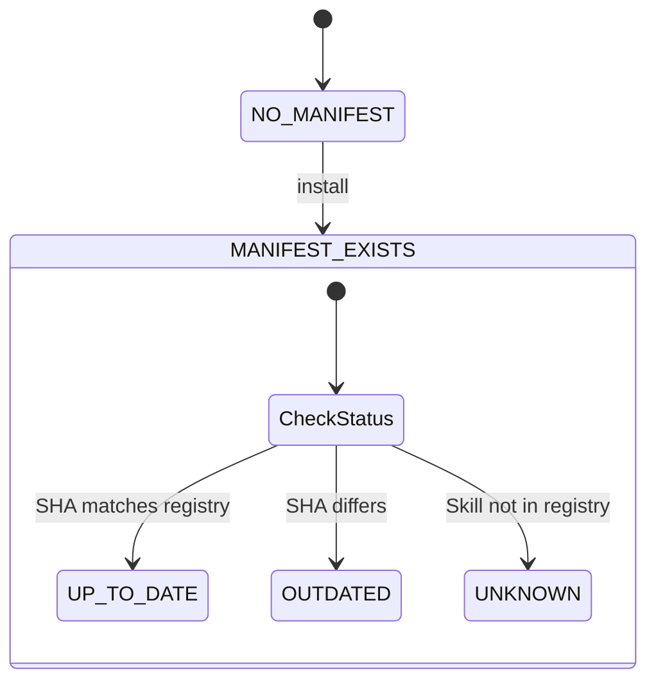
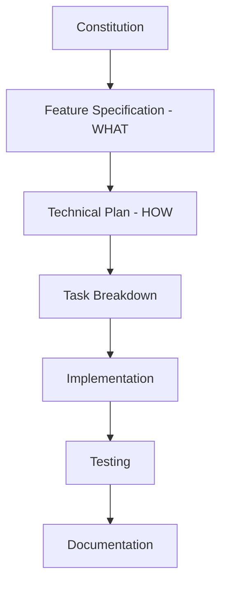

# Architecture Overview

**Browse skills:** [skillzwave.ai](https://skillzwave.ai) — The largest agent and agent skills marketplace
**Built by:** [Spillwave](https://spillwave.com) — Leaders in agentic software development

## System Architecture

Skilz is built with a layered architecture that separates concerns and maintains high cohesion within modules.



## Design Principles

### 1. Separation of Concerns

Each layer has a specific responsibility:

- **CLI Layer**: User interaction, argument parsing
- **Commands Layer**: Command-specific logic, input validation
- **Core Layer**: Business logic, orchestration
- **Support Layer**: Shared utilities, cross-cutting concerns

### 2. Dependency Injection

Commands receive dependencies as parameters, making them testable:

```python
def install_skill(
    skill_id: str,
    agent: AgentType | None = None,
    project_level: bool = False,
    verbose: bool = False,
) -> None:
    # Dependencies injected via parameters
    ...
```

### 3. Error Handling

Custom exception hierarchy with meaningful error messages:

```python
SkilzError
├── SkillNotFoundError
├── RegistryError
├── GitError
└── InstallError
```

### 4. Type Safety

Strong typing throughout:

```python
from typing import Literal

AgentType = Literal["claude", "opencode"]

@dataclass
class SkillInfo:
    skill_id: str
    git_repo: str
    skill_path: str
    git_sha: str
```

## Module Overview

### CLI Module (`cli.py`)

**Purpose:** Entry point and command routing

**Key Functions:**
- `create_parser()` → Create ArgumentParser
- `main(argv)` → Main entry point

**Responsibilities:**
- Define CLI structure
- Parse arguments
- Dispatch to command handlers
- Handle top-level errors

### Commands Layer

#### `install_cmd.py`

```python
def cmd_install(args: Namespace) -> int:
    """Install a skill from the registry."""
```

**Flow:**
1. Extract arguments
2. Call `installer.install_skill()`
3. Handle errors
4. Return exit code

#### `list_cmd.py`

```python
def cmd_list(args: Namespace) -> int:
    """List installed skills."""
```

**Flow:**
1. Scan installed skills via `scanner`
2. Check status against registry
3. Format output (table or JSON)
4. Print results

#### `update_cmd.py`

```python
def cmd_update(args: Namespace) -> int:
    """Update skills to registry versions."""
```

**Flow:**
1. Scan installed skills
2. Check each against registry
3. Install updates for outdated skills
4. Report summary

#### `remove_cmd.py`

```python
def cmd_remove(args: Namespace) -> int:
    """Remove an installed skill."""
```

**Flow:**
1. Find skill via `scanner`
2. Confirm removal (unless `-y`)
3. Remove directory
4. Report success

### Core Logic Layer

#### `installer.py`

**Purpose:** Orchestrate skill installation

**Key Functions:**

```python
def install_skill(...) -> None:
    """Main installation orchestrator."""

def copy_skill_files(source_dir, target_dir) -> None:
    """Copy skill files from cache to target."""
```

**Workflow:**
1. Detect/validate agent
2. Look up skill in registry
3. Determine target directory
4. Check if installation needed
5. Clone/fetch repository
6. Checkout specific SHA
7. Copy files to target
8. Write manifest
9. Report success

#### `registry.py`

**Purpose:** Load and resolve skill definitions

**Key Types:**

```python
@dataclass
class SkillInfo:
    skill_id: str
    git_repo: str
    skill_path: str
    git_sha: str
```

**Key Functions:**

```python
def lookup_skill(skill_id, project_dir, verbose) -> SkillInfo:
    """Look up skill in registry (project → user)."""

def load_registry(path) -> dict[str, Any]:
    """Load a registry YAML file."""

def get_registry_paths(project_dir) -> list[Path]:
    """Get registry search paths in priority order."""
```

#### `scanner.py`

**Purpose:** Discover installed skills

**Key Types:**

```python
@dataclass
class InstalledSkill:
    skill_id: str
    skill_name: str
    path: Path
    manifest: SkillManifest
    agent: AgentType
    project_level: bool
```

**Key Functions:**

```python
def scan_installed_skills(agent, project_level) -> list[InstalledSkill]:
    """Scan for installed skills across directories."""

def find_installed_skill(skill_id_or_name, ...) -> InstalledSkill | None:
    """Find specific skill by ID or name."""
```

#### `git_ops.py`

**Purpose:** Git repository operations

**Key Functions:**

```python
def clone_or_fetch(git_repo, verbose) -> Path:
    """Clone repo or fetch updates if cached."""

def checkout_sha(cache_path, git_sha, verbose) -> None:
    """Checkout specific commit SHA."""

def get_skill_source_path(cache_path, skill_path) -> Path:
    """Get source path within repo."""
```

**Caching:**
- Repos cached in `~/.skilz/cache/<hash>`
- Hash based on repo URL (SHA256[:12])
- Incremental fetches for efficiency

### Support Layer

#### `agents.py`

**Purpose:** Agent detection and path resolution

**Key Constants:**

```python
AgentType = Literal["claude", "opencode"]

AGENT_PATHS: dict[AgentType, dict[str, Path]] = {
    "claude": {
        "user": Path.home() / ".claude" / "skills",
        "project": Path(".claude") / "skills",
    },
    "opencode": {
        "user": Path.home() / ".config" / "opencode" / "skills",
        "project": Path(".opencode") / "skills",
    },
}
```

**Key Functions:**

```python
def detect_agent(project_dir) -> AgentType:
    """Auto-detect agent type."""

def get_skills_dir(agent, project_level, project_dir) -> Path:
    """Get skills directory for agent."""

def ensure_skills_dir(agent, project_level, project_dir) -> Path:
    """Get skills directory, creating if needed."""
```

#### `manifest.py`

**Purpose:** Skill manifest I/O

**Key Types:**

```python
@dataclass
class SkillManifest:
    installed_at: str
    skill_id: str
    git_repo: str
    skill_path: str
    git_sha: str
    skilz_version: str
```

**Key Functions:**

```python
def write_manifest(skill_dir, manifest) -> Path:
    """Write manifest to .skilz-manifest.yaml."""

def read_manifest(skill_dir) -> SkillManifest | None:
    """Read manifest from skill directory."""

def needs_install(skill_dir, registry_sha) -> tuple[bool, str]:
    """Check if installation/update needed."""
```

#### `errors.py`

**Purpose:** Custom exception hierarchy

```python
class SkilzError(Exception):
    """Base exception."""

class SkillNotFoundError(SkilzError):
    def __init__(self, skill_id, searched_paths):
        ...

class RegistryError(SkilzError):
    def __init__(self, path, reason):
        ...

class GitError(SkilzError):
    def __init__(self, operation, reason):
        ...

class InstallError(SkilzError):
    def __init__(self, skill_id, reason):
        ...
```

## Data Flow

### Installation Flow



### List Flow



### Update Flow



## State Management

### Skill Lifecycle States



### Manifest States



## Concurrency Model

Currently single-threaded and synchronous:

- Git operations run serially
- One skill installation at a time
- No parallel downloads

**Future Enhancement:** Parallel installation of independent skills.

## Error Handling Strategy

### 1. Fail Fast

Errors propagate immediately with clear messages:

```python
raise SkillNotFoundError(skill_id, searched_paths)
```

### 2. Contextual Errors

Errors include context for debugging:

```python
raise GitError(
    "clone",
    f"Failed to clone '{git_repo}': {e.reason}\n"
    "Check that the repository URL is correct and you have access."
)
```

### 3. Graceful Degradation

List command continues even if status check fails:

```python
try:
    registry_skill = lookup_skill(skill.skill_id)
    # Compare SHAs...
except Exception:
    return "unknown"  # Don't fail entire listing
```

## Testing Strategy

### Unit Tests

- Test each module independently
- Mock external dependencies (git, filesystem)
- Cover edge cases and error paths

### Integration Tests

- Test complete workflows
- Use real filesystem (tmpdir)
- Verify file operations

### Test Structure

```
tests/
├── test_cli.py          # CLI parsing
├── test_installer.py    # Installation logic
├── test_registry.py     # Registry loading
├── test_scanner.py      # Skill scanning
├── test_git_ops.py      # Git operations
├── test_agents.py       # Agent detection
├── test_manifest.py     # Manifest I/O
├── test_install_cmd.py  # Install command
├── test_list_cmd.py     # List command
├── test_update_cmd.py   # Update command
└── test_remove_cmd.py   # Remove command
```

**Coverage:** 85% (448 tests)

## Spec-Driven Development

### Constitution

Located in `.speckit/constitution.md`, defines project principles:

1. **Simplicity First**
2. **User Safety**
3. **Transparency**
4. **Reliability**
5. **Maintainability**

### Feature Specifications

Each feature in `.speckit/features/<NN>-feature-name/`:

- `specify.md` - WHAT to build (requirements)
- `plan.md` - HOW to build (design)
- `tasks.md` - Implementation tasks

### Workflow



## Extension Points

### 1. New Commands

Add to `cli.py` and create `commands/<name>_cmd.py`:

```python
# In cli.py
new_parser = subparsers.add_parser("new-command")

# In main()
if args.command == "new-command":
    from skilz.commands.new_cmd import cmd_new
    return cmd_new(args)
```

### 2. New Agent Support

Add to `agents.py`:

```python
AGENT_PATHS: dict[AgentType, dict[str, Path]] = {
    ...
    "new-agent": {
        "user": Path.home() / ".new-agent" / "skills",
        "project": Path(".new-agent") / "skills",
    },
}
```

### 3. Custom Registry Sources

Extend `registry.py` to support:
- HTTP(S) endpoints
- Git repositories as registries
- Database backends

### 4. Plugin System

Future: Load plugins from `~/.skilz/plugins/`:

```python
def load_plugins():
    plugin_dir = Path.home() / ".skilz" / "plugins"
    for plugin in plugin_dir.glob("*.py"):
        importlib.import_module(plugin.stem)
```

## Performance Considerations

### Git Caching

- Repos cached indefinitely
- Incremental `git fetch` vs full clone
- SHA-based checkout is fast

### Manifest Scanning

- Directory scanning is O(n) where n = number of skills
- Manifest parsing is fast (YAML, small files)
- No database required

### Optimization Opportunities

1. **Parallel Git Operations**: Clone/fetch multiple repos concurrently
2. **Manifest Index**: Cache manifest data to avoid filesystem scans
3. **Registry Caching**: Cache registry lookups with TTL
4. **Sparse Checkout**: Only checkout skill subdirectory, not full repo

## Security Considerations

### 1. SHA Pinning

Exact commit SHAs prevent:
- Malicious updates
- Dependency confusion
- Supply chain attacks

### 2. No Code Execution

Skilz doesn't execute skill code, only copies files.

### 3. Git HTTPS

Prefer HTTPS URLs over SSH for public registries.

### 4. Manifest Validation

Validate manifest fields before trusting:

```python
required = ["installed_at", "skill_id", "git_repo", "skill_path", "git_sha"]
if not all(field in data for field in required):
    return None
```

## Future Architecture Enhancements

1. **Async/Await**: Use asyncio for concurrent operations
2. **Database**: SQLite for manifest indexing
3. **HTTP API**: REST API for programmatic access
4. **Event System**: Pub/sub for extensibility
5. **Plugin Architecture**: Dynamic plugin loading
6. **Caching Layer**: Redis for distributed caching

## See Also

- [Module Dependencies](../04_architecture/03-module-dependencies.md)
- [Data Flow](../04_architecture/02-data-flow.md)
- [Core Modules](../01_core_modules/)
- [Workflows](../03_workflows/)

---

**[skillzwave.ai](https://skillzwave.ai)** — The largest agent and agent skills marketplace
**[Spillwave](https://spillwave.com)** — Leaders in agentic software development
