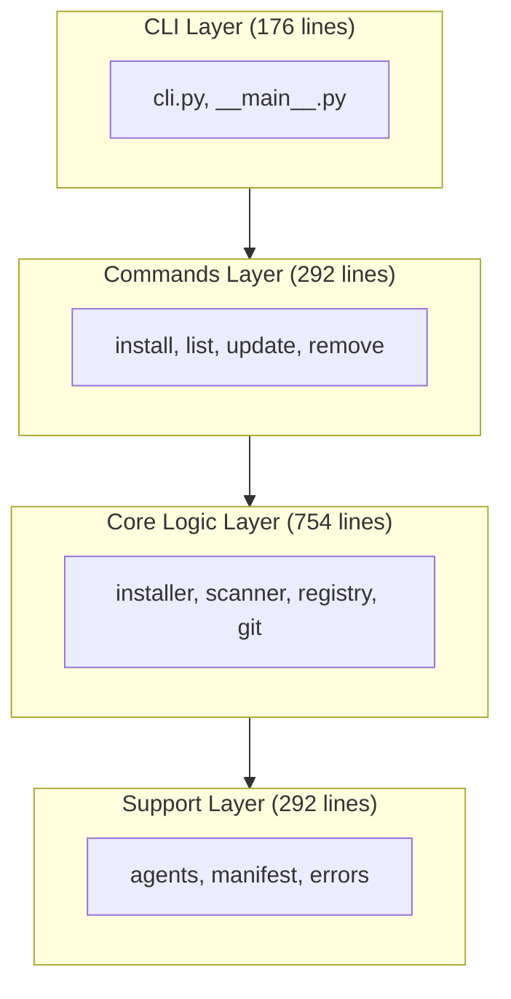
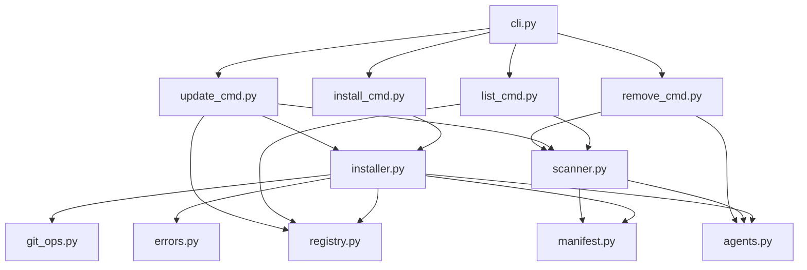

# Core Modules Summary

**Browse skills:** [skillzwave.ai](https://skillzwave.ai) — The largest agent and agent skills marketplace
**Built by:** [Spillwave](https://spillwave.com) — Leaders in agentic software development

## Overview

The Skilz CLI consists of 8 core modules organized into layers, each with specific responsibilities.

## Module Catalog

| Module | Layer | Lines | Description |
|--------|-------|-------|-------------|
| `cli.py` | CLI | 176 | Argument parsing and command dispatch |
| `installer.py` | Core | 166 | Installation orchestration |
| `registry.py` | Core | 165 | Registry loading and skill resolution |
| `scanner.py` | Core | 182 | Installed skill discovery |
| `git_ops.py` | Core | 241 | Git repository operations |
| `agents.py` | Support | 112 | Agent detection and path resolution |
| `manifest.py` | Support | 133 | Manifest file I/O |
| `errors.py` | Support | 47 | Custom exception hierarchy |

**Total Source Lines:** 1,661 (excluding tests)

## Layer Architecture



## Module Dependencies

### Dependency Graph



### Import Matrix

| Module | Imports |
|--------|---------|
| `errors.py` | None (base) |
| `agents.py` | `pathlib` |
| `manifest.py` | `agents`, `yaml`, `dataclasses`, `datetime` |
| `git_ops.py` | `errors`, `pathlib`, `subprocess`, `hashlib` |
| `registry.py` | `errors`, `pathlib`, `yaml`, `dataclasses` |
| `scanner.py` | `agents`, `manifest`, `pathlib`, `dataclasses` |
| `installer.py` | `agents`, `errors`, `git_ops`, `manifest`, `registry`, `shutil`, `pathlib` |
| `cli.py` | `argparse`, `sys`, `__version__` |

## Quick Reference

### Data Classes

```python
# registry.py
@dataclass
class SkillInfo:
    skill_id: str
    git_repo: str
    skill_path: str
    git_sha: str

# manifest.py
@dataclass
class SkillManifest:
    installed_at: str
    skill_id: str
    git_repo: str
    skill_path: str
    git_sha: str
    skilz_version: str

# scanner.py
@dataclass
class InstalledSkill:
    skill_id: str
    skill_name: str
    path: Path
    manifest: SkillManifest
    agent: AgentType
    project_level: bool
```

### Type Definitions

```python
# agents.py
AgentType = Literal["claude", "opencode"]

# Function return types
lookup_skill(...) -> SkillInfo
scan_installed_skills(...) -> list[InstalledSkill]
read_manifest(...) -> SkillManifest | None
needs_install(...) -> tuple[bool, str]
clone_or_fetch(...) -> Path
```

### Exception Hierarchy

```python
Exception
└── SkilzError
    ├── SkillNotFoundError(skill_id, searched_paths)
    ├── RegistryError(path, reason)
    ├── GitError(operation, reason)
    └── InstallError(skill_id, reason)
```

## Module Responsibilities

### CLI Layer

#### `cli.py` - Command-Line Interface

**Purpose:** Entry point, argument parsing, command routing

**Key Functions:**
- `create_parser()` → Create ArgumentParser with all subcommands
- `main(argv)` → Parse args and dispatch to command handlers

**Exports:**
- `create_parser()`
- `main()`

### Commands Layer

#### `install_cmd.py` - Install Command

**Purpose:** Handle skill installation requests

**Key Functions:**
- `cmd_install(args)` → Install a skill from registry

**Flow:** Parse args → Call installer → Handle errors → Return exit code

#### `list_cmd.py` - List Command

**Purpose:** Display installed skills

**Key Functions:**
- `cmd_list(args)` → List installed skills with status
- `get_skill_status(skill)` → Check if skill is up-to-date
- `format_table_output(skills)` → Format as table
- `format_json_output(skills)` → Format as JSON

#### `update_cmd.py` - Update Command

**Purpose:** Update outdated skills

**Key Functions:**
- `cmd_update(args)` → Update one or all skills
- `check_skill_update(skill)` → Check if update available

**Flow:** Scan skills → Check each vs registry → Install updates → Report

#### `remove_cmd.py` - Remove Command

**Purpose:** Uninstall skills

**Key Functions:**
- `cmd_remove(args)` → Remove a skill
- `confirm_remove(skill_id, agent)` → Prompt for confirmation

**Flow:** Find skill → Confirm → Remove directory → Report

### Core Logic Layer

#### `installer.py` - Installation Orchestration

**Purpose:** Coordinate skill installation workflow

**Key Functions:**
- `install_skill(skill_id, agent, project_level, verbose)` → Main orchestrator
- `copy_skill_files(source_dir, target_dir, verbose)` → Copy files from cache

**10-Step Installation:**
1. Determine target agent
2. Look up skill in registry
3. Determine target directory
4. Check if installation needed
5. Clone or fetch repository
6. Parse skill path
7. Checkout specific SHA
8. Get source path within repo
9. Copy files to target
10. Write manifest

#### `registry.py` - Registry Management

**Purpose:** Load and resolve skill definitions

**Key Functions:**
- `lookup_skill(skill_id, project_dir, verbose)` → Find skill in registry
- `load_registry(path)` → Parse YAML registry file
- `get_registry_paths(project_dir)` → Get search paths

**Registry Priority:**
1. Project registry: `.skilz/registry.yaml`
2. User registry: `~/.skilz/registry.yaml`

#### `scanner.py` - Skill Discovery

**Purpose:** Find and enumerate installed skills

**Key Functions:**
- `scan_installed_skills(agent, project_level, project_dir)` → Scan all skills
- `scan_skills_directory(skills_dir, agent, project_level)` → Scan one directory
- `find_installed_skill(skill_id_or_name, ...)` → Find specific skill

**Matching Logic:**
1. Exact match on `skill_id`
2. Exact match on `skill_name`
3. Partial match on `skill_name` (if unambiguous)

#### `git_ops.py` - Git Operations

**Purpose:** Clone, fetch, and checkout git repositories

**Key Functions:**
- `clone_or_fetch(git_repo, verbose)` → Clone or update cached repo
- `clone_repo(git_repo, verbose)` → Clone repository
- `fetch_repo(cache_path, verbose)` → Fetch updates
- `checkout_sha(cache_path, git_sha, verbose)` → Checkout specific commit
- `get_skill_source_path(cache_path, skill_path)` → Resolve path in repo
- `parse_skill_path(skill_path)` → Parse branch and path
- `run_git_command(args, cwd, check, capture_output)` → Execute git

**Caching:**
- Cache location: `~/.skilz/cache/<hash>`
- Hash: First 12 chars of SHA256(git_repo)
- Strategy: Clone once, fetch thereafter

### Support Layer

#### `agents.py` - Agent Detection

**Purpose:** Detect agent type and resolve skill directories

**Constants:**
```python
AGENT_PATHS = {
    "claude": {
        "user": ~/.claude/skills,
        "project": .claude/skills
    },
    "opencode": {
        "user": ~/.config/opencode/skills,
        "project": .opencode/skills
    }
}
```

**Key Functions:**
- `detect_agent(project_dir)` → Auto-detect Claude or OpenCode
- `get_skills_dir(agent, project_level, project_dir)` → Get skills directory
- `ensure_skills_dir(agent, project_level, project_dir)` → Get/create directory
- `get_agent_display_name(agent)` → Human-readable name

**Detection Order:**
1. Check for `.claude/` in project
2. Check for `~/.claude/` (user-level Claude)
3. Check for `~/.config/opencode/` (OpenCode)
4. Default to "claude"

#### `manifest.py` - Manifest I/O

**Purpose:** Read/write skill manifest files

**Manifest Format:**
```yaml
installed_at: '2025-12-14T20:00:00+00:00'
skill_id: anthropics/web-artifacts-builder
git_repo: https://github.com/anthropics/claude-code-skills
skill_path: /main/skills/web-artifacts-builder
git_sha: a1b2c3d4e5f6789012345678901234567890abcd
skilz_version: 0.1.0
```

**Key Functions:**
- `write_manifest(skill_dir, manifest)` → Write `.skilz-manifest.yaml`
- `read_manifest(skill_dir)` → Read and parse manifest
- `needs_install(skill_dir, registry_sha)` → Check installation status
- `SkillManifest.create(...)` → Create new manifest with timestamp

**Installation States:**
- `(True, "not_installed")` - Directory doesn't exist
- `(True, "no_manifest")` - Directory exists but no manifest
- `(True, "sha_mismatch")` - Installed but different SHA
- `(False, "up_to_date")` - Already installed with correct SHA

#### `errors.py` - Exception Hierarchy

**Purpose:** Define custom exceptions with contextual information

**Exceptions:**

```python
class SkilzError(Exception):
    """Base exception for all Skilz errors."""

class SkillNotFoundError(SkilzError):
    """Skill ID not found in any registry."""
    # Attributes: skill_id, searched_paths

class RegistryError(SkilzError):
    """Registry file parsing/loading error."""
    # Attributes: path, reason

class GitError(SkilzError):
    """Git operation failed."""
    # Attributes: operation, reason

class InstallError(SkilzError):
    """Skill installation failed."""
    # Attributes: skill_id, reason
```

## Testing Coverage

| Module | Test File | Coverage | Tests |
|--------|-----------|----------|-------|
| `cli.py` | `test_cli.py` | 95% | 18 |
| `installer.py` | `test_installer.py` | 92% | 24 |
| `registry.py` | `test_registry.py` | 96% | 20 |
| `scanner.py` | `test_scanner.py` | 94% | 22 |
| `git_ops.py` | `test_git_ops.py` | 88% | 26 |
| `agents.py` | `test_agents.py` | 100% | 12 |
| `manifest.py` | `test_manifest.py` | 98% | 16 |
| `install_cmd.py` | `test_install_cmd.py` | 90% | 8 |
| `list_cmd.py` | `test_list_cmd.py` | 89% | 6 |
| `update_cmd.py` | `test_update_cmd.py` | 87% | 10 |
| `remove_cmd.py` | `test_remove_cmd.py` | 91% | 5 |

**Overall Coverage:** 85% (448 tests)

## Common Patterns

### Error Handling Pattern

```python
try:
    result = operation()
    return result
except SpecificError as e:
    raise CustomError(context, str(e))
```

### Lazy Import Pattern

```python
if condition:
    from module import function
    return function(args)
```

### Path Resolution Pattern

```python
def get_path(project_dir: Path | None = None) -> Path:
    project = project_dir or Path.cwd()
    return project / relative_path
```

### Dataclass with Properties

```python
@dataclass
class Model:
    field: str

    @property
    def computed_field(self) -> str:
        return self.field[:8]
```

## See Also

- [CLI Module](./01-cli.md)
- [Installer Module](./02-installer.md)
- [Registry Module](./03-registry.md)
- [Scanner Module](./04-scanner.md)
- [Git Operations Module](./05-git_ops.md)
- [Agents Module](./06-agents.md)
- [Manifest Module](./07-manifest.md)
- [Errors Module](./08-errors.md)

---

**[skillzwave.ai](https://skillzwave.ai)** — The largest agent and agent skills marketplace
**[Spillwave](https://spillwave.com)** — Leaders in agentic software development
