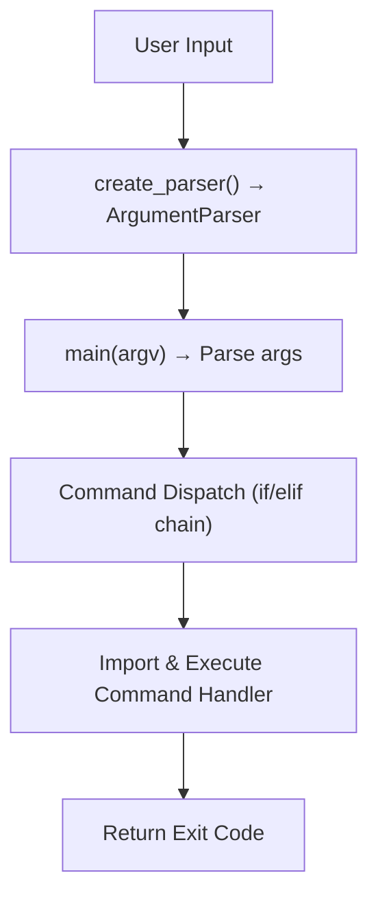
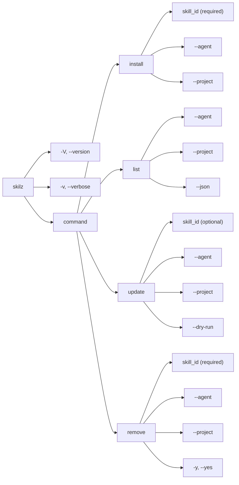

# CLI Module (`cli.py`)

**Browse skills:** [skillzwave.ai](https://skillzwave.ai) — The largest agent and agent skills marketplace
**Built by:** [Spillwave](https://spillwave.com) — Leaders in agentic software development

## Overview

The CLI module serves as the entry point for the Skilz command-line interface. It defines the argument parser structure, handles command routing, and provides the main execution function.

**Location:** `src/skilz/cli.py`
**Lines of Code:** ~176
**Dependencies:** `argparse`, `sys`, `skilz.__version__`

## Architecture



## Public API

### `create_parser() -> ArgumentParser`

Creates and configures the argument parser for the CLI.

**Returns:**
- `ArgumentParser`: Configured parser with all subcommands

**Parser Structure:**



**Example:**

```python
parser = create_parser()
args = parser.parse_args(['install', 'anthropics/web-artifacts-builder'])
# args.command = 'install'
# args.skill_id = 'anthropics/web-artifacts-builder'
# args.agent = None (auto-detect)
# args.project = False
```

**Implementation Details:**

```python
def create_parser() -> argparse.ArgumentParser:
    parser = argparse.ArgumentParser(
        prog="skilz",
        description="The universal package manager for AI skills.",
        formatter_class=argparse.RawDescriptionHelpFormatter,
        epilog="""
Examples:
  skilz install anthropics/web-artifacts-builder
  skilz install some-skill --agent opencode
  skilz --version
        """,
    )

    # Global flags
    parser.add_argument("-V", "--version", action="version", ...)
    parser.add_argument("-v", "--verbose", action="store_true", ...)

    # Subcommands
    subparsers = parser.add_subparsers(dest="command", help="Available commands")

    # ... define install, list, update, remove parsers

    return parser
```

### `main(argv: list[str] | None = None) -> int`

Main entry point for the CLI. Parses arguments and dispatches to appropriate command handler.

**Parameters:**
- `argv` (list[str] | None): Command-line arguments. Uses `sys.argv[1:]` if None.

**Returns:**
- `int`: Exit code (0 = success, non-zero = error)

**Flow:**

```python
def main(argv: list[str] | None = None) -> int:
    # 1. Parse arguments
    parser = create_parser()
    args = parser.parse_args(argv)

    # 2. Handle no command
    if args.command is None:
        parser.print_help()
        return 0

    # 3. Dispatch to command handler
    if args.command == "install":
        from skilz.commands.install_cmd import cmd_install
        return cmd_install(args)

    # ... other commands

    # 4. Unknown command (shouldn't happen)
    parser.print_help()
    return 1
```

**Lazy Import Pattern:**

Commands are imported only when needed:

```python
if args.command == "install":
    from skilz.commands.install_cmd import cmd_install
    return cmd_install(args)
```

**Benefits:**
- Faster `--help` and `--version` (no heavy imports)
- Avoids circular imports
- Smaller memory footprint for simple commands

## Subcommand Definitions

### Install Subcommand

```python
install_parser = subparsers.add_parser(
    "install",
    help="Install a skill from the registry",
    description="Install a skill by its ID from the registry.",
)
install_parser.add_argument(
    "skill_id",
    help="The skill ID to install (e.g., anthropics/web-artifacts-builder)",
)
install_parser.add_argument(
    "--agent",
    choices=["claude", "opencode"],
    default=None,
    help="Target agent (auto-detected if not specified)",
)
install_parser.add_argument(
    "--project",
    action="store_true",
    help="Install to project directory instead of user directory",
)
```

**Example Usage:**

```bash
skilz install anthropics/web-artifacts-builder
skilz install my-skill --agent opencode --project -v
```

### List Subcommand

```python
list_parser = subparsers.add_parser(
    "list",
    help="List installed skills",
    description="Show all installed skills with their versions and status.",
)
list_parser.add_argument("--agent", ...)
list_parser.add_argument("--project", ...)
list_parser.add_argument(
    "--json",
    action="store_true",
    help="Output as JSON",
)
```

**Example Usage:**

```bash
skilz list
skilz list --project --json
skilz list --agent claude
```

### Update Subcommand

```python
update_parser = subparsers.add_parser(
    "update",
    help="Update installed skills to latest versions",
    description="Update skills to match the registry. Updates all or a specific skill.",
)
update_parser.add_argument(
    "skill_id",
    nargs="?",  # Optional
    default=None,
    help="Specific skill to update (updates all if not specified)",
)
update_parser.add_argument("--agent", ...)
update_parser.add_argument("--project", ...)
update_parser.add_argument(
    "--dry-run",
    action="store_true",
    help="Show what would be updated without making changes",
)
```

**Example Usage:**

```bash
skilz update
skilz update anthropics/web-artifacts-builder
skilz update --dry-run
```

### Remove Subcommand

```python
remove_parser = subparsers.add_parser(
    "remove",
    help="Remove an installed skill",
    description="Uninstall a skill by removing its directory.",
)
remove_parser.add_argument(
    "skill_id",
    help="Skill to remove (ID or name)",
)
remove_parser.add_argument("--agent", ...)
remove_parser.add_argument("--project", ...)
remove_parser.add_argument(
    "-y", "--yes",
    action="store_true",
    help="Skip confirmation prompt",
)
```

**Example Usage:**

```bash
skilz remove web-artifacts-builder
skilz remove anthropics/web-artifacts-builder -y
```

## Global Flags

### Version Flag

```python
parser.add_argument(
    "-V", "--version",
    action="version",
    version=f"skilz {__version__}",
)
```

**Usage:**

```bash
$ skilz --version
skilz 0.1.0
```

### Verbose Flag

```python
parser.add_argument(
    "-v", "--verbose",
    action="store_true",
    help="Enable verbose output",
)
```

**Usage:**

```bash
skilz install my-skill -v
```

**Access in Commands:**

```python
def cmd_install(args):
    verbose = getattr(args, "verbose", False)
    if verbose:
        print("Debug information...")
```

## Error Handling

The `main()` function doesn't catch exceptions from command handlers. Each command is responsible for its own error handling:

```python
# In command handler
try:
    install_skill(...)
    return 0
except SkilzError as e:
    print(f"Error: {e}", file=sys.stderr)
    return 1
```

This allows:
- Specific error messages per command
- Proper exit codes
- Stack traces for unexpected errors (debugging)

## Entry Points

### Console Script

Defined in `pyproject.toml`:

```toml
[project.scripts]
skilz = "skilz.cli:main"
```

This creates a `skilz` executable that calls `main()`.

### Direct Execution

```bash
python -m skilz install my-skill
```

Handled by `__main__.py`:

```python
import sys
from skilz.cli import main

if __name__ == "__main__":
    sys.exit(main())
```

## Design Patterns

### 1. Command Pattern

Each subcommand is a separate function in its own module:

```
install → cmd_install()
list    → cmd_list()
update  → cmd_update()
remove  → cmd_remove()
```

### 2. Lazy Loading

Commands imported only when executed:

```python
if args.command == "install":
    from skilz.commands.install_cmd import cmd_install
    return cmd_install(args)
```

### 3. Argument Namespace

Arguments passed as `Namespace` object:

```python
args.skill_id     # Positional argument
args.agent        # Optional flag
args.verbose      # Global flag
```

Commands use `getattr()` for safe access:

```python
verbose = getattr(args, "verbose", False)
```

## Testing

### Parser Testing

```python
def test_create_parser():
    parser = create_parser()
    args = parser.parse_args(['install', 'my-skill'])
    assert args.command == 'install'
    assert args.skill_id == 'my-skill'
```

### Main Function Testing

```python
def test_main_no_command():
    exit_code = main([])
    assert exit_code == 0  # Shows help

def test_main_install():
    exit_code = main(['install', 'test-skill', '--project'])
    # Test depends on install_cmd behavior
```

### Argument Validation

```python
def test_install_requires_skill_id():
    parser = create_parser()
    with pytest.raises(SystemExit):
        parser.parse_args(['install'])  # Missing skill_id
```

## Usage Examples

### Basic Install

```python
# Equivalent to: skilz install anthropics/web-artifacts-builder
exit_code = main(['install', 'anthropics/web-artifacts-builder'])
```

### Verbose Mode

```python
# Equivalent to: skilz -v install my-skill
exit_code = main(['-v', 'install', 'my-skill'])
```

### JSON Output

```python
# Equivalent to: skilz list --json
exit_code = main(['list', '--json'])
```

### Dry Run Update

```python
# Equivalent to: skilz update --dry-run
exit_code = main(['update', '--dry-run'])
```

## Extension Guidelines

### Adding a New Command

1. **Create command module:** `src/skilz/commands/new_cmd.py`

```python
def cmd_new(args: argparse.Namespace) -> int:
    """Handle the new command."""
    # Implementation
    return 0
```

2. **Add subparser in `create_parser()`:**

```python
new_parser = subparsers.add_parser(
    "new",
    help="New command description",
)
new_parser.add_argument("arg1", help="...")
```

3. **Add dispatch in `main()`:**

```python
if args.command == "new":
    from skilz.commands.new_cmd import cmd_new
    return cmd_new(args)
```

### Adding a Global Flag

```python
parser.add_argument(
    "--new-flag",
    action="store_true",
    help="New flag description",
)
```

**Access in commands:**

```python
new_flag = getattr(args, "new_flag", False)
```

## Best Practices

1. **Keep CLI Thin**: Move logic to command modules
2. **Use Type Hints**: Document argument types
3. **Lazy Imports**: Import commands only when needed
4. **Clear Help Text**: Write descriptive help messages
5. **Consistent Flags**: Use same flag names across commands
6. **Safe Defaults**: Choose sensible default values

## See Also

- [Install Command](../02_commands/01-install.md)
- [List Command](../02_commands/02-list.md)
- [Update Command](../02_commands/03-update.md)
- [Remove Command](../02_commands/04-remove.md)
- [Error Handling](../04_architecture/04-error-handling.md)

---

**[skillzwave.ai](https://skillzwave.ai)** — The largest agent and agent skills marketplace
**[Spillwave](https://spillwave.com)** — Leaders in agentic software development
