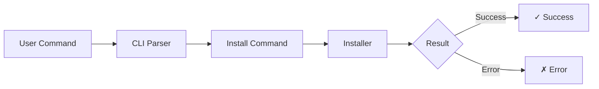

# Installation Workflow

**Browse skills:** [skillzwave.ai](https://skillzwave.ai) — The largest agent and agent skills marketplace
**Built by:** [Spillwave](https://spillwave.com) — Leaders in agentic software development

## Overview

The installation workflow orchestrates 10 distinct steps to safely install a skill from a git repository to the target agent's skills directory.

## High-Level Flow



## Detailed 10-Step Workflow

### Step 1: Determine Target Agent

**Module:** `agents.py`
**Function:** `detect_agent(project_dir)`

**Logic:**
1. Check for `.claude/` in project directory
2. Check for `~/.claude/` (user-level Claude Code)
3. Check for `~/.config/opencode/` (OpenCode)
4. Default to "claude"

**Example:**
```python
agent = detect_agent()
# → "claude" or "opencode"
```

**Override:** User can specify `--agent claude` or `--agent opencode`

### Step 2: Look Up Skill in Registry

**Module:** `registry.py`
**Function:** `lookup_skill(skill_id, project_dir, verbose)`

**Registry Search Order:**
1. Project registry: `.skilz/registry.yaml` (highest priority)
2. User registry: `~/.skilz/registry.yaml`

**Returns:** `SkillInfo` with:
- `skill_id`: e.g., "anthropics/web-artifacts-builder"
- `git_repo`: e.g., "https://github.com/anthropics/claude-code-skills"
- `skill_path`: e.g., "/main/skills/web-artifacts-builder"
- `git_sha`: 40-character commit SHA

**Errors:**
- `SkillNotFoundError` if skill not in any registry
- `RegistryError` if registry file invalid

### Step 3: Determine Target Directory

**Module:** `agents.py`
**Function:** `ensure_skills_dir(agent, project_level, project_dir)`

**Target Paths:**

| Agent | User Level | Project Level |
|-------|-----------|---------------|
| claude | `~/.claude/skills/` | `.claude/skills/` |
| opencode | `~/.config/opencode/skill/` | `.opencode/skill/` |

**Skill Directory:** `target_dir = skills_dir / skill_info.skill_name`

**Example:**
```python
skills_dir = ensure_skills_dir("claude", project_level=False)
# → /Users/you/.claude/skills/

target_dir = skills_dir / "web-artifacts-builder"
# → /Users/you/.claude/skills/web-artifacts-builder/
```

### Step 4: Check If Installation Needed

**Module:** `manifest.py`
**Function:** `needs_install(target_dir, registry_sha)`

**Decision Logic:**

```python
if not target_dir.exists():
    return (True, "not_installed")

manifest = read_manifest(target_dir)

if manifest is None:
    return (True, "no_manifest")

if manifest.git_sha != registry_sha:
    return (True, "sha_mismatch")

return (False, "up_to_date")
```

**Reasons:**
- `not_installed`: Directory doesn't exist
- `no_manifest`: Directory exists but no `.skilz-manifest.yaml`
- `sha_mismatch`: Installed but different SHA (update needed)
- `up_to_date`: Already installed with correct SHA

**Idempotency:** If `up_to_date`, installation is skipped.

### Step 5: Clone or Fetch Repository

**Module:** `git_ops.py`
**Function:** `clone_or_fetch(git_repo, verbose)`

**Cache Path:**
```python
repo_hash = sha256(git_repo.encode()).hexdigest()[:12]
cache_path = ~/.skilz/cache/<repo_hash>
```

**Logic:**
```python
if cache_path.exists():
    # Repository already cached, fetch updates
    run_git_command(["fetch", "--all"], cwd=cache_path)
else:
    # Need to clone
    run_git_command(["clone", git_repo, str(cache_path)])

return cache_path
```

**Benefits:**
- Clone only once per repository
- Subsequent installs/updates use cached copy
- Incremental fetches for efficiency

**Example:**
```bash
# First install
git clone https://github.com/anthropics/claude-code-skills ~/.skilz/cache/a1b2c3d4e5f6

# Subsequent installs
cd ~/.skilz/cache/a1b2c3d4e5f6
git fetch --all
```

### Step 6: Parse Skill Path

**Module:** `git_ops.py`
**Function:** `parse_skill_path(skill_path)`

**Format:** `/<branch>/path/to/skill[/SKILL.md]`

**Examples:**
- `/main/skills/web-artifacts-builder` → branch="main", path="skills/web-artifacts-builder"
- `/develop/my-skill/SKILL.md` → branch="develop", path="my-skill"
- `/main/SKILL.md` → branch="main", path=""

**Parsing Logic:**
```python
parts = skill_path.lstrip("/").split("/", 1)
branch = parts[0]  # e.g., "main"
path = parts[1] if len(parts) > 1 else ""  # e.g., "skills/web-artifacts-builder"
return (branch, path)
```

### Step 7: Checkout Specific SHA

**Module:** `git_ops.py`
**Function:** `checkout_sha(cache_path, git_sha, verbose)`

**Command:**
```bash
cd ~/.skilz/cache/<hash>
git checkout <sha>
```

**SHA Pinning:** Ensures exact version, preventing:
- Malicious updates
- Unexpected changes
- Dependency confusion attacks

**Error Handling:**
```python
try:
    run_git_command(["checkout", git_sha], cwd=cache_path)
except GitError as e:
    if "did not match any" in e.reason:
        raise GitError(
            "checkout",
            f"Commit '{git_sha}' not found in repository.\n"
            "The registry may reference a commit that doesn't exist."
        )
    raise
```

### Step 8: Get Source Path Within Repo

**Module:** `git_ops.py`
**Function:** `get_skill_source_path(cache_path, skill_path)`

**Resolve Path:**
```python
# skill_path = "/main/skills/web-artifacts-builder"
parts = skill_path.lstrip("/").split("/", 1)
# parts = ["main", "skills/web-artifacts-builder"]

relative_path = parts[1]  # "skills/web-artifacts-builder"

# Remove trailing /SKILL.md if present
if relative_path.endswith("/SKILL.md"):
    relative_path = relative_path[:-9]

source_dir = cache_path / relative_path
# → ~/.skilz/cache/<hash>/skills/web-artifacts-builder/
```

**Validation:**
```python
if not source_dir.exists():
    raise InstallError(
        skill_id,
        f"Skill path not found in repository: {skill_path}\n"
        f"Expected at: {source_dir}"
    )
```

### Step 9: Copy Files to Target

**Module:** `installer.py`
**Function:** `copy_skill_files(source_dir, target_dir, verbose)`

**Logic:**
```python
# Remove existing installation if present
if target_dir.exists():
    shutil.rmtree(target_dir)

# Ensure parent directory exists
target_dir.parent.mkdir(parents=True, exist_ok=True)

# Copy the skill directory
shutil.copytree(source_dir, target_dir)
```

**Result:**
```
~/.skilz/cache/<hash>/skills/web-artifacts-builder/
    ├── SKILL.md
    ├── code/
    └── ...

→ copied to →

~/.claude/skills/web-artifacts-builder/
    ├── SKILL.md
    ├── code/
    └── ...
```

**Error Handling:**
```python
try:
    shutil.copytree(source_dir, target_dir)
except OSError as e:
    raise InstallError(skill_id, f"Failed to copy files: {e}")
```

### Step 10: Write Manifest

**Module:** `manifest.py`
**Function:** `write_manifest(target_dir, manifest)`

**Create Manifest:**
```python
manifest = SkillManifest.create(
    skill_id=skill_info.skill_id,
    git_repo=skill_info.git_repo,
    skill_path=skill_info.skill_path,
    git_sha=skill_info.git_sha,
)
```

**Manifest Content:**
```yaml
installed_at: '2025-12-14T20:00:00+00:00'
skill_id: anthropics/web-artifacts-builder
git_repo: https://github.com/anthropics/claude-code-skills
skill_path: /main/skills/web-artifacts-builder
git_sha: a1b2c3d4e5f6789012345678901234567890abcd
skilz_version: 0.1.0
```

**Write to File:**
```python
manifest_path = target_dir / ".skilz-manifest.yaml"
content = yaml.dump(manifest.to_dict(), ...)
manifest_path.write_text(content)
```

**Purpose:**
- Track installation metadata
- Enable version checking
- Support update detection
- Facilitate `skilz list` output

## Success Message

After all 10 steps complete:

```python
action = "Updated" if reason == "sha_mismatch" else "Installed"
agent_name = get_agent_display_name(agent)
location = "project" if project_level else "user"

print(f"{action}: {skill_id} -> {agent_name} ({location})")
```

**Example Output:**
```
Installed: anthropics/web-artifacts-builder -> Claude Code (user)
```

Or for an update:
```
Updated: anthropics/web-artifacts-builder -> Claude Code (user)
```

## Error Scenarios

### 1. Skill Not Found

```
Error: Skill 'my-skill' not found in registry.
Searched: ./.skilz/registry.yaml, ~/.skilz/registry.yaml
```

**Cause:** `skill_id` not in any registry
**Exception:** `SkillNotFoundError`

### 2. Git Clone Failed

```
Error: Git clone failed: Failed to clone 'https://github.com/...'
Check that the repository URL is correct and you have access.
```

**Causes:**
- Invalid `git_repo` URL
- Network issues
- Authentication required but not configured

**Exception:** `GitError`

### 3. SHA Not Found

```
Error: Git checkout failed: Commit 'abc123...' not found in repository.
The registry may reference a commit that doesn't exist or hasn't been fetched.
```

**Causes:**
- Invalid `git_sha` in registry
- Repository was force-pushed
- SHA from different repository

**Exception:** `GitError`

### 4. Path Not Found

```
Error: Failed to install 'my-skill': Skill path not found in repository: /main/skills/my-skill
Expected at: /Users/you/.skilz/cache/abc123/skills/my-skill
```

**Cause:** `skill_path` doesn't exist in repository at specified SHA
**Exception:** `InstallError`

### 5. Copy Failed

```
Error: Failed to install 'my-skill': Failed to copy files: [Errno 13] Permission denied: '...'
```

**Causes:**
- Insufficient permissions
- Disk full
- Target directory locked

**Exception:** `InstallError`

## Verbose Output Example

```bash
$ skilz install -v anthropics/web-artifacts-builder
Auto-detected agent: Claude Code
Looking up skill: anthropics/web-artifacts-builder
  Searching registry: ./.skilz/registry.yaml
  Registry not found: ./.skilz/registry.yaml
  Searching registry: /Users/you/.skilz/registry.yaml
  Found skill 'anthropics/web-artifacts-builder' in /Users/you/.skilz/registry.yaml
  Found: https://github.com/anthropics/claude-code-skills
  Path: /main/skills/web-artifacts-builder
  SHA: a1b2c3d4...
  Installing: not_installed
Fetching repository...
  Repository already cached: /Users/you/.skilz/cache/a1b2c3d4e5f6
  Fetching latest changes in /Users/you/.skilz/cache/a1b2c3d4e5f6...
Checking out a1b2c3d4...
  Checking out a1b2c3d4...
Installing to /Users/you/.claude/skills/web-artifacts-builder...
  Copying /Users/you/.skilz/cache/a1b2c3d4e5f6/skills/web-artifacts-builder -> /Users/you/.claude/skills/web-artifacts-builder
Installed: anthropics/web-artifacts-builder -> Claude Code (user)
```

## Idempotency

The workflow is idempotent - safe to run multiple times:

```bash
$ skilz install anthropics/web-artifacts-builder
Installed: anthropics/web-artifacts-builder -> Claude Code (user)

$ skilz install anthropics/web-artifacts-builder
Already installed: anthropics/web-artifacts-builder (a1b2c3d4)
```

Step 4 detects `up_to_date` and skips steps 5-10.

## See Also

- [Installer Module](../01_core_modules/02-installer.md)
- [Registry Module](../01_core_modules/03-registry.md)
- [Git Operations Module](../01_core_modules/05-git_ops.md)
- [Manifest Module](../01_core_modules/07-manifest.md)
- [Installation Sequence Diagram](../diagrams/mermaid/installation-workflow.mmd)

---

**[skillzwave.ai](https://skillzwave.ai)** — The largest agent and agent skills marketplace
**[Spillwave](https://spillwave.com)** — Leaders in agentic software development
