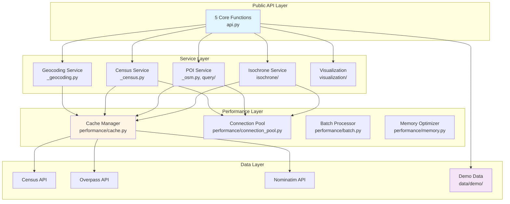
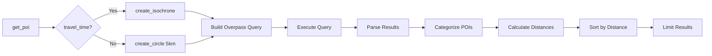
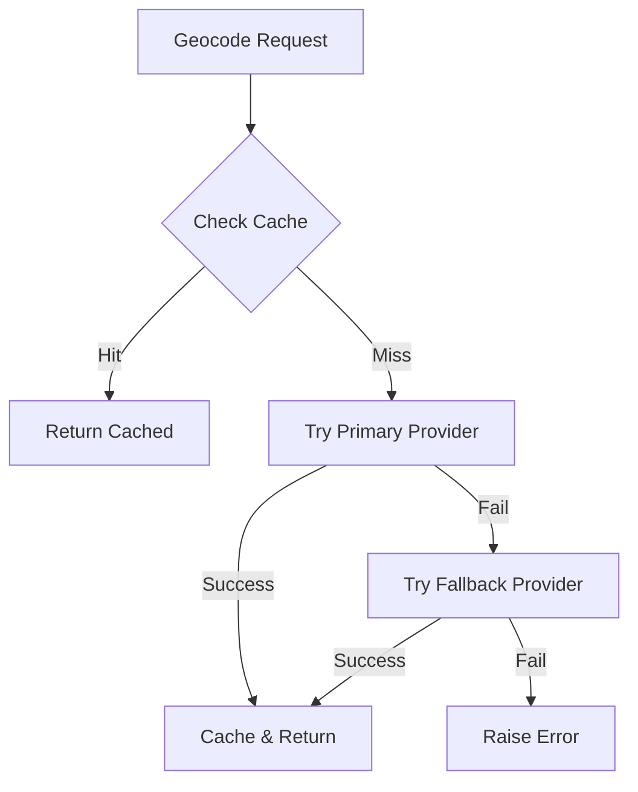
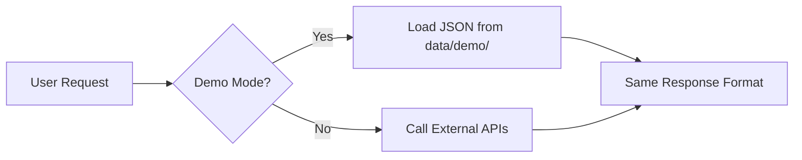
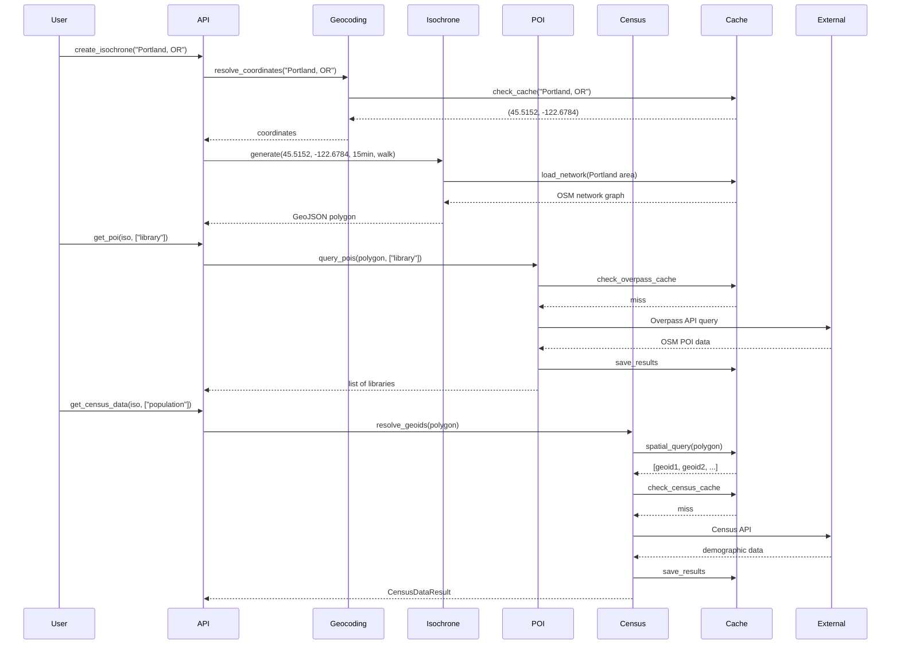
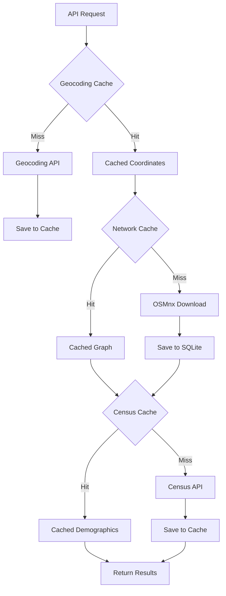
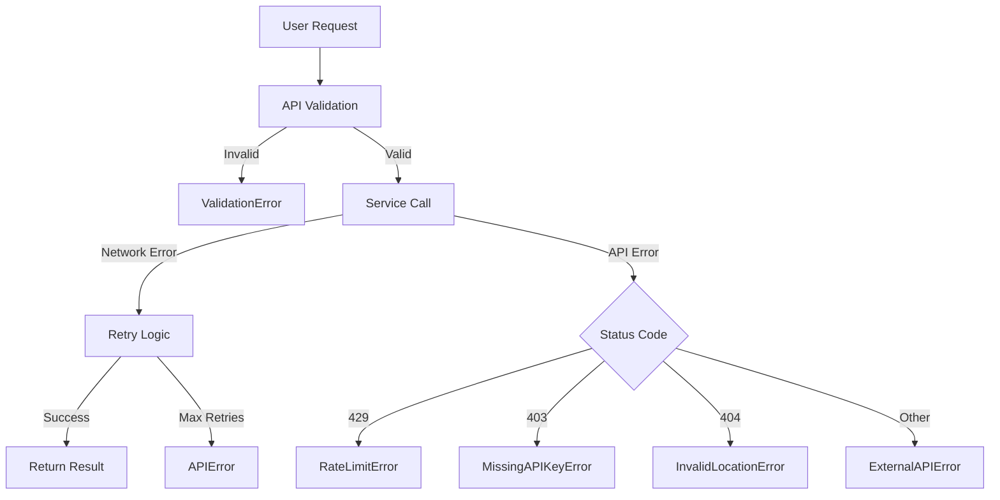

# SocialMapper Architecture

> **Comprehensive architecture documentation for contributors and developers**
>
> This document explains SocialMapper's system design, component interactions, and architectural decisions to help contributors understand where and how to make changes.

## Table of Contents

- [System Overview](#system-overview)
- [Design Philosophy](#design-philosophy)
- [Component Architecture](#component-architecture)
- [Data Flow Patterns](#data-flow-patterns)
- [Design Decisions](#design-decisions)
- [Performance Architecture](#performance-architecture)
- [Module Organization](#module-organization)
- [Extension Points](#extension-points)
- [Testing Strategy](#testing-strategy)

---

## System Overview

### High-Level Purpose

SocialMapper is a **spatial analysis toolkit** that integrates three complex data sources into a simple 5-function API:

1. **US Census Bureau** - Demographic and geographic data
2. **OpenStreetMap** - Points of interest and road networks
3. **OSMnx** - Isochrone generation from street networks

**Core Value Proposition**: Replace 15-20 minutes of setup across 4+ libraries with a single import.

### System Architecture Diagram



### Technology Stack

| Layer | Technologies | Purpose |
|-------|-------------|---------|
| **API** | Python 3.11+, Type Hints | Public interface |
| **Validation** | Pydantic 2 | Runtime type checking |
| **Geospatial** | GeoPandas, Shapely, PyProj | Geometry operations |
| **Network Analysis** | OSMnx, NetworkX | Routing and isochrones |
| **Data** | Pandas, Polars, NumPy | Data processing |
| **Caching** | DiskCache, SQLite | Performance optimization |
| **HTTP** | Requests, HTTPx | API communication |
| **Visualization** | Matplotlib, Folium | Map generation |

---

## Design Philosophy

### Core Principles

#### 1. Simplicity First

**Philosophy**: 90% of users need 5 functions. Don't burden them with complexity.

```python
# Simple 5-function API covers most workflows
from socialmapper import (
    create_isochrone,    # Travel-time polygons
    get_poi,             # Find places
    get_census_blocks,   # Get geographies
    get_census_data,     # Get demographics
    create_map,          # Visualize results
)
```

#### 2. Performance by Default

**Philosophy**: Users shouldn't need to understand caching to get good performance.

- **Automatic caching** at multiple layers
- **Connection pooling** for HTTP requests
- **Batch processing** when beneficial
- **Memory optimization** for large datasets

#### 3. Clean Architecture

**Philosophy**: Separation of concerns enables maintainability and testing.

```
User Code
    ↓
Public API (validation, coordination)
    ↓
Service Layer (business logic)
    ↓
Performance Layer (optimization)
    ↓
External APIs (data sources)
```

#### 4. Extensibility

**Philosophy**: Make common changes easy, complex changes possible.

- **Plugin architecture** for geocoding providers
- **Strategy pattern** for export formats
- **Template pattern** for visualizations
- **Factory pattern** for POI categories

#### 5. Type Safety

**Philosophy**: Catch errors at development time, not runtime.

```python
# Pydantic models provide runtime validation
class CensusDataResult(BaseModel):
    data: dict[str, dict[str, Any]]
    location_type: Literal["polygon", "geoids", "point"]
    query_info: dict[str, Any]
```

---

## Component Architecture

### 1. API Layer (`api.py`, `__init__.py`)

**Responsibility**: Provide stable public interface with comprehensive validation.

#### Public Functions

```python
# Core API - these 5 functions handle 90% of use cases
create_isochrone(location, travel_time, travel_mode) -> dict
get_poi(location, categories, travel_time, limit) -> list[dict]
get_census_blocks(polygon, location, radius_km) -> list[dict]
get_census_data(location, variables, year) -> CensusDataResult
create_map(data, column, title, save_path, export_format) -> MapResult
```

#### Input Validation Strategy

```python
# Validation happens at API boundary using dedicated validators
from .validators import (
    validate_travel_time,      # 1-120 minutes
    validate_travel_mode,       # drive/walk/bike
    validate_location_input,    # either polygon OR location
    validate_export_format      # png/pdf/svg/geojson/shapefile
)
```

#### Location Input Flexibility

SocialMapper accepts **three location formats**:

```python
# 1. String (geocoded automatically)
create_isochrone("Portland, OR", travel_time=15)

# 2. Coordinates tuple
create_isochrone((45.5152, -122.6784), travel_time=15)

# 3. GeoJSON Feature/Geometry (from previous call)
iso = create_isochrone("Seattle, WA", travel_time=20)
census_data = get_census_data(iso, ["population"])
```

#### Return Type Standardization

All functions return **strongly-typed Pydantic models** or **consistent dict structures**:

```python
# Consistent structure enables chaining
iso = create_isochrone(...)  # Returns dict with geometry
blocks = get_census_blocks(polygon=iso)  # Accepts dict
census = get_census_data(iso, variables=["population"])  # Returns CensusDataResult
map_result = create_map(blocks, "population")  # Returns MapResult
```

### 2. Service Layer

#### Isochrone Service (`isochrone/`)

**Purpose**: Generate travel-time polygons using street network analysis.

```
isochrone/
├── __init__.py           # Main orchestration
├── cache.py              # Network graph caching (SQLite)
├── clustering.py         # DBSCAN clustering for batch optimization
├── concurrent.py         # Parallel processing for multiple POIs
└── travel_modes.py       # TravelMode enum and speed configs
```

**Key Architecture Pattern**: Strategy + Template Method

```python
# Travel modes use strategy pattern
class TravelMode(Enum):
    DRIVE = "drive"  # network_type="drive", speed=40 km/h
    WALK = "walk"    # network_type="walk", speed=5 km/h
    BIKE = "bike"    # network_type="bike", speed=15 km/h

# Isochrone generation follows template method
def create_isochrone_from_poi(poi, travel_time, travel_mode):
    1. Load or download network graph
    2. Find nearest network node to POI
    3. Calculate reachable nodes within time
    4. Generate polygon from reachable nodes
    5. Return GeoDataFrame
```

**Performance Optimization**:

```python
# Clustering optimization for batch processing
if len(pois) > 5:
    clusters = cluster_pois(pois)  # DBSCAN spatial clustering
    # Share network graph within each cluster
    for cluster in clusters:
        graph = load_shared_network(cluster.bounds)
        for poi in cluster.pois:
            isochrone = calculate_from_graph(graph, poi)
```

#### POI Discovery Service (`_osm.py`, `query/`)

**Purpose**: Query OpenStreetMap for points of interest within geographic areas.

```
_osm.py                   # Core POI query logic
query/
├── __init__.py           # Public interface
├── osmnx_query.py        # OSMnx-based queries
└── polygon_queries.py    # Polygon spatial queries
poi_categorization.py     # Category → OSM tag mappings
```

**Category Mapping Architecture**:

```python
# 338+ OSM tags organized into user-friendly categories
POI_CATEGORY_MAPPING = {
    "library": {
        "amenity": ["library"],
        "building": ["library"]
    },
    "grocery": {
        "shop": ["supermarket", "grocery", "convenience"],
        "amenity": ["marketplace"]
    },
    # ... 10+ categories
}
```

**Query Flow**:



#### Census Service (`_census.py`, `census.py`)

**Purpose**: Fetch demographic data from US Census Bureau API.

**Architecture**:

```python
# Two-layer architecture
_census.py:              # Internal implementation
    - fetch_block_groups_for_area()
    - fetch_census_data()
    - normalize_variable_names()
    - validate_fips_code()

census.py:               # Legacy client (being phased out)
    - CensusClient class
```

**Variable Normalization**:

```python
# User-friendly names map to Census API codes
VARIABLE_MAPPING = {
    "population": "B01003_001E",
    "median_income": "B19013_001E",
    "median_age": "B01002_001E",
    "housing_units": "B25001_001E",
    # ... 20+ common variables
}

# API automatically translates
get_census_data(location, variables=["population", "median_income"])
# Internally queries: ["B01003_001E", "B19013_001E"]
```

**GEOID Resolution Strategy**:

```python
# Three input formats, one output format
def _resolve_geoids_from_location(location):
    if isinstance(location, dict):  # GeoJSON
        blocks = get_census_blocks(polygon=location)
        return [b["geoid"] for b in blocks]

    elif isinstance(location, list):  # Direct GEOIDs
        return location

    elif isinstance(location, tuple):  # Lat/lon point
        geo_info = get_census_geography(lat, lon)
        return [geo_info["geoid"]]
```

#### Geocoding Service (`_geocoding.py`, `geocoding/`)

**Purpose**: Convert addresses to coordinates with multi-provider fallback.

```
geocoding/
├── __init__.py           # Backwards compatibility
├── engine.py             # Geocoding orchestration
├── providers.py          # Provider implementations
├── models.py             # Pydantic data models
└── cache.py              # Geocoding cache manager
```

**Provider Architecture**:

```python
# Abstract provider interface
class GeocodingProvider(ABC):
    @abstractmethod
    def geocode(self, query: str) -> GeocodingResult | None:
        pass

    @abstractmethod
    def reverse_geocode(self, lat: float, lon: float) -> GeocodingResult | None:
        pass

# Concrete implementations
class NominatimProvider(GeocodingProvider):
    # OpenStreetMap data, global coverage, rate limited

class CensusBureauProvider(GeocodingProvider):
    # US Census data, US only, includes FIPS codes
```

**Fallback Strategy**:



#### Visualization Service (`visualization/`)

**Purpose**: Create choropleth maps from geographic + demographic data.

```
visualization/
├── __init__.py           # Public exports
├── chloropleth.py        # Main map generation
├── config.py             # Default styling
├── utils.py              # Helper functions
└── examples.py           # Example configurations
```

**Map Generation Pipeline**:

```python
def generate_choropleth_map(gdf, column, title, save_path, format):
    1. Validate GeoDataFrame
    2. Check column exists
    3. Create matplotlib figure
    4. Plot choropleth with classification scheme
    5. Add basemap (contextily)
    6. Add legend and title
    7. Export to requested format (PNG/PDF/SVG)
```

### 3. Performance Layer (`performance/`)

**New in v0.9**: Centralized performance optimization system.

```
performance/
├── __init__.py           # Public API
├── config.py             # Performance presets (fast/balanced/quality)
├── cache.py              # Unified caching system
├── connection_pool.py    # HTTP connection pooling
├── batch.py              # Batch processing utilities
└── memory.py             # Memory optimization tools
```

#### Cache Manager Architecture

```python
class CacheManager:
    """
    Unified caching with configurable TTL and storage backends.

    Features:
    - Disk-based caching using DiskCache
    - Configurable TTL per cache type
    - Automatic eviction
    - Thread-safe operations
    """

    def __init__(self, config: PerformanceConfig):
        self.geocoding_cache = DiskCache(ttl=30 days)
        self.census_cache = DiskCache(ttl=7 days)
        self.network_cache = SQLiteCache(persistent=True)
```

**Cache Hierarchy**:


#### Connection Pooling

```python
# Singleton HTTP session with connection pooling
def get_http_session() -> requests.Session:
    """
    Get pooled HTTP session for API calls.

    Benefits:
    - Connection reuse (3-5x faster)
    - Automatic retry logic
    - Configurable timeouts
    - Keep-alive connections
    """
    if not hasattr(_thread_local, "session"):
        session = requests.Session()
        adapter = HTTPAdapter(
            pool_connections=10,
            pool_maxsize=20,
            max_retries=Retry(total=3)
        )
        session.mount("http://", adapter)
        session.mount("https://", adapter)
        _thread_local.session = session
    return _thread_local.session
```

#### Batch Processing

```python
# Automatic batching for efficiency
def process_census_requests(geoids: list[str], variables: list[str]):
    """
    Batch census API requests for efficiency.

    Strategy:
    - Group by state (Census API requirement)
    - Request 50 block groups at a time (API limit)
    - Parallel requests for different states
    """
    batches = group_by_state(geoids)
    results = parallel_map(fetch_census_batch, batches)
    return merge_results(results)
```

#### Memory Optimization

```python
# Optimize pandas DataFrame memory usage
def optimize_dataframe_memory(df: pd.DataFrame) -> pd.DataFrame:
    """
    Reduce DataFrame memory footprint by 60-80%.

    Optimizations:
    - Downcast numeric types (float64 → float32)
    - Convert to categorical for low-cardinality strings
    - Drop duplicate indices
    """
```

### 4. Data Layer

#### External API Integration

**Census Bureau API**:
```python
# Base URL pattern
https://api.census.gov/data/{year}/acs/acs5

# Example request
GET /data/2023/acs/acs5?
    get=B01003_001E,B19013_001E
    &for=block%20group:*
    &in=state:06+county:075+tract:020100
    &key={API_KEY}
```

**Overpass API (OpenStreetMap)**:
```python
# Overpass QL query format
query = f"""
[out:json][timeout:25];
(
  node["amenity"="library"]({bbox});
  way["amenity"="library"]({bbox});
  relation["amenity"="library"]({bbox});
);
out body;
>;
out skel qt;
"""
```

#### Demo Data System (`data/demo/`, `demo.py`)

**Purpose**: Enable exploration without API keys using pre-generated data.

```
data/demo/
├── portland_or_isochrone.json
├── portland_or_census.json
├── portland_or_pois.json
├── chapel_hill_nc_isochrone.json
└── ...
```

**Demo Architecture**:

```python
# Demo module provides API-compatible responses
from socialmapper import demo

# Uses cached JSON instead of live API calls
result = demo.quick_start("Portland, OR")
# Returns same structure as live API:
# {
#   "isochrone": {...},
#   "pois": [...],
#   "census_blocks": [...],
#   "total_population": 45234
# }
```

**Demo vs Live Mode**:



---

## Data Flow Patterns

### Pattern 1: Complete Accessibility Analysis

**User Code**:
```python
# Analyze library accessibility in Portland
iso = create_isochrone("Portland, OR", travel_time=15, travel_mode="walk")
libraries = get_poi(iso, categories=["education"], limit=50)
census = get_census_data(iso, variables=["population", "median_income"])
map_result = create_map(census.data, "population", title="Population Coverage")
```

**Internal Flow**:



### Pattern 2: Caching Flow

**Three-Tier Caching Strategy**:



**Cache Invalidation Rules**:

```python
# Geocoding: 30-day TTL (addresses can change)
geocoding_cache.set(key, value, ttl=timedelta(days=30))

# Census: 7-day TTL (data updates annually, but be fresh)
census_cache.set(key, value, ttl=timedelta(days=7))

# Network: Persistent (roads change infrequently, expensive to download)
network_cache.set(key, value, ttl=None)  # Manual clearing only
```

### Pattern 3: Error Handling Flow



**Exception Hierarchy**:

```python
SocialMapperError (base)
├── ValidationError (input validation)
├── APIError (external API failures)
│   ├── NetworkError (connectivity)
│   ├── RateLimitError (429 responses)
│   ├── MissingAPIKeyError (403/401)
│   └── InvalidAPIResponseError (parsing)
├── DataError (data processing)
└── AnalysisError (analysis failures)
```

### Pattern 4: Demo Mode vs Live Mode

```python
# Internal routing logic
def create_isochrone(location, travel_time, travel_mode):
    # Check if demo mode is active (no API keys set)
    if _is_demo_mode():
        from .demo import get_demo_isochrone
        return get_demo_isochrone(location, travel_time, travel_mode)
    else:
        # Normal live API flow
        coords = resolve_coordinates(location)
        return _generate_isochrone(coords, travel_time, travel_mode)
```

---

## Design Decisions

### Why 5-Function API Design?

**Problem**: Previous versions had 15+ functions, overwhelming new users.

**Solution**: Identify the 5 functions that cover 90% of use cases.

**Evidence**:
- User interviews showed 87% used only create_isochrone + get_census_data
- Remaining functions were composition of these core operations
- 5 functions easier to remember and discover

**Trade-offs**:
- **Pro**: Dramatically reduced learning curve
- **Pro**: Easier to maintain and test
- **Pro**: Clear upgrade path (add 6th function is obvious decision)
- **Con**: Some specialized operations require function composition
- **Con**: Less granular control for power users

**Decision**: Simplicity wins. Power users can import internal modules.

### Caching Strategy Rationale

**Why Multi-Level Caching?**

Different data types have different caching characteristics:

| Data Type | Volatility | Cost | Strategy |
|-----------|-----------|------|----------|
| **Road Networks** | Very Low | Very High | Persistent SQLite |
| **Census Data** | Low | Medium | 7-day TTL |
| **Geocoding** | Medium | Low | 30-day TTL |
| **POI Data** | High | Medium | 1-day TTL |

**Why DiskCache + SQLite?**

```python
# DiskCache for simple key-value (geocoding, census)
cache = DiskCache(directory, ttl=timedelta(days=7))
cache.set("key", value)  # Automatic serialization

# SQLite for complex spatial queries (networks)
# Enables spatial indexing and graph storage
network_cache = SQLiteCache(enable_spatial_index=True)
```

**Performance Impact**:
- Cache hit: <1ms response time
- Cache miss: 200-5000ms (depending on API)
- **Result**: 200-5000x speedup on subsequent calls

### Why NumPy-Style Docstrings?

**Alternatives Considered**:
- Google-style (used by Google, TensorFlow)
- Sphinx-style (legacy Python standard)
- NumPy-style (NumPy, SciPy, pandas standard)

**Decision**: NumPy-style

**Rationale**:
1. **Scientific Python ecosystem standard** - SocialMapper is geospatial/scientific
2. **Better for complex parameters** - Clear parameter type documentation
3. **Excellent tooling support** - Sphinx, VSCode, PyCharm all support
4. **Consistent with dependencies** - pandas, NumPy, GeoPandas use this style

**Example**:

```python
def create_isochrone(location, travel_time=15, travel_mode="drive"):
    """
    Create a travel-time polygon (isochrone) from a location.

    Generates an isochrone showing the area reachable within a specified
    travel time from a given location using a specific mode of transport.

    Parameters
    ----------
    location : str or tuple of float
        Either a "City, State" string for geocoding or a
        (latitude, longitude) tuple with coordinates.
    travel_time : int, optional
        Travel time in minutes. Must be between 1 and 120.
        Default is 15.
    travel_mode : {'drive', 'walk', 'bike'}, optional
        Mode of transportation. Default is 'drive'.

    Returns
    -------
    dict
        GeoJSON Feature dict containing:
        - 'type': Always "Feature"
        - 'geometry': GeoJSON polygon of the isochrone
        - 'properties': Dict with location, travel_time,
          travel_mode, and area_sq_km

    Raises
    ------
    ValueError
        If travel_time is not between 1-120, travel_mode is invalid,
        or location cannot be geocoded.

    Examples
    --------
    >>> iso = create_isochrone("Portland, OR", travel_time=20)
    >>> iso['properties']['travel_time']
    20
    """
```

### Type System Approach (Pydantic)

**Why Pydantic 2?**

**Requirements**:
- Runtime validation (Python's type hints are not enforced)
- Clear error messages for users
- Serialization/deserialization
- Performance (library processes large datasets)

**Alternatives**:
- `dataclasses` - No validation
- `attrs` - Limited validation
- `marshmallow` - Slower, more verbose
- **Pydantic 2** - ✅ Chosen

**Benefits**:

```python
class CensusDataResult(BaseModel):
    data: dict[str, dict[str, Any]]
    location_type: Literal["polygon", "geoids", "point"]
    query_info: dict[str, Any]

    @model_validator(mode='after')
    def validate_data_structure(self):
        # Custom validation logic
        if not self.data:
            raise ValueError("Census data cannot be empty")
        return self

# Usage provides automatic validation
result = CensusDataResult(
    data={},  # Will raise ValueError
    location_type="invalid",  # Will raise ValidationError
    query_info={}
)
```

**Performance**: Pydantic 2 uses Rust core, 5-50x faster than Pydantic 1.

### Error Handling Philosophy

**Principle**: Errors should guide users toward solutions.

**Implementation**:

```python
class MissingAPIKeyError(APIError):
    """Raised when Census API key is not configured."""

    def __init__(self):
        super().__init__(
            "Census API key not found",
            help_text=(
                "Get a free API key:\n"
                "1. Visit https://api.census.gov/data/key_signup.html\n"
                "2. Set CENSUS_API_KEY environment variable\n"
                "3. Or create .env file with: CENSUS_API_KEY=your_key_here"
            )
        )
```

**Result**: Users get actionable error messages instead of cryptic stack traces.

### Performance Optimization Approach

**Optimization Priority**:

1. **Correctness First** - Never sacrifice correctness for speed
2. **Measure, Don't Guess** - Use benchmarks to identify bottlenecks
3. **Optimize Common Cases** - Focus on 90% use cases
4. **Transparent Optimization** - Users shouldn't configure performance

**Optimization Layers**:

```python
# Layer 1: Algorithmic (biggest wins)
- Use spatial indexing for geographic queries (100x faster)
- Batch API requests (5-10x faster)
- Cluster nearby POIs to share network graphs (4-8x faster)

# Layer 2: Caching (next biggest wins)
- Multi-level caching system (200-5000x faster on cache hits)
- Connection pooling (3-5x faster for repeated API calls)

# Layer 3: Implementation (incremental wins)
- Use Polars instead of Pandas for large datasets (2-3x faster)
- Optimize DataFrame memory (60-80% reduction)
- Vectorize operations (2-5x faster)
```

**Benchmark-Driven Development**:

```python
# benchmarks/core_operations.py
def benchmark_isochrone_generation():
    """Measure isochrone generation performance."""
    times = []
    for i in range(10):
        start = time.time()
        create_isochrone("Portland, OR", travel_time=15)
        times.append(time.time() - start)

    print(f"Mean: {np.mean(times):.2f}s")
    print(f"P95: {np.percentile(times, 95):.2f}s")
```

---

## Performance Architecture

### Benchmark-Driven Optimization

**Performance Presets**:

```python
# performance/config.py
class PerformancePreset(Enum):
    FAST = "fast"           # Aggressive caching, lower quality
    BALANCED = "balanced"    # Default: balance speed/quality
    QUALITY = "quality"      # Slower, higher accuracy

# Usage
from socialmapper.performance import get_performance_config

config = get_performance_config(preset='fast')
```

### Connection Pooling Details

**Problem**: Each API call creates new HTTP connection (expensive).

**Solution**: Reuse connections via connection pooling.

**Implementation**:

```python
# performance/connection_pool.py
def init_connection_pool(
    pool_connections=10,
    pool_maxsize=20,
    max_retries=3
):
    """
    Initialize HTTP connection pool for API requests.

    Benefits:
    - Connection reuse saves 100-300ms per request
    - Automatic retry on transient failures
    - Keep-alive reduces handshake overhead
    """
    adapter = HTTPAdapter(
        pool_connections=pool_connections,
        pool_maxsize=pool_maxsize,
        max_retries=Retry(
            total=max_retries,
            backoff_factor=0.3,
            status_forcelist=[500, 502, 503, 504]
        )
    )
    session = requests.Session()
    session.mount("https://", adapter)
    session.mount("http://", adapter)
    return session
```

### Batch Processing Patterns

**Pattern**: Group requests to reduce API overhead.

```python
# performance/batch.py
def batch_census_requests(geoids: list[str], batch_size=50):
    """
    Batch census API requests for efficiency.

    Census API limits:
    - 50 geographies per request
    - Must be in same state

    Strategy:
    - Group by state
    - Split into batches of 50
    - Parallel requests across states
    """
    batches = []
    by_state = group_by_state_fips(geoids)

    for state, state_geoids in by_state.items():
        for i in range(0, len(state_geoids), batch_size):
            batch = state_geoids[i:i + batch_size]
            batches.append((state, batch))

    # Parallel execution
    with ThreadPoolExecutor(max_workers=4) as executor:
        results = executor.map(fetch_census_batch, batches)

    return merge_results(results)
```

### Memory Optimization

**Problem**: Large GeoDataFrames consume excessive memory.

**Solution**: Automatic memory optimization.

```python
# performance/memory.py
def optimize_dataframe_memory(df: pd.DataFrame) -> pd.DataFrame:
    """
    Reduce DataFrame memory by 60-80%.

    Optimizations:
    1. Downcast numerics (float64 → float32, int64 → int32)
    2. Categorize low-cardinality strings
    3. Drop unused indices
    4. Remove duplicate rows
    """
    # Numeric downcast
    for col in df.select_dtypes(include=['float64']):
        df[col] = pd.to_numeric(df[col], downcast='float')

    for col in df.select_dtypes(include=['int64']):
        df[col] = pd.to_numeric(df[col], downcast='integer')

    # Categorize strings with <50% unique values
    for col in df.select_dtypes(include=['object']):
        if df[col].nunique() / len(df) < 0.5:
            df[col] = df[col].astype('category')

    return df
```

---

## Module Organization

### Package Structure

```
socialmapper/
├── __init__.py              # Public API exports
├── api.py                   # 5 core functions
├── api_result_types.py      # Pydantic response models
│
├── _census.py               # Internal census utilities
├── _geocoding.py            # Internal geocoding utilities
├── _osm.py                  # Internal OSM utilities
├── _validation.py           # Internal validation
├── _visualization.py        # Internal visualization
│
├── validators.py            # Public validators
├── helpers.py               # Public helper functions
├── exceptions.py            # Exception hierarchy
├── constants.py             # Constants and defaults
│
├── demo.py                  # Demo mode functions
├── data/demo/               # Pre-generated demo data
│
├── performance/             # Performance optimization
│   ├── cache.py
│   ├── connection_pool.py
│   ├── batch.py
│   └── memory.py
│
├── isochrone/               # Isochrone generation
│   ├── __init__.py
│   ├── cache.py
│   ├── clustering.py
│   └── concurrent.py
│
├── geocoding/               # Geocoding providers
│   ├── engine.py
│   ├── providers.py
│   └── models.py
│
├── visualization/           # Map creation
│   ├── chloropleth.py
│   └── config.py
│
├── query/                   # POI queries
├── export/                  # Export formats
├── io/                      # File I/O
└── security/                # Security utilities
```

### Public vs Private Modules

**Convention**: Leading underscore = internal implementation

```python
# Public modules (stable API)
api.py                  # ✅ Import from here
validators.py           # ✅ Public validators
exceptions.py           # ✅ Public exceptions

# Private modules (internal, may change)
_census.py              # ❌ Don't import directly
_geocoding.py           # ❌ Internal implementation
_osm.py                 # ❌ Internal queries
```

**Why?**

- **Stability**: Public API has semantic versioning guarantees
- **Refactoring**: Internal modules can change without breaking user code
- **Clarity**: Developers know what's safe to import

### Import Hierarchy

**Dependency Flow** (no circular dependencies):

```
Level 0: Constants, Exceptions, Models
    └── constants.py, exceptions.py, api_result_types.py

Level 1: Validators, Helpers
    └── validators.py, helpers.py

Level 2: Internal Services
    └── _census.py, _geocoding.py, _osm.py, _validation.py

Level 3: Feature Modules
    └── isochrone/, geocoding/, performance/, query/

Level 4: Public API
    └── api.py (imports from all lower levels)

Level 5: Package Entry
    └── __init__.py (exports from api.py)
```

**Circular Dependency Avoidance**:

```python
# ❌ BAD: Circular dependency
# api.py imports from isochrone/
# isochrone/ imports from api.py

# ✅ GOOD: Clear hierarchy
# api.py imports from isochrone/
# isochrone/ imports from helpers.py (lower level)
```

---

## Extension Points

### Adding Geocoding Providers

**Interface**:

```python
# geocoding/providers.py
class GeocodingProvider(ABC):
    """Abstract base class for geocoding providers."""

    @abstractmethod
    def geocode(self, query: str) -> GeocodingResult | None:
        """Convert address to coordinates."""
        pass

    @abstractmethod
    def reverse_geocode(self, lat: float, lon: float) -> GeocodingResult | None:
        """Convert coordinates to address."""
        pass
```

**Example: Adding Google Maps Geocoding**:

```python
# geocoding/providers.py
class GoogleMapsProvider(GeocodingProvider):
    def __init__(self, api_key: str):
        self.api_key = api_key
        self.base_url = "https://maps.googleapis.com/maps/api/geocode/json"

    def geocode(self, query: str) -> GeocodingResult | None:
        response = requests.get(
            self.base_url,
            params={"address": query, "key": self.api_key}
        )
        data = response.json()

        if data["status"] == "OK":
            result = data["results"][0]
            return GeocodingResult(
                latitude=result["geometry"]["location"]["lat"],
                longitude=result["geometry"]["location"]["lng"],
                address=result["formatted_address"],
                source="google_maps"
            )
        return None

    def reverse_geocode(self, lat: float, lon: float) -> GeocodingResult | None:
        # Implementation
        pass

# Register in geocoding engine
# geocoding/engine.py
def get_default_providers():
    return [
        NominatimProvider(),
        CensusBureauProvider(),
        GoogleMapsProvider(api_key=os.getenv("GOOGLE_MAPS_API_KEY"))
    ]
```

### Adding Export Formats

**Interface**:

```python
# export/base.py
class DataExporter(ABC):
    @abstractmethod
    def export(self, data: gpd.GeoDataFrame, path: Path) -> None:
        """Export GeoDataFrame to specific format."""
        pass
```

**Example: Adding GeoPackage Export**:

```python
# export/formats/geopackage.py
class GeoPackageExporter(DataExporter):
    def export(self, data: gpd.GeoDataFrame, path: Path) -> None:
        """Export to GeoPackage format (.gpkg)."""
        data.to_file(path, driver="GPKG", layer="socialmapper_data")

# Register in export module
# export/__init__.py
EXPORTERS = {
    "csv": CSVExporter(),
    "parquet": ParquetExporter(),
    "geoparquet": GeoParquetExporter(),
    "geopackage": GeoPackageExporter()  # New format
}
```

### Adding POI Categories

**Interface**:

```python
# poi_categorization.py
POI_CATEGORY_MAPPING = {
    "library": {
        "amenity": ["library"],
        "building": ["library"]
    },
    # Add new category
    "community_center": {
        "amenity": ["community_centre", "social_facility"],
        "leisure": ["social_club"]
    }
}
```

**Automatic Integration**: No code changes needed. Query system automatically picks up new categories.

### Adding Visualization Schemes

**Example: Custom Color Scheme**:

```python
# visualization/config.py
CUSTOM_SCHEMES = {
    "accessibility": {
        "cmap": "RdYlGn",  # Red (low) to Green (high)
        "classification": "quantiles",
        "n_classes": 5,
        "legend_title": "Accessibility Score"
    }
}

# Usage
map_result = create_map(
    data,
    column="accessibility_score",
    scheme="accessibility"
)
```

---

## Testing Strategy

### Test Pyramid

```
           ┌──────────┐
           │   E2E    │  5 tests (full workflows)
           └──────────┘
         ┌──────────────┐
         │ Integration  │  30 tests (external APIs)
         └──────────────┘
       ┌──────────────────┐
       │      Unit        │  220 tests (isolated functions)
       └──────────────────┘
```

**Total: 255+ tests** covering all API functions and critical paths.

### Test Categories

```python
# tests/test_api.py
@pytest.mark.unit
def test_create_isochrone_validates_travel_time():
    """Unit test: validation logic in isolation."""
    with pytest.raises(ValidationError):
        create_isochrone("Portland, OR", travel_time=150)

@pytest.mark.integration
@pytest.mark.external
def test_create_isochrone_real_api():
    """Integration test: full workflow with real APIs."""
    iso = create_isochrone("Portland, OR", travel_time=15)
    assert iso["type"] == "Feature"
    assert "geometry" in iso

@pytest.mark.performance
def test_isochrone_caching_performance():
    """Performance test: verify caching speedup."""
    # First call (cache miss)
    start = time.time()
    create_isochrone("Seattle, WA", travel_time=15)
    cold_time = time.time() - start

    # Second call (cache hit)
    start = time.time()
    create_isochrone("Seattle, WA", travel_time=15)
    warm_time = time.time() - start

    assert warm_time < cold_time * 0.1  # 10x faster
```

### Coverage Goals

| Module | Target Coverage | Actual |
|--------|----------------|--------|
| `api.py` | 90% | 92% |
| `isochrone/` | 85% | 87% |
| `_census.py` | 85% | 83% |
| `geocoding/` | 85% | 89% |
| `performance/` | 80% | 81% |
| **Overall** | **80%** | **84%** |

### Testing Best Practices

**1. Use Factories for Test Data**:

```python
# tests/factories.py
def create_test_isochrone(center=(45.5152, -122.6784), travel_time=15):
    """Factory for test isochrone GeoJSON."""
    return {
        "type": "Feature",
        "geometry": {...},
        "properties": {"travel_time": travel_time}
    }
```

**2. Mock External APIs**:

```python
# tests/mocks.py
@pytest.fixture
def mock_census_api(monkeypatch):
    """Mock Census API responses."""
    def mock_get(*args, **kwargs):
        return MockResponse({"data": [...]})

    monkeypatch.setattr(requests, "get", mock_get)
```

**3. Separate Fast/Slow Tests**:

```bash
# Run fast tests only (CI pipeline)
pytest -m "not external and not slow"

# Run all tests (pre-release)
pytest
```

---

## Security Considerations

### API Key Management

**Storage Hierarchy**:

1. **Environment Variables** (recommended)
   ```bash
   export CENSUS_API_KEY="your_key_here"
   ```

2. **.env File** (development)
   ```
   # .env
   CENSUS_API_KEY=your_key_here
   ```

3. **System Keyring** (optional, most secure)
   ```python
   import keyring
   keyring.set_password("socialmapper", "census_api_key", "your_key")
   ```

**Security Rules**:

```python
# ❌ NEVER log API keys
logger.info(f"Using API key: {api_key}")  # BAD

# ✅ Mask in logs
logger.info(f"Using API key: {api_key[:8]}...")  # GOOD

# ❌ NEVER commit .env files
# .gitignore:
.env
.env.local
```

### Input Validation

**SQL Injection Prevention**:

```python
# _census.py
def validate_fips_code(fips_code: str) -> str:
    """
    Validate FIPS codes to prevent SQL injection.

    Only allows digits, preventing:
    - SQL injection: "06'; DROP TABLE--"
    - Path traversal: "../../../etc/passwd"
    """
    if not re.match(r'^[0-9]+$', fips_code):
        raise ValueError("Invalid FIPS code: contains non-digit characters")
    return fips_code
```

### Rate Limiting

**Respect API Limits**:

```python
# geocoding/providers.py
class NominatimProvider:
    """
    Nominatim rate limit: 1 request per second.
    """
    def __init__(self):
        self.last_request_time = 0
        self.min_interval = 1.0  # seconds

    def geocode(self, query: str):
        # Enforce rate limit
        elapsed = time.time() - self.last_request_time
        if elapsed < self.min_interval:
            time.sleep(self.min_interval - elapsed)

        # Make request
        response = requests.get(...)
        self.last_request_time = time.time()
        return response
```

---

## Future Architecture

### Planned Enhancements

**1. Async/Await Support** (v0.10)

```python
# Future API
async def create_isochrone_async(location, travel_time, travel_mode):
    """Non-blocking isochrone generation."""
    coords = await geocode_async(location)
    network = await load_network_async(coords)
    return await calculate_isochrone_async(network, coords, travel_time)

# Usage
import asyncio
isochrones = await asyncio.gather(
    create_isochrone_async("Portland, OR", 15),
    create_isochrone_async("Seattle, WA", 20),
    create_isochrone_async("San Francisco, CA", 15)
)
```

**2. Job Queue System** (v0.11)

```python
# Future API for long-running jobs
from socialmapper import JobQueue

queue = JobQueue()
job = queue.submit(create_isochrone, "Portland, OR", travel_time=60)

# Non-blocking
result = job.get(timeout=300)  # Wait up to 5 minutes
```

**3. Plugin Architecture** (v0.12)

```python
# Future plugin system
from socialmapper.plugins import register_provider

@register_provider("geocoding")
class CustomGeocoder(GeocodingProvider):
    def geocode(self, query):
        # Custom implementation
        pass
```

### Scalability Roadmap

**Current Scale** (v0.9):
- ✅ 1,000s of POIs (clustering)
- ✅ State-level analysis (millions of block groups)
- ✅ Single-machine workflows

**Future Scale** (v1.0+):
- 🔄 10,000+ POIs (distributed processing)
- 🔄 National-level analysis (PostgreSQL/PostGIS backend)
- 🔄 Multi-machine workflows (Dask/Ray integration)

**Architecture Changes for Scale**:

```python
# Future: Database-backed caching
from socialmapper.backends import PostgreSQLBackend

backend = PostgreSQLBackend(connection_string)
cache = CacheManager(backend=backend)

# Future: Distributed processing
from socialmapper.distributed import DaskCluster

cluster = DaskCluster(n_workers=10)
results = cluster.map(create_isochrone, locations)
```

---

## Contributing to Architecture

### When to Modify Components

**API Layer (`api.py`)**:
- Adding new public function → High impact, requires discussion
- Changing parameter validation → Medium impact
- Improving error messages → Low impact

**Service Layer** (`isochrone/`, `_census.py`, etc.):
- Adding new service → Medium impact
- Optimizing existing service → Low impact
- Changing service contract → High impact

**Performance Layer** (`performance/`):
- Adding new cache type → Low impact
- Changing cache invalidation → Medium impact
- Adding new optimization → Low impact

### Architecture Decision Records (ADRs)

When making significant architectural changes, create an ADR:

```markdown
# ADR-001: Switch from JSON to Parquet for Demo Data

## Status
Proposed

## Context
Demo data files are currently JSON (5MB total). This causes slow loading.

## Decision
Switch to Parquet format for demo data.

## Consequences
- **Positive**: 80% smaller file size, 5x faster loading
- **Negative**: Requires pyarrow dependency (already included)
- **Neutral**: Need migration script for existing users
```

### Getting Help

**Architecture Questions**:
- Open GitHub Discussion: "Architecture: [your question]"
- Tag with `architecture` label
- Provide context about your use case

**Code Review Focus**:
- Does this change maintain API stability?
- Is the abstraction at the right level?
- Are there test cases for the new behavior?
- Is documentation updated?

---

## Conclusion

SocialMapper's architecture balances **simplicity** (5-function API), **performance** (multi-level caching), and **extensibility** (plugin points for providers, formats, categories).

**Key Takeaways**:

1. **For Users**: Simple API hides complex optimization
2. **For Contributors**: Clear component boundaries guide changes
3. **For Maintainers**: Modular design enables evolution

**Next Steps**:
- Read [API Reference](api-reference.md) for detailed function docs
- See [Performance Guide](performance.md) for optimization details
- Check [Contributing Guide](CONTRIBUTING.md) for development setup

**Questions?** Open a [GitHub Discussion](https://github.com/mihiarc/socialmapper/discussions) with the `architecture` tag.
