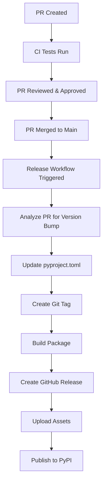

# Automated Release Process

This project uses GitHub Actions to automatically create releases when pull requests are merged to the main branch.

## How It Works

### Automatic Releases (on PR merge)

When a pull request is merged into the main branch, the system automatically:

1. **Determines version bump type** based on PR title/body keywords:
   - **Major** (1.0.0 → 2.0.0): Keywords like "breaking", "major"
   - **Minor** (1.0.0 → 1.1.0): Keywords like "feature", "minor", "feat"
   - **Patch** (1.0.0 → 1.0.1): Default for bug fixes and small changes

2. **Updates version** in `pyproject.toml`
3. **Creates a git tag** (e.g., `v1.2.3`)
4. **Builds the package** (wheel and source distribution)
5. **Creates a GitHub release** with automatic release notes
6. **Publishes to PyPI** automatically

### Manual Releases

You can also trigger releases manually:

1. Go to **Actions** tab in GitHub
2. Select **Manual Release** workflow
3. Click **Run workflow**
4. Choose version bump type (patch/minor/major)
5. Add optional release notes

## Version Bump Keywords

Include these keywords in your PR title or description to control version bumps:

### Major Release (Breaking Changes)
- `breaking` - Breaking API changes
- `major` - Major new version

### Minor Release (New Features)
- `feature` - New feature added
- `minor` - Minor version bump
- `feat` - Feature addition

### Patch Release (Bug Fixes)
- Default behavior if no keywords found
- Bug fixes, documentation updates, small improvements

## Example PR Titles

```
✅ "Fix bug in acid formation calculation" → v1.2.3 → v1.2.4 (patch)
✅ "feat: Add new CO2 density calculation method" → v1.2.3 → v1.3.0 (minor)
✅ "breaking: Change API for Fluid class constructor" → v1.2.3 → v2.0.0 (major)
```

## Setup Requirements

### GitHub Secrets

You need to add these secrets to your GitHub repository:

1. **`PYPI_API_TOKEN`** - Your PyPI API token for publishing packages
   - Go to GitHub repo → Settings → Secrets and variables → Actions
   - Click "New repository secret"
   - Name: `PYPI_API_TOKEN`
   - Value: Your PyPI token (starts with `pypi-`)

### Branch Protection (Recommended)

For best practices, protect your main branch:

1. Go to Settings → Branches
2. Add rule for `main` branch
3. Enable:
   - "Require pull request reviews before merging"
   - "Require status checks to pass before merging"
   - "Require branches to be up to date before merging"

## Workflow Files

- `.github/workflows/release.yml` - Automatic release on PR merge
- `.github/workflows/manual-release.yml` - Manual release trigger

## Release Process Flow



## Benefits

1. **Consistent versioning** - No manual version management
2. **Automated releases** - No manual steps required
3. **Automatic PyPI publishing** - Users get updates immediately
4. **Release notes** - Automatically generated from PR information
5. **Semantic versioning** - Based on change type
6. **Rollback capability** - Git tags allow easy rollbacks

## Troubleshooting

### Failed PyPI Upload
- Check that `PYPI_API_TOKEN` secret is set correctly
- Verify token has permissions for your package
- Ensure package name doesn't conflict with existing packages

### Version Conflicts
- The workflow will fail if the version already exists
- Check that your main branch is up to date
- Manually create a tag if needed: `git tag v1.2.3 && git push origin v1.2.3`

### Build Failures
- Check the Actions tab for detailed error logs
- Ensure all dependencies are properly specified in `pyproject.toml`
- Test builds locally with `python -m build`

## Testing the Workflow

To test without publishing:

1. Create a test repository
2. Set up the workflow files
3. Remove the PyPI publishing step temporarily
4. Test with sample PRs

## Best Practices

1. **Use descriptive PR titles** with appropriate keywords
2. **Include detailed PR descriptions** for better release notes
3. **Test changes locally** before creating PRs
4. **Use draft releases** for testing if needed
5. **Tag releases consistently** with semantic versioning
