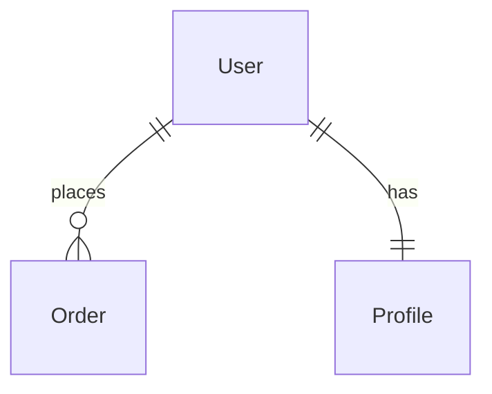

# Stage 9: Data Models

Generate data model documentation covering entities, relationships, validation rules, and ER diagrams using Mermaid.

## Prerequisites

- Stage 08 completed (or skipped if no API)
- Mode: `{REPOIX_MODE}` (if "cli", convert MCP calls per AGENTS.md)
- Discovery cache loaded: LIMITS, COMPONENT_SUFFIXES, COMPONENT_PREFIXES

## Critical Rules

| Rule | Action |
|------|--------|
| API required | **MUST** verify {wiki_dir}/api.md exists (or stage skipped) |
| Search before skip | **MUST** search for models before deciding to skip |
| Mermaid only | **MUST** use Mermaid ER diagrams (no ASCII) |
| Skip if none | **MAY** skip if no models found (stateless apps) |

---

{{include:ai-cache-enforcement.md}}

## AI Context Cache: Check Cached Understanding

**[!] MANDATORY: Check cache status FIRST.**

```text
# [!] MANDATORY: Check cache status at stage start
get_understanding_stats(limit=50)

# Recall understanding for paths from stats output
recall_understanding(target="project")

# Use ACTUAL paths from YOUR get_understanding_stats output:
# recall_understanding(target="{path_from_stats}")  # if exists in stats

# IF found AND fresh: Use cached analysis to guide model documentation
# IF not found: Proceed with discovery, then MUST store findings
```

---

**Anti-pattern (DO NOT):**

```text
User --+-- Order
       |
       +-- Profile
```

**Correct pattern:**



---

## Step 1: Verify Previous Stage

```bash
speckitadv deepwiki-update-state verify-stage --stage=09-models --wiki-dir={wiki_dir}
```

---

## Step 2: Find Model Definitions

**Load discovered patterns from discovery_cache:**

```bash
speckitadv deepwiki-update-state show --wiki-dir={wiki_dir}
# Extract: LIMITS = discovery_cache.project_size.limits
# Extract: COMPONENT_SUFFIXES = discovery_cache.file_patterns.component_patterns.suffixes
# Extract: COMPONENT_PREFIXES = discovery_cache.file_patterns.component_patterns.prefixes
```

**MUST search using YOUR DISCOVERED patterns (iterate over your actual COMPONENT_SUFFIXES):**

```text
# MANDATORY: For EACH suffix in YOUR COMPONENT_SUFFIXES that relates to data/models:
# Example if COMPONENT_SUFFIXES = ["Dto", "Entity", "Model", "Schema", "Repository", "Request", "Response"]:
search_symbols(query="%Dto", kind="class", limit=LIMITS.symbols)
search_symbols(query="%Entity", kind="class", limit=LIMITS.symbols)
search_symbols(query="%Model", kind="class", limit=LIMITS.symbols)
search_symbols(query="%Schema", kind="class", limit=LIMITS.symbols)
search_symbols(query="%Repository", kind="class", limit=LIMITS.symbols)
search_symbols(query="%Request", kind="class", limit=LIMITS.symbols)
search_symbols(query="%Response", kind="class", limit=LIMITS.symbols)
# ... continue for ALL data-related suffixes in YOUR discovered COMPONENT_SUFFIXES

# MANDATORY: For EACH prefix in YOUR COMPONENT_PREFIXES:
# Example if COMPONENT_PREFIXES = ["Base", "Abstract", "I"]:
search_symbols(query="Base%", kind="class", limit=LIMITS.symbols)
search_symbols(query="Abstract%", kind="class", limit=LIMITS.symbols)
# ... continue for ALL prefixes in YOUR discovered COMPONENT_PREFIXES
```

**[!] CRITICAL:** The patterns above are examples. You **MUST** use YOUR actual discovered COMPONENT_SUFFIXES and COMPONENT_PREFIXES from enumerate-index output, not these examples.

**ORM-specific patterns (language detection from PRIMARY_LANGUAGE):**

```text
# Java/Kotlin
search_code(query="@Entity|@Table|@Column", is_regex=true, source_only=true, limit=LIMITS.code)
# Python
search_code(query="models.Model|mongoose.Schema", is_regex=true, source_only=true, limit=LIMITS.code)
# Go/Rust
search_code(query="gorm.Model|#\\[derive.*Serialize", is_regex=true, source_only=true, limit=LIMITS.code)

# Model directories
list_files(pattern="**/models/**", include_stats=true, limit=LIMITS.files)
list_files(pattern="**/entities/**", include_stats=true, limit=LIMITS.files)
```

---

## Step 3: Explore Type Hierarchies (with AI Context Cache)

For each model class:

```text
# FIRST: Check cached understanding for model file
recall_understanding(target="<model_file>")
# IF found AND fresh: Use cached model analysis
# IF not found: Proceed with full analysis below

# Get full hierarchy
get_type_hierarchy(fqn="<model_class>", direction="both", depth=5)

# Find all references
get_references(fqn="<model_class>")

# Get all fields
get_file_symbols(path="<model_file>", include_private=true, kinds=["property", "field", "method"])

# Find similar models and duplicate patterns
find_similar(fqn="<model_class>", similarity_threshold=0.6, limit=20)
get_duplicate_code(source_only=true, similarity_threshold=0.6, limit=30)

# Read implementation (check cache first)
recall_understanding(target="<model_file>")
# IF not cached: Read file: <model_file>
# [!] NOW CALL store_understanding for the file above
# -> Extract fields with types
# -> Note validation constraints
# -> Identify relationships (ForeignKey, ManyToMany)

# Get imports
get_file_imports(path="<model_file>")

# Find tests
get_related_files(path="<model_file>", relationship_types=["test"])

# [!] MANDATORY: Store understanding for EACH model file read
store_understanding(
  scope="file",
  target="<model_file>",
  purpose="Data model for <entity_name>",
  importance="high",
  key_points=["<fields>", "<relationships>", "<constraints>"],
  gotchas=["<validation_rules>", "<migration_notes>"],
  analysis="<detailed_logic_and_flow_explanation>"
)
```

---

## Step 4: Generate Documentation

Write `{wiki_dir}/models.md` using this template:

{{include:wiki/model-template.md}}

**Fill placeholders with:** Models summary, entities table, entity details (fields, types, constraints), Mermaid ER diagrams, validation rules, migration notes.

---

## Step 5: Complete Stage

```bash
speckitadv deepwiki-update-state stage --stage=09-models --status=completed --artifacts="{wiki_dir}/models.md" --wiki-dir={wiki_dir}
```

---

## Output Format

```text
===========================================================
  STAGE COMPLETE: 09-models

  Generated: {wiki_dir}/models.md
  Entities: {count}
  Relationships: {count}

  AI Cache Efficiency:
    - Files read: <count_read>
    - Files cached (store_understanding): <count_stored>
    - Cache hits (found=true, fresh=true): <count_hits>

  Next: Run {next_command}
===========================================================
```

---

## Edge Cases

| Scenario | Action |
|----------|--------|
| No ORM/models found | Skip stage (stateless app) |
| Multiple ORMs | Document each separately |
| NoSQL/Document store | Use document schema format |
| No relationships | Skip ER diagram |

---

## Next Stage

Run `{next_command}` - CLI auto-detects current stage and emits next prompt.
