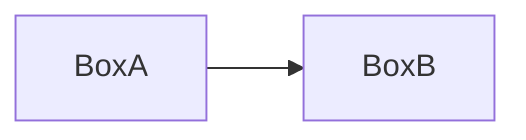
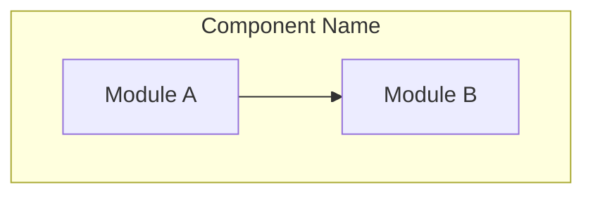
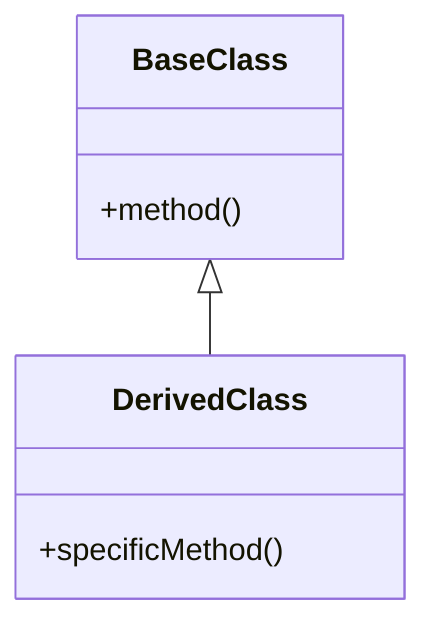
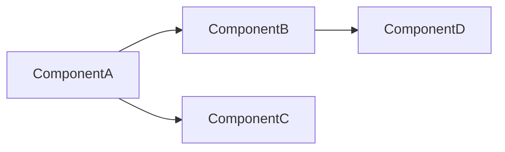

# Stage 5: Visual Diagrams

Generate visual architecture diagrams using Mermaid for component relationships, class hierarchies, and system structure.

## Prerequisites

- Stage 04 completed with overview.md generated
- Mode: `{REPOIX_MODE}` (if "cli", convert MCP calls per AGENTS.md)

## Critical Rules

| Rule | Action |
|------|--------|
| Overview required | **MUST** verify {wiki_dir}/overview.md exists |
| At least 1 diagram | **MUST** generate at least 1 architecture diagram |
| Mermaid only | **MUST** use Mermaid syntax (no ASCII/text diagrams) |

---

{{include:ai-cache-enforcement.md}}

## AI Context Cache: Check Cached Understanding

**[!] MANDATORY: Check cache status FIRST.**

```text
# [!] MANDATORY: Check cache status at stage start
get_understanding_stats(limit=50)

# Recall understanding for paths from stats output
recall_understanding(target="project")

# Use ACTUAL paths from YOUR get_understanding_stats output:
# recall_understanding(target="{path_from_stats}")  # if exists in stats

# IF found AND fresh: Use cached analysis to guide diagram generation
# IF not found: Proceed with discovery, then MUST store findings
```

---

**Anti-pattern (DO NOT):**

```text
+-------+     +-------+
| Box A |---->| Box B |
+-------+     +-------+
```

**Correct pattern:**



---

## Step 1: Verify Previous Stage

```bash
speckitadv deepwiki-update-state verify-stage --stage=05-diagrams --wiki-dir={wiki_dir}
```

---

## Step 2: Load Discovery Cache (MANDATORY)

```bash
speckitadv deepwiki-update-state show --wiki-dir={wiki_dir}
# Extract: COMPONENT_SUFFIXES = discovery_cache.file_patterns.component_patterns.suffixes
# Extract: COMPONENT_PREFIXES = discovery_cache.file_patterns.component_patterns.prefixes
# Extract: LIMITS = discovery_cache.project_size.limits
```

---

## Step 3: Gather Diagram Data

**MUST** iterate over ALL discovered patterns. Do NOT use only 2-3 hardcoded patterns.

```text
# Component relationships (always run these)
get_components()
get_dependencies()
index_status()

# MANDATORY: For EACH prefix in YOUR COMPONENT_PREFIXES, search for base classes:
# Example if COMPONENT_PREFIXES = ["Video", "Create", "I", "Update", "FAQ"]:
search_symbols(query="Video%", kind="class", limit=LIMITS.symbols)
search_symbols(query="Create%", kind="class", limit=LIMITS.symbols)
search_symbols(query="I%", kind="interface", limit=LIMITS.symbols)
search_symbols(query="Update%", kind="class", limit=LIMITS.symbols)
search_symbols(query="FAQ%", kind="class", limit=LIMITS.symbols)
# ... continue for ALL prefixes in YOUR discovered COMPONENT_PREFIXES

# For each base class found, get type hierarchy:
get_type_hierarchy(fqn="<base_class>", direction="both", depth=5)

# MANDATORY: For EACH suffix in YOUR COMPONENT_SUFFIXES, search for patterns:
# Example if COMPONENT_SUFFIXES = ["Dto", "Request", "Service", "Controller", "Validator"]:
search_symbols(query="%Dto", kind="class", limit=LIMITS.symbols)
search_symbols(query="%Request", kind="class", limit=LIMITS.symbols)
search_symbols(query="%Service", kind="class", limit=LIMITS.symbols)
search_symbols(query="%Controller", kind="class", limit=LIMITS.symbols)
search_symbols(query="%Validator", kind="class", limit=LIMITS.symbols)
# ... continue for ALL suffixes in YOUR discovered COMPONENT_SUFFIXES

# API structure
get_api_endpoints(limit=200)
```

**[!] CRITICAL:** You **MUST** search for ALL patterns in YOUR COMPONENT_SUFFIXES and COMPONENT_PREFIXES. The examples above are illustrative. Use YOUR actual discovered patterns from the enumerate-index output.

For key classes, trace relationships:

```text
get_references(fqn="<class_fqn>")
get_callers(fqn="<service_method>", depth=3)
get_file_imports(path="<key_file>")

# [!] MANDATORY: Store architectural understanding discovered above
store_understanding(
  scope="module",
  target="architecture/diagrams",
  purpose="Architectural structure discovered via MCP analysis",
  importance="high",
  key_points=["<component_count> components", "<dependency_graph>", "<class_hierarchies>"],
  gotchas=["<circular_dependencies>", "<orphan_components>"],
  analysis="<architecture_layers>: <presentation> -> <business> -> <data>. <key_patterns>: <pattern1>, <pattern2>. <component_relationships>."
)

# ALSO store understanding for any key files read during hierarchy analysis
# (Apply 1:1 Read:Store rule - for each file read, store understanding)
```

---

## Step 4: Generate Diagrams

Create `{wiki_dir}/architecture/diagrams.md` with:

### Architecture Diagram



### Class Diagram (for OOP codebases)



### Dependency Graph



---

## Step 5: Complete Stage

```bash
speckitadv deepwiki-update-state stage --stage=05-diagrams --status=completed --artifacts="{wiki_dir}/architecture/diagrams.md" --wiki-dir={wiki_dir}
```

---

## Output Format

```text
===========================================================
  STAGE COMPLETE: 05-diagrams

  Summary:
    - Generated: {wiki_dir}/architecture/diagrams.md
    - Diagrams: {count} (architecture, class, dependency)
    - Components: {count}

  AI Cache Efficiency:
    - Files read: <count_read>
    - Files cached (store_understanding): <count_stored>
    - Cache hits (found=true, fresh=true): <count_hits>

  Next: Run {next_command}
===========================================================
```

---

## Edge Cases

| Scenario | Action |
|----------|--------|
| No dependencies found | Generate single-component diagram only |
| No class hierarchies | Skip class diagram (functional codebase) |
| Circular dependencies | Mark with warning in diagram |
| Too many components (>50) | Group into logical layers/subgraphs |

---

## Next Stage

Run `{next_command}` - CLI auto-detects current stage and emits next prompt.
