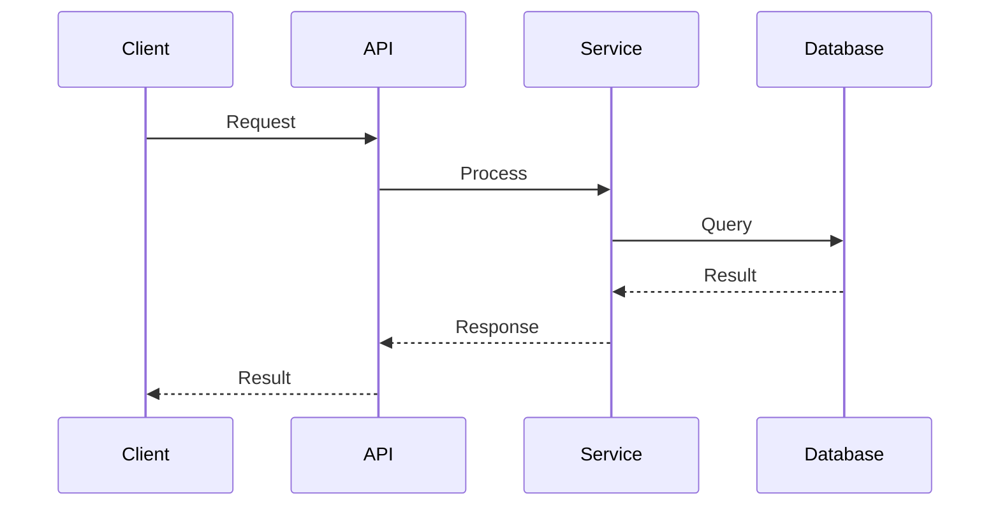

# Stage 6: Flow Documentation

Generate flow documentation showing how requests and data move through the system using Mermaid sequence diagrams.

## Prerequisites

- Stage 05 completed with diagrams.md generated
- Mode: `{REPOIX_MODE}` (if "cli", convert MCP calls per AGENTS.md)
- Discovery cache loaded: LIMITS, COMPONENT_SUFFIXES

## Critical Rules

| Rule | Action |
|------|--------|
| Diagrams required | **MUST** verify {wiki_dir}/architecture/diagrams.md exists |
| Entry points | **MUST** discover at least 1 entry point |
| Complete flow | **MUST** trace at least 1 flow from entry to exit |
| Mermaid only | **MUST** use Mermaid syntax (no ASCII diagrams) |
| Multi-file output | **MUST** create flows/ directory with separate files |

---

{{include:ai-cache-enforcement.md}}

## AI Context Cache: Check Cached Understanding

**[!] MANDATORY: Check cache status FIRST.**

```text
# [!] MANDATORY: Check cache status at stage start
get_understanding_stats(limit=50)

# Recall understanding for paths from stats output
recall_understanding(target="project")

# Use ACTUAL paths from YOUR get_understanding_stats output:
# recall_understanding(target="{path_from_stats}")  # if exists in stats

# IF found AND fresh: Use cached analysis to guide flow tracing
# IF not found: Proceed with discovery, then MUST store findings
```

---

**Anti-pattern (DO NOT):**

```text
Client --> API --> Service --> Database
```

**Correct pattern:**



---

## Step 1: Verify Previous Stage

```bash
speckitadv deepwiki-update-state verify-stage --stage=06-flows --wiki-dir={wiki_dir}
```

---

## Step 2: Find Entry Points

**Load discovered patterns from discovery_cache:**

```bash
speckitadv deepwiki-update-state show --wiki-dir={wiki_dir}
# Extract: COMPONENT_SUFFIXES = discovery_cache.file_patterns.component_patterns.suffixes
# Extract: LIMITS = discovery_cache.project_size.limits
```

```text
# API endpoints
get_api_endpoints(limit=200)
search_code(query="@route|@app.route", is_regex=true, limit=100)
search_code(query="@Get|@Post|@Put|@Delete|@Patch", is_regex=true, limit=100)

# MANDATORY: For EACH suffix in YOUR COMPONENT_SUFFIXES that relates to flows:
# Example if COMPONENT_SUFFIXES includes ["Handler", "Listener", "Consumer", "Job", "Worker", "Middleware"]:
search_symbols(query="%Handler", kind="class", limit=LIMITS.symbols)
search_symbols(query="%Listener", kind="class", limit=LIMITS.symbols)
search_symbols(query="%Consumer", kind="class", limit=LIMITS.symbols)
search_symbols(query="%Job", kind="class", limit=LIMITS.symbols)
search_symbols(query="%Middleware", kind="class", limit=LIMITS.symbols)
# ... continue for ALL relevant flow-related suffixes in YOUR COMPONENT_SUFFIXES

# CLI commands
search_code(query="@click.command|argparse", is_regex=true, limit=LIMITS.code)
```

**[!] CRITICAL:** Use YOUR actual discovered COMPONENT_SUFFIXES, not these examples.

Categorize entry points: authentication, CRUD, workflows, jobs, webhooks.

---

## Step 3: Trace Call Chains (with AI Context Cache)

For each major flow:

```text
# FIRST: Check cached understanding for handler/service files
recall_understanding(target="<handler_file>")
recall_understanding(target="<service_file>")
# IF found AND fresh: Use cached flow patterns
# IF not found: Proceed with full analysis below

# Get handler symbol
search_symbols(query="<HandlerName>", kind="class")
get_file_symbols(path="<handler_file>", kinds=["method"])
get_file_imports(path="<handler_file>")
get_type_hierarchy(fqn="<handler_fqn>", direction="both", depth=3)

# Trace downstream (check cache first for each file)
recall_understanding(target="<handler_file>")
# IF not cached: Read file: <handler_file>
# [!] NOW CALL store_understanding for the file above
recall_understanding(target="<service_file>")
# IF not cached: Read file: <service_file>
# [!] NOW CALL store_understanding for the file above
recall_understanding(target="<repository_file>")
# IF not cached: Read file: <repository_file>
# [!] NOW CALL store_understanding for the file above

# Trace upstream
get_callers(fqn="<service_method>", depth=3)
get_references(fqn="<repository_method>")

# Cross-component
get_dependencies()
get_related_files(path="<service_file>")

# [!] MANDATORY: Store understanding for EACH file read above
store_understanding(
  scope="file",
  target="<handler_file>",
  purpose="Flow handler for <flow_name>",
  importance="high",
  key_points=["<entry_point>", "<downstream_calls>", "<response_format>"],
  gotchas=["<error_paths>", "<auth_requirements>"],
  analysis="<detailed_request_flow>: 1) <entry> 2) <validation> 3) <business_call> 4) <response>. <error_handling_strategy>."
)
store_understanding(
  scope="file",
  target="<service_file>",
  purpose="Service logic for <flow_name>",
  importance="high",
  key_points=["<business_rules>", "<validations>", "<transactions>"],
  gotchas=["<edge_cases>", "<error_handling>"],
  analysis="<business_logic>: <rule1>, <rule2>. <state_machine_if_any>. <transaction_boundaries>."
)
store_understanding(
  scope="file",
  target="<repository_file>",
  purpose="Data access for <flow_name>",
  importance="medium",
  key_points=["<queries>", "<relationships>"],
  gotchas=["<N+1_risks>", "<transaction_scope>"],
  analysis="<data_access_patterns>: <main_queries>. <eager_vs_lazy_loading>. <caching_strategy>."
)
```

Extract: validation, auth checks, business logic, persistence, error handling, logging.

---

## Step 4: Generate Flow Diagrams

Use Mermaid sequence diagrams:


---

## Step 5: Write Output

**Create directory first:**

```bash
mkdir -p {wiki_dir}/flows
```

**Required files:**

| File | Content |
|------|---------|
| `{wiki_dir}/flows/README.md` | Index with links to all flows |
| `{wiki_dir}/flows/{flow-slug}.md` | Individual flow (one per major flow) |

**Each flow file uses this template:**

{{include:wiki/flow-template.md}}

**Fill placeholders with:** Flow title, Mermaid sequence diagram, step-by-step walkthrough with file:line references, key functions table, error handling, related flows.

---

## Step 6: Verification Gate (MANDATORY)

**[STOP: VERIFY_MULTI_FILE_OUTPUT]**

Before completing this stage, you MUST verify:

1. [ ] `{wiki_dir}/flows/README.md` exists (index file)
2. [ ] At least 1 individual flow file exists: `{wiki_dir}/flows/{flow-slug}.md`
3. [ ] Each flow file contains: title, Mermaid sequence diagram, step walkthrough

**FAILURE CONDITIONS:**

- If only README.md exists: FAIL - You MUST create individual flow files
- If flow files have no Mermaid diagram: FAIL - Each flow must have sequence diagram

**Count files in directory:**

```bash
ls {wiki_dir}/flows/
```

Expected: README.md + at least 1 flow file (e.g., `auth-flow.md`, `crud-flow.md`, `main-flow.md`)

**IF verification fails:** Go back to Step 5 and create the missing individual files.

---

## Step 7: Complete Stage

```bash
speckitadv deepwiki-update-state stage --stage=06-flows --status=completed --artifacts="{wiki_dir}/flows/README.md,{wiki_dir}/flows/{flow-1}.md,..." --wiki-dir={wiki_dir}
```

---

## Output Format

```text
===========================================================
  STAGE COMPLETE: 06-flows

  Generated Files:
    - {wiki_dir}/flows/README.md (index)
    - {wiki_dir}/flows/{flow-N}.md (per-flow files)

  Total Files: {count}
  Flows documented: {count}
  Entry points covered: {count}

  AI Cache Efficiency:
    - Files read: <count_read>
    - Files cached (store_understanding): <count_stored>
    - Cache hits (found=true, fresh=true): <count_hits>

  Next: Run {next_command}
===========================================================
```

---

## Edge Cases

| Scenario | Action |
|----------|--------|
| No API endpoints | Document CLI command flows instead |
| Library project | Document public API usage patterns |
| Async patterns | Use async-aware sequence diagrams |
| Event-driven | Create dedicated event flow diagrams |

---

## Next Stage

Run `{next_command}` - CLI auto-detects current stage and emits next prompt.
