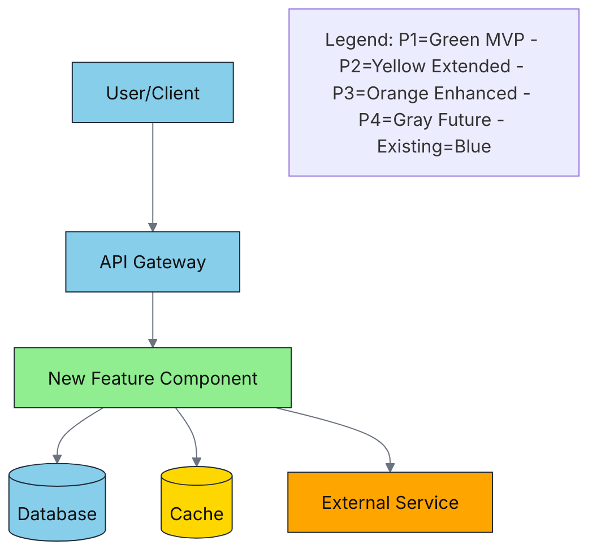
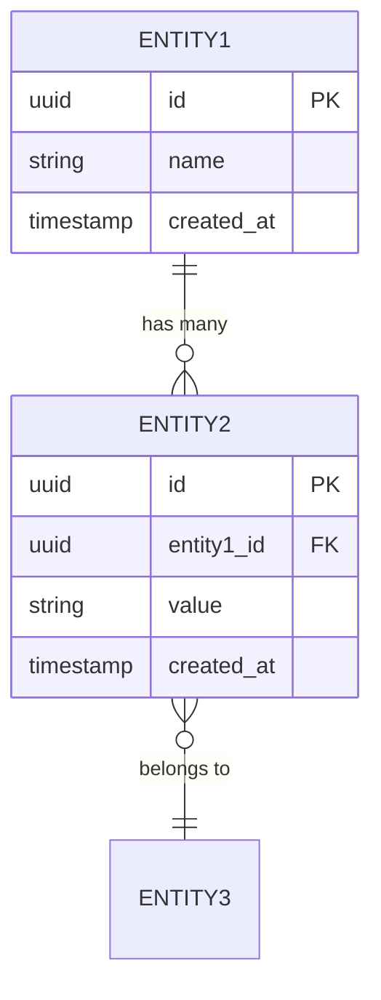
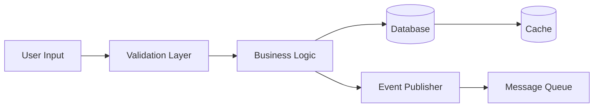

# Implementation Plan: <<FEATURE_NAME>>

**Branch**: `<<FEATURE_BRANCH>>` | **Date**: <<DATE>> | **Spec**: <<SPEC_LINK>>
**Input**: Feature specification from `/specs/<<FEATURE_BRANCH>>/spec.md`

**Note**: This template is filled in by the `speckitadv plan` command.

## Summary

[Extract from feature spec: primary requirement + technical approach from research]

## Technical Context

<!--
  ACTION REQUIRED: Replace the content in this section with the technical details
  for the project. The structure here is presented in advisory capacity to guide
  the iteration process.
-->

**Language/Version**: [e.g., Python 3.12, Node.js 20 LTS, Java 21 LTS - defaults to latest LTS if not specified, or NEEDS CLARIFICATION]
**Primary Dependencies**: [e.g., FastAPI, Express, Spring Boot or NEEDS CLARIFICATION]
**Storage**: [if applicable, e.g., PostgreSQL 16, MongoDB, files or N/A]
**Testing**: [e.g., pytest, jest, JUnit or NEEDS CLARIFICATION]
**Target Platform**: [e.g., Linux server, iOS 15+, Web browser or NEEDS CLARIFICATION]
**Project Type**: [single/web/mobile - determines source structure]
**Performance Goals**: [domain-specific, e.g., 1000 req/s, 10k lines/sec, 60 fps or NEEDS CLARIFICATION]
**Constraints**: [domain-specific, e.g., <200ms p95, <100MB memory, offline-capable or NEEDS CLARIFICATION]
**Scale/Scope**: [domain-specific, e.g., 10k users, 1M LOC, 50 screens or NEEDS CLARIFICATION]

**Version Selection Notes**: Per AGENTS.md Section 4.5, when versions are not specified in spec, default to latest LTS versions for languages/frameworks. Document chosen versions with rationale (e.g., "Node.js 20 LTS - latest stable as of plan creation").

## Constitution Check

*GATE: Must pass before Phase 0 research. Re-check after Phase 1 design.*

[Gates determined based on constitution file]

## Project Structure

### Documentation (this feature)

```text
specs/<<FEATURE_BRANCH>>/
+--- plan.md              # This file (/speckitadv.plan command output)
+--- research.md          # Phase 0 output (/speckitadv.plan command)
+--- data-model.md        # Phase 1 output (/speckitadv.plan command)
+--- quickstart.md        # Phase 1 output (/speckitadv.plan command)
+--- contracts/           # Phase 1 output (/speckitadv.plan command)
+--- tasks.md             # Phase 2 output (/speckitadv.tasks command - NOT created by /speckitadv.plan)
```

### Source Code (repository root)
<!--
  ACTION REQUIRED: Replace the placeholder tree below with the concrete layout
  for this feature. Delete unused options and expand the chosen structure with
  real paths (e.g., apps/admin, packages/something). The delivered plan must
  not include Option labels.
-->

```text
# [REMOVE IF UNUSED] Option 1: Single project (DEFAULT)
src/
+--- models/
+--- services/
+--- cli/
+--- lib/

tests/
+--- contract/
+--- integration/
+--- unit/

# [REMOVE IF UNUSED] Option 2: Web application (when "frontend" + "backend" detected)
backend/
+--- src/
|   +--- models/
|   +--- services/
|   +--- api/
+--- tests/

frontend/
+--- src/
|   +--- components/
|   +--- pages/
|   +--- services/
+--- tests/

# [REMOVE IF UNUSED] Option 3: Mobile + API (when "iOS/Android" detected)
api/
+--- [same as backend above]

ios/ or android/
+--- [platform-specific structure: feature modules, UI flows, platform tests]
```

**Structure Decision**: [Document the selected structure and reference the real
directories captured above]

## Complexity Tracking

> **Fill ONLY if Constitution Check has violations that must be justified**

| Violation | Why Needed | Simpler Alternative Rejected Because |
| ----------- | ------------ | ------------------------------------- |
| [e.g., 4th project] | [current need] | [why 3 projects insufficient] |
| [e.g., Repository pattern] | [specific problem] | [why direct DB access insufficient] |

---

## High-Level Architecture

<!--
  REQUIRED SECTION: Always include this section for all features.
  Shows how THIS feature integrates with the existing system.
-->

### Component Interaction Diagram

**Purpose**: Show how this feature integrates with existing system components



**Instructions**:

- Color NEW components by phase (P1/P2/P3/P4)
- Color EXISTING components as blue
- Show data flow direction with arrows
- Include critical external dependencies

### Architecture Pattern

**Pattern Used**: [e.g., Layered, Hexagonal/Ports & Adapters, Event-Driven, CQRS, etc.]

**Justification**: [Why this pattern fits the feature requirements]

**Trade-offs**:

- **Optimizing for**: [e.g., Maintainability, testability, separation of concerns]
- **Trade-off**: [e.g., More indirection, additional complexity]

### Component Responsibilities

| Component | Responsibility | New/Modified | Phase | Location |
|-----------|----------------|--------------|-------|----------|
| [Component name] | [What it does] | New | P1 | [src/path/to/component] |
| [Component name] | [What changes] | Modified | P1 | [src/path/to/component] |

---

## Cross-Cutting Concerns

<!--
  CONDITIONAL SECTION: Include this section if the feature involves:
  - Error handling beyond simple try-catch
  - Security (authentication, authorization, data protection)
  - Observability (logging, metrics, tracing, alerting)
  - Caching strategies
  - Resilience patterns (retries, circuit breakers, timeouts)
  - API design decisions
  - Configuration management

  DELETE this entire section if the feature is simple CRUD with standard error handling.
-->

### Error Handling

**Strategy**: [Fail fast / Graceful degradation / Retry with exponential backoff]

**Error Response Format**:

```json
{
  "error": {
    "code": "[ERROR_CODE]",
    "message": "[User-friendly message]",
    "details": "[Technical details - only in dev/staging]",
    "timestamp": "[ISO8601]",
    "requestId": "[Correlation ID]"
  }
}
```

**Error Codes**: [List specific error codes for this feature]

**Logging Strategy**:

- **What to log**: [Business events, errors, performance metrics]
- **Log levels**: INFO (business events), WARN (recoverable), ERROR (requires attention)
- **Correlation**: [Request ID propagated across all log statements]
- **PII masking**: [Automatic redaction of sensitive fields: email, phone, SSN, etc.]

### Security

**Authentication**: [How users are authenticated - OAuth 2.0, JWT, Session, API Key, etc.]

**Authorization**: [RBAC, ABAC, claims-based - specify roles/permissions needed]

**Data Protection**:

- **Encryption in transit**: [TLS 1.3]
- **Encryption at rest**: [If storing sensitive data - database encryption, field-level encryption]
- **PII handling**: [What PII is collected, how it's protected, retention policy]

**Input Validation**:

- **Where**: [API layer, service layer]
- **Method**: [Schema validation (OpenAPI/JSON Schema), whitelist, sanitization]

**OWASP Top 10 Mitigations**:

- **SQL Injection**: [Parameterized queries, ORM]
- **XSS**: [Content Security Policy, output encoding]
- **CSRF**: [SameSite cookies, CSRF tokens]
- **Secrets**: [Never hardcode - use environment variables, secrets manager]

### Observability

**Logging**:

- **Format**: [JSON structured logs]
- **Fields**: timestamp, level, message, requestId, userId, component, [feature-specific fields]
- **Destination**: [stdout/stderr, log aggregation service]

**Metrics** (if applicable):

- **Type**: RED (Rate, Errors, Duration)
- **Key metrics for this feature**:
  - Request rate: `[feature_name]_requests_total` (counter)
  - Error rate: `[feature_name]_errors_total` (counter)
  - Latency: `[feature_name]_duration_seconds` (histogram)
  - \[Feature-specific metric\]: [description]

**Tracing** (if applicable):

- **Tool**: [OpenTelemetry, Jaeger, Datadog APM, etc.]
- **Trace points**: [Key operations to trace]
- **Sampling**: [100% in dev, 10% in prod, 100% on errors]

**Alerting** (if applicable):

- **Conditions**: [Error rate > 5%, latency p95 > 500ms, etc.]
- **Channels**: [Slack, PagerDuty, email]
- **Runbook**: [Link or brief steps for on-call engineer]

### Caching Strategy

<!--
  DELETE this subsection if no caching is needed
-->

**What to cache**: [Specific data/queries that are cacheable]

**Cache layer**: [Application cache / CDN / Database query cache]

**Technology**: [Redis, Memcached, in-memory, CDN]

**TTL**: [Time-to-live values - be specific: "User profile: 5 minutes"]

**Invalidation**:

- **Strategy**: [Time-based / Event-based / Manual purge]
- **Events triggering invalidation**: [e.g., User update event invalidates user cache]

**Cache miss handling**: [Fallback to database, error if critical]

### Resilience Patterns

<!--
  DELETE this subsection if no external dependencies or all synchronous calls to internal services only
-->

**Timeouts**:

- **Connection timeout**: [e.g., 3 seconds]
- **Read timeout**: [e.g., 10 seconds]
- **Total request timeout**: [e.g., 30 seconds]

**Retries**:

- **Retry logic**: [Exponential backoff: 2^n seconds, max 5 attempts]
- **Retry on**: [Network errors, 5xx errors, timeouts]
- **No retry on**: [4xx errors (except 429), business logic errors]

**Circuit Breaker** (if external dependencies):

- **Failure threshold**: [e.g., 5 consecutive failures]
- **Timeout**: [e.g., 30 seconds in open state]
- **Half-open state**: [Allow 1 test request after timeout]

**Fallback**:

- **Degraded mode**: [What happens when dependency is unavailable]
- **Default behavior**: [Return cached data / Return empty / Fail request]

### API Design

<!--
  DELETE this subsection if feature does not expose any APIs
-->

**Style**: [REST / GraphQL / gRPC / WebSocket]

**Versioning**: [URI versioning (/api/v1/) / Header versioning / Content negotiation]

**Rate Limiting** (if applicable):

- **Limits**: [e.g., 100 requests/minute per user, 1000 requests/minute per API key]
- **Headers**: `X-RateLimit-Limit`, `X-RateLimit-Remaining`, `X-RateLimit-Reset`
- **Response**: `429 Too Many Requests` with `Retry-After` header

**Idempotency** (if applicable):

- **Operations**: [POST/PUT/PATCH/DELETE operations]
- **Mechanism**: `Idempotency-Key` header (UUID)
- **Storage**: [Redis with 24h TTL]

**Pagination** (if applicable):

- **Style**: [Offset-based / Cursor-based / Page-based]
- **Default page size**: [e.g., 20]
- **Max page size**: [e.g., 100]

**Filtering/Sorting** (if applicable):

- **Query parameters**: [e.g., ?filter=status:active&sort=-createdAt]

### Configuration

**Configuration source**: [Environment variables / Config files / Secret manager / Feature flags]

**Secrets management**: [AWS Secrets Manager / Azure Key Vault / HashiCorp Vault / Kubernetes Secrets]

**Feature flags** (if applicable):

- **Tool**: [LaunchDarkly / Unleash / Custom / None]
- **Flags for this feature**: [List feature flags]

**Hot reload**: [Yes - via SIGHUP / No - requires restart]

---

## Data Architecture

<!--
  CONDITIONAL SECTION: Include this section if the feature:
  - Introduces new database tables/collections
  - Modifies existing data structures
  - Has significant data flow (ETL, streaming, etc.)
  - Requires data migration

  DELETE this entire section if the feature is purely computational or only reads existing data without schema changes.
-->

### Data Model

**Entities** (Phase-Colored):

- **[Entity 1]** (P1) - [Brief description]
- **[Entity 2]** (P1) - [Brief description]
- **[Entity 3]** (P2) - [Brief description]

**Entity Relationship Diagram**:



### Database Schema

**Database Type**: [Relational (PostgreSQL/MySQL) / NoSQL (MongoDB/DynamoDB) / Graph (Neo4j) / etc.]

#### Entity: [Entity Name]

```sql
-- Example for relational database
CREATE TABLE [table_name] (
  id UUID PRIMARY KEY DEFAULT gen_random_uuid(),
  [field_name] [TYPE] [CONSTRAINTS],
  created_at TIMESTAMP WITH TIME ZONE DEFAULT CURRENT_TIMESTAMP,
  updated_at TIMESTAMP WITH TIME ZONE DEFAULT CURRENT_TIMESTAMP
);

-- Indexes
CREATE INDEX idx_[name] ON [table]([field]);

-- Foreign keys
ALTER TABLE [table] ADD CONSTRAINT fk_[name]
  FOREIGN KEY ([field]) REFERENCES [other_table]([field]);
```

**Indexing Strategy**:

- **Primary access patterns**: [e.g., Find user by email, List orders by userId and date]
- **Indexes needed**: [List indexes with justification]
- **Composite indexes**: [If needed - specify column order and why]

**Constraints**:

- **Unique constraints**: [Which fields must be unique]
- **Check constraints**: [Business rules enforced at DB level]
- **Foreign keys**: [Relationships with ON DELETE/ON UPDATE behavior]

### Data Flow Diagram

**Purpose**: Show how data moves through this feature



**Data Flow Description**:

1. [Step 1: e.g., User submits form data]
2. [Step 2: e.g., API validates input against schema]
3. [Step 3: e.g., Business logic transforms and enriches data]
4. [Step 4: e.g., Data persisted to database]
5. [Step 5: e.g., Event published for downstream consumers]

### Data Validation

**Validation Layers**:

- **API layer**: [Schema validation (JSON Schema, OpenAPI), type checking]
- **Service layer**: [Business rules, cross-field validation]
- **Database layer**: [Constraints, triggers]

**Validation Rules**: [List specific validation rules for this feature]

### Data Migration

<!--
  DELETE this subsection if no existing data needs to be migrated
-->

**Migration Type**: [Schema change / Data transformation / Both]

**Existing Data**: [What existing data is affected]

**Migration Strategy**:

- **Approach**: [Online migration / Offline migration / Blue-Green / Dual-write]
- **Steps**:
  1. [Step 1]
  2. [Step 2]
  3. [Step 3]

**Rollback Plan**: [How to revert if migration fails]

**Data Validation**: [How to verify migration success - row counts, checksums, sample verification]

---

## Integration Architecture

<!--
  CONDITIONAL SECTION: Include this section if the feature:
  - Calls external APIs or services
  - Exposes APIs to external consumers
  - Integrates with third-party systems
  - Has service-to-service communication

  DELETE this entire section if the feature is self-contained with no external dependencies.
-->

### External Dependencies

| Dependency | Type | Protocol | Auth | Purpose | Criticality | SLA |
|------------|------|----------|------|---------|-------------|-----|
| [Service/API name] | [REST API / gRPC / Database / Message Queue] | [HTTP/gRPC/AMQP] | [OAuth 2.0 / API Key / mTLS] | [What it's used for] | [Critical / High / Medium / Low] | [e.g., 99.9% uptime, <200ms p95] |

### Integration Patterns

**Synchronous Integrations**:

- **[Service name]**:
  - **Pattern**: Request-Response
  - **Timeout**: [e.g., 10 seconds]
  - **Retry**: [e.g., 3 attempts with exponential backoff]
  - **Circuit breaker**: [Yes - 5 failures/30s]
  - **Fallback**: [What happens if unavailable]

**Asynchronous Integrations**:

- **[Service name]**:
  - **Pattern**: [Message Queue / Pub-Sub / Event-Driven]
  - **Message format**: [JSON / Protobuf / Avro]
  - **Retry policy**: [e.g., Exponential backoff, max 10 attempts, then DLQ]
  - **Idempotency**: [How duplicate messages are handled]

### Failure Handling

| Dependency | Failure Scenario | Impact on Feature | Mitigation | Degraded Behavior |
|------------|------------------|-------------------|------------|-------------------|
| [Service name] | Unavailable (503) | [e.g., Cannot create orders] | Circuit breaker + queue for retry | Queue request, process async |
| [Service name] | Slow response (>5s) | [e.g., User experience degraded] | Timeout + fallback | Return cached data |
| [Service name] | Rate limited (429) | [e.g., Some requests fail] | Exponential backoff + retry | Retry after header value |

### API Contracts

<!--
  Include contracts for APIs this feature exposes or consumes
-->

#### Endpoint: [Method] [Path]

**Purpose**: [What this endpoint does]

**Request**:

```json
{
  "field": "type (description)"
}
```

**Response** (Success - 200):

```json
{
  "field": "type (description)"
}
```

**Error Responses**:

- `400 Bad Request`: [When validation fails]
- `401 Unauthorized`: [When authentication fails]
- `403 Forbidden`: [When user lacks permission]
- `404 Not Found`: [When resource doesn't exist]
- `429 Too Many Requests`: [When rate limited]
- `500 Internal Server Error`: [When unexpected error occurs]

**SLA**: [Expected response time]

---

## Migration/Rollout Plan

<!--
  CONDITIONAL SECTION: Include this section if:
  - Feature modifies existing behavior (not just adds new)
  - Feature has backward compatibility concerns
  - Feature requires data migration (cross-reference Data Architecture section)

  DELETE this entire section if feature is net-new with no impact on existing behavior.
-->

### Backward Compatibility

**Breaking Changes**: [List any breaking changes]

**API Versioning** (if applicable):

- **Old version**: [e.g., /api/v1/resource] - Supported until [date]
- **New version**: [e.g., /api/v2/resource] - Available from [date]
- **Deprecation notice**: [6 months warning, sunset headers]

**Compatibility Window**: [How long old behavior is supported]

**Migration Path for Consumers**:

1. [Step 1: e.g., Update client library to v2]
2. [Step 2: e.g., Test against new API]
3. [Step 3: e.g., Deploy with feature flag]
4. [Step 4: e.g., Monitor and switch traffic]

### User Communication

<!--
  DELETE this subsection if change is invisible to users
-->

**Affected Users**: [Who is impacted - all users, specific segments, API consumers]

**Communication Plan**:

- **Channel**: [Email / In-app notification / Documentation / Release notes]
- **Timeline**: [When to notify - 2 weeks before, at launch, after completion]
- **Message**: [What to communicate - what's changing, why, what they need to do]

**Training/Documentation** (if needed):

- **Training materials**: [Video tutorial / Documentation / FAQ]
- **Support plan**: [Support hours, escalation path]

---

## Risk Assessment

<!--
  CONDITIONAL SECTION: Include this section if:
  - Feature has HIGH or CRITICAL impact
  - Feature has significant technical complexity
  - Feature has external dependencies with unknown reliability
  - Feature has tight deadlines with resource constraints

  DELETE this entire section for low-risk, straightforward features.
-->

### Risks

| Risk | Probability | Impact | Mitigation | Contingency | Owner |
|------|-------------|--------|------------|-------------|-------|
| [Risk 1: e.g., Database migration fails] | [High / Medium / Low] | [Critical / High / Medium / Low] | [Preventive: Test migration on copy, have rollback script] | [If happens: Execute rollback, investigate, retry] | [Team/Person] |
| [Risk 2: e.g., External API unavailable] | [High / Medium / Low] | [Critical / High / Medium / Low] | [Preventive: Circuit breaker, fallback, caching] | [If happens: Serve cached data, degrade gracefully] | [Team/Person] |
| [Risk 3: e.g., Performance regression] | [High / Medium / Low] | [Critical / High / Medium / Low] | [Preventive: Load testing, profiling, monitoring] | [If happens: Rollback, optimize, scale up] | [Team/Person] |

### Assumptions

| Assumption | Validation Needed | Impact if Wrong | Validation Method |
|------------|-------------------|-----------------|-------------------|
| [e.g., API will handle 1000 req/s] | [Yes - load test] | [Need caching/scaling] | [Load test in staging] |
| [e.g., Users have modern browsers] | [Yes - analytics] | [Need polyfills] | [Check browser usage stats] |
| [e.g., Data migration < 1 hour] | [Yes - test run] | [Extended downtime] | [Test with production data copy] |

### Dependencies & Blockers

| Dependency | Owner | Due Date | Status | Impact | Risk |
|------------|-------|----------|--------|--------|------|
| [e.g., Database schema approval] | [DBA team] | [Date] | [In Progress / Blocked / Done] | [Cannot start P1] | [High] |
| [e.g., API key from vendor] | [Vendor X] | [Date] | [Blocked] | [Cannot integrate] | [Medium] |
| [e.g., Design mockups] | [Design team] | [Date] | [Done] | [Frontend implementation] | [Low] |

### Open Questions

1. **Q1**: [Question requiring clarification]
    - **Owner**: [Who should answer]
    - **Deadline**: [When answer is needed]
    - **Impact**: [What's blocked without answer]

2. **Q2**: [Question requiring clarification]
    - [Same structure...]
