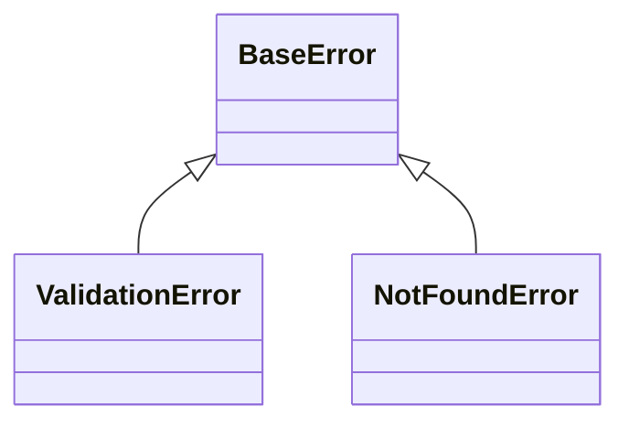

# Stage 13: Error Handling Documentation

Generate documentation of error handling patterns, error types, and troubleshooting guides.

## Prerequisites

- Stage 12 completed with decisions.md generated
- Mode: `{REPOIX_MODE}` (if "cli", convert MCP calls per AGENTS.md)
- Discovery cache loaded: LIMITS, PRIMARY_LANGUAGE

## Critical Rules

| Rule | Action |
|------|--------|
| Decisions required | **MUST** verify {wiki_dir}/architecture/decisions.md exists |
| Analyze code | **NEVER** document without analyzing actual code |
| Mermaid only | **MUST** use Mermaid class diagrams (no ASCII) |
| Skip if none | **MAY** skip if no error handling patterns found |

---

{{include:ai-cache-enforcement.md}}

## AI Context Cache: Check Cached Understanding

**[!] MANDATORY: Check cache status FIRST.**

```text
# [!] MANDATORY: Check cache status at stage start
get_understanding_stats(limit=50)

# Recall understanding for paths from stats output
recall_understanding(target="project")

# Use ACTUAL paths from YOUR get_understanding_stats output:
# recall_understanding(target="{path_from_stats}")  # if exists in stats

# IF found AND fresh: Use cached analysis to guide error documentation
# IF not found: Proceed with discovery, then MUST store findings
```

---

**Anti-pattern (DO NOT):**

```text
BaseError
    +-- ValidationError
    +-- NotFoundError
```

**Correct pattern:**



---

## Step 1: Verify Previous Stage

```bash
speckitadv deepwiki-update-state verify-stage --stage=13-errors --wiki-dir={wiki_dir}
```

---

## Step 2: Load Discovery Cache

```bash
speckitadv deepwiki-update-state show --wiki-dir={wiki_dir}
# Extract: LIMITS = discovery_cache.project_size.limits
# Extract: PRIMARY_LANGUAGE = discovery_cache.file_patterns.languages.primary
```

**MCP/CLI conversion (if REPOIX_MODE == "cli"):**

| MCP Call | CLI Equivalent |
|----------|----------------|
| `search_symbols(query="%Error", kind="class")` | `civyk-repoix query search-symbols --query "%Error" --kind class` |
| `get_type_hierarchy(fqn="...", direction="both")` | `civyk-repoix query get-type-hierarchy --fqn "..." --direction both` |
| `search_code(query="throw|raise", is_regex=true)` | `civyk-repoix query search-code --query "throw|raise" --is-regex true` |

---

## Step 3: Search Error Patterns

```text
# Error throwing/raising
search_code(query="throw|raise", is_regex=true, limit=200)
search_code(query="Error|Exception", is_regex=true, limit=200)
search_code(query="log.error|logger.error|console.error", is_regex=true, limit=100)

# Error classes
search_symbols(query="%Error", kind="class", limit=100)
search_symbols(query="%Exception", kind="class", limit=100)

# Try-catch patterns
search_code(query="try|catch|except|finally", is_regex=true, limit=200)

# Language-specific
# Go: search_code(query="if err != nil|errors.New", is_regex=true, limit=100)
# Rust: search_code(query="#\\[error|anyhow::", is_regex=true, limit=50)
# Result/Either: search_code(query="Result<|Either<|Ok\\(|Err\\(", is_regex=true, limit=50)
```

---

## Step 4: Analyze Error Classes (with AI Context Cache)

For each error class:

```text
# FIRST: Check cached understanding for error class file
recall_understanding(target="<error_class_file>")
# IF found AND fresh: Use cached error analysis
# IF not found: Proceed with full analysis below

# Get type hierarchy
get_type_hierarchy(fqn="<base_error>", direction="both", depth=5)

# Find similar errors and duplicate handling patterns
find_similar(fqn="<error_class>", similarity_threshold=0.6, limit=30)
get_duplicate_code(source_only=true, similarity_threshold=0.6, limit=30)

# Get symbol details
get_symbol(fqn="<error_class>")

# Find references
get_references(fqn="<error_class>")

# Get callers
get_callers(fqn="<throwing_method>", depth=3)

# Read implementation (check cache first)
recall_understanding(target="<error_class_file>")
# IF not cached: Read file: <error_class_file>
# [!] NOW CALL store_understanding for the file above
# -> Extract error message templates
# -> Note error codes
# -> Understand context

# Find tests
get_related_files(path="<error_file>", relationship_types=["test"])

# [!] MANDATORY: Store understanding for EACH error file read
store_understanding(
  scope="file",
  target="<error_class_file>",
  purpose="Error handling for <error_type>",
  importance="medium",
  key_points=["<error_codes>", "<message_templates>", "<hierarchy>"],
  gotchas=["<retry_behavior>", "<logging_level>"],
  analysis="<detailed_logic_and_flow_explanation>"
)
```

---

## Step 5: Generate Documentation

**[!] CRITICAL OUTPUT FILE: You MUST write to `{wiki_dir}/errors.md`**

- Do NOT create `issues.md`, `error-handling.md`, or any other filename
- The output MUST be exactly: `{wiki_dir}/errors.md`

Write `{wiki_dir}/errors.md` using this template:

{{include:wiki/errors-template.md}}

**Fill placeholders with:** Error handling summary, Mermaid error hierarchy diagram, error types table, centralized handler patterns, logging levels table, retryable errors table, troubleshooting guide.

---

## Step 6: Complete Stage

```bash
speckitadv deepwiki-update-state stage --stage=13-errors --status=completed --artifacts="{wiki_dir}/errors.md" --wiki-dir={wiki_dir}
```

---

## Output Format

```text
===========================================================
  STAGE COMPLETE: 13-errors

  Generated: {wiki_dir}/errors.md
  Error classes: {count}
  Error patterns: {count}

  AI Cache Efficiency:
    - Files read: <count_read>
    - Files cached (store_understanding): <count_stored>
    - Cache hits (found=true, fresh=true): <count_hits>

  Next: Run {next_command}
===========================================================
```

---

## Edge Cases

| Scenario | Action |
|----------|--------|
| No custom error classes | Document standard error patterns |
| External error codes | Link to external documentation |
| Multiple error patterns | Document each separately |
| Logging-based errors | Focus on log patterns |

---

## Next Stage

Run `{next_command}` - CLI auto-detects current stage and emits next prompt.
