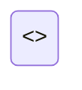

# Error Handling

<<ERROR_HANDLING_SUMMARY>>

---

## Overview

| Attribute | Value |
|-----------|-------|
| **Error Strategy** | <<ERROR_STRATEGY>> |
| **Base Error Class** | <<BASE_ERROR_CLASS>> |
| **Error Codes** | <<ERROR_CODE_FORMAT>> |
| **Logging Level** | <<DEFAULT_LOG_LEVEL>> |

---

## Error Hierarchy

```mermaid
classDiagram
    <<ERROR_HIERARCHY_DIAGRAM>>
```

---

## Error Types Summary

| Error Class | Code | HTTP Status | Description |
|-------------|------|-------------|-------------|
<<ERROR_TYPES_TABLE>>

---

## Error Details

### <<ERROR_1_NAME>>

<<ERROR_1_DESCRIPTION>>

| Attribute | Value |
|-----------|-------|
| **Code** | `<<ERROR_1_CODE>>` |
| **HTTP Status** | <<ERROR_1_HTTP_STATUS>> |
| **Severity** | <<ERROR_1_SEVERITY>> |
| **Retryable** | <<ERROR_1_RETRYABLE>> |

**When Thrown:**

<<ERROR_1_WHEN_THROWN>>

**Example:**

```<<LANGUAGE>>
<<ERROR_1_EXAMPLE>>
```

**Resolution:**

<<ERROR_1_RESOLUTION>>

---

### <<ERROR_2_NAME>>

<<ERROR_2_DESCRIPTION>>

| Attribute | Value |
|-----------|-------|
| **Code** | `<<ERROR_2_CODE>>` |
| **HTTP Status** | <<ERROR_2_HTTP_STATUS>> |
| **Severity** | <<ERROR_2_SEVERITY>> |
| **Retryable** | <<ERROR_2_RETRYABLE>> |

**When Thrown:**

<<ERROR_2_WHEN_THROWN>>

**Example:**

```<<LANGUAGE>>
<<ERROR_2_EXAMPLE>>
```

**Resolution:**

<<ERROR_2_RESOLUTION>>

---

## Error Response Format

### Standard Error Response

```json
{
  "error": {
    "code": "<<ERROR_CODE>>",
    "message": "<<ERROR_MESSAGE>>",
    "details": <<ERROR_DETAILS>>,
    "timestamp": "<<TIMESTAMP>>",
    "requestId": "<<REQUEST_ID>>",
    "path": "<<REQUEST_PATH>>"
  }
}
```

### Validation Error Response

```json
{
  "error": {
    "code": "VALIDATION_ERROR",
    "message": "Validation failed",
    "details": {
      "fields": [
        {
          "field": "<<FIELD_NAME>>",
          "message": "<<FIELD_ERROR>>",
          "code": "<<FIELD_ERROR_CODE>>"
        }
      ]
    }
  }
}
```

---

## Error Handling Patterns

### Pattern 1: Centralized Error Handler

<<CENTRALIZED_HANDLER_DESCRIPTION>>

```<<LANGUAGE>>
<<CENTRALIZED_HANDLER_EXAMPLE>>
```

### Pattern 2: Domain-Specific Errors

<<DOMAIN_ERROR_DESCRIPTION>>

```<<LANGUAGE>>
<<DOMAIN_ERROR_EXAMPLE>>
```

### Pattern 3: Error Boundaries

<<ERROR_BOUNDARY_DESCRIPTION>>

```<<LANGUAGE>>
<<ERROR_BOUNDARY_EXAMPLE>>
```

---

## Error Propagation

### Flow Diagram

```mermaid
flowchart TD
    <<ERROR_PROPAGATION_DIAGRAM>>
```

### Propagation Rules

| Layer | Catches | Transforms | Logs |
|-------|---------|------------|------|
<<ERROR_PROPAGATION_TABLE>>

---

## Logging

### Log Format

```text
<<LOG_FORMAT>>
```

### Log Levels by Error Type

| Error Type | Log Level | Include Stack | Alert |
|------------|-----------|---------------|-------|
<<LOG_LEVELS_TABLE>>

### Structured Logging Fields

| Field | Type | Description |
|-------|------|-------------|
<<LOG_FIELDS_TABLE>>

---

## Retry Strategy

### Retryable Errors

| Error Code | Max Retries | Backoff | Notes |
|------------|-------------|---------|-------|
<<RETRYABLE_ERRORS_TABLE>>

### Retry Configuration

```<<LANGUAGE>>
<<RETRY_CONFIG_EXAMPLE>>
```

---

## Circuit Breaker

### Configuration

| Parameter | Value | Description |
|-----------|-------|-------------|
<<CIRCUIT_BREAKER_TABLE>>

### States



---

## Troubleshooting Guide

### Problem: Application Won't Start

**Symptoms:**
<<STARTUP_ERROR_SYMPTOMS>>

**Common Causes:**
<<STARTUP_ERROR_CAUSES>>

**Resolution Steps:**
<<STARTUP_ERROR_RESOLUTION>>

---

### Problem: Connection Errors

**Symptoms:**
<<CONNECTION_ERROR_SYMPTOMS>>

**Common Causes:**
<<CONNECTION_ERROR_CAUSES>>

**Resolution Steps:**
<<CONNECTION_ERROR_RESOLUTION>>

---

### Problem: Authentication Failures

**Symptoms:**
<<AUTH_ERROR_SYMPTOMS>>

**Common Causes:**
<<AUTH_ERROR_CAUSES>>

**Resolution Steps:**
<<AUTH_ERROR_RESOLUTION>>

---

### Problem: Data Validation Errors

**Symptoms:**
<<VALIDATION_ERROR_SYMPTOMS>>

**Common Causes:**
<<VALIDATION_ERROR_CAUSES>>

**Resolution Steps:**
<<VALIDATION_ERROR_RESOLUTION>>

---

## Monitoring & Alerting

### Key Metrics

| Metric | Threshold | Alert Level |
|--------|-----------|-------------|
<<ERROR_METRICS_TABLE>>

### Dashboard Queries

```<<QUERY_LANGUAGE>>
<<DASHBOARD_QUERIES>>
```

---

## Testing Error Handling

### Unit Test Examples

```<<LANGUAGE>>
<<ERROR_UNIT_TEST>>
```

### Integration Test Examples

```<<LANGUAGE>>
<<ERROR_INTEGRATION_TEST>>
```

---

## See Also

- **Overview**: [Project Overview](overview.md) - Error handling architecture
- **Flows**: [Request Flows](flows/README.md) - Error paths in flows
- **Components**: [Components](components/README.md) - Component error handling
- **API**: [API Reference](api.md) - API error responses
- **Configuration**: [Config Guide](configuration/README.md) - Error configuration
- **Examples**: [Usage Examples](examples.md) - Error handling examples

---

> Generated by [SpecKitAdv DeepWiki](https://github.com/veerabhadra-ponna/spec-kit-adv) | Stage: 13-errors | <<TIMESTAMP>>
