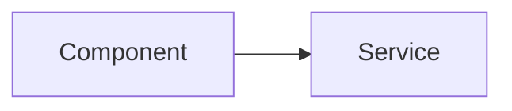

# Stage 12: Design Decisions

Generate documentation of design rationale and architectural decisions by analyzing codebase patterns.

## Prerequisites

- Stage 11 completed with dependencies.md generated
- Mode: `{REPOIX_MODE}` (if "cli", convert MCP calls per AGENTS.md)
- Discovery cache loaded: LIMITS, COMPONENT_SUFFIXES, COMPONENT_PREFIXES

## Critical Rules

| Rule | Action |
|------|--------|
| Dependencies required | **MUST** verify {wiki_dir}/dependencies.md exists |
| Analyze before document | **NEVER** fabricate decisions without codebase evidence |
| Mermaid only | **MUST** use Mermaid syntax (no ASCII diagrams) |
| Pattern search | **MUST** analyze codebase for patterns |

---

{{include:ai-cache-enforcement.md}}

## AI Context Cache: Check Cached Understanding

**[!] MANDATORY: Check cache status FIRST.**

```text
# [!] MANDATORY: Check cache status at stage start
get_understanding_stats(limit=50)

# Recall understanding for paths from stats output
recall_understanding(target="project")

# Use ACTUAL paths from YOUR get_understanding_stats output:
# recall_understanding(target="{path_from_stats}")  # if exists in stats

# IF found AND fresh: Use cached analysis to guide design decisions documentation
# IF not found: Proceed with discovery, then MUST store findings
```

---

**Anti-pattern (DO NOT):**

```text
+-------------+     +-------------+
|  Component  |---->|   Service   |
+-------------+     +-------------+
```

**Correct pattern:**



---

## Step 1: Verify Previous Stage

```bash
speckitadv deepwiki-update-state verify-stage --stage=12-decisions --wiki-dir={wiki_dir}
```

---

## Step 2: Find High-Churn Areas

```text
# Hotspots by file and component
get_hotspots(since="90d", group_by="file", limit=50)
get_hotspots(since="90d", group_by="component", limit=30)

# Recent changes
get_recent_changes(since="30d", include_symbols=true, limit=100)
get_branch_diff(include_symbols=true)
```

---

## Step 3: Identify Architectural Patterns

**Load discovered patterns from discovery_cache:**

```bash
speckitadv deepwiki-update-state show --wiki-dir={wiki_dir}
# Extract: LIMITS = discovery_cache.project_size.limits
# Extract: COMPONENT_SUFFIXES = discovery_cache.file_patterns.component_patterns.suffixes
# Extract: COMPONENT_PREFIXES = discovery_cache.file_patterns.component_patterns.prefixes
```

**MUST search using ALL YOUR discovered COMPONENT_SUFFIXES:**

```text
# MANDATORY: For EACH suffix in YOUR COMPONENT_SUFFIXES, search with %<SUFFIX>:
# Example if COMPONENT_SUFFIXES = ["Service", "Controller", "Repository", "Handler", "Factory"]:
search_symbols(query="%Service", kind="class", limit=LIMITS.symbols)
search_symbols(query="%Controller", kind="class", limit=LIMITS.symbols)
search_symbols(query="%Repository", kind="class", limit=LIMITS.symbols)
search_symbols(query="%Handler", kind="class", limit=LIMITS.symbols)
search_symbols(query="%Factory", kind="class", limit=LIMITS.symbols)
# ... continue for ALL suffixes in YOUR discovered COMPONENT_SUFFIXES
```

**MUST search using ALL YOUR discovered COMPONENT_PREFIXES:**

```text
# MANDATORY: For EACH prefix in YOUR COMPONENT_PREFIXES, search with <PREFIX>%:
# Example if COMPONENT_PREFIXES = ["Base", "Abstract", "I", "Default"]:
search_symbols(query="Base%", kind="class", limit=LIMITS.symbols)
search_symbols(query="Abstract%", kind="class", limit=LIMITS.symbols)
search_symbols(query="I%", kind="interface", limit=LIMITS.symbols)
search_symbols(query="Default%", kind="class", limit=LIMITS.symbols)
# ... continue for ALL prefixes in YOUR discovered COMPONENT_PREFIXES
```

**[!] CRITICAL:** The patterns above are examples. You **MUST** use YOUR actual discovered COMPONENT_SUFFIXES and COMPONENT_PREFIXES from enumerate-index output, not these examples.

**Common design pattern suffixes (search if found in COMPONENT_SUFFIXES):**

```text
# GoF patterns: Factory, Strategy, Observer, Builder, Singleton, Adapter, Decorator, Facade
# Architectural: Controller, Service, Handler, UseCase, Gateway
# Cloud: CircuitBreaker, Retry, Saga
```

**Type analysis:**

```text
get_type_hierarchy(fqn="<base_class>", direction="both", depth=5)
find_similar(fqn="<key_class>", similarity_threshold=0.6, limit=LIMITS.symbols)
```

**Duplicate code analysis (identifies consolidation opportunities):**

```text
get_duplicate_code(similarity_threshold=0.7, source_only=true, limit=50)
# Groups of similar code suggest abstraction candidates or design patterns
```

**Find existing ADRs:**

```text
list_files(pattern="**/docs/adr/**/*.md", limit=50)
list_files(pattern="**/docs/decisions/**/*.md", limit=50)
```

---

## Step 4: Generate Documentation

Write `{wiki_dir}/architecture/decisions.md` using this template:

{{include:wiki/decisions-template.md}}

**Fill placeholders with:** Decisions summary, ADR index table (if existing ADRs found), pattern documentation, technology choices from hotspot analysis, Mermaid architectural diagrams.

---

## Step 5: Complete Stage

```bash
speckitadv deepwiki-update-state stage --stage=12-decisions --status=completed --artifacts="{wiki_dir}/architecture/decisions.md" --wiki-dir={wiki_dir}
```

---

## Output Format

```text
===========================================================
  STAGE COMPLETE: 12-decisions

  Generated: {wiki_dir}/architecture/decisions.md
  Patterns identified: {count}
  Hotspot areas: {count}

  AI Cache Efficiency:
    - Files read: <count_read>
    - Files cached (store_understanding): <count_stored>
    - Cache hits (found=true, fresh=true): <count_hits>

  Next: Run {next_command}
===========================================================
```

---

## Edge Cases

| Scenario | Action |
|----------|--------|
| No ADR directory | Infer decisions from code patterns |
| Existing ADRs found | Summarize and link to originals |
| High churn (>20 changes) | Flag for architectural review |
| Deprecated patterns | Document migration path |

---

## Next Stage

Run `{next_command}` - CLI auto-detects current stage and emits next prompt.
