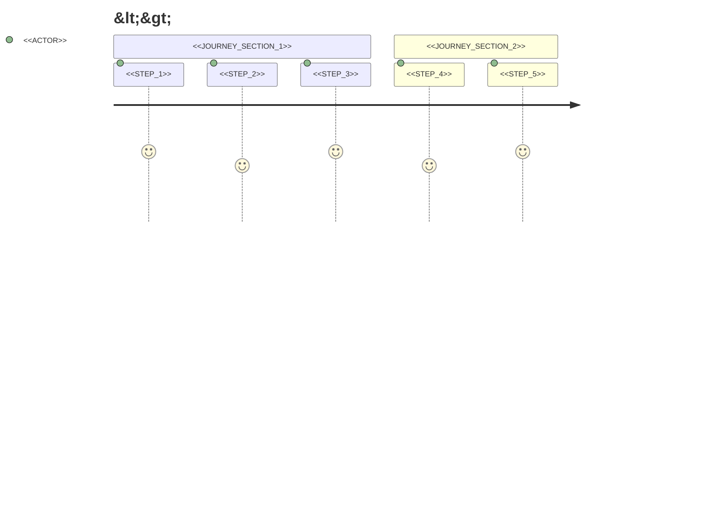

# <<PROJECT_NAME>> Overview

<<PROJECT_SUMMARY>>

---

## At a Glance

| Attribute | Value |
|-----------|-------|
| **Project Type** | <<PROJECT_TYPE>> |
| **Primary Language** | <<PRIMARY_LANGUAGE>> |
| **Framework** | <<FRAMEWORK>> |
| **License** | <<LICENSE>> |
| **Status** | <<STATUS>> |

---

## Business Context

### Problem Statement

<<PROBLEM_STATEMENT>>

### Target Users

| User Type | Description | Key Needs |
|-----------|-------------|-----------|
<<TARGET_USERS_TABLE>>

### Key Features

| Feature | Description | Business Value |
|---------|-------------|----------------|
<<KEY_FEATURES_TABLE>>

---

## Domain Model

### Core Entities

| Entity | Description | Location |
|--------|-------------|----------|
<<DOMAIN_ENTITIES_TABLE>>

### Business Rules

| Rule | Description | Enforced In |
|------|-------------|-------------|
<<BUSINESS_RULES_TABLE>>

### Domain Glossary

| Term | Definition |
|------|------------|
<<DOMAIN_GLOSSARY_TABLE>>

---

## Use Cases

### Primary Use Cases

| Actor | Action | Outcome |
|-------|--------|---------|
<<USE_CASES_TABLE>>

### User Journeys

<<USER_JOURNEYS_DESCRIPTION>>

### Key User Workflow



---

## State Transitions

### Primary Entity States


| State | Description | Valid Transitions |
|-------|-------------|-------------------|
<<STATE_TABLE>>

---

## Technology Stack

### Core Technologies

| Layer | Technology | Version | Purpose |
|-------|------------|---------|---------|
<<TECH_STACK_TABLE>>

### Development Tools

| Tool | Purpose |
|------|---------|
<<DEV_TOOLS_TABLE>>

---

## System Architecture

### Context Diagram (C4 Level 1)

Shows how <<PROJECT_NAME>> fits into the broader system landscape.

```mermaid
C4Context
    title System Context Diagram - <<PROJECT_NAME>>

    <<CONTEXT_DIAGRAM_CONTENT>>
```

### Container Diagram (C4 Level 2)

Shows the high-level technical building blocks.

```mermaid
C4Container
    title Container Diagram - <<PROJECT_NAME>>

    <<CONTAINER_DIAGRAM_CONTENT>>
```

### Component Overview

```mermaid
graph TB
    subgraph "<<PROJECT_NAME>>"
        <<COMPONENT_DIAGRAM_CONTENT>>
    end
```

---

## Component Summary

| Component | Responsibility | Dependencies | Location |
|-----------|----------------|--------------|----------|
<<COMPONENT_SUMMARY_TABLE>>

---

## Data Flow Overview

```mermaid
flowchart LR
    <<DATA_FLOW_DIAGRAM>>
```

<<DATA_FLOW_DESCRIPTION>>

---

## Key Patterns & Principles

### Architecture Patterns

| Pattern | Applied To | Rationale |
|---------|------------|-----------|
<<PATTERNS_TABLE>>

### Design Principles

<<DESIGN_PRINCIPLES>>

---

## Directory Structure

| Directory | Purpose | Documentation |
|-----------|---------|---------------|
<<DIRECTORY_STRUCTURE_TABLE>>

---

## Cross-Cutting Concerns

### Error Handling

<<ERROR_HANDLING_APPROACH>>

### Logging & Observability

<<LOGGING_APPROACH>>

### Security

<<SECURITY_APPROACH>>

### Performance

<<PERFORMANCE_APPROACH>>

---

## Integration Points

### External Services

| Service | Purpose | Protocol | Documentation |
|---------|---------|----------|---------------|
<<EXTERNAL_SERVICES_TABLE>>

### APIs Exposed

| API | Type | Purpose | Documentation |
|-----|------|---------|---------------|
<<APIS_EXPOSED_TABLE>>

---

## Development Guidelines

### Getting Started

See [Quick Start Guide](quickstart.md) for setup instructions.

### Code Style

<<CODE_STYLE_SUMMARY>>

### Testing Strategy

| Test Type | Coverage Target | Framework |
|-----------|-----------------|-----------|
<<TESTING_STRATEGY_TABLE>>

---

## Deployment

### Environments

| Environment | Purpose | URL |
|-------------|---------|-----|
<<ENVIRONMENTS_TABLE>>

### Deployment Flow

```mermaid
flowchart LR
    <<DEPLOYMENT_FLOW_DIAGRAM>>
```

---

## Roadmap & Future Considerations

<<ROADMAP_SUMMARY>>

---

## Related Documentation

| Document | Description |
|----------|-------------|
| [Quick Start](quickstart.md) | Getting started guide |
| [Components](components/README.md) | Detailed component documentation |
| [API Reference](api.md) | API documentation |
| [Configuration](configuration/README.md) | Configuration options |
| [Dependencies](dependencies.md) | Dependency information |
| [Design Decisions](architecture/decisions.md) | Architecture decisions |

---

## See Also

- **Flows**: [Request Flows](flows/README.md) - Detailed request and data flow documentation
- **Components**: [Component Details](components/README.md) - In-depth component documentation
- **API**: [API Reference](api.md) - Complete API endpoint documentation
- **Models**: [Data Models](models.md) - Entity and schema definitions
- **Configuration**: [Config Guide](configuration/README.md) - Environment and runtime configuration
- **Errors**: [Error Handling](errors.md) - Error types and troubleshooting
- **Examples**: [Usage Examples](examples.md) - Code examples and patterns

---

> Generated by [SpecKitAdv DeepWiki](https://github.com/veerabhadra-ponna/spec-kit-adv) | Stage: 04-overview | <<TIMESTAMP>>
