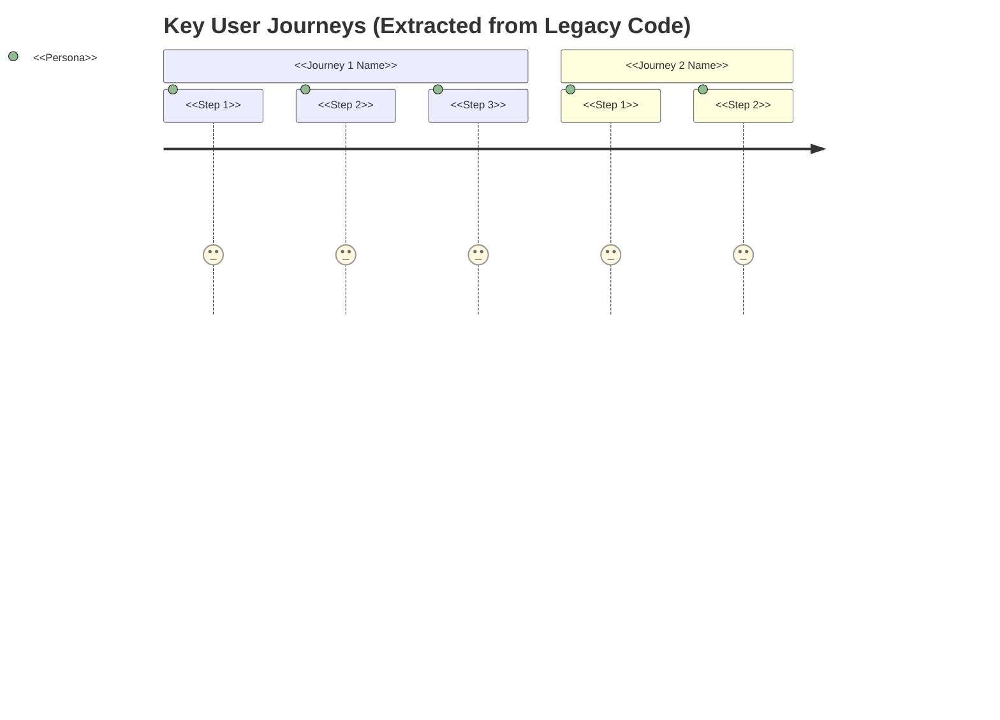
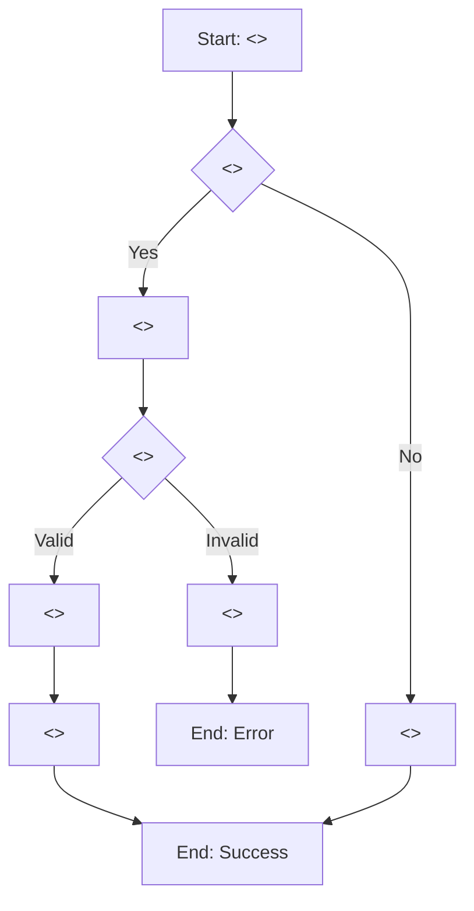
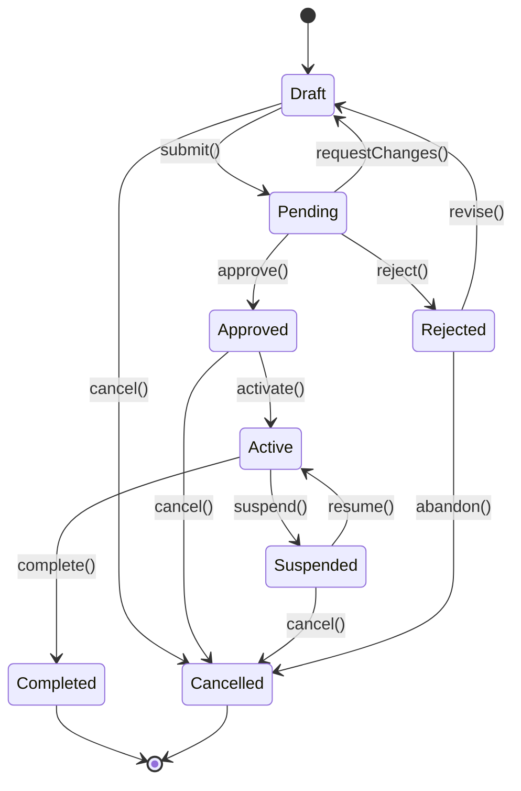
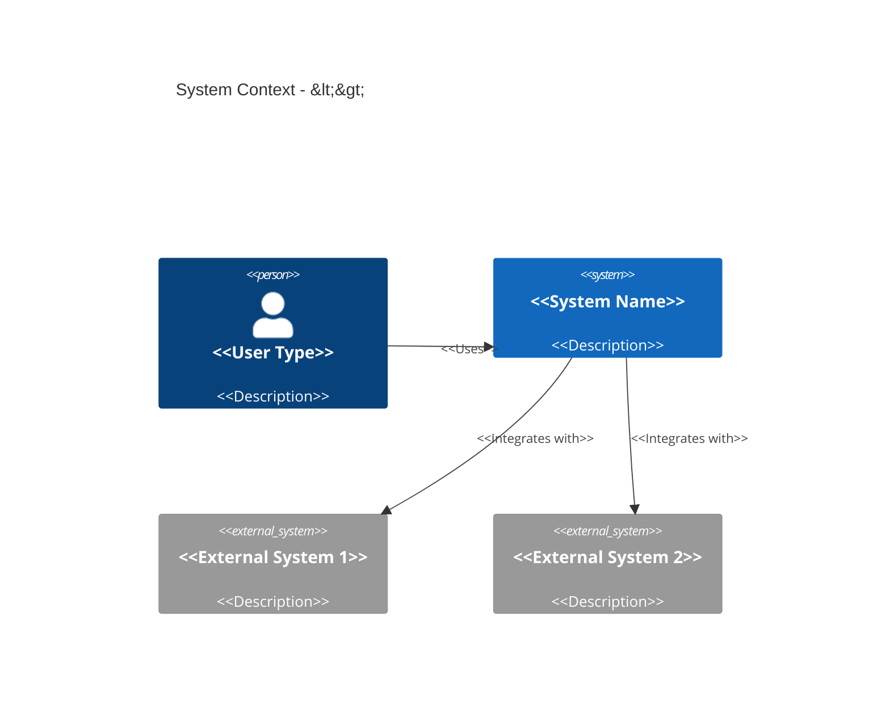

# Functional Specification - Legacy System Analysis

**Project**: <<PROJECT_NAME>>
**Legacy System Version**: <<LEGACY_VERSION>>
**Analysis Date**: <<ANALYSIS_DATE>>
**Analyst**: AI Agent
**Status**: Draft (For Modernization)

---

## Template Usage

This template generates BOTH legacy and target functional specifications:

| Output File | Purpose | Focus |
|-------------|---------|-------|
| `functional-spec-legacy.md` | Documents WHAT the **existing** system does | Extract from code |
| `functional-spec-target.md` | Documents WHAT the **new** system will do | Design intent |

**Section Markers**:

- `[LEGACY ONLY]` - Skip this section when generating target spec
- `[TARGET ONLY]` - Skip this section when generating legacy spec
- `[LEGACY: extract from code]` / `[TARGET: design intent]` - Different focus for same section

**AI Decision**: When you see conditional markers, determine which applies based on:

- Which spec you are currently generating (legacy or target)
- The characteristics of the codebase being analyzed

---

## Instructions for AI

This template is based on **Section A (Business Analysis)** from the Universal Meta-Prompt.
It is adapted for **legacy code analysis** to extract WHAT the system does (not HOW).

**Key Adaptations for Legacy Analysis**:

- Extract information from **actual code**, not imagination
- Every finding must include **Evidence** (file:line references)
- Focus on WHAT (business functionality), not HOW (implementation details)
- Identify **Known Quirks** and **Legacy Behaviors** that may need preservation
- Categorize features by criticality: CRITICAL, STANDARD, LEGACY QUIRKS

**Placeholders to Fill** (based on deep analysis of legacy code):

- `<<PROJECT_NAME>>` - Extract from package.json, pom.xml, README, etc.
- `<<LEGACY_VERSION>>` - Current version from codebase
- `<<ANALYSIS_DATE>>` - Current date (ISO 8601)
- `<<EXTRACT_FEATURES>>` - Scan controllers, routes, services for features
- `<<EXTRACT_PERSONAS>>` - Identify from auth/RBAC/user roles in code
- `<<EXTRACT_JOURNEYS>>` - Map workflows from code paths
- `<<EXTRACT_DATA_MODELS>>` - Parse from DB schemas, migrations, ORMs
- `<<EXTRACT_CONFIG>>` - List all config files and their purposes
- `<<EXTRACT_QUIRKS>>` - Find hardcoded values, workarounds, edge cases

### Critical Focus Areas (Extraction Priority)

Extract in this priority order to ensure critical items are not missed:

#### Priority 1: Business Logic (MOST CRITICAL)

- Extract ALL validation rules with exact thresholds
- Document ALL calculation formulas with precision requirements
- Capture ALL decision trees and conditional logic
- Map ALL state transitions and workflows

#### Priority 2: Data Transformations

- Document ALL field mappings (source -> target)
- Extract ALL data type conversions
- Capture ALL data enrichment logic
- Map ALL aggregation and filtering rules

#### Priority 3: Integration Points

- Document ALL external API calls
- Extract ALL database queries
- Capture ALL message queue interactions
- Map ALL file I/O operations

#### Priority 4: Error Handling

- Document ALL exception types and handling
- Extract ALL retry mechanisms
- Capture ALL fallback strategies
- Map ALL error codes and messages

#### Priority 5: Configuration

- Extract ALL configuration parameters
- Document ALL default values
- Capture ALL environment-specific settings
- Map ALL feature flags

### Output Quality Standards

**Completeness** - Verify each section includes:

- [ ] Every public method/function documented
- [ ] Every configuration parameter extracted
- [ ] Every validation rule captured
- [ ] Every integration point mapped
- [ ] Every error scenario documented

**Accuracy** - Ensure:

- [ ] Algorithm pseudocode matches actual code logic
- [ ] Data types correctly identified
- [ ] Thresholds and limits precisely stated
- [ ] Formulas mathematically correct
- [ ] Configuration values accurate

**Clarity** - Include:

- [ ] Business context provided for technical details
- [ ] Jargon explained or avoided
- [ ] Examples provided for complex logic
- [ ] Diagrams used for visual clarity
- [ ] Tables used for comparisons

**Traceability** - Every item must have:

- [ ] Code references included (class.method or file:line)
- [ ] Configuration file paths specified
- [ ] Test case references for validation

### Conditional Sections

Include these sections ONLY when the codebase exhibits these characteristics:

| Section | Include IF | Skip IF |
|---------|------------|---------|
| Message Formats (16.x) | Event-driven architecture, message queues, Kafka/RabbitMQ | No async messaging |
| Audit Trail (12.x) | Compliance requirements (GDPR, SOX, HIPAA), audit logging | No compliance needs |
| Field Mappings (14.x) | Data migration, ETL, multiple data sources | Single data model |
| Calculation Formulas (6.x) | Financial, scientific, or precision-sensitive calculations | No complex math |

### Example Output Snippets

**Algorithm Documentation Example:**

```text
ALGORITHM: CalculateOrderTotal
PURPOSE: Calculate final order amount including taxes and discounts
INPUT: Order object containing line items, customer, shipping address
OUTPUT: OrderTotal object with subtotal, tax, discount, total

STEP 1: Calculate Subtotal
  subtotal = 0
  FOR each line_item in order.line_items:
    item_total = line_item.quantity * line_item.unit_price
    subtotal = subtotal + item_total

STEP 2: Apply Discounts
  discount_amount = 0
  IF order.customer.loyalty_tier == "GOLD":
    discount_amount = subtotal * 0.10  // 10% discount
  ELSE IF order.customer.loyalty_tier == "SILVER":
    discount_amount = subtotal * 0.05  // 5% discount
  discounted_subtotal = subtotal - discount_amount

STEP 3: Calculate Tax
  tax_rate = get_tax_rate(order.shipping_address.state)
  tax_amount = discounted_subtotal * tax_rate

STEP 4: Calculate Final Total
  final_total = discounted_subtotal + tax_amount + order.shipping_cost

STEP 5: Validation
  IF final_total < 0:
    THROW InvalidOrderException("Order total cannot be negative")

RETURN OrderTotal(subtotal, discount_amount, tax_amount, order.shipping_cost, final_total)
```

**Business Rules Table Example:**

| Rule ID | Condition | Action | Threshold | Source |
|---------|-----------|--------|-----------|--------|
| BR-001 | Customer loyalty tier = GOLD | Apply 10% discount | N/A | OrderService.calculateDiscount():45 |
| BR-002 | Order total > $100 | Free shipping | $100.00 | ShippingService.calculateShipping():78 |
| BR-003 | Payment retry count | Reject transaction | 3 attempts | PaymentProcessor.processPayment():112 |

**Configuration Example:**

| Category | Parameter | Type | Default | Required | Env-Specific | Description |
|----------|-----------|------|---------|----------|--------------|-------------|
| Payment Gateway | payment.gateway.url | String | `https://api.payment.com/v1` | Yes | Yes | Base URL for payment API |
| Payment Gateway | payment.gateway.timeout | Integer (ms) | 30000 | No | No | HTTP timeout for payment calls |
| Payment Gateway | payment.retry.max-attempts | Integer | 3 | No | No | Maximum retry attempts for failed payments |

---

## 1. Executive Summary

**WHAT**: <<1-2 sentences describing what the legacy system does>>

**WHO**: <<Primary user types/personas extracted from code>>

**WHY**: <<Business purpose derived from functionality analysis>>

**TOP 3 CAPABILITIES**:

1. <<Most important feature from code analysis>>
2. <<Second most important feature>>
3. <<Third most important feature>>

**Evidence**: Analysis of <<N>> files across <<M>> directories

---

## 2. Current State - Problem & Goals

### Current Business Objectives

Based on analysis of the legacy codebase, the system serves these objectives:

- <<Objective 1>> (Evidence: <<file:line>>)
- <<Objective 2>> (Evidence: <<file:line>>)
- <<Objective 3>> (Evidence: <<file:line>>)

### KPIs/Metrics (Extracted from Code)

| Metric | Current Implementation | Evidence |
| -------- | ---------------------- | ---------- |
| <<Metric name>> | <<How it's tracked>> | <<file:line>> |
| <<Response time>> | <<Hardcoded timeout/config>> | <<file:line>> |
| <<Throughput>> | <<Rate limit/throttle config>> | <<file:line>> |

---

## 3. Personas & User Journeys

### Personas (Extracted from Code)

<<Extract from authentication, authorization, RBAC, user roles>>

| Persona | Evidence | Permissions/Capabilities |
| --------- | ---------- | ------------------------- |
| <<Admin>> | <<auth.js:45-67>> | <<Full access, user management, etc.>> |
| <<User>> | <<auth.js:89-102>> | <<Read/write own data, limited access>> |
| <<Guest>> | <<auth.js:115-120>> | <<Read-only public data>> |

### Top User Journeys (From Code Paths)



**Evidence**:

- Journey 1: <<controller paths, workflow files>>
- Journey 2: <<service methods, state machines>>

---

## 4. Use Cases (Extracted from Code)

### UC-001: <<Use Case Name>>

| Attribute | Value |
|-----------|-------|
| **ID** | UC-001 |
| **Name** | <<Use Case Name>> |
| **Actor(s)** | <<Primary Actor>>, <<Secondary Actor>> |
| **Priority** | CRITICAL / STANDARD |
| **Evidence** | <<file:line>> |

**Preconditions**:

1. <<Precondition 1>>
2. <<Precondition 2>>

**Main Flow (Happy Path)**:

1. Actor <<action 1>>
2. System <<response 1>>
3. Actor <<action 2>>
4. System <<response 2>>
5. System <<final outcome>>

**Alternative Flows**:

| ID | Trigger | Steps | Outcome |
|----|---------|-------|---------|
| AF-1 | <<condition>> | <<steps>> | <<outcome>> |
| AF-2 | <<condition>> | <<steps>> | <<outcome>> |

**Exception Flows**:

| ID | Trigger | Steps | Outcome |
|----|---------|-------|---------|
| EF-1 | <<error condition>> | <<error handling>> | <<recovery/error state>> |
| EF-2 | <<error condition>> | <<error handling>> | <<recovery/error state>> |

**Postconditions**:

1. <<State after successful completion>>
2. <<Data changes made>>

**Business Rules Applied**:

- BR-<<id>>: <<rule reference>>

---

### UC-002: <<Next Use Case>>

<<Repeat structure>>

---

## 5. User Stories (Given-When-Then Format)

### CRITICAL Stories

#### US-CRIT-001: <<Story Title>>

**Evidence**: <<file:line>>
**Priority**: CRITICAL
**Actor**: <<Persona>>

**Story**:
> As a **<<persona>>**,
> I want to **<<action/capability>>**,
> So that **<<business value>>**.

**Acceptance Criteria (Given-When-Then)**:

```gherkin
Scenario: <<Scenario Name>>
  Given <<initial context/state>>
    And <<additional context>>
  When <<action performed>>
    And <<additional action>>
  Then <<expected outcome>>
    And <<additional outcome>>

Scenario: <<Edge Case Scenario>>
  Given <<edge case context>>
  When <<action>>
  Then <<expected behavior>>
```

**Current Implementation**:

- Code location: <<file:line-range>>
- Key logic: <<summary of implementation>>

---

#### US-CRIT-002: <<Next Critical Story>>

<<Repeat structure>>

---

### STANDARD Stories

#### US-STD-001: <<Story Title>>

**Evidence**: <<file:line>>
**Priority**: STANDARD
**Actor**: <<Persona>>

**Story**:
> As a **<<persona>>**,
> I want to **<<action/capability>>**,
> So that **<<business value>>**.

**Acceptance Criteria (Given-When-Then)**:

```gherkin
Scenario: <<Scenario Name>>
  Given <<context>>
  When <<action>>
  Then <<outcome>>
```

**Modernization Opportunity**: <<How this could be improved>>

---

## 6. Business Logic (Algorithms, Rules & Calculations)

[LEGACY: extract from code] / [TARGET: design intent]

- **Legacy spec**: Extract algorithms, rules, and formulas from existing code with file:line references
- **Target spec**: Document intended business logic, preserving critical rules from legacy with enhancements

### 6.1 Core Processing Algorithms

For each major processing method/function, document using this structured format:

#### ALG-001: <<Algorithm Name>>

**Evidence**: <<file:line-range>>
**Category**: <<Validation | Calculation | Authorization | Workflow | Data Processing>>
**Criticality**: <<CRITICAL | STANDARD>>

```text
ALGORITHM: <<MethodName or ProcessName>>
PURPOSE: <<What it does - from comments/method name>>
INPUT: <<Parameter types and descriptions>>
OUTPUT: <<Return type and description>>

STEP 1: <<First operation>>
  <<Detailed logic from code>>
  IF <<condition>>:
    <<action>>
  ELSE:
    <<alternative action>>

STEP 2: <<Second operation>>
  FOR each <<item>> in <<collection>>:
    <<processing logic>>

STEP 3: <<Third operation>>
  <<Calculation or transformation>>

ERROR HANDLING:
  IF <<error condition>>:
    <<error handling logic>>
    RETURN <<error result>>

RETURN <<success result>>
```

**Sub-Algorithms**: Document helper methods called within main algorithm:

- `<<helper_method_1>>`: <<brief description>>
- `<<helper_method_2>>`: <<brief description>>

**Flowchart**:



**Edge Cases**:

| Case | Handling | Evidence |
|------|----------|----------|
| <<edge case 1>> | <<how handled>> | <<file:line>> |
| <<edge case 2>> | <<how handled>> | <<file:line>> |

---

#### ALG-002: <<Next Algorithm>>

<<Repeat structure>>

---

### 6.2 Decision Trees

Extract from complex if/else, switch statements. Document the business reasoning.

#### DT-001: <<Decision Name>>

**Evidence**: <<file:line-range>>
**Decision**: <<What is being decided>>

```text
DECISION: <<What is being decided>>

IF <<condition 1>>:
  THEN <<action 1>>
  BECAUSE <<business reason from comments>>

ELSE IF <<condition 2>>:
  THEN <<action 2>>
  BECAUSE <<business reason>>

ELSE:
  THEN <<default action>>
  BECAUSE <<why this is the default>>
```

**Decision Table**:

| Condition | Action | Business Reason | Evidence |
|-----------|--------|-----------------|----------|
| <<condition 1>> | <<action 1>> | <<why>> | <<file:line>> |
| <<condition 2>> | <<action 2>> | <<why>> | <<file:line>> |
| Default | <<action>> | <<why>> | <<file:line>> |

---

### 6.3 Calculation Formulas

**[CONDITIONAL]** Include this section IF the codebase contains financial, scientific, or precision-sensitive calculations.

Extract from mathematical operations. Document precision requirements.

#### CALC-001: <<Formula Name>>

**Evidence**: <<file:line-range>>
**Purpose**: <<What it calculates>>

**Formula**:

```text
FORMULA: <<Formula Name>>
PURPOSE: <<What it calculates>>

<<variable_1>> = <<expression from code>>
<<variable_2>> = <<expression from code>>
<<result>> = <<final calculation>>

PRECISION: <<decimal places, rounding rules>>
CONSTRAINTS: <<min/max values, domain restrictions>>
```

**Example Calculation**:

| Input | Value | Output | Expected |
|-------|-------|--------|----------|
| <<input 1>> | <<value>> | <<result>> | <<expected>> |
| <<input 2>> | <<value>> | <<result>> | <<expected>> |

---

### 6.4 Business Constants

Extract from enums, constant classes. Document business meaning.

| Constant Name | Value | Usage Context | Business Meaning | Evidence |
|---------------|-------|---------------|------------------|----------|
| <<NAME>> | <<value>> | <<where used>> | <<what it represents>> | <<file:line>> |
| <<NAME>> | <<value>> | <<where used>> | <<what it represents>> | <<file:line>> |

---

### 6.5 Validation Rules

Extract from validation annotations, custom validators.

| Field | Validation Type | Rule | Error Message | Evidence |
|-------|-----------------|------|---------------|----------|
| <<field>> | <<NotNull/Range/Pattern>> | <<constraint>> | <<message>> | <<file:line>> |
| <<field>> | <<NotNull/Range/Pattern>> | <<constraint>> | <<message>> | <<file:line>> |

---

### BL-LEGACY: Legacy Business Logic (Pseudocode Format)

For simpler logic that doesn't require the structured algorithm format:

#### BL-001: <<Business Logic Name>>

**Evidence**: <<file:line-range>>
**Category**: <<Validation | Calculation | Authorization | Workflow | Data Processing>>
**Criticality**: <<CRITICAL | STANDARD>>

**Plain English Description**:
<<Natural language explanation of what this logic does and why>>

**Pseudocode**:

```plaintext
FUNCTION <<function_name>>(<<parameters>>):
    // Validation
    IF <<condition>> THEN
        RAISE Error("<<message>>")
    END IF

    // Core Logic
    SET <<variable>> = <<initial_value>>

    FOR EACH <<item>> IN <<collection>>:
        IF <<condition>> THEN
            <<action>>
        ELSE IF <<other_condition>> THEN
            <<alternative_action>>
        ELSE
            <<default_action>>
        END IF
    END FOR

    // Calculation
    SET <<result>> = <<formula>>

    // Persist
    SAVE <<entity>> TO <<storage>>

    RETURN <<result>>
END FUNCTION
```

---

## 7. State Machines

### SM-001: <<Entity/Process Name>> States

**Evidence**: <<file:line-range>> or <<state management files>>
**Applies To**: <<Entity or Process>>

**State Diagram**:



**State Definitions**:

| State | Description | Entry Conditions | Exit Conditions |
|-------|-------------|------------------|-----------------|
| <<Draft>> | <<Initial state, editable>> | <<Created>> | <<submit, cancel>> |
| <<Pending>> | <<Awaiting approval>> | <<Submitted>> | <<approve, reject, requestChanges>> |
| <<Approved>> | <<Approved, ready for activation>> | <<Approval granted>> | <<activate, cancel>> |
| <<Active>> | <<In use/operation>> | <<Activated>> | <<suspend, complete>> |
| <<Suspended>> | <<Temporarily inactive>> | <<Suspended by admin>> | <<resume, cancel>> |
| <<Completed>> | <<Final successful state>> | <<Process finished>> | <<terminal>> |
| <<Rejected>> | <<Denied, needs revision>> | <<Rejection>> | <<revise, abandon>> |
| <<Cancelled>> | <<Terminated>> | <<Cancellation>> | <<terminal>> |

**Transitions**:

| From | To | Trigger | Guard Condition | Action | Evidence |
|------|-----|---------|-----------------|--------|----------|
| Draft | Pending | submit() | <<validation passes>> | <<notify reviewers>> | <<file:line>> |
| Pending | Approved | approve() | <<has approval authority>> | <<log approval>> | <<file:line>> |
| Pending | Rejected | reject() | <<has rejection authority>> | <<notify owner, log reason>> | <<file:line>> |

**Business Rules for Transitions**:

- BR-<<id>>: <<rule that governs transitions>>

---

### SM-002: <<Next State Machine>>

<<Repeat structure>>

---

## 8. Configuration-Driven Behaviors

### Config Category: <<Category Name>>

**Evidence**: <<config file path>>
**Impact**: <<What behavior is controlled>>

#### CFG-001: <<Configuration Name>>

| Attribute | Value |
|-----------|-------|
| **Config Key** | <<key name>> |
| **Location** | <<file path>> |
| **Type** | <<string/number/boolean/object>> |
| **Default** | <<default value>> |
| **Environment Override** | <<ENV_VAR_NAME>> |

**Behavior Impact**:

| Config Value | Resulting Behavior |
|--------------|-------------------|
| `<<value 1>>` | <<behavior when this value>> |
| `<<value 2>>` | <<behavior when this value>> |
| `<<value 3>>` | <<behavior when this value>> |

**Code Reference**:

```javascript
// Evidence: <<file:line>>
if (config.<<key>> === '<<value>>') {
    // <<resulting behavior>>
}
```

**Dependencies**:

- Depends on: <<other config keys>>
- Affects: <<features/modules>>

---

#### CFG-002: <<Next Configuration>>

<<Repeat structure>>

---

### Feature Flags

| Flag | Purpose | Default | Evidence |
|------|---------|---------|----------|
| <<FLAG_NAME>> | <<what it enables/disables>> | <<on/off>> | <<file:line>> |
| <<FLAG_NAME>> | <<what it enables/disables>> | <<on/off>> | <<file:line>> |

**Flag Behavior Matrix**:

| Flag | ON Behavior | OFF Behavior |
|------|-------------|--------------|
| <<flag>> | <<behavior when enabled>> | <<behavior when disabled>> |

---

## 9. Scope / Out-of-Scope

### In Scope (Features Found in Legacy Code)

| Feature/Capability | Evidence (file:line) | Criticality |
| ------------------- | --------------------- | ------------- |
| <<Feature 1>> | <<path/to/file:123>> | CRITICAL |
| <<Feature 2>> | <<path/to/file:456>> | STANDARD |
| <<Feature 3>> | <<path/to/file:789>> | STANDARD |

### Out of Scope (Not Found in Legacy Code)

| Capability | Rationale |
| ----------- | ----------- |
| <<Feature X>> | No evidence in codebase; may be external/deprecated |
| <<Feature Y>> | Only mentioned in comments, no implementation |

---

## 10. Functional Requirements (Extracted from Legacy Code)

### CRITICAL Features (Must Preserve Exactly)

#### FR-CRIT-001: <<Feature Name>>

- **As a** <<persona from code>>, **the system provides** <<capability extracted from code>>,
  **so that** <<business value inferred from usage>>.
- **Evidence**: <<controller/service/file:line-range>>
- **Current Implementation**:
  - <<Key code logic summary>>
  - <<Important config/constants>>
- **Related Use Case**: UC-<<id>>
- **Related User Story**: US-CRIT-<<id>>
- **Business Logic**: BL-<<id>>
- **State Machine**: SM-<<id>> (if applicable)
- **Configuration**: CFG-<<id>> (if applicable)
- **Acceptance Criteria** (derived from code/tests):
  - AC-1: <<Measurable condition from test or code logic>>
  - AC-2: <<Second condition>>
- **CRITICAL**: This behavior MUST be preserved exactly in modernized system.

#### FR-CRIT-002: <<Next Critical Feature>>

<<Repeat structure>>

### STANDARD Features (Can Modernize Implementation)

#### FR-STD-001: <<Feature Name>>

- **As a** <<persona>>, **the system provides** <<capability>>, **so that** <<value>>.
- **Evidence**: <<file:line>>
- **Current Implementation**: <<Summary>>
- **Related Use Case**: UC-<<id>>
- **Related User Story**: US-STD-<<id>>
- **Modernization Opportunity**: <<How this could be improved in new system>>
- **Acceptance Criteria**:
  - AC-1: <<Condition>>
  - AC-2: <<Condition>>

#### FR-STD-002: <<Next Standard Feature>>

<<Repeat structure>>

### LEGACY QUIRKS (Decide: Preserve or Fix)

#### FR-QUIRK-001: <<Quirk Name>>

- **Current Behavior**: <<Description of unexpected/undocumented behavior>>
- **Evidence**: <<file:line>>
- **Issue**: <<Why this is a quirk (hardcoded, workaround, anti-pattern)>>
- **Decision Needed**:
  - **Option A**: Preserve (for backward compatibility)
  - **Option B**: Fix/modernize (with migration plan)
- **Impact Analysis**: <<What breaks if changed>>

#### FR-QUIRK-002: <<Next Quirk>>

<<Repeat structure>>

---

## 11. Non-Negotiables (Extracted from Code Analysis)

These constraints are derived from code evidence and must be preserved:

1. **<<Non-Negotiable 1>>**
   **Rationale**: <<Why mandatory>>
   **Evidence**: <<file:line>>
   **Example**: <<Actual code snippet or config value>>

2. **<<Non-Negotiable 2>>** (e.g., PII Encryption)
   **Rationale**: All PII must be encrypted at rest
   **Evidence**: <<encryption-middleware.js:45-78>>
   **Example**: Uses AES-256-CBC with custom key derivation

3. **<<Non-Negotiable 3>>** (e.g., Audit Logging)
   **Rationale**: Regulatory compliance (GDPR, SOX)
   **Evidence**: <<audit-logger.js:12-34>>
   **Example**: All transactions logged to immutable audit table

---

## 12. Non-Functional Requirements (Legacy System)

### Performance (Extracted from Config/Code)

| Metric | Current Target | Evidence | Notes |
| -------- | --------------- | ---------- | ------- |
| Response time | p95 < <<X>>ms | <<config.js:23>> | Hardcoded timeout |
| Throughput | <<Y>> req/min | <<rate-limiter.js:45>> | Per-user limit |
| Batch size | <<Z>> records | <<batch-processor.js:67>> | Max batch |

### Availability & Reliability

| Metric | Current Implementation | Evidence |
| -------- | ---------------------- | ---------- |
| Uptime | <<SLA/config>> | <<deploy/config.yaml:12>> |
| Retry logic | <<3 attempts, exp backoff>> | <<http-client.js:89-102>> |
| Circuit breaker | <<Threshold: 5 failures>> | <<circuit-breaker.js:34>> |

### Security (Current Implementation)

| Aspect | Implementation | Evidence |
| -------- | --------------- | ---------- |
| Authentication | <<Session-based, 30min timeout>> | <<auth/session.js:45>> |
| Authorization | <<Role-based (admin/user/guest)>> | <<auth/rbac.js:23-67>> |
| Encryption | <<AES-256-CBC for PII>> | <<crypto/encrypt.js:12>> |
| Input validation | <<Schema-based (Joi)>> | <<validators/input.js:34>> |

### Accessibility, Privacy, Localization

| Aspect | Current State | Evidence |
| -------- | -------------- | ---------- |
| A11y | <<WCAG level/none>> | <<frontend analysis>> |
| Privacy | <<PII masking in logs>> | <<logger.js:56>> |
| I18n | <<EN only / multi-lang>> | <<i18n/locales/>> |

### Audit Trail Requirements

**[CONDITIONAL]** Include this section IF the system has compliance requirements (GDPR, SOX, HIPAA) or audit logging.

Extract from logging statements, audit interceptors.

| Event Type | Audit Fields | Storage | Retention | Evidence |
|------------|--------------|---------|-----------|----------|
| <<event>> | <<fields logged>> | <<where stored>> | <<how long>> | <<file:line>> |
| <<event>> | <<fields logged>> | <<where stored>> | <<how long>> | <<file:line>> |

### Data Quality Checks

**[CONDITIONAL]** Include IF the system has data quality validation.

```text
ALGORITHM: ValidateDataQuality
INPUT: <<data object>>
OUTPUT: <<validation result>>

STEP 1: Completeness Check
  <<Check for required fields>>
  <<Verify no null values where not allowed>>

STEP 2: Accuracy Check
  <<Validate data formats>>
  <<Check value ranges>>
  <<Verify checksums/hashes>>

STEP 3: Consistency Check
  <<Cross-field validations>>
  <<Referential integrity>>

STEP 4: Timeliness Check
  <<Check timestamps>>
  <<Detect stale data>>

RETURN <<validation report>>
```

---

## 13. Error Handling & Recovery

[LEGACY: extract from code] / [TARGET: design intent]

- **Legacy spec**: Extract existing error handling patterns, exception types, and recovery logic from code
- **Target spec**: Design error handling strategy, specifying which legacy patterns to preserve vs. modernize
- **Note**: For HOW to implement (circuit breakers, retry patterns), see technical-spec Section 7 "Resilience Patterns"

### 13.1 Exception Handling Patterns

[LEGACY] Extract from try/catch blocks, error handlers.
[TARGET] Define exception hierarchy and handling strategy.

| Exception Type | Handling Strategy | Retry Logic | Fallback Action | Evidence |
|----------------|-------------------|-------------|-----------------|----------|
| <<ExceptionClass>> | <<Log/Rethrow/Handle>> | <<retry count, backoff>> | <<alternative action>> | <<file:line>> |
| <<ExceptionClass>> | <<Log/Rethrow/Handle>> | <<retry count, backoff>> | <<alternative action>> | <<file:line>> |

---

### 13.2 Error Recovery Algorithms

```text
ALGORITHM: HandleError[<<ErrorType>>]
INPUT: <<error object, context>>
OUTPUT: <<recovery result or escalation>>

STEP 1: Error Classification
  <<Determine error severity and type>>

STEP 2: Retry Strategy
  IF <<retriable error>>:
    FOR attempt = 1 to <<max_retries>>:
      <<Wait with exponential backoff>>
      <<Retry operation>>
      IF <<success>>:
        RETURN <<success result>>

STEP 3: Fallback Mechanism
  IF <<retry failed>>:
    <<Execute fallback logic>>
    RETURN <<degraded result>>

STEP 4: Escalation
  IF <<critical error>>:
    <<Log critical error>>
    <<Notify monitoring system>>
    THROW <<exception>>
```

---

### 13.3 Validation Error Handling

Extract from validation logic.

| Validation Failure | Error Code | Error Message | User Action | Evidence |
|--------------------|------------|---------------|-------------|----------|
| <<validation type>> | <<code>> | <<message>> | <<what user should do>> | <<file:line>> |
| <<validation type>> | <<code>> | <<message>> | <<what user should do>> | <<file:line>> |

---

### 13.4 Error Codes Catalog

| Error Code | Category | Description | Severity | Recovery |
|------------|----------|-------------|----------|----------|
| <<ERR_001>> | <<Validation/System/Integration>> | <<description>> | <<ERROR/WARN/FATAL>> | <<auto/manual/none>> |
| <<ERR_002>> | <<Validation/System/Integration>> | <<description>> | <<ERROR/WARN/FATAL>> | <<auto/manual/none>> |

---

## 14. Data Models (Extracted from DB Schemas)

[LEGACY: extract from code] / [TARGET: design intent]

- **Legacy spec**: Extract data models from existing DB schemas, migrations, ORM mappings
- **Target spec**: Design target data model, documenting migration strategy from legacy
- **Note**: For HOW to migrate data, see technical-spec Section 12 "Data & Schema"

### Core Entities

#### Entity: <<EntityName>> (e.g., User)

**Evidence**: <<migrations/001_create_users.sql>> or <<models/User.js>>

| Field | Type | Constraints | PII | Notes |
| ------- | ------ | ------------- | ----- | ------- |
| id | UUID | PRIMARY KEY | No | Auto-generated |
| email | VARCHAR(255) | UNIQUE, NOT NULL | Yes | Encrypted |
| password_hash | VARCHAR(255) | NOT NULL | Yes | bcrypt |
| role | ENUM | admin/user/guest | No | Default: user |
| created_at | TIMESTAMP | NOT NULL | No | Auto |

**Relationships**:

- Has many: <<RelatedEntity>> (<<foreign_key_field>>)
- Belongs to: <<ParentEntity>> (<<foreign_key_field>>)

**Evidence**: <<schema.sql:45-78>> or <<ORM model file>>

#### Entity: <<NextEntityName>>

<<Repeat structure>>

---

### 14.2 Field Mappings

**[CONDITIONAL]** Include this section IF the system has data migration, ETL, or multiple data sources.

Extract from mapper classes, transformation logic.

| Source Field | Source Type | Target Field | Target Type | Transformation Rule | Evidence |
|--------------|-------------|--------------|-------------|---------------------|----------|
| <<input>> | <<type>> | <<output>> | <<type>> | <<conversion logic>> | <<file:line>> |
| <<input>> | <<type>> | <<output>> | <<type>> | <<conversion logic>> | <<file:line>> |

### Data Transformation Algorithms

```text
ALGORITHM: Transform<<SourceType>>To<<TargetType>>
INPUT: <<source object>>
OUTPUT: <<target object>>

STEP 1: Field Extraction
  <<Extract each field with null handling>>

STEP 2: Type Conversion
  <<Convert types with error handling>>

STEP 3: Validation
  <<Apply validation rules>>

STEP 4: Enrichment
  <<Add calculated/derived fields>>

RETURN <<transformed object>>
```

---

### 14.3 Data Validation Rules

Extract from validation annotations, custom validators.

| Entity | Field | Validation Type | Rule | Error Message | Evidence |
|--------|-------|-----------------|------|---------------|----------|
| <<Entity>> | <<field>> | <<NotNull/Range/Pattern>> | <<constraint>> | <<message>> | <<file:line>> |
| <<Entity>> | <<field>> | <<Custom>> | <<constraint>> | <<message>> | <<file:line>> |

---

## 15. Configuration Mapping (All Config Files)

| Config File | Purpose | Key Settings | Migration Strategy |
| ------------- | --------- | -------------- | ------------------- |
| `.env.example` | Env var template | DB_URL, API_KEY, etc. | Keep, update keys |
| `config/app.js` | App settings | PORT, LOG_LEVEL, TIMEOUT | Migrate to env vars |
| `config/database.yml` | DB connection | host, port, credentials | Use connection string |
| `logging.conf` | Log settings | Format, level, output | Modernize to structured logging |
| `nginx.conf` | Reverse proxy | Routing, SSL | Migrate to K8s Ingress/ALB |

**Evidence**: Analysis of <<N>> config files

---

## 16. API Contracts (Extracted from Code)

### REST Endpoints

| Method | Path | Purpose | Auth Required | Request | Response | Evidence |
| -------- | ------ | --------- | -------------- | --------- | ---------- | ---------- |
| GET | `/api/users` | List users | Yes (admin) | Query params | User[] | <<routes/users.js:23>> |
| POST | `/api/users` | Create user | Yes (admin) | UserInput | User | <<routes/users.js:45>> |
| GET | `/api/users/:id` | Get user | Yes | - | User | <<routes/users.js:67>> |
| PUT | `/api/users/:id` | Update user | Yes (self/admin) | UserInput | User | <<routes/users.js:89>> |
| DELETE | `/api/users/:id` | Delete user | Yes (admin) | - | 204 | <<routes/users.js:112>> |

### Request/Response Schemas (Extract from code validators or examples)

<<Paste actual schemas found in code>>

---

## 17. Integration Points (External Systems)

| External System | Purpose | Protocol | Auth Method | Evidence |
| ---------------- | --------- | ---------- | ------------- | ---------- |
| <<Payment Gateway>> | Process payments | REST API | API Key | <<services/payment.js:34>> |
| <<Email Service>> | Send notifications | SMTP | Username/Password | <<services/email.js:56>> |
| <<Analytics>> | Track events | HTTP POST | Bearer token | <<services/analytics.js:78>> |

**Evidence**: Scan for external HTTP calls, SDK usage, message queue producers/consumers

---

### 17.1 Message Formats

**[CONDITIONAL]** Include this section IF the system uses event-driven architecture, message queues (Kafka, RabbitMQ, SQS), or async messaging.

Extract from message producers/consumers.

| Message Type | Format | Schema | Routing Key | Exchange/Topic | Evidence |
|--------------|--------|--------|-------------|----------------|----------|
| <<type>> | <<JSON/XML/Avro>> | <<schema>> | <<key>> | <<exchange>> | <<file:line>> |
| <<type>> | <<JSON/XML/Avro>> | <<schema>> | <<key>> | <<exchange>> | <<file:line>> |

### Database Operations

Extract from repository classes, SQL queries.

| Operation | Query Type | Tables | Indexes Used | Performance Notes | Evidence |
|-----------|------------|--------|--------------|-------------------|----------|
| <<operation>> | <<SELECT/INSERT>> | <<tables>> | <<indexes>> | <<notes>> | <<file:line>> |
| <<operation>> | <<SELECT/INSERT>> | <<tables>> | <<indexes>> | <<notes>> | <<file:line>> |

---

## 18. Known Quirks & Legacy Behaviors

### Quirk 1: <<Name>>

- **Description**: <<What happens>>
- **Evidence**: <<file:line>>
- **Root Cause**: <<Why it exists (workaround, bug, limitation)>>
- **Impact**: <<Who is affected, when>>
- **Related State Machine**: SM-<<id>> (if applicable)
- **Related Config**: CFG-<<id>> (if applicable)
- **Decision Needed**: Preserve or fix in modernization?

### Quirk 2: <<Name>>

<<Repeat>>

---

## 19. Risks, Assumptions, Decisions (RAD)

### Risks (Identified from Code Analysis)

| Risk | Evidence | Impact | Mitigation |
| ------ | ---------- | -------- | ------------ |
| <<Missing input validation>> | <<file:line>> | HIGH | Add validation layer |
| <<Hardcoded credentials>> | <<file:line>> | CRITICAL | Move to secrets manager |
| <<Race condition in concurrent writes>> | <<file:line>> | MEDIUM | Add locking mechanism |

### Assumptions (Made During Analysis)

1. <<Assumption 1>>: <<Description>> (Unable to verify from code; needs user confirmation)
2. <<Assumption 2>>: <<Description>>

### Decisions Needed

1. **<<Decision 1>>**: Should we preserve <<legacy quirk X>>?
   **Options**: A) Preserve, B) Fix
   **Owner**: User
   **Deadline**: Before modernization begins

---

## 20. Value / Business Case (Legacy System)

### Current Value Delivered

Based on code analysis, the legacy system delivers:

- <<Value 1>>: <<Quantify if possible (N users, M transactions/day)>>
- <<Value 2>>: <<Business capability>>
- <<Value 3>>: <<Cost savings/revenue>>

### Modernization Drivers

Why modernize (inferred from code analysis):

1. **Technical Debt**: <<Language version EOL, framework outdated, etc.>>
2. **Performance Issues**: <<Identified bottlenecks from code>>
3. **Security Risks**: <<Vulnerabilities found>>
4. **Scalability Limits**: <<Architecture constraints>>

---

## 21. Traceability Matrix

### Requirements to Evidence

| Requirement | Use Case | User Story | Business Logic | State Machine | Error Handling | Config | Evidence |
|-------------|----------|------------|----------------|---------------|----------------|--------|----------|
| FR-CRIT-001 | UC-001 | US-CRIT-001 | BL-001 | SM-001 | ERR-001 | CFG-001 | <<file:line>> |
| FR-CRIT-002 | UC-002 | US-CRIT-002 | BL-002 | - | ERR-002 | - | <<file:line>> |
| FR-STD-001 | UC-003 | US-STD-001 | BL-003 | - | - | CFG-002 | <<file:line>> |

### Validation Checklists Cross-Reference

| Checklist | Purpose | When to Use |
|-----------|---------|-------------|
| Section 23 | Business Logic Preservation | Before starting modernization |
| Section 24 | Output Validation | Before stakeholder handoff |

---

## 22. Next Steps

1. **User Review**: Validate extracted features, use cases, and quirks with stakeholders
2. **Decision Points**: Resolve all "Decision Needed" items in FR-QUIRK sections
3. **Clarifications**: Address assumptions that couldn't be verified from code
4. **State Machine Validation**: Confirm state transitions match expected behavior
5. **Configuration Review**: Verify all config-driven behaviors are documented
6. **Modernization Planning**: Use this spec as input to technical-spec-target.md

---

## 23. Business Logic Preservation Checklist

[LEGACY ONLY] This section applies when documenting the legacy/existing system.
When generating functional-spec-target.md, SKIP this section or replace with
"Business Logic Implementation Verification" to confirm preserved logic was implemented.

[CRITICAL] This checklist ensures ALL business logic is captured before modernization.

### 23.1 Extraction Completeness

| Category | Extracted | Verified | Evidence |
|----------|-----------|----------|----------|
| Validation Rules | [ ] All field validations documented | [ ] Cross-checked with UI | Section 6.5 |
| Calculation Formulas | [ ] All formulas with precision | [ ] Test cases verified | Section 6.3 |
| Decision Trees | [ ] All branching logic mapped | [ ] Edge cases covered | Section 6.2 |
| Business Constants | [ ] All magic numbers documented | [ ] Sources identified | Section 6.4 |
| State Transitions | [ ] All states and transitions | [ ] Invalid paths documented | Section 10 |
| Error Handling | [ ] All exception patterns | [ ] Recovery logic captured | Section 13 |

### 23.2 Critical Business Rules Verification

For each business rule in Section 6, verify:

- [ ] **Rule ID assigned** (BL-XXX format)
- [ ] **Source code reference** (file:line)
- [ ] **Plain English description** (non-technical stakeholder readable)
- [ ] **Pseudocode/algorithm** (developer implementable)
- [ ] **Edge cases documented** (boundary conditions)
- [ ] **Error behavior specified** (what happens on invalid input)

### 23.3 Data Transformation Verification

For each data transformation:

- [ ] **Source format documented** (input structure)
- [ ] **Target format documented** (output structure)
- [ ] **Transformation rules captured** (mapping logic)
- [ ] **Null/empty handling specified**
- [ ] **Type conversions documented**
- [ ] **Precision requirements noted** (decimal places, rounding)

### 23.4 Integration Logic Verification

For each integration point:

- [ ] **Protocol documented** (REST, SOAP, file, queue)
- [ ] **Message format captured** (request/response schemas)
- [ ] **Error handling documented** (retry, timeout, fallback)
- [ ] **Authentication method noted**
- [ ] **Rate limits/throttling documented**

---

## 24. Output Validation Checklist

[LEGACY: verify extraction] / [TARGET: verify design]

- **Legacy spec**: Verify all business logic was extracted from code with evidence
- **Target spec**: Verify design covers all preserved logic plus enhancements

Use this checklist to validate specification completeness before handoff.

### 24.1 Document Quality

| Check | Status | Notes |
|-------|--------|-------|
| All sections complete (no TODO/TBD) | [ ] | |
| All placeholders replaced with actual content | [ ] | |
| All cross-references valid | [ ] | |
| All code references verified (file:line exists) | [ ] | |
| All tables properly formatted | [ ] | |
| All diagrams render correctly | [ ] | |

### 24.2 Content Completeness

| Section | Min Items | Actual | Verified |
|---------|-----------|--------|----------|
| Use Cases (Section 4) | 5+ | <<N>> | [ ] |
| User Stories (Section 5) | 10+ | <<N>> | [ ] |
| Business Logic Rules (Section 6) | 10+ | <<N>> | [ ] |
| State Machines (Section 7) | 1+ | <<N>> | [ ] |
| Configuration Behaviors (Section 8) | 5+ | <<N>> | [ ] |
| Functional Requirements (Section 10) | 10+ | <<N>> | [ ] |
| Error Handling Patterns (Section 13) | 5+ | <<N>> | [ ] |
| Integration Points (Section 17) | 1+ | <<N>> | [ ] |

### 24.3 Traceability Validation

- [ ] Every feature has at least one use case
- [ ] Every use case has at least one user story
- [ ] Every business rule has source code evidence
- [ ] Every state machine has transition evidence
- [ ] Traceability matrix (Section 21) is complete

### 24.4 Stakeholder Readiness

- [ ] Executive Summary readable by non-technical stakeholders
- [ ] Business rules understandable by domain experts
- [ ] Technical details sufficient for developers
- [ ] Edge cases documented for QA team
- [ ] Assumptions documented for product owner review

---

## Appendix A: Analysis Metadata

- **Files Analyzed**: <<N>> files
- **Lines of Code**: <<M>> LOC
- **Languages Detected**: <<List>>
- **Frameworks Detected**: <<List>>
- **Database**: <<Type, version>>
- **Analysis Tool**: AI Agent with legacy code analysis capability
- **Analysis Duration**: <<X>> hours/minutes
- **Confidence Level**: <<HIGH/MEDIUM/LOW>> based on code completeness

---

## Appendix B: Glossary

| Term | Definition | Context |
|------|------------|---------|
| <<Term 1>> | <<Definition>> | <<Where used>> |
| <<Term 2>> | <<Definition>> | <<Where used>> |

---

## Appendix C: Reference Diagrams

### System Context Diagram



---

## END OF FUNCTIONAL SPECIFICATION

This document serves as the "WHAT" for the modernization effort.
<!-- Note: This template is used for BOTH functional-spec-legacy.md and functional-spec-target.md -->
<!-- The corresponding technical spec depends on context: -->
<!--   - functional-spec-legacy.md -> technical-spec-legacy.md (current architecture) -->
<!--   - functional-spec-target.md -> technical-spec-target.md (target architecture) -->
For "HOW" (architecture, target stack, migration), see the corresponding technical specification.
