# Technical Specification - Modernization Architecture

**Project**: <<PROJECT_NAME>>
**Legacy Version**: <<LEGACY_VERSION>> -> **Target Version**: <<TARGET_VERSION>>
**Architecture Date**: <<ANALYSIS_DATE>>
**Architect**: AI Agent
**Status**: Draft (Modernization Plan)

---

## Template Usage

This template generates BOTH legacy and target technical specifications:

| Output File | Purpose | Focus |
|-------------|---------|-------|
| `technical-spec-legacy.md` | Documents HOW the **existing** system is built | Current architecture |
| `technical-spec-target.md` | Documents HOW the **new** system will be built | Target architecture |

**Section Markers**:

- `[LEGACY ONLY]` - Skip this section when generating target spec
- `[TARGET ONLY]` - Skip this section when generating legacy spec
- `[LEGACY: current state]` / `[TARGET: target state]` - Different focus for same section

**Cross-Reference**:

- Technical specs reference both functional specs for complete context
- `functional-spec-legacy.md` - WHAT the legacy system does
- `functional-spec-target.md` - WHAT the target system will do

---

## Instructions for AI

This template is based on **Section B (Architecture)** from the Universal Meta-Prompt.
It is adapted for **legacy code modernization** to define HOW to build the new system.

**Key Adaptations for Modernization**:

- Show **Legacy vs. Target** comparison for each section
- Use **user's modernization preferences** from Q1-Q10
- Include **migration path** (not just greenfield)
- Leverage **AI knowledge base** for LTS versions (don't hardcode)
- Use **phase-colored Mermaid** adapted to target infrastructure
- Convert **legacy NFRs to measurable SLO/SLI targets**
- Include **C4 architecture diagrams** at multiple levels
- Document **component dependencies** and **sequence flows**
- Define **resilience patterns** and **data flows**

**Placeholders to Fill** (from user answers + AI knowledge):

- `<<USER_CHOICE_LANGUAGE>>` - From Q1 (e.g., "Java 21 LTS")
- `<<USER_CHOICE_DATABASE>>` - From Q2 (e.g., "PostgreSQL 16 LTS")
- `<<USER_CHOICE_MESSAGE_BUS>>` - From Q3 (e.g., "Apache Kafka")
- `<<USER_CHOICE_PACKAGE_MANAGER>>` - From Q4 (e.g., "Gradle")
- `<<USER_CHOICE_DEPLOYMENT>>` - From Q5 (e.g., "Kubernetes cluster")
- `<<USER_CHOICE_IAC>>` - From Q6 (e.g., "Helm charts")
- `<<USER_CHOICE_CONTAINERIZATION>>` - From Q7 (e.g., "Docker + Kubernetes")
- `<<USER_CHOICE_OBSERVABILITY>>` - From Q8 (e.g., "Prometheus + Grafana")
- `<<USER_CHOICE_SECURITY>>` - From Q9 (e.g., "OAuth 2.0 / OpenID Connect")
- `<<USER_CHOICE_TESTING>>` - From Q10 (e.g., "Unit + Integration + E2E tests")
- `<<LEGACY_PAIN_POINTS>>` - Extract from functional-spec-legacy.md
- `<<LTS_VERSIONS>>` - Query AI knowledge base for latest LTS

### Output Quality Standards

**Technical Accuracy** - Verify each section includes:

- [ ] All architecture decisions justified with rationale
- [ ] All diagrams consistent with text descriptions
- [ ] All technology choices match user preferences (Q1-Q10)
- [ ] All LTS versions verified against current sources
- [ ] All migration paths have rollback strategies

**Completeness** - Verify coverage:

- [ ] Every component from functional spec has corresponding architecture
- [ ] Every NFR from functional spec has SLO/SLI target
- [ ] Every integration point has sequence diagram
- [ ] Every data entity has migration strategy
- [ ] Every risk has mitigation plan

**Consistency** - Verify alignment:

- [ ] Component names match across all diagrams
- [ ] Technology stack consistent throughout
- [ ] Phase assignments (P1-P4) align with functional spec priorities

---

## 1. Architectural Principles

[LEGACY: document current state] / [TARGET: document target state]

- **Legacy spec**: Document principles observed in existing codebase
- **Target spec**: Document principles for the modernized system

### Legacy System Principles (Extracted)

From analysis of the legacy codebase:

1. **<<Principle 1>>** - <<Evidence from code>>
2. **<<Principle 2>>** - <<Evidence from code>>
3. **<<Principle 3>>** - <<Evidence from code>>

### Target System Principles (New + Preserved)

**Preserve from Legacy**:

- [ok] <<Good pattern to keep>> (Evidence: <<file:line>>)

**Add for Modernization**:

- [new] **Simplicity**: Reduce complexity (current: <<N>> layers -> target: <<M>> layers)
- [new] **Evolvability**: Use latest LTS for long-term support
- [new] **Operability**: Cloud-native observability and automation
- [new] **Security**: Modern auth (OAuth 2.0), encryption at rest/transit
- [new] **Cost Awareness**: Right-size resources, use managed services

---

## 2. C4 Architecture Views

### 2.1 System Context Diagram (C4 Level 1)

**Purpose**: Shows how the system fits into its environment

#### Legacy System Context

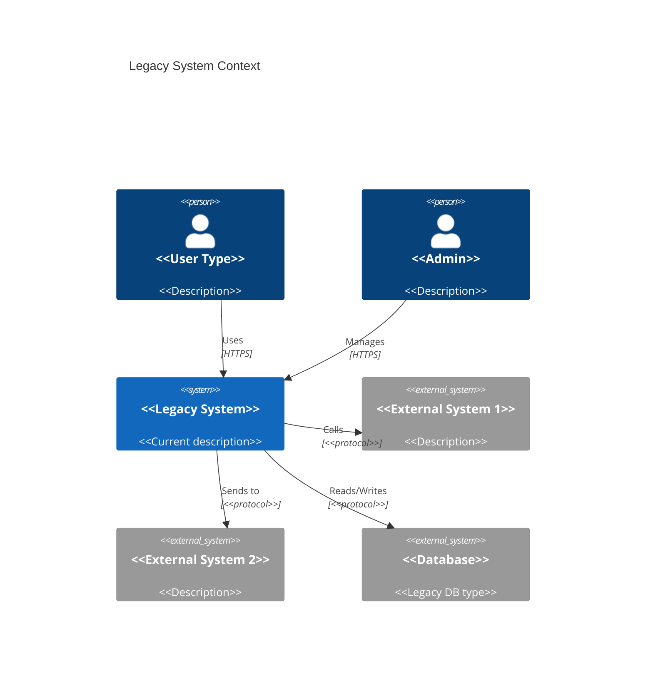

#### Target System Context

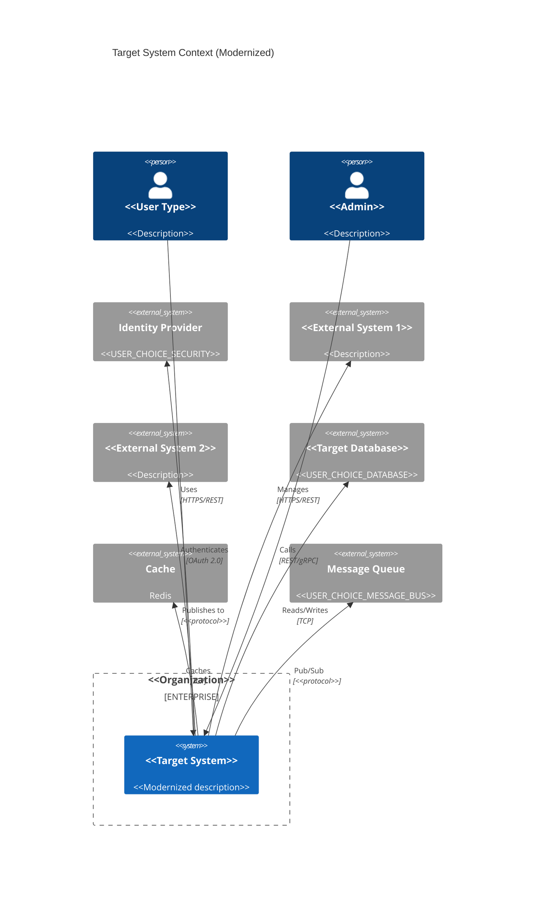

---

### 2.2 Container Diagram (C4 Level 2)

**Purpose**: Shows the high-level shape of the software architecture

#### Legacy Container View

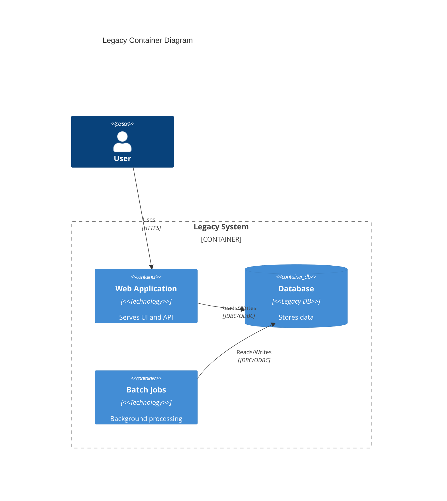

#### Target Container View

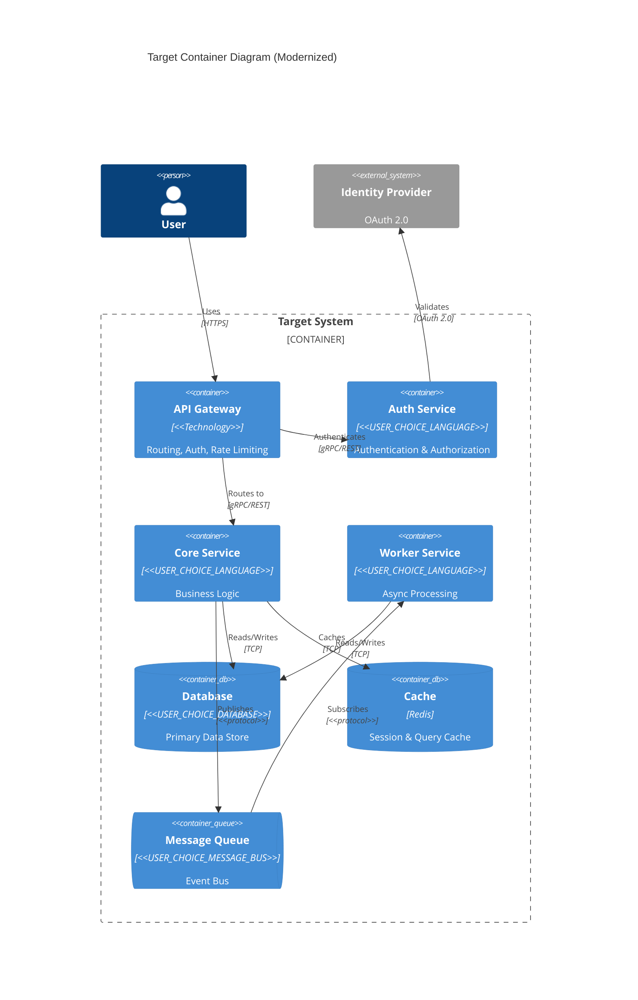

---

### 2.3 Component Diagram (C4 Level 3)

**Purpose**: Shows components within a container

#### Core Service Components

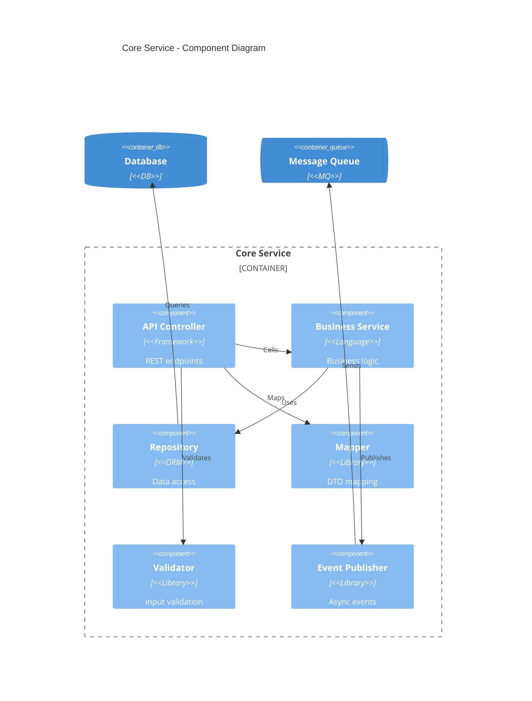

---

## 3. Component Dependency Diagram

### 3.1 Service Dependencies

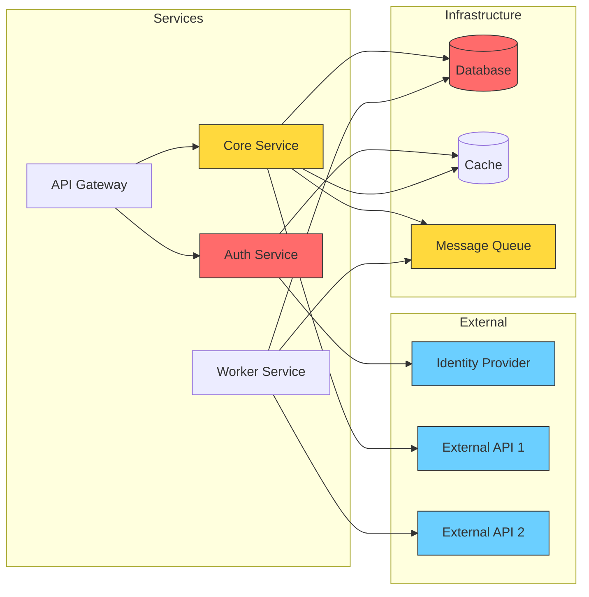

### 3.2 Dependency Matrix

| Component | Depends On | Criticality | Failure Impact |
|-----------|------------|-------------|----------------|
| API Gateway | Auth Service | CRITICAL | All requests fail |
| Auth Service | IDP, Cache | CRITICAL | No authentication |
| Core Service | DB, Cache, MQ | HIGH | Core functionality unavailable |
| Worker Service | MQ, DB | MEDIUM | Async processing delayed |

### 3.3 Module Dependencies (Code Level)

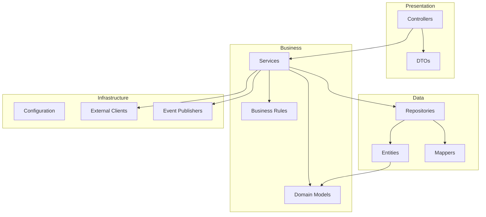

---

## 4. Sequence Diagrams

### 4.1 User Authentication Flow

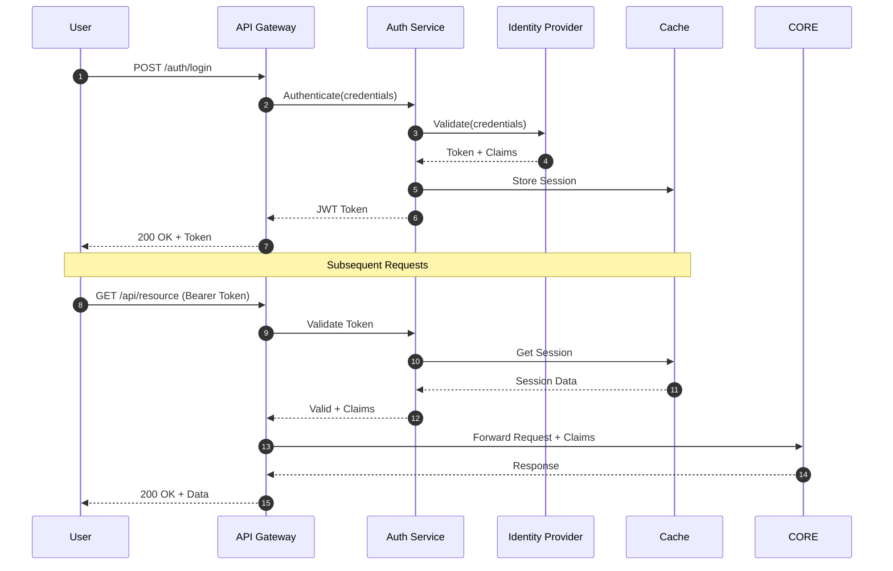

### 4.2 Core Business Flow (Example: <<Use Case Name>>)

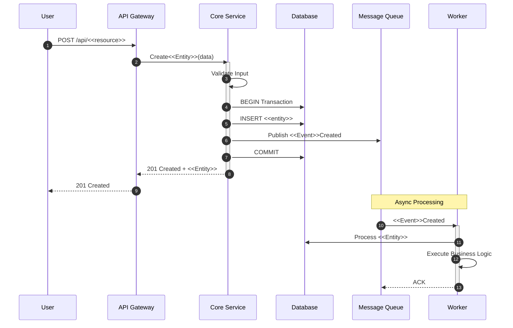

### 4.3 Error Handling Flow

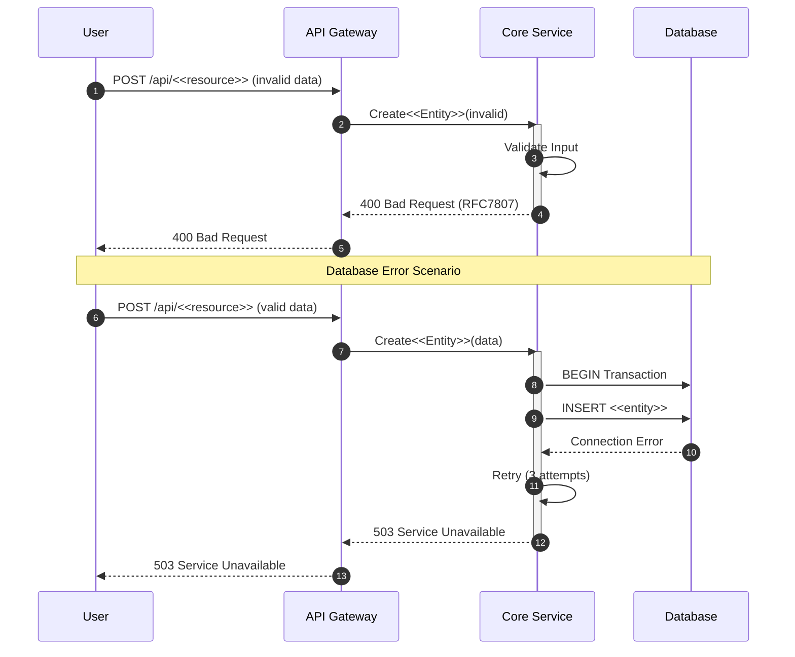

---

## 5. Deployment Architecture

### 5.1 Target Deployment Diagram

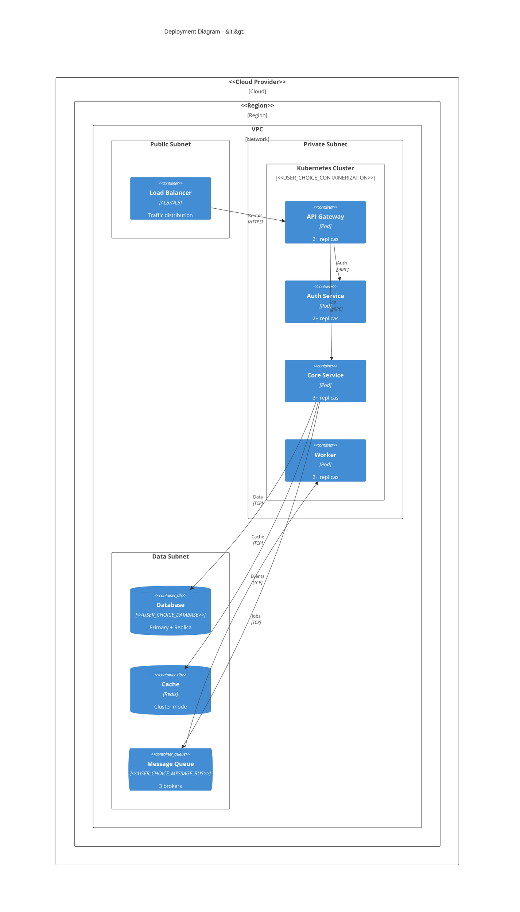

### 5.2 Environment Strategy

| Environment | Purpose | Resources | Scaling |
|-------------|---------|-----------|---------|
| Development | Local development | Minimal (1 replica each) | Manual |
| Staging | Pre-production testing | Reduced (2 replicas) | Manual |
| Production | Live traffic | Full (HPA: 3-10 replicas) | Auto (HPA) |
| DR | Disaster recovery | Standby | Failover |

### 5.3 Kubernetes Deployment Specs

```yaml
# Example HPA configuration
apiVersion: autoscaling/v2
kind: HorizontalPodAutoscaler
metadata:
  name: core-service-hpa
spec:
  scaleTargetRef:
    apiVersion: apps/v1
    kind: Deployment
    name: core-service
  minReplicas: 3
  maxReplicas: 10
  metrics:
  - type: Resource
    resource:
      name: cpu
      target:
        type: Utilization
        averageUtilization: 70
  - type: Resource
    resource:
      name: memory
      target:
        type: Utilization
        averageUtilization: 80
```

---

## 6. Data Flow Diagrams

### 6.1 System Data Flow

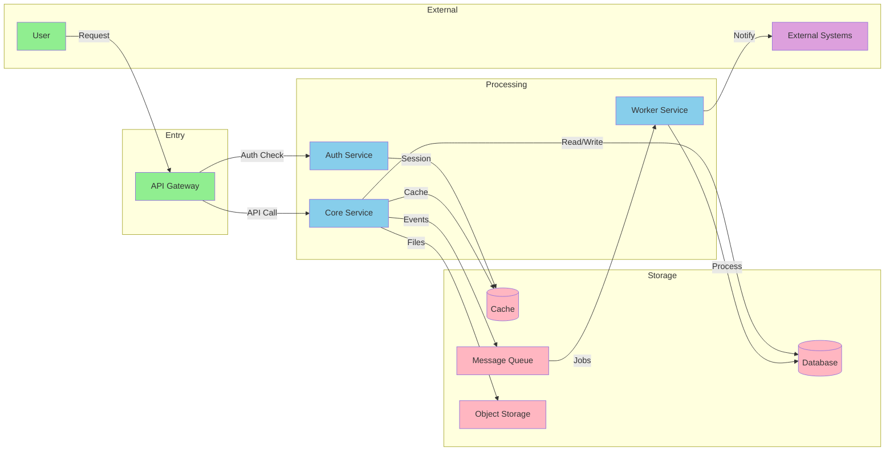

### 6.2 Data Classification & Flow

| Data Type | Classification | Source | Destination | Encryption | Retention |
|-----------|---------------|--------|-------------|------------|-----------|
| User Credentials | PII - CRITICAL | User | Auth Service | TLS + Hash | N/A |
| Session Tokens | Sensitive | Auth | Cache | TLS | 15 min |
| Business Data | Internal | Core | Database | TLS + At Rest | 7 years |
| Audit Logs | Compliance | All | Log Store | TLS | 5 years |
| Analytics | Internal | Events | Analytics | TLS | 2 years |

### 6.3 Data Transformation Pipeline

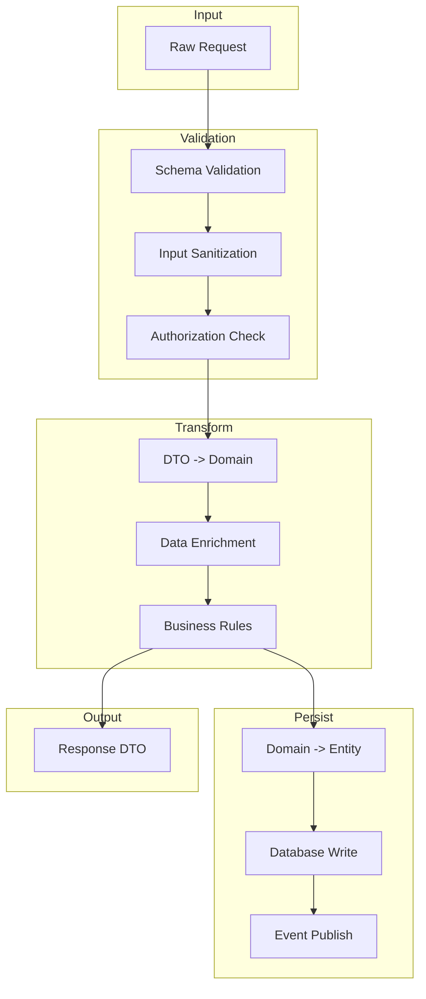

---

## 7. Resilience Patterns

### 7.1 Circuit Breaker Configuration

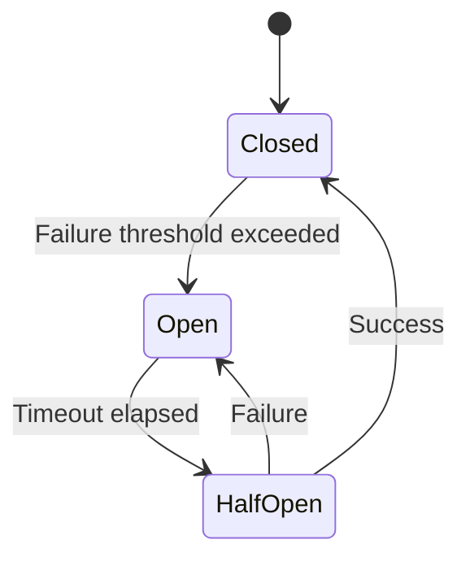

| Circuit | Failure Threshold | Timeout | Half-Open Max |
|---------|------------------|---------|---------------|
| Database | 5 failures in 10s | 30s | 3 requests |
| External API | 3 failures in 5s | 60s | 1 request |
| Cache | 10 failures in 30s | 10s | 5 requests |

### 7.2 Retry Strategy

| Operation | Retries | Backoff | Max Delay | Jitter |
|-----------|---------|---------|-----------|--------|
| Database Read | 3 | Exponential | 10s | +/-20% |
| Database Write | 2 | Exponential | 5s | +/-10% |
| External API | 3 | Exponential | 30s | +/-30% |
| Message Publish | 5 | Fixed 1s | 5s | None |

### 7.3 Fallback Strategies

| Service | Primary | Fallback | Degradation |
|---------|---------|----------|-------------|
| Auth | IDP | Cached Token | Read-only mode |
| Core Data | Database | Cache (stale) | Limited features |
| Search | Elasticsearch | Database | Slow search |
| Notifications | Push | Email queue | Delayed delivery |

### 7.4 Bulkhead Pattern

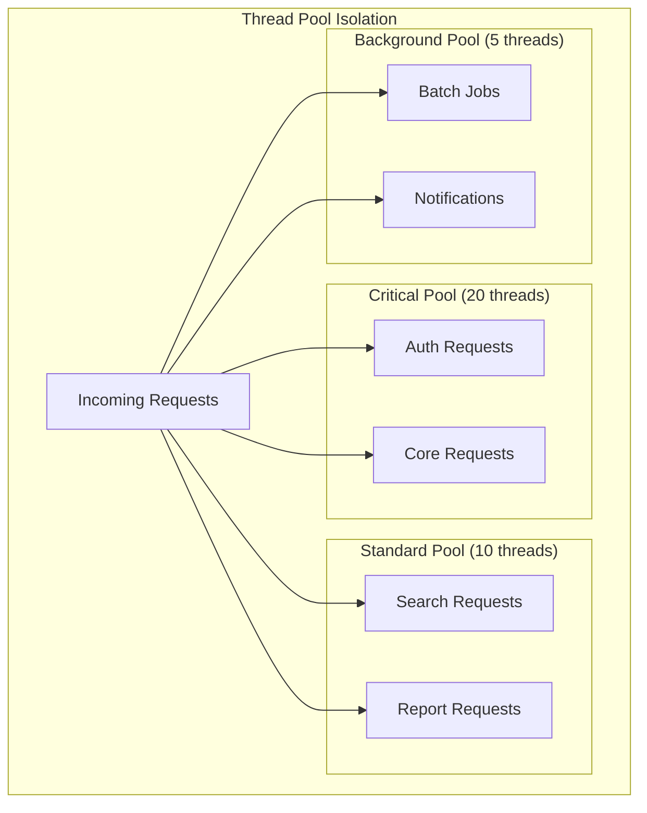

### 7.5 Health Check Strategy

| Check | Type | Interval | Timeout | Threshold |
|-------|------|----------|---------|-----------|
| Liveness | HTTP /health/live | 10s | 5s | 3 failures |
| Readiness | HTTP /health/ready | 5s | 3s | 1 failure |
| Database | TCP connection | 30s | 10s | 2 failures |
| External API | HTTP HEAD | 60s | 10s | 3 failures |

---

## 8. Why This Pattern (Legacy -> Target)

[LEGACY: document current architecture] / [TARGET: document target architecture with rationale]

- **Legacy spec**: Document current architecture patterns and pain points
- **Target spec**: Document chosen patterns and justify decisions with ADRs (Section 20)

### Legacy Architecture Pattern

**Current Pattern**: <<e.g., Monolithic 3-tier>>

**Evidence**:

- <<Directory structure shows monolith>>
- <<All code in single deployment unit>>
- <<Direct DB access from web layer>>

**Pain Points** (from analysis):

1. <<Pain 1>>: <<e.g., Cannot scale components independently>>
2. <<Pain 2>>: <<e.g., Long deployment cycles>>
3. <<Pain 3>>: <<e.g., Technology lock-in>>

### Target Architecture Pattern

**Chosen Pattern**: <<Based on user's deployment choice + best practices>>

**Mapping BA Needs -> Pattern**:

- **Need**: <<from functional-spec-legacy.md>> -> **Pattern**: <<How target pattern addresses it>>
- **Need**: <<Scalability>> -> **Pattern**: <<Microservices with K8s autoscaling>>
- **Need**: <<Faster releases>> -> **Pattern**: <<Independent service deployments>>

**Rationale**:

1. <<Reason 1>>: <<Why this pattern fits>>
2. <<Reason 2>>: <<Based on user's infrastructure choice>>
3. <<Reason 3>>: <<Leverages LTS stack>>

---

## 9. Capabilities by Phase (50/30/15/5)

Map legacy features (from functional-spec-legacy.md) to modernization phases:

| Phase | Scope | Value % | Features (from Legacy) | Risks | Exit Criteria |
| ------- | ------- | --------: | ---------------------- | ------- | --------------- |
| **P1** | Core MVP | 50 | <<CRITICAL features from FR-CRIT-*>> | <<Risk>> | <<Criteria>> |
| **P2** | Extended | 30 | <<STANDARD features from FR-STD-*>> | <<Risk>> | <<Criteria>> |
| **P3** | Enhanced | 15 | <<Nice-to-have features>> | <<Risk>> | <<Criteria>> |
| **P4** | Polish | 5 | <<Optional/future features>> | <<Risk>> | <<Criteria>> |

**P1 Minimum Viable Migration (50% value)**:

- [ok] <<Feature 1 from functional-spec>> (CRITICAL)
- [ok] <<Feature 2 from functional-spec>> (CRITICAL)
- [ok] <<Feature 3 from functional-spec>> (CRITICAL)
- [ok] Data migration for <<core entities>>
- [ok] Auth/security parity with legacy
- **Exit Criteria**: Can replace legacy for <<core workflow>>

**P2 Feature Parity (30% value)**:

- [ok] <<Feature 4-6 from functional-spec>> (STANDARD)
- [ok] Complete data migration
- [ok] <<Integration X>>
- **Exit Criteria**: Full functional parity with legacy

**P3 Modernization Benefits (15% value)**:

- [new] <<New capability enabled by modern stack>>
- [new] <<Performance improvements>>
- [new] <<Observability enhancements>>
- **Exit Criteria**: Demonstrates ROI of modernization

**P4 Future Enhancements (5% value)**:

- [+] <<Future feature>>
- [+] <<Experimental feature>>
- **Exit Criteria**: Foundation for future growth

---

## 10. Component / Service Responsibilities

Map legacy code to modernized components:

### Component: <<Component Name>> (e.g., Auth Service)

**Responsibilities**:

- <<Responsibility 1>>
- <<Responsibility 2>>

**Migrates From** (Legacy):

- <<legacy/src/auth/>> -> <<new/services/auth-service/>>
- <<legacy/src/session/>> -> (Replaced by JWT tokens)

**Technology Stack**:

- Language: <<USER_CHOICE_LANGUAGE>> (from Q1)
- Framework: <<e.g., Spring Boot 3.x for Java, FastAPI for Python>>
- Database: <<USER_CHOICE_DATABASE>> (from Q2)

**P1 Scope**: <<Core functionality>>
**P2 Scope**: <<Extended functionality>>

### Component: <<Next Component>>

<<Repeat>>

---

## 11. Interfaces & Contracts

### API Design

**Legacy**:

- Protocol: <<REST/SOAP/RPC>>
- Auth: <<Session cookies>>
- Versioning: <<None/implicit>>

**Target**:

- Protocol: **REST** (with OpenAPI 3.1 spec)
- Auth: **<<USER_CHOICE_SECURITY>>** (from Q9)
- Versioning: **URI versioning** (`/api/v1/`, `/api/v2/`)
- Rate Limiting: **<<100 req/min per user>>** (from legacy config)
- Idempotency: **Idempotency-Key header** for mutations
- Error Model: **RFC7807** (Problem Details)

### Example Endpoint (Modernized)

| Method | Path | Auth | Request Schema | Response Schema | Errors |
| -------- | ------ | ------ | ---------------- | ----------------- | -------- |
| GET | `/api/v1/users` | Bearer token | - | UserListResponse | 401, 429, 500 |
| POST | `/api/v1/users` | Bearer token | UserInput | User | 400, 401, 409, 429, 500 |

**Schemas**: See functional-spec-legacy.md Section 15 for legacy contracts
**Target Schemas**: <<Update with modern conventions (camelCase, ISO8601, etc.)>>

### Authentication Flow (Target)

**<<USER_CHOICE_SECURITY>>** implementation:

- **Legacy**: Session-based (30min timeout)
- **Target**: OAuth 2.0 Authorization Code Flow with PKCE
- **Token Lifetime**: Access token 15min, Refresh token 7 days
- **Migration**: Dual-mode support during transition

---

## 12. Data & Schema (Legacy -> Target)

[LEGACY: document current schema] / [TARGET: document migration strategy]

- **Legacy spec**: Document current database schema, data types, constraints
- **Target spec**: Document target schema with migration scripts and rollback plan
- **Note**: For WHAT data models exist, see functional-spec Section 14 "Data Models"

### Database Migration

**Legacy Database**: <<Oracle 11g>>
**Target Database**: <<USER_CHOICE_DATABASE>> (from Q2)

### Schema Mapping

#### Entity: <<User>> (Example)

**Legacy Schema** (from functional-spec-legacy.md Section 13):

```sql
-- Oracle 11g
CREATE TABLE users (
  id NUMBER PRIMARY KEY,
  email VARCHAR2(255) UNIQUE NOT NULL,
  password_hash VARCHAR2(255) NOT NULL,
  role VARCHAR2(50) DEFAULT 'user',
  created_at TIMESTAMP DEFAULT CURRENT_TIMESTAMP
);
```

**Target Schema** (PostgreSQL 16):

```sql
-- PostgreSQL 16 LTS
CREATE TABLE users (
  id UUID PRIMARY KEY DEFAULT gen_random_uuid(),
  email VARCHAR(255) UNIQUE NOT NULL,
  password_hash VARCHAR(255) NOT NULL,
  role user_role DEFAULT 'user', -- ENUM type
  created_at TIMESTAMP WITH TIME ZONE DEFAULT CURRENT_TIMESTAMP,
  updated_at TIMESTAMP WITH TIME ZONE DEFAULT CURRENT_TIMESTAMP
);

CREATE TYPE user_role AS ENUM ('admin', 'user', 'guest');
```

**Migration Notes**:

- ID: NUMBER -> UUID (generate mapping table)
- Timestamps: Add timezone awareness
- Role: VARCHAR -> ENUM for type safety
- Add `updated_at` for audit trail

**Migration Tool**: <<pgloader / custom script>>

### Data Migration Strategy

| Phase | Approach | Rollback Plan |
| ------- | ---------- | --------------- |
| P1 | Dual-write (legacy + new) | Stop writing to new, keep legacy |
| P2 | Read from new, fallback to legacy | Switch read back to legacy |
| P3 | Decommission legacy | Restore from backups |

---

## 13. Target Tech Stack (From User Preferences + LTS)

### Summary Table

| Component | Legacy | User Choice | LTS Version | EOL Date | Rationale |
| ----------- | -------- | ------------- | ------------- | ---------- | ----------- |
| Language | <<Java 8>> | <<USER_CHOICE_LANGUAGE>> | <<Java 21 LTS>> | 2028-09 | Latest LTS, performance, features |
| Database | <<Oracle 11g>> | <<USER_CHOICE_DATABASE>> | <<PostgreSQL 16>> | 2028-11 | Open source, JSONB, better perf |
| Message Bus | <<TIBCO EMS>> | <<USER_CHOICE_MESSAGE_BUS>> | <<Kafka 3.x>> | Active | Industry standard, scalable |
| Package Mgr | <<Maven 3.6>> | <<USER_CHOICE_PACKAGE_MANAGER>> | <<Gradle 8.x>> | Active | Faster builds, better caching |
| Deployment | <<VM>> | <<USER_CHOICE_DEPLOYMENT>> | <<Kubernetes 1.28+>> | Active | Cloud-native, auto-scaling |
| IaC | <<Manual>> | <<USER_CHOICE_IAC>> | <<Helm 3.x>> | Active | K8s package manager |
| Container | <<None>> | <<USER_CHOICE_CONTAINERIZATION>> | <<Docker 24.x>> | Active | Consistent environments |
| Observability | <<Logs>> | <<USER_CHOICE_OBSERVABILITY>> | <<Prom 2.x + Grafana>> | Active | Metrics, dashboards, alerts |
| Security (Auth) | <<Sessions>> | <<USER_CHOICE_SECURITY>> | <<OAuth 2.0 / OIDC>> | Standard | Stateless, scalable, secure |
| Testing | <<Unit only>> | <<USER_CHOICE_TESTING>> | <<JUnit 5 + Testcontainers>> | Active | Unit + Integration + E2E |

---

## 14. NFR Targets (Measurable SLO/SLI)

Convert legacy NFRs (from functional-spec-legacy.md Section 12) to measurable targets:

### Performance

| Metric | Legacy | Target | Measurement | SLI |
| -------- | -------- | -------- | ------------- | ----- |
| API Response (p95) | <<1.5s>> | **< 500ms** | Prometheus histogram | 95% of requests < 500ms |
| API Response (p99) | <<3s>> | **< 1s** | Prometheus histogram | 99% of requests < 1s |
| Throughput | <<100 req/min>> | **1000 req/min** | Prometheus counter | Sustained load test |
| DB Query (p95) | <<800ms>> | **< 100ms** | APM tracing | Query optimization + indexing |

**SLO**: 95% of API requests complete in < 500ms (measured weekly)

### Availability

| Metric | Legacy | Target | Measurement |
| -------- | -------- | -------- | ------------- |
| Uptime SLA | <<99%>> | **99.9%** | Uptime monitor (Datadog/Pingdom) |
| Error Rate | <<2%>> | **< 0.1%** | Prometheus error counter |
| MTTR | <<2 hours>> | **< 15 minutes** | Incident tracking |

**SLO**: 99.9% uptime per month (allows 43min downtime)

### Scalability

| Metric | Legacy | Target | Approach |
| -------- | -------- | -------- | ---------- |
| Horizontal Scaling | Manual | **Auto (HPA)** | Kubernetes HPA based on CPU/memory |
| Max Load | <<1000 users>> | **10,000 users** | Load testing + auto-scaling |
| Resource Efficiency | <<50% CPU idle>> | **70-80% utilization** | Right-sizing + auto-scaling |

---

## 15. Operations & SRE

### SLO Table

| Service | SLI | Target SLO | Error Budget (monthly) | Alert Threshold |
| --------- | ----- | ------------ | ---------------------- | ----------------- |
| API | Response time p95 < 500ms | 99.5% | 21 minutes downtime | 98% threshold |
| API | Error rate | < 0.1% | 43 requests | 0.5% spike |
| DB | Query time p95 < 100ms | 99% | 7 hours slow | 95% threshold |

### Runbooks

<<Link to runbook repo or inline key runbooks>>

- **Runbook 001**: High API latency
- **Runbook 002**: Database connection pool exhaustion
- **Runbook 003**: Cache miss storm

### Rollout / Rollback Strategy

**Deployment Strategy**: <<Canary / Blue-Green / Rolling>>

- **P1**: Blue-Green (safe, instant rollback)
- **P2+**: Canary (5% -> 25% -> 50% -> 100%)

**Rollback Triggers**:

- Error rate > 1%
- p95 latency > 2x baseline
- Any P0/P1 incident

**Rollback Time**: <<< 5 minutes>> (automated)

---

## 16. Security & Compliance

### Threat Model

| Threat | Legacy Mitigation | Target Mitigation | Priority |
| -------- | ------------------ | ------------------ | ---------- |
| SQL Injection | <<ORM only>> | **Parameterized queries + ORM** | HIGH |
| XSS | <<Template escaping>> | **CSP + Content escaping** | HIGH |
| CSRF | <<None>> | **SameSite cookies + CSRF tokens** | HIGH |
| Secrets in Code | <<Hardcoded>> | **Secrets Manager (AWS/Azure/Vault)** | CRITICAL |

### Compliance Requirements

From legacy analysis (functional-spec-legacy.md Section 11):

- **GDPR**: PII encryption, right to erasure
- **SOX**: Audit logging, immutability
- **<<Other>>**: <<Requirements>>

**Target Implementation**:

- PII: Encrypt at rest (DB-level encryption)
- Audit: Immutable audit log table + event stream
- Access Controls: RBAC + audit trail

---

## 17. Migration / Expansion Paths

### P1: Minimum Viable Migration

**Approach**: Strangler Fig Pattern

1. **Week 1-2**: Setup infrastructure (<<USER_CHOICE_DEPLOYMENT>>)
2. **Week 3-4**: Deploy auth service (P1)
3. **Week 5-8**: Deploy core service + DB (P1)
4. **Week 9-10**: Dual-write data (legacy + new)
5. **Week 11-12**: Route <<10%>> traffic to new system (canary)

**Exit Criteria**:

- [ok] Core workflow functional
- [ok] Performance meets SLO
- [ok] Zero data loss in dual-write
- [ok] Rollback tested

### P2: Feature Parity

**Approach**: Incremental migration

1. **Month 4**: Migrate <<Feature Set 2>>
2. **Month 5**: Migrate integrations
3. **Month 6**: Route <<50%>> traffic to new

**Exit Criteria**:

- [ok] All features migrated
- [ok] Performance better than legacy
- [ok] User acceptance testing passed

### P3: Modernization Benefits

**Approach**: Leverage new capabilities

1. **Month 7**: Add <<new observability>>
2. **Month 8**: Optimize performance
3. **Month 9**: Route <<100%>> traffic

**Exit Criteria**:

- [ok] Legacy system decommissioned
- [ok] Observability dashboards live
- [ok] Cost savings achieved

---

## 18. Risks & Decisions (RAD)

### Top Risks (Prioritized)

| Risk | Probability | Impact | Mitigation | Owner |
| ------ | ------------ | -------- | ------------ | ------- |
| Data migration corruption | Medium | CRITICAL | Reconciliation + rollback plan | Data Team |
| Performance regression | Medium | HIGH | Load testing + canary rollout | Platform Team |
| Feature gap discovery | High | MEDIUM | Comprehensive functional spec review | Product |
| Team unfamiliarity with new stack | High | MEDIUM | Training + pair programming | Engineering |

### Decisions Required

**D-001**: Preserve legacy quirk <<X>>?

- **Options**: A) Preserve, B) Fix and migrate
- **Recommendation**: <<Based on analysis>>
- **Owner**: Product
- **Deadline**: Before P1 implementation

---

## 19. R->C->T Traceability

Map Requirements (from functional-spec-legacy.md) -> Components -> Tests:

| Requirement ID | Requirement | Component | Test ID | Test Type |
| ---------------- | ------------- | ----------- | --------- | ----------- |
| FR-CRIT-001 | <<Feature name>> | <<Auth Service>> | T-001 | Unit + E2E |
| FR-CRIT-002 | <<Feature name>> | <<Core Service>> | T-002 | Integration |
| FR-STD-001 | <<Feature name>> | <<Integration Service>> | T-003 | E2E |

**Testing Strategy** (from Q10):

- **<<USER_CHOICE_TESTING>>**: <<e.g., Unit + Integration + E2E tests>>
- **Test Coverage Target**: <<85%>> (from legacy: <<current coverage>>%)
- **Test Frameworks**:
  - Unit: <<JUnit 5 / pytest / Jest>>
  - Integration: <<Testcontainers / pytest-docker>>
  - E2E: <<Playwright / Cypress / Selenium>>

---

## 20. Architecture Decision Records (ADR)

[TARGET ONLY] Document key architectural decisions for the modernization.
For legacy systems, document observed patterns without formal ADRs.

### ADR-001: <<Decision Title>>

**Status**: Proposed | Accepted | Deprecated | Superseded

**Context**:
<<What is the issue that we're seeing that is motivating this decision or change?>>

**Decision**:
<<What is the change that we're proposing and/or doing?>>

**Consequences**:

- **Positive**: <<Benefits>>
- **Negative**: <<Trade-offs>>
- **Risks**: <<Potential issues>>

**Alternatives Considered**:

| Option | Pros | Cons | Why Not Chosen |
|--------|------|------|----------------|
| <<Option A>> | <<pros>> | <<cons>> | <<reason>> |
| <<Option B>> | <<pros>> | <<cons>> | <<reason>> |

### ADR Template for Additional Decisions

Repeat the above format for each major decision:

- Database technology choice
- Authentication strategy
- Message queue selection
- Deployment platform
- Microservices vs modular monolith

---

## 21. Infrastructure as Code (IaC)

[TARGET ONLY] Document IaC patterns and configurations for the target system.

### 21.1 IaC Tool Stack

| Component | Tool | Version | Purpose |
|-----------|------|---------|---------|
| Container Orchestration | <<USER_CHOICE_CONTAINERIZATION>> | <<version>> | Container management |
| Infrastructure | <<USER_CHOICE_IAC>> | <<version>> | Resource provisioning |
| Configuration | <<ConfigMgmt tool>> | <<version>> | App configuration |
| Secrets | <<Secrets manager>> | <<version>> | Sensitive data |

### 21.2 Directory Structure

```text
infrastructure/
|-- terraform/           # or pulumi/, cloudformation/
|   |-- modules/
|   |   |-- networking/
|   |   |-- compute/
|   |   |-- database/
|   |   |-- security/
|   |-- environments/
|       |-- dev/
|       |-- staging/
|       |-- production/
|-- kubernetes/          # or helm/
|   |-- base/
|   |-- overlays/
|       |-- dev/
|       |-- staging/
|       |-- production/
|-- scripts/
    |-- deploy.sh
    |-- rollback.sh
```

### 21.3 Environment Parity

| Config | Dev | Staging | Production |
|--------|-----|---------|------------|
| Replicas | 1 | 2 | 3+ (HPA) |
| Resources | Minimal | Reduced | Full |
| Database | Local/Docker | Managed (small) | Managed (HA) |
| Secrets | Local file | Secret Manager | Secret Manager |

---

## 22. CI/CD Pipeline Architecture

[TARGET ONLY] Document the continuous integration and deployment pipelines.

### 22.1 Pipeline Overview

```mermaid
flowchart LR
    subgraph Build
        CHECKOUT[Checkout] --> DEPS[Install Deps]
        DEPS --> LINT[Lint]
        LINT --> TEST[Unit Tests]
        TEST --> BUILD[Build]
        BUILD --> SCAN[Security Scan]
    end

    subgraph Publish
        SCAN --> IMAGE[Build Image]
        IMAGE --> PUSH[Push Registry]
    end

    subgraph Deploy
        PUSH --> DEV[Deploy Dev]
        DEV --> INT_TEST[Integration Tests]
        INT_TEST --> STAGING[Deploy Staging]
        STAGING --> E2E[E2E Tests]
        E2E --> PROD[Deploy Prod]
    end

    PROD --> MONITOR[Monitor]
```

### 22.2 Pipeline Stages

| Stage | Trigger | Actions | Failure Action |
|-------|---------|---------|----------------|
| Build | Push to any branch | Lint, Test, Build | Block merge |
| Security | Push to main | SAST, Dependency scan | Block deploy |
| Deploy Dev | Merge to main | Deploy to dev | Rollback |
| Deploy Staging | Manual / Schedule | Deploy to staging | Rollback |
| Deploy Prod | Manual approval | Canary deploy | Auto-rollback |

### 22.3 Quality Gates

| Gate | Threshold | Action if Failed |
|------|-----------|------------------|
| Unit Test Coverage | >= 80% | Block merge |
| Integration Tests | 100% pass | Block deploy |
| Security Vulnerabilities | 0 Critical, 0 High | Block deploy |
| Performance Regression | < 10% degradation | Alert + review |

### 22.4 Deployment Strategies

| Environment | Strategy | Rollback Time |
|-------------|----------|---------------|
| Dev | Direct deploy | N/A |
| Staging | Blue-Green | Instant |
| Production | Canary (5% -> 25% -> 100%) | < 2 min |

---

## 23. Open Questions & Next Steps

### Open Questions

1. **Q-001**: <<Question needing user input>>
2. **Q-002**: <<Question needing user input>>

### Next Steps

1. **User Review**: Validate target architecture and tech stack
2. **Prototype**: Build P1 MVP spike to validate assumptions
3. **Cost Estimation**: Calculate infra costs for <<USER_CHOICE_DEPLOYMENT>>
4. **Team Training**: Plan upskilling for new stack
5. **Implementation**: Proceed with P1 based on this spec

---

## Appendix A: LTS Version Sources

**Sources for LTS versions** (queried <<ANALYSIS_DATE>>):

- Java: [OpenJDK Roadmap](https://openjdk.org/projects/jdk/)
- PostgreSQL: [Versioning Policy](https://www.postgresql.org/support/versioning/)
- Kubernetes: [Release Schedule](https://kubernetes.io/releases/)
- <<Other>>: <<Source URLs>>

---

## Appendix B: Diagram Legend

| Color/Symbol | Meaning |
|--------------|---------|
| Green (#90EE90) | P1 - Core MVP (50% value) |
| Yellow (#FFD700) | P2 - Extended (30% value) |
| Orange (#FFA500) | P3 - Enhanced (15% value) |
| Gray (#D3D3D3) | P4 - Future (5% value) |
| Red border | Critical path |
| Dashed line | Optional/async |

---

## END OF TECHNICAL SPECIFICATION

This document defines HOW to build the modernized system.
<!-- Note: This template is used for BOTH technical-spec-legacy.md and technical-spec-target.md -->
<!-- Both specs reference both functional specs for complete context: -->
<!--   - functional-spec-legacy.md documents WHAT the legacy system does -->
<!--   - functional-spec-target.md documents WHAT the target system will do -->
For WHAT the system does, see `functional-spec-legacy.md` and `functional-spec-target.md`.
For stage-specific guidance, see `stage-prompts/`.
