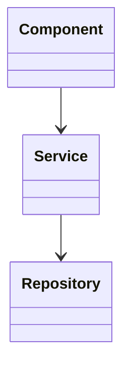

# Stage 7: Component Documentation

Generate detailed documentation for each architectural component including purpose, public API, dependencies, and usage.

## Prerequisites

- Stage 06 completed with flows documented
- Mode: `{REPOIX_MODE}` (if "cli", convert MCP calls per AGENTS.md)
- Discovery cache loaded: LIMITS, COMPONENT_SUFFIXES, COMPONENT_PREFIXES

## Critical Rules

| Rule | Action |
|------|--------|
| Flows required | **MUST** verify {wiki_dir}/flows/README.md exists |
| Component discovery | **MUST** discover at least 1 component |
| Dependencies | **MUST** document cross-component dependencies |
| Mermaid only | **MUST** use Mermaid syntax (no ASCII diagrams) |
| Multi-file output | **MUST** create components/ directory with separate files |

**Anti-pattern (DO NOT):**

```text
+-------------+     +-------------+
|  Component  |---->|   Service   |
+-------------+     +-------------+
```

**Correct pattern:**



---

## Step 1: Verify Previous Stage

```bash
speckitadv deepwiki-update-state verify-stage --stage=07-components --wiki-dir={wiki_dir}
```

---

## Step 2: Load Discovery Cache

```bash
speckitadv deepwiki-update-state show --wiki-dir={wiki_dir}
# Extract: LIMITS = discovery_cache.project_size.limits
# Extract: COMPONENT_SUFFIXES = discovery_cache.file_patterns.component_patterns.suffixes
# Extract: COMPONENT_PREFIXES = discovery_cache.file_patterns.component_patterns.prefixes
```

**MCP/CLI conversion (if REPOIX_MODE == "cli"):**

| MCP Call | CLI Equivalent |
|----------|----------------|
| `get_components()` | `civyk-repoix query get-components` |
| `get_file_symbols(path="...", kinds=["class"])` | `civyk-repoix query get-file-symbols --path "..." --kinds "class"` |
| `get_type_hierarchy(fqn="...", direction="both")` | `civyk-repoix query get-type-hierarchy --fqn "..." --direction both` |

---

{{include:ai-cache-enforcement.md}}

## AI Context Cache: Check Cached Understanding

**[!] MANDATORY: Check cache status FIRST.**

```text
# [!] MANDATORY: Check cache status at stage start
get_understanding_stats(limit=50)

# Recall understanding for paths from stats output
recall_understanding(target="project")

# Use ACTUAL paths from YOUR get_understanding_stats output:
# recall_understanding(target="{path_from_stats}")  # if exists in stats

# IF found AND fresh: Use cached analysis to guide component documentation
# IF not found: Proceed with discovery, then MUST store findings
```

---

## Step 3: Discover Components

```text
# Get all components
get_components()
get_dependencies()
get_api_endpoints(limit=200)

# Architecture context
build_context_pack(task="understand all architectural components", token_budget=2000)

# Development activity
get_hotspots(since="90d", group_by="component", limit=50)
get_recent_changes(since="30d", include_symbols=true, limit=100)
```

---

## Step 4: Document Each Component

For each component:

```text
# FIRST: Check cached understanding for this component/module
recall_understanding(target="<component_path>")
# IF found AND fresh: Use cached analysis, focus on verification only
# IF not found OR stale: Proceed with full analysis below

# Context and dependencies
build_context_pack(task="document <component_name>", component_filter="<component_name>", token_budget=2000)
get_dependencies(component="<component_name>")

# Files and symbols
list_files(path="<component_path>", include_stats=true, limit=100)
get_file_symbols(path="<file>", include_private=true)
get_file_imports(path="<file>")

# Type hierarchy and patterns
get_type_hierarchy(fqn="<class_fqn>", direction="both", depth=5)
find_similar(fqn="<class_fqn>", similarity_threshold=0.5, limit=20)
get_duplicate_code(component="<component_name>", source_only=true, limit=20)

# Usage analysis
get_references(fqn="<main_class_fqn>")
get_callers(fqn="<key_method_fqn>", depth=3)
analyze_impact(fqn="<main_class_fqn>", depth=3, include_tests=true)
get_tests_for(path="<component_file>", include_indirect=true)

# Read key files (check cache first for each)
recall_understanding(target="<main_file>")
# IF not cached: Read file: <main_file>
# [!] NOW CALL store_understanding for the file above
recall_understanding(target="<test_file>")
# IF not cached: Read file: <test_file>
# [!] NOW CALL store_understanding for the file above

# [!] MANDATORY: Store understanding for EACH file read above
store_understanding(
  scope="file",
  target="<main_file>",
  purpose="<main file purpose in component>",
  importance="high",
  key_points=["<classes>", "<public_methods>", "<patterns>"],
  gotchas=["<edge_cases>", "<dependencies>"],
  analysis="<detailed_logic_and_flow_explanation>"
)
store_understanding(
  scope="file",
  target="<test_file>",
  purpose="Tests for <main_file>",
  importance="medium",
  key_points=["<test_coverage>", "<test_patterns>"],
  gotchas=["<missing_coverage>"],
  analysis="<detailed_logic_and_flow_explanation>"
)
# ALSO store module-level understanding
store_understanding(
  scope="module",
  target="<component_path>",
  purpose="<component purpose and responsibilities>",
  importance="high",
  key_points=["<main classes>", "<public API>", "<key patterns>"],
  gotchas=["<edge cases>", "<known issues>"],
  analysis="<component_architecture>: <layers>, <patterns>. <public_api>: <key_methods>. <dependencies>: <imports>.",
  related_to=["<dependent_components>"]
)
```

Extract: purpose, public API, configuration, error handling, usage examples.

---

## Step 5: Write Output

**Required files:**

| File | Content |
|------|---------|
| `{wiki_dir}/components/README.md` | Index with component overview and dependency diagram |
| `{wiki_dir}/components/{component-slug}.md` | Individual component (one per component) |

**Each component file uses this template:**

{{include:wiki/component-template.md}}

**Fill placeholders with:** Component name, summary, purpose, responsibilities, public API (classes, functions, interfaces), dependencies, usage examples, related components.

---

## Step 6: Verification Gate (MANDATORY)

**[STOP: VERIFY_MULTI_FILE_OUTPUT]**

Before completing this stage, you MUST verify:

1. [ ] `{wiki_dir}/components/README.md` exists (index file)
2. [ ] At least 1 individual component file exists: `{wiki_dir}/components/{component-slug}.md`
3. [ ] Each component file contains: summary, public API, dependencies, examples

**FAILURE CONDITIONS:**

- If only README.md exists: FAIL - You MUST create individual component files
- If component files have no content: FAIL - Each file must have real documentation

**Count files in directory:**

```bash
ls {wiki_dir}/components/
```

Expected: README.md + at least 1 component file (e.g., `handlers.md`, `services.md`)

**IF verification fails:** Go back to Step 5 and create the missing individual files.

---

## Step 7: Complete Stage

```bash
speckitadv deepwiki-update-state stage --stage=07-components --status=completed --artifacts="{wiki_dir}/components/README.md,{wiki_dir}/components/{component-1}.md,..." --wiki-dir={wiki_dir}
```

---

## Output Format

```text
===========================================================
  STAGE COMPLETE: 07-components

  Generated: {wiki_dir}/components/
  Components: {count}
  Public symbols: {count}

  AI Cache Efficiency:
    - Files read: <count_read>
    - Files cached (store_understanding): <count_stored>
    - Cache hits (found=true, fresh=true): <count_hits>

  Checkpoint: P1 prompts complete
    - {wiki_dir}/quickstart.md
    - {wiki_dir}/overview.md
    - {wiki_dir}/architecture/diagrams.md
    - {wiki_dir}/flows/
    - {wiki_dir}/components/

  Next: Run {next_command}
===========================================================
```

---

## Edge Cases

| Scenario | Action |
|----------|--------|
| Single component | Document as monolithic structure |
| No public exports | Document internal structure |
| Component filter active | Regenerate only specified component |
| Too many symbols (>100) | Focus on main exports only |

---

## Next Stage

Run `{next_command}` - CLI auto-detects current stage and emits next prompt.
