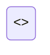

# <<FLOW_NAME>>

<<FLOW_SUMMARY>>

---

## Overview

| Attribute | Value |
|-----------|-------|
| **Type** | <<FLOW_TYPE>> |
| **Trigger** | <<TRIGGER_TYPE>> |
| **Entry Point** | <<ENTRY_POINT>> |
| **Frequency** | <<EXECUTION_FREQUENCY>> |

---

## Trigger

### When This Flow Starts

<<TRIGGER_DESCRIPTION>>

### Trigger Conditions

| Condition | Value | Required |
|-----------|-------|----------|
<<TRIGGER_CONDITIONS_TABLE>>

### Input Data

| Field | Type | Required | Description |
|-------|------|----------|-------------|
<<INPUT_DATA_TABLE>>

---

## Sequence Diagram

```mermaid
sequenceDiagram
    <<SEQUENCE_DIAGRAM_CONTENT>>
```

---

## Flow Diagram

```mermaid
flowchart TD
    <<FLOW_DIAGRAM_CONTENT>>
```

---

## State Machine



---

## Steps

### Step 1: <<STEP_1_NAME>>

<<STEP_1_DESCRIPTION>>

**Key Function**: `<<STEP_1_FUNCTION>>`

**Input**: <<STEP_1_INPUT>>

**Output**: <<STEP_1_OUTPUT>>

---

### Step 2: <<STEP_2_NAME>>

<<STEP_2_DESCRIPTION>>

**Key Function**: `<<STEP_2_FUNCTION>>`

**Input**: <<STEP_2_INPUT>>

**Output**: <<STEP_2_OUTPUT>>

---

### Step 3: <<STEP_3_NAME>>

<<STEP_3_DESCRIPTION>>

**Key Function**: `<<STEP_3_FUNCTION>>`

**Input**: <<STEP_3_INPUT>>

**Output**: <<STEP_3_OUTPUT>>

---

## Key Functions

| Step | Function | File | Responsibility |
|------|----------|------|----------------|
<<FUNCTIONS_TABLE>>

---

## Data Transformations

### Input to Output Mapping

```mermaid
flowchart LR
    <<DATA_TRANSFORMATION_DIAGRAM>>
```

### Transformation Details

| Stage | Input Type | Output Type | Transformation |
|-------|------------|-------------|----------------|
<<TRANSFORMATIONS_TABLE>>

---

## Error Handling

### Error Flow

```mermaid
flowchart TD
    <<ERROR_FLOW_DIAGRAM>>
```

### Error Scenarios

| Error | Cause | Handling | Recovery |
|-------|-------|----------|----------|
<<ERROR_SCENARIOS_TABLE>>

### Retry Strategy

<<RETRY_STRATEGY>>

### Rollback Behavior

<<ROLLBACK_BEHAVIOR>>

---

## Performance

### Timing Expectations

| Step | Expected Duration | Timeout |
|------|-------------------|---------|
<<TIMING_TABLE>>

### Bottlenecks

<<BOTTLENECKS_DESCRIPTION>>

### Optimization Tips

<<OPTIMIZATION_TIPS>>

---

## Monitoring

### Key Metrics

| Metric | Type | Alert Threshold |
|--------|------|-----------------|
<<METRICS_TABLE>>

### Log Points

| Point | Level | Fields Logged |
|-------|-------|---------------|
<<LOG_POINTS_TABLE>>

---

## Testing

### How to Test This Flow

<<TEST_INSTRUCTIONS>>

### Test Scenarios

| Scenario | Input | Expected Output |
|----------|-------|-----------------|
<<TEST_SCENARIOS_TABLE>>

---

## Configuration

| Option | Default | Description |
|--------|---------|-------------|
<<FLOW_CONFIG_TABLE>>

---

## Related Flows

| Flow | Relationship | Trigger |
|------|--------------|---------|
<<RELATED_FLOWS_TABLE>>

---

## See Also

- **Overview**: [Project Overview](../overview.md) - Architecture and design patterns
- **Components**: [Components](../components/README.md) - Component details for this flow
- **API**: [API Reference](../api.md) - Endpoint documentation
- **Models**: [Data Models](../models.md) - Entity definitions used in this flow
- **Configuration**: [Config Guide](../configuration/README.md) - Flow-related configuration
- **Errors**: [Error Handling](../errors.md) - Error types thrown by this flow
- **Examples**: [Usage Examples](../examples.md) - Code examples for this flow

---

> Generated by [SpecKitAdv DeepWiki](https://github.com/veerabhadra-ponna/spec-kit-adv) | Stage: 06-flows | <<TIMESTAMP>>
