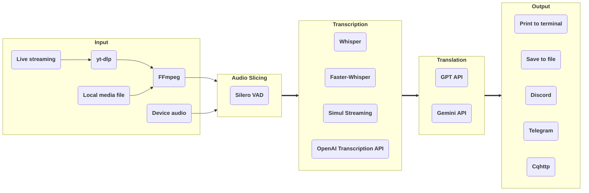

# stream-translator-gpt

[](https://badge.fury.io/py/stream-translator-gpt) [](https://pypi.org/project/stream-translator-gpt/) [](https://pepy.tech/project/stream-translator-gpt) [](https://github.com/ionic-bond/stream-translator-gpt/blob/main/LICENSE) [](https://gradio.app)

English | [中文](./README_CN.md)

stream-translator-gpt is a command-line tool for real-time transcription and translation of live streams. We have now added an easier-to-use WebUI entry point.

Try it on Colab: 

|                                                                                     WebUI                                                                                     |                                                                                       Command Line                                                                                        |
| :---------------------------------------------------------------------------------------------------------------------------------------------------------------------------: | :---------------------------------------------------------------------------------------------------------------------------------------------------------------------------------------: |
| [](https://colab.research.google.com/github/ionic-bond/stream-translator-gpt/blob/main/webui.ipynb) | [](https://colab.research.google.com/github/ionic-bond/stream-translator-gpt/blob/main/stream_translator.ipynb) |

(Due to frequent scraping and theft of API keys, we are unable to provide a trial API key. You need to fill in your own API key.)

## Pipeline



Uses [**yt-dlp**](https://github.com/yt-dlp/yt-dlp) to extract audio data from live streams.

Dynamic threshold audio slicing based on [**Silero-VAD**](https://github.com/snakers4/silero-vad).

Use [**Whisper**](https://github.com/openai/whisper) / [**Faster-Whisper**](https://github.com/SYSTRAN/faster-whisper) /  [**Simul Streaming**](https://github.com/ufal/SimulStreaming) locally or call [**OpenAI Transcription API**](https://platform.openai.com/docs/guides/speech-to-text) remotely for transcription.

Use OpenAI's [**GPT API**](https://platform.openai.com/docs/overview) / Google's [**Gemini API**](https://ai.google.dev/gemini-api/docs) for translation.

Finally, the results can be printed to the terminal, saved to a file, or sent to a group via social media bot.

## Prerequisites

**Linux or Windows:**

1. Python >= 3.8 (Recommend >= 3.10)
2. [**Install CUDA on your system**](https://developer.nvidia.com/cuda-downloads).
3. [**Install cuDNN to your CUDA dir**](https://developer.nvidia.com/cudnn-downloads) if you want to use **Faster-Whisper**.
4. [**Install PyTorch (with CUDA) to your Python**](https://pytorch.org/get-started/locally/).
5. [**Create a Google API key**](https://aistudio.google.com/app/apikey) if you want to use **Gemini API** for translation.
6. [**Create a OpenAI API key**](https://platform.openai.com/api-keys) if you want to use **OpenAI Transcription API** for transcription or **GPT API** for translation.

**If you are in Windows, you also need to:**

1. [**Install and add ffmpeg to your PATH.**](https://www.thewindowsclub.com/how-to-install-ffmpeg-on-windows-10#:~:text=Click%20New%20and%20type%20the,Click%20OK%20to%20apply%20changes.)
2. Install [**yt-dlp**](https://github.com/yt-dlp/yt-dlp) and add it to your PATH.


## WebUI

```
pip install stream-translator-gpt[webui] -U
stream-translator-gpt-webui
```

## Command Line

**Install release version from PyPI:**

```
pip install stream-translator-gpt -U
stream-translator-gpt
```

or

**Clone master version code from Github:**

```
git clone https://github.com/ionic-bond/stream-translator-gpt.git
pip install -r ./stream-translator-gpt/requirements.txt -U
python3 ./stream-translator-gpt/stream_translator_gpt/main.py
```

### Usage

The commands on Colab [](https://colab.research.google.com/github/ionic-bond/stream-translator-gpt/blob/main/stream_translator.ipynb) are the recommended usage, below are some other commonly used options.

- Transcribe live streaming (default use **Whisper**):

    ```stream-translator-gpt {URL} --model large --language {input_language}```

- Transcribe by **Faster-Whisper**:

    ```stream-translator-gpt {URL} --model large --language {input_language} --use_faster_whisper```

- Transcribe by **SimulStreaming**:

    ```stream-translator-gpt {URL} --model large --language {input_language} --use_simul_streaming```

- Transcribe by **SimulStreaming** with **Faster-Whisper** as the encoder:

    ```stream-translator-gpt {URL} --model large --language {input_language} --use_simul_streaming --use_faster_whisper```

- Transcribe by **OpenAI Transcription API**:

    ```stream-translator-gpt {URL} --language {input_language} --use_openai_transcription_api --openai_api_key {your_openai_key}```

- Translate to other language by **Gemini**:

    ```stream-translator-gpt {URL} --model large --language ja --translation_prompt "Translate from Japanese to Chinese" --google_api_key {your_google_key}```

- Translate to other language by **GPT**:

    ```stream-translator-gpt {URL} --model large --language ja --translation_prompt "Translate from Japanese to Chinese" --openai_api_key {your_openai_key}```

- Using **OpenAI Transcription API** and **Gemini** at the same time:

    ```stream-translator-gpt {URL} --language ja --use_openai_transcription_api --openai_api_key {your_openai_key} --translation_prompt "Translate from Japanese to Chinese" --google_api_key {your_google_key}```

- Local video/audio file as input:

    ```stream-translator-gpt /path/to/file --model large --language {input_language}```

- Record system audio as input:

    ```stream-translator-gpt device --model large --language {input_language}```

- Record microphone as input:

    ```stream-translator-gpt device --model large --language {input_language} --mic```

- Sending result to Discord:

    ```stream-translator-gpt {URL} --model large --language {input_language} --discord_webhook_url {your_discord_webhook_url}```

- Sending result to Telegram:

    ```stream-translator-gpt {URL} --model large --language {input_language} --telegram_token {your_telegram_token} --telegram_chat_id {your_telegram_chat_id}```

- Sending result to Cqhttp:

    ```stream-translator-gpt {URL} --model large --language {input_language} --cqhttp_url {your_cqhttp_url} --cqhttp_token {your_cqhttp_token}```

- Saving result to a .srt subtitle file:

    ```stream-translator-gpt {URL} --model large --language ja --translation_prompt "Translate from Japanese to Chinese" --google_api_key {your_google_key} --hide_transcribe_result --retry_if_translation_fails --output_timestamps --output_file_path ./result.srt```

### All options

| Option                                  | Default Value                  | Description                                                                                                                                                                                                        |
| :-------------------------------------- | :----------------------------- | :----------------------------------------------------------------------------------------------------------------------------------------------------------------------------------------------------------------- |
| **Overall Options**                     |
| `--proxy`                               |                                | Used to set the proxy for all --*_proxy flags if they are not specifically set. Also sets http_proxy environment variables.                                                                                        |
| `--openai_api_key`                      |                                | OpenAI API key if using GPT translation / Whisper API. If you have multiple keys, you can separate them with "," and each key will be used in turn.                                                                |
| `--google_api_key`                      |                                | Google API key if using Gemini translation. If you have multiple keys, you can separate them with "," and each key will be used in turn.                                                                           |
| **Input Options**                       |
| `URL`                                   |                                | The URL of the stream. If a local file path is filled in, it will be used as input. If fill in "device", the input will be obtained from your PC device.                                                           |
| `--format`                              | ba/wa*                         | Stream format code, this parameter will be passed directly to yt-dlp. You can get the list of available format codes by `yt-dlp {url} -F`                                                                          |
| `--list_format`                         |                                | Print all available formats then exit.                                                                                                                                                                             |
| `--cookies`                             |                                | Used to open member-only stream, this parameter will be passed directly to yt-dlp.                                                                                                                                 |
| `--input_proxy`                         |                                | Use the specified HTTP/HTTPS/SOCKS proxy for yt-dlp, e.g. http://127.0.0.1:7890.                                                                                                                                   |
| `--device_index`                        |                                | The index of the device that needs to be recorded. If not set, the system default recording device will be used.                                                                                                   |
| `--list_devices`                        |                                | Print all audio devices info then exit.                                                                                                                                                                            |
| `--device_recording_interval`           | 0.5                            | The shorter the recording interval, the lower the latency, but it will increase CPU usage. It is recommended to set it between 0.1 and 1.0.                                                                        |
| **Audio Slicing Options**               |
| `--min_audio_length`                    | 0.5                            | Minimum slice audio length in seconds.                                                                                                                                                                             |
| `--max_audio_length`                    | 30.0                           | Maximum slice audio length in seconds.                                                                                                                                                                             |
| `--target_audio_length`                 | 5.0                            | When dynamic no speech threshold is enabled (enabled by default), the program will slice the audio as close to this length as possible.                                                                            |
| `--continuous_no_speech_threshold`      | 1.0                            | Slice if there is no speech during this number of seconds. If the dynamic no speech threshold is enabled (enabled by default), the actual threshold will be dynamically adjusted based on this value.              |
| `--disable_dynamic_no_speech_threshold` |                                | Set this flag to disable dynamic no speech threshold.                                                                                                                                                              |
| `--prefix_retention_length`             | 0.5                            | The length of the retention prefix audio during slicing.                                                                                                                                                           |
| `--vad_threshold`                       | 0.35                           | Range 0~1. the higher this value, the stricter the speech judgment. If dynamic VAD threshold is enabled (enabled by default), this threshold will be adjusted dynamically based on the input speech's VAD results. |
| `--disable_dynamic_vad_threshold`       |                                | Set this flag to disable dynamic VAD threshold.                                                                                                                                                                    |
| **Transcription Options**               |
| `--model`                               | small                          | Select Whisper/Faster-Whisper/Simul Streaming model size. See [here](https://github.com/openai/whisper#available-models-and-languages) for available models.                                                       |
| `--language`                            | auto                           | Language spoken in the stream. See [here](https://github.com/openai/whisper#available-models-and-languages) for available languages.                                                                               |
| `--use_faster_whisper`                  |                                | Set this flag to use Faster-Whisper instead of Whisper. If used with --use_simul_streaming, SimulStreaming with Faster-Whisper as the encoder will be used.                                                        |
| `--use_simul_streaming`                 |                                | Set this flag to use SimulStreaming instead of Whisper. If used with --use_faster_whisper, SimulStreaming with Faster-Whisper as the encoder will be used.                                                         |
| `--use_openai_transcription_api`        |                                | Set this flag to use OpenAI transcription API instead of the original local Whipser.                                                                                                                               |
| `--transcription_filters`               | emoji_filter,repetition_filter | Filters apply to transcription results, separated by ",". We provide emoji_filter, repetition_filter and japanese_stream_filter.                                                                                   |
| `--transcription_initial_prompt`        |                                | General purpose prompt/glossary for transcription. Format: "Word1, Word2, Word3, ...". This text is always included in the prompt passed to the model.                                                             |
| `--disable_transcription_context`       |                                | Set this flag to disable context (previous sentence) propagation in transcription.                                                                                                                                 |
| **Translation Options**                 |
| `--gpt_model`                           | gpt-5-nano                     | OpenAI's GPT model name, gpt-5 / gpt-5-mini / gpt-5-nano                                                                                                                                                           |
| `--gemini_model`                        | gemini-2.5-flash-lite          | Google's Gemini model name, gemini-2.0-flash / gemini-2.5-flash / gemini-2.5-flash-lite                                                                                                                            |
| `--translation_prompt`                  |                                | If set, will translate the result text to target language via GPT / Gemini API (According to which API key is filled in). Example: "Translate from Japanese to Chinese"                                            |
| `--translation_history_size`            | 0                              | The number of previous messages sent when calling the GPT / Gemini API. If the history size is 0, the translation will be run parallelly. If the history size > 0, the translation will be run serially.           |
| `--translation_timeout`                 | 10                             | If the GPT / Gemini translation exceeds this number of seconds, the translation will be discarded.                                                                                                                 |
| `--openai_base_url`                     |                                | Customize the API endpoint of OpenAI (Affects GPT translation & OpenAI Transcription).                                                                                                                             |
| `--google_base_url`                     |                                | Customize the API endpoint of Google (Affects Gemini translation).                                                                                                                                                 |
| `--processing_proxy`                    |                                | Use the specified HTTP/HTTPS/SOCKS proxy for Whisper/GPT API (Gemini currently doesn't support specifying a proxy within the program), e.g. http://127.0.0.1:7890.                                                 |
| `--use_json_result`                     |                                | Using JSON result in LLM translation for some locally deployed models.                                                                                                                                             |
| `--retry_if_translation_fails`          |                                | Retry when translation times out/fails. Used to generate subtitles offline.                                                                                                                                        |
| **Output Options**                      |
| `--output_timestamps`                   |                                | Output the timestamp of the text when outputting the text.                                                                                                                                                         |
| `--hide_transcribe_result`              |                                | Hide the result of Whisper transcribe.                                                                                                                                                                             |
| `--output_proxy`                        |                                | Use the specified HTTP/HTTPS/SOCKS proxy for Cqhttp/Discord/Telegram, e.g. http://127.0.0.1:7890.                                                                                                                  |
| `--output_file_path`                    |                                | If set, will save the result text to this path.                                                                                                                                                                    |
| `--cqhttp_url`                          |                                | If set, will send the result text to the cqhttp server.                                                                                                                                                            |
| `--cqhttp_token`                        |                                | Token of cqhttp, if it is not set on the server side, it does not need to fill in.                                                                                                                                 |
| `--discord_webhook_url`                 |                                | If set, will send the result text to the discord channel.                                                                                                                                                          |
| `--telegram_token`                      |                                | Token of Telegram bot.                                                                                                                                                                                             |
| `--telegram_chat_id`                    |                                | If set, will send the result text to this Telegram chat. Needs to be used with \"--telegram_token\".                                                                                                               |

## Contact me

Telegram: [@ionic_bond](https://t.me/ionic_bond)

## Donate

[PayPal Donate](https://www.paypal.com/donate/?hosted_button_id=D5DRBK9BL6DUA) or [PayPal](https://paypal.me/ionicbond3)
