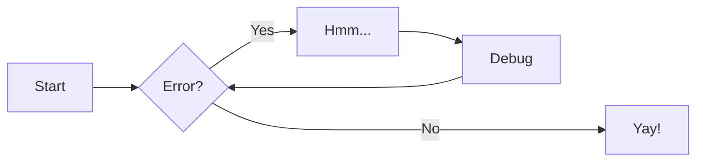

# Contributing to STS

## Getting Started

### Prerequisites

- Python 3.9 or later
- [hatch](https://hatch.pypa.io/) (recommended)
- [pre-commit](https://pre-commit.com/) (required)

### Setup

**Clone repository:**

   ```bash
   git clone git@gitlab.com:rh-kernel-stqe/sts.git
   cd sts
   ```

**Install dependencies:**

   ```bash
   # Recommended: Use hatch
   hatch shell # Creates isolated environment with all dependencies

   # Alternative: Direct pip install
   pip install ruff pyright pre-commit pytest pytest-mock pytest-cov
   ```

**Configure pre-commit:**

   ```bash
   pre-commit install
   ```

**Verify setup:**

   ```bash
   hatch env show # Show the available environments
   ```

## Development Workflow

**Create branch:**

   ```bash
   git checkout main && git pull --rebase origin main
   git checkout -b branch-name
   ```

**Make changes** following our [code standards](#code-standards)
**Test changes:**

   ```bash
   # Note: This step is optional, it will be run in CI pipeline.
   hatch run all      # Format and type check
   hatch run test     # Run unit tests
   ```

**Commit changes** (pre-commit hooks run automatically)

**Submit merge request** with:

```text
- Clear description of changes
- [Conventional Commits](https://www.conventionalcommits.org/en/v1.0.0/) format (recommended but not required)
- Reference to related issues if have
- For example, add 'Co-Authored-By: Claude' or 'Co-Authored-By: Cursor' when AI is used for code creation
```

**Merge Request Requirements**:

```text
- All CI checks pass
- One maintainer approval required
- Test coverage for new functionality
- Updated documentation for API changes
```

📖 See [Writing Tests Guide](contributing/writing-tests.md) for detailed testing instructions.

## Commands

### Development

| Command                | Purpose                               |
|------------------------|---------------------------------------|
| `hatch run format`     | Auto-fix and format code              |
| `hatch run lint`       | Check code style                      |
| `hatch run check`      | Type checking                         |
| `hatch run all`        | Run format + check                    |
| `hatch run test`       | Run unit tests with coverage          |

### Documentation

| Command                | Purpose                               |
|------------------------|---------------------------------------|
| `hatch run docs:build` | Build static documentation            |
| `hatch run docs:serve` | Serve docs at <http://127.0.0.1:8000> |

### Without Hatch

```bash
ruff format && ruff check --fix    # Format and auto-fix
ruff check && ruff format --check  # Lint without changes
pyright                            # Type checking
pytest sts_libs/tests/             # Run tests
```

## Code Standards

### Requirements

| Aspect             | Requirement                                           |
|--------------------|-------------------------------------------------------|
| **Python version** | 3.9+                                                  |
| **Line length**    | 120 characters maximum                                |
| **String quotes**  | Single quotes preferred                               |
| **Type hints**     | Required for all functions                            |
| **Docstrings**     | [Google style convention](contributing/docstrings.md) |

### Quality Tools

- **[ruff](https://docs.astral.sh/ruff/)** - Fast Python linting and formatting
- **[pyright](https://microsoft.github.io/pyright/)** - Static type checking
- **[pytest](https://docs.pytest.org/)** - Testing framework
- **[pre-commit](https://pre-commit.com/)** - Automated quality checks

### Key Rules

- No unused imports or variables
- No bare `except:` clauses
- No mutable default arguments
- Proper async/await patterns
- PEP 8 naming conventions

## Testing

- Unit tests recommended where suitable
- Use pytest framework
- Coverage reports generated automatically
- Focus on descriptive test names

## Documentation Guidelines

- Documentation is built using mkdocs with the Material theme
- API documentation is automatically generated from docstrings
- Developers are encouraged to add their own documentation:
    * Add usage examples and best practices
    * Include troubleshooting tips
    * Provide architecture diagrams or flowcharts
    * Share implementation notes or design decisions
    * Document common pitfalls or gotchas
    * Add links to related documentation or resources

### Enhancing Documentation

While docstrings provide the core API documentation, you can enhance the documentation
by adding additional content before or after the auto-generated sections. For example:

```markdown
# My Module

Some introductory text explaining the module's purpose and key concepts.

## Usage Tips

Here are some best practices for using this module effectively...

## API Reference

::: sts.my_module

## Implementation Notes

Additional details about the implementation, design decisions, etc...

## Common Patterns

Examples of common usage patterns and their explanations...
```

### Using MkDocs Plugins

We encourage the use of MkDocs plugins to enhance documentation. The Material theme
supports many useful plugins that can improve documentation quality and readability.

Browse the [MkDocs Material Plugins page](https://squidfunk.github.io/mkdocs-material/plugins/)
for a complete list of available plugins and their features.

To use a plugin:

1. Add it to the project's [docs] dependencies
2. Configure it in mkdocs.yml
3. Use it in your documentation

For example, to add a Mermaid diagram:

```markdown



### Local Preview

Preview documentation locally using:

```bash
hatch run docs:serve
```

Visit <http://127.0.0.1:8000> to see your changes.

## Getting Help

### Support Channels

- **Bug Reports & Features:** [GitLab Issues](https://gitlab.com/rh-kernel-stqe/sts/-/issues)
- **Documentation:** [Complete docs](https://rh-kernel-stqe.gitlab.io/sts)
- **Team Chat:** Slack channel `sts`
- **Response Time:** 2-3 business days

### Before Asking

1. Check existing issues
2. Review documentation and examples
3. Test with minimal reproduction case

### Effective Reports

- Environment details (OS, Python version, STS version)
- Minimal reproduction case
- Expected vs actual behavior
- Full error messages and stack traces
- Steps to reproduce
