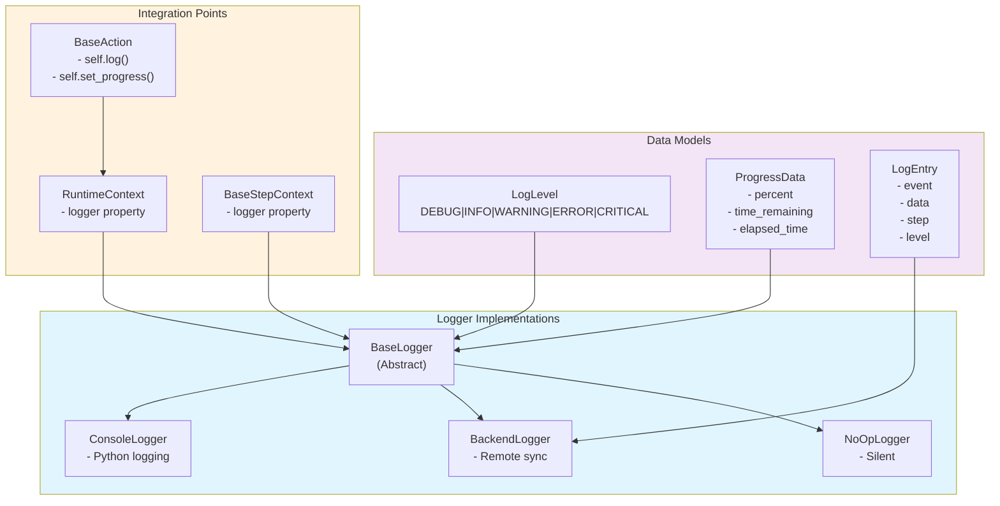

# Logging System

Comprehensive logging system for progress tracking, metrics collection, and event logging across the Synapse SDK plugin system.

## Architecture



## Core Components

### BaseLogger (Abstract)

Location: `synapse_sdk/loggers.py`

Abstract base class providing the logging interface. All logging state is instance-level to prevent cross-instance contamination.

```python
from synapse_sdk.loggers import BaseLogger
from synapse_sdk.plugins.models.logger import LogLevel

class CustomLogger(BaseLogger):
    def _log_impl(
        self,
        event: str,
        data: dict[str, Any],
        file: str | None,
        step: str | None,
        level: LogLevel | None = None,
    ) -> None:
        # Custom implementation
        print(f"[{level.value}] {event}: {data}")
```

**Key Methods:**

| Method | Description |
|--------|-------------|
| `log(level, event, data, file, step)` | Log an event with structured data |
| `info(message)` | Log info-level message |
| `debug(message)` | Log debug-level message |
| `warning(message)` | Log warning-level message |
| `error(message)` | Log error-level message |
| `critical(message)` | Log critical-level message |
| `set_progress(current, total, step)` | Update progress with ETA calculation |
| `set_progress_failed(category)` | Mark progress as failed |
| `set_metrics(value, step)` | Record metrics for a step |
| `set_step(step)` | Set current step context |
| `get_step()` | Get current step name |
| `get_progress(category)` | Retrieve progress data |
| `get_metrics(category)` | Retrieve recorded metrics |
| `finish()` | Mark logger as complete |

**Extension Hooks:**

```python
class CustomLogger(BaseLogger):
    def _log_impl(self, event, data, file, step, level):
        """Required: Handle log events."""
        pass

    def _on_progress(self, progress: ProgressData, category: str | None):
        """Optional: Called when progress updates."""
        pass

    def _on_metrics(self, category: str, metrics: dict[str, Any]):
        """Optional: Called when metrics update."""
        pass

    def _on_finish(self):
        """Optional: Called when logger finishes."""
        pass
```

### LogLevel

Location: `synapse_sdk/plugins/models/logger.py`

Enumeration for log severity levels:

```python
from synapse_sdk.plugins.models.logger import LogLevel

class LogLevel(str, Enum):
    DEBUG = 'debug'      # Detailed debugging information
    INFO = 'info'        # General operational messages
    WARNING = 'warning'  # Warning conditions
    ERROR = 'error'      # Error conditions
    CRITICAL = 'critical' # Critical failures
```

**Python Logging Level Mapping:**

| LogLevel | Python Level |
|----------|--------------|
| `DEBUG` | `logging.DEBUG` (10) |
| `INFO` | `logging.INFO` (20) |
| `WARNING` | `logging.WARNING` (30) |
| `ERROR` | `logging.ERROR` (40) |
| `CRITICAL` | `logging.CRITICAL` (50) |

### ProgressData

Immutable snapshot of progress state:

```python
from synapse_sdk.loggers import ProgressData

@dataclass
class ProgressData:
    percent: float           # Progress percentage (0-100)
    time_remaining: float | None  # Estimated seconds remaining
    elapsed_time: float | None    # Seconds elapsed
    status: str = 'running'       # 'running' or 'failed'
```

**Automatic ETA Calculation:**

```python
logger.set_progress(50, 100, step='training')
progress = logger.get_progress('training')
# progress.percent = 50.0
# progress.time_remaining = estimated based on elapsed/progress rate
# progress.elapsed_time = seconds since first progress call
```

### LogEntry

Structured log entry with metadata:

```python
from synapse_sdk.loggers import LogEntry

@dataclass
class LogEntry:
    event: str              # Event name/type
    data: dict[str, Any]    # Event payload
    timestamp: float        # Unix timestamp
    file: str | None        # Associated file path
    step: str | None        # Step context
    level: LogLevel | None  # Log level

    def to_dict(self) -> dict[str, Any]:
        """Serialize for API transmission."""
```

---

## Logger Implementations

### ConsoleLogger

Prints logs to console using Python's `logging` module. Best for development and debugging.

```python
from synapse_sdk.loggers import ConsoleLogger
from synapse_sdk.plugins.models.logger import LogLevel

logger = ConsoleLogger()

# Log messages at different levels
logger.info("Starting process")
logger.debug("Processing item 1")
logger.warning("Slow performance detected")
logger.error("Failed to connect")

# Structured logging
logger.log(LogLevel.INFO, 'model_loaded', {'path': '/models/yolo.pt'})

# Progress tracking
logger.set_step('training')
for epoch in range(100):
    logger.set_progress(epoch + 1, 100)
    # Output: [training] Progress: 50% | ETA: 30.5s

# Metrics
logger.set_metrics({'loss': 0.05, 'accuracy': 0.95}, step='training')
# Output: [training] Metrics: {'loss': 0.05, 'accuracy': 0.95}

logger.finish()
```

**Output Format:**

```
INFO:synapse_sdk.loggers:[training] model_loaded {'path': '/models/yolo.pt'}
INFO:synapse_sdk.loggers:[training] Progress: 50.0% | ETA: 30.5s
INFO:synapse_sdk.loggers:[training] Metrics: {'loss': 0.05, 'accuracy': 0.95}
```

### BackendLogger

Synchronizes logs with a remote backend service. Used in production environments for centralized monitoring.

```python
from synapse_sdk.loggers import BackendLogger, LoggerBackend

class MyBackend(LoggerBackend):
    def publish_progress(self, job_id: str, progress: ProgressData) -> None:
        # Send to backend API
        requests.post(f'/api/jobs/{job_id}/progress', json=progress.__dict__)

    def publish_metrics(self, job_id: str, metrics: dict[str, Any]) -> None:
        requests.post(f'/api/jobs/{job_id}/metrics', json=metrics)

    def publish_log(self, job_id: str, log_entry: LogEntry) -> None:
        requests.post(f'/api/jobs/{job_id}/logs', json=log_entry.to_dict())

# Initialize with backend
backend = MyBackend()
logger = BackendLogger(backend=backend, job_id='job-123')

# All logging operations sync to backend
logger.set_progress(50, 100, step='training')
logger.set_metrics({'loss': 0.05}, step='training')
logger.log(LogLevel.INFO, 'checkpoint', {'epoch': 5})

logger.finish()  # Flushes remaining logs
```

**Error Handling:**

BackendLogger silently logs errors without raising exceptions:

```python
# If backend.publish_progress() fails:
# ERROR:synapse_sdk.loggers:Failed to publish progress: ConnectionError
```

### NoOpLogger

Silent logger for testing or disabled logging scenarios:

```python
from synapse_sdk.loggers import NoOpLogger

logger = NoOpLogger()

# All operations are no-ops
logger.info("This goes nowhere")
logger.set_progress(50, 100)
logger.set_metrics({'loss': 0.05}, step='train')
logger.finish()  # Does nothing
```

---

## LoggerBackend Protocol

Protocol interface for implementing custom backend integrations:

```python
from synapse_sdk.loggers import LoggerBackend, ProgressData, LogEntry

class LoggerBackend(Protocol):
    """Protocol for logger backends that handle data synchronization."""

    def publish_progress(self, job_id: str, progress: ProgressData) -> None:
        """Publish progress update to backend."""
        ...

    def publish_metrics(self, job_id: str, metrics: dict[str, Any]) -> None:
        """Publish metrics to backend."""
        ...

    def publish_log(self, job_id: str, log_entry: LogEntry) -> None:
        """Publish log entry to backend."""
        ...
```

**Implementation Example:**

```python
import httpx
from synapse_sdk.loggers import LoggerBackend, ProgressData, LogEntry

class HTTPBackend:
    """HTTP-based backend implementation."""

    def __init__(self, base_url: str, api_key: str):
        self.client = httpx.Client(
            base_url=base_url,
            headers={'Authorization': f'Bearer {api_key}'},
        )

    def publish_progress(self, job_id: str, progress: ProgressData) -> None:
        self.client.post(f'/jobs/{job_id}/progress', json={
            'percent': progress.percent,
            'time_remaining': progress.time_remaining,
            'elapsed_time': progress.elapsed_time,
            'status': progress.status,
        })

    def publish_metrics(self, job_id: str, metrics: dict[str, Any]) -> None:
        self.client.post(f'/jobs/{job_id}/metrics', json=metrics)

    def publish_log(self, job_id: str, log_entry: LogEntry) -> None:
        self.client.post(f'/jobs/{job_id}/logs', json=log_entry.to_dict())
```

---

## Integration with Actions

### RuntimeContext

Actions access logging through `RuntimeContext`:

```python
from synapse_sdk.plugins import BaseAction
from synapse_sdk.plugins.context import RuntimeContext

class MyAction(BaseAction[MyParams]):
    def execute(self) -> dict:
        # Access logger via context
        self.ctx.logger.info("Starting execution")

        # Convenience methods on context
        self.ctx.set_progress(50, 100)
        self.ctx.set_metrics({'items': 100}, category='process')
        self.ctx.log('custom_event', {'data': 'value'})

        # User-facing messages
        self.ctx.log_message("Processing complete!", context='success')

        # Developer debug events
        self.ctx.log_dev_event("Checkpoint saved", {'path': '/tmp/ckpt'})

        return {'status': 'done'}
```

**RuntimeContext Methods:**

| Method | Description |
|--------|-------------|
| `log(event, data, file)` | Log structured event |
| `set_progress(current, total, category)` | Update progress |
| `set_metrics(value, category)` | Record metrics |
| `log_message(message, context)` | User-facing message |
| `log_dev_event(message, data)` | Developer debug event |
| `end_log()` | Signal execution complete |

### BaseAction Shortcuts

`BaseAction` provides convenience methods that delegate to the logger:

```python
class TrainAction(BaseAction[TrainParams]):
    def execute(self) -> dict:
        # Direct logging methods
        self.log('epoch_start', {'epoch': 1})
        self.set_progress(1, 100)
        self.set_metrics({'loss': 0.5}, category='train')

        # These call self.ctx.logger internally
        return {'status': 'done'}
```

---

## Integration with Steps

### BaseStepContext

Steps access logging through `BaseStepContext`:

```python
from dataclasses import dataclass
from synapse_sdk.plugins.steps import BaseStep, StepResult, BaseStepContext

@dataclass
class MyContext(BaseStepContext):
    data: list[str] = field(default_factory=list)

class ProcessStep(BaseStep[MyContext]):
    @property
    def name(self) -> str:
        return 'process'

    @property
    def progress_weight(self) -> float:
        return 0.5

    def execute(self, context: MyContext) -> StepResult:
        # Log through context
        context.log('process_start', {'count': len(context.data)})

        for i, item in enumerate(context.data):
            context.set_progress(i + 1, len(context.data))
            # Process item...

        context.set_metrics({'processed': len(context.data)})

        return StepResult(success=True)
```

### LoggingStep Wrapper

Wrap any step with automatic timing and logging:

```python
from synapse_sdk.plugins.steps.utils import LoggingStep

# Wrap step with logging
logged_step = LoggingStep(ProcessStep())
registry.register(logged_step)

# Execution logs:
# step_start {'step': 'process'}
# step_end {'step': 'process', 'elapsed': 1.234, 'success': True}
```

---

## Progress Tracking

### Step-Based Progress

Modern API using step names for progress categorization:

```python
logger = ConsoleLogger()

# Set current step context
logger.set_step('download')
logger.set_progress(50, 100)  # Uses current step

# Or specify step explicitly
logger.set_progress(50, 100, step='training')

# Multiple concurrent progress tracks
logger.set_progress(100, 100, step='download')  # Complete
logger.set_progress(25, 100, step='training')   # 25%
```

### Category Parameter (Deprecated)

The `category` parameter is deprecated in favor of `step`:

```python
# Deprecated
logger.set_progress(50, 100, category='train')
# DeprecationWarning: Use 'step' instead

# Recommended
logger.set_progress(50, 100, step='train')
```

**Priority Order:**
1. Explicit `step` parameter
2. Current step from `set_step()`
3. `category` parameter (deprecated, warns)
4. `__default__` key

### ETA Calculation

Automatic time remaining estimation:

```python
logger.set_step('training')

# First call initializes timer
logger.set_progress(0, 100)
time.sleep(1)

# Subsequent calls calculate ETA
logger.set_progress(10, 100)
progress = logger.get_progress('training')
# progress.percent = 10.0
# progress.elapsed_time = 1.0  # seconds
# progress.time_remaining = 9.0  # estimated

# Reset timer by setting current=0
logger.set_progress(0, 100)  # Timer resets
```

### Failed Progress

Mark progress as failed:

```python
try:
    for i in range(100):
        logger.set_progress(i + 1, 100, step='process')
        process_item(i)
except Exception:
    logger.set_progress_failed('process')
    # progress.status = 'failed'
    raise
```

---

## Pipeline Progress Models

### ActionProgress

Track progress for a single action in a pipeline:

```python
from synapse_sdk.plugins.models.logger import ActionProgress
from synapse_sdk.plugins.models.pipeline import ActionStatus

action_progress = ActionProgress(
    name='train',
    status=ActionStatus.RUNNING,
    progress=75.5,
    progress_category='epoch',
    message='Training epoch 75/100',
    metrics={'loss': 0.05, 'accuracy': 0.95},
    started_at=datetime.now(),
)

# Serialize for API
data = action_progress.to_dict()
```

### PipelineProgress

Overall pipeline state tracking:

```python
from synapse_sdk.plugins.models.logger import PipelineProgress, ActionProgress
from synapse_sdk.plugins.models.pipeline import RunStatus

pipeline_progress = PipelineProgress(
    run_id='run-123',
    status=RunStatus.RUNNING,
    current_action='train',
    started_at=datetime.now(),
)

# Add action progress
pipeline_progress.actions['download'] = ActionProgress(
    name='download',
    status=ActionStatus.COMPLETED,
    progress=100.0,
)
pipeline_progress.actions['train'] = ActionProgress(
    name='train',
    status=ActionStatus.RUNNING,
    progress=50.0,
)

# Calculate overall progress
print(pipeline_progress.overall_progress)  # 75.0 (average)
print(pipeline_progress.completed_actions)  # 1
```

---

## Best Practices

### Use Step Context

Always set step context for organized logging:

```python
def execute(self) -> dict:
    # Set step for automatic categorization
    self.ctx.logger.set_step('download')

    for i in range(100):
        self.ctx.set_progress(i + 1, 100)
        # Progress automatically associated with 'download'

    self.ctx.logger.set_step('process')
    # Subsequent logs go to 'process'
```

### Structured Event Names

Use consistent, descriptive event names:

```python
# Good: specific, actionable names
logger.log(LogLevel.INFO, 'model_checkpoint_saved', {'path': path, 'epoch': 5})
logger.log(LogLevel.ERROR, 'dataset_validation_failed', {'errors': errors})
logger.log(LogLevel.DEBUG, 'batch_processed', {'batch_id': i, 'items': 32})

# Avoid: vague or generic names
logger.log(LogLevel.INFO, 'done', {})
logger.log(LogLevel.INFO, 'step1', {'data': data})
```

### Include Relevant Data

Log actionable information:

```python
# Good: includes context for debugging
logger.log(LogLevel.ERROR, 'file_not_found', {
    'path': '/data/train.csv',
    'checked_paths': ['/data', '/tmp/data'],
    'suggestion': 'Ensure dataset is downloaded',
})

# Avoid: minimal information
logger.log(LogLevel.ERROR, 'error', {'msg': 'not found'})
```

### Handle Logger Lifecycle

Always finish the logger:

```python
logger = ConsoleLogger()
try:
    # ... operations ...
    logger.set_progress(100, 100)
except Exception:
    logger.set_progress_failed()
    raise
finally:
    logger.finish()  # Always call finish
```

### Guard Against Finished Logger

```python
logger.finish()

try:
    logger.info("After finish")
except RuntimeError as e:
    # "Cannot log to a finished logger"
    pass
```

---

## Module Reference

| Module | Classes | Purpose |
|--------|---------|---------|
| `synapse_sdk.loggers` | `BaseLogger`, `ConsoleLogger`, `BackendLogger`, `NoOpLogger`, `LoggerBackend`, `ProgressData`, `LogEntry` | Core logging system |
| `synapse_sdk.plugins.models.logger` | `LogLevel`, `ActionProgress`, `PipelineProgress`, `Checkpoint` | Progress models and enums |
| `synapse_sdk.plugins.steps.utils.logging` | `LoggingStep` | Step wrapper with timing |
| `synapse_sdk.plugins.context` | `RuntimeContext` | Action context with logger |

---

## Related Documentation

- **[OVERVIEW.md](OVERVIEW.md)** - Plugin system introduction
- **[ARCHITECTURE.md](ARCHITECTURE.md)** - Technical architecture
- **[STEP.md](STEP.md)** - Step implementations
- **[README.md](README.md)** - Quick reference
