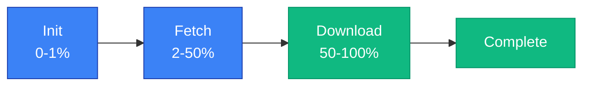

# Dataset Actions

Dataset actions handle dataset download and format conversion workflows. Use `DatasetAction` to download datasets from the backend or convert between annotation formats like Datamaker, YOLO, and COCO.

## Overview

Dataset actions provide a unified interface for:

- Downloading datasets from backend data collections
- Converting between annotation formats (DM → YOLO, YOLO → DM, etc.)
- Handling categorized datasets with train/valid/test splits
- Composing download-convert pipelines

### At a Glance

| Property | Value |
|----------|-------|
| Class | `DatasetAction` |
| Category | `PluginCategory.NEURAL_NET` |
| Operations | `DOWNLOAD`, `CONVERT` |
| Result Model | `DatasetResult` |
| Requires Client | Yes (for download) |

## DatasetAction

`DatasetAction` extends `BaseAction` with dataset-specific operations. The `operation` parameter determines whether to download or convert.

```python filename="synapse_sdk/plugins/actions/dataset/action.py"
from synapse_sdk.plugins.action import BaseAction
from synapse_sdk.utils.converters import DatasetFormat, get_converter
from synapse_sdk.utils.annotation_models (formats module removed).dm import DMVersion
from synapse_sdk.plugins.enums import PluginCategory
from synapse_sdk.plugins.types import YOLODataset

class DatasetAction(BaseAction[DatasetParams]):
    category = PluginCategory.NEURAL_NET
    input_type = None
    output_type = YOLODataset
    result_model = DatasetResult
```

The generic type `DatasetParams` defines input parameters for both operations.

### Key Methods

#### `execute()`

Dispatches to `download()` or `convert()` based on `params.operation`.

```python filename="example.py"
action = DatasetAction(params, ctx)
result = action.execute()  # Returns DatasetResult
```

#### `download()`

Downloads ground truths from a backend dataset. Saves in Datamaker v2 format (`json/` + `original_files/` structure).

The download process:
1. Lists ground truth versions for the specified dataset
2. Fetches ground truth events with full file information
3. Downloads image files and annotation JSON files (`data_meta_*`)
4. Builds DM v2 JSON from annotation data (coordinates, classifications)

```python filename="example.py"
# Called internally when operation='download'
result = action.download()
# Returns: DatasetResult(path, format='dm_v2', is_categorized, count)
```

> **Note**: Annotation data is extracted from `data_meta_*` files which contain `annotations` (metadata) and `annotationsData` (coordinates) structures. The action automatically merges these to build the DM v2 JSON format.

#### `convert()`

Converts dataset from source format to target format.

```python filename="example.py"
# Called internally when operation='convert'
result = action.convert()
# Returns: DatasetResult(path, format, config_path, source_path)
```

## DatasetOperation

Enum defining available operations.

```python filename="synapse_sdk/plugins/actions/dataset/action.py"
from enum import StrEnum

class DatasetOperation(StrEnum):
    DOWNLOAD = 'download'  # Download from backend
    CONVERT = 'convert'    # Convert between formats
```

## DatasetParams

Parameters for `DatasetAction`. Different fields apply depending on the operation.

```python filename="synapse_sdk/plugins/actions/dataset/action.py"
from pydantic import BaseModel, Field

class DatasetParams(BaseModel):
    operation: DatasetOperation = DatasetOperation.DOWNLOAD

    # Download params
    dataset: int | None = Field(default=None, description='Data collection ID')
    splits: dict[str, dict[str, Any]] | None = Field(
        default=None,
        description='Split definitions: {"train": {...filters}, "valid": {...}}',
    )

    # Convert params
    path: Path | str | None = Field(default=None, description='Dataset path')
    source_format: str = Field(default='dm_v2', description='Source format')
    target_format: str = Field(default='yolo', description='Target format')
    dm_version: str = Field(default='v2', description='Datamaker version')

    # Shared params
    output_dir: Path | str | None = Field(default=None, description='Output directory')
    is_categorized: bool = Field(default=False, description='Has splits')
```

### Download Parameters

| Parameter | Type | Required | Default | Description |
|-----------|------|----------|---------|-------------|
| `operation` | `DatasetOperation` | No | `DOWNLOAD` | Operation type |
| `dataset` | `int` | Yes | - | Data collection ID |
| `splits` | `dict[str, dict]` | No | `None` | Split definitions with filters |
| `output_dir` | `Path \| str` | No | Auto | Output directory path |

### Convert Parameters

| Parameter | Type | Required | Default | Description |
|-----------|------|----------|---------|-------------|
| `operation` | `DatasetOperation` | Yes | - | Set to `CONVERT` |
| `path` | `Path \| str` | Yes | - | Source dataset path |
| `source_format` | `str` | No | `dm_v2` | Source format |
| `target_format` | `str` | No | `yolo` | Target format |
| `dm_version` | `str` | No | `v2` | Datamaker version (`v1` or `v2`) |
| `output_dir` | `Path \| str` | No | Auto | Output directory path |
| `is_categorized` | `bool` | No | `False` | Has train/valid/test splits |

> **Good to know**: When `output_dir` is not specified, the action creates a temporary directory for downloads or appends the target format to the source path for conversions.

## DatasetResult

Result model returned by `DatasetAction`.

```python filename="synapse_sdk/plugins/actions/dataset/action.py"
from pydantic import BaseModel

class DatasetResult(BaseModel):
    path: Path                      # Dataset directory path
    format: str                     # Format ('dm_v2', 'yolo', etc.)
    is_categorized: bool = False    # Has train/valid/test splits
    config_path: Path | None = None # Config file (e.g., dataset.yaml)
    count: int | None = None        # Number of items processed
    source_path: Path | None = None # Original source path (convert only)

    class Config:
        arbitrary_types_allowed = True
```

### Fields

| Field | Type | Description |
|-------|------|-------------|
| `path` | `Path` | Dataset directory path |
| `format` | `str` | Dataset format identifier |
| `is_categorized` | `bool` | Whether dataset has splits |
| `config_path` | `Path \| None` | Path to config file (YOLO: `dataset.yaml`) |
| `count` | `int \| None` | Number of items (download only) |
| `source_path` | `Path \| None` | Original source path (convert only) |

### Properties

#### `data_path`

Returns `config_path` if set, otherwise `path`. Use this for downstream actions that need a single path.

```python filename="example.py"
result = action.execute()

# For YOLO training, use data_path to get dataset.yaml
model.train(data=str(result.data_path))
```

## Supported Formats

`DatasetFormat` enum defines supported annotation formats.

| Format | Value | Description |
|--------|-------|-------------|
| `DM_V1` | `dm_v1` | Datamaker v1 format |
| `DM_V2` | `dm_v2` | Datamaker v2 format |
| `YOLO` | `yolo` | YOLO format (labels + dataset.yaml) |
| `COCO` | `coco` | COCO JSON format |
| `PASCAL` | `pascal` | Pascal VOC XML format |

### Conversion Matrix

| Source → Target | DM_V1 | DM_V2 | YOLO | COCO | PASCAL |
|-----------------|-------|-------|------|------|--------|
| **DM_V1** | - | - | ✓ | - | - |
| **DM_V2** | - | - | ✓ | - | - |
| **YOLO** | ✓ | ✓ | - | - | - |
| **COCO** | - | - | - | - | - |
| **PASCAL** | - | - | - | - | - |

> **Note**: Currently only DM ↔ YOLO conversions are implemented. COCO and PASCAL converters are planned.

## Examples

### Example: Dataset Download

Download a dataset from a data collection.

```python filename="plugins/dataset/download_example.py"
from synapse_sdk.plugins.actions.dataset import (
    DatasetAction,
    DatasetParams,
    DatasetOperation,
)

# Simple download
params = DatasetParams(
    operation=DatasetOperation.DOWNLOAD,
    dataset=123,
    output_dir='/data/my_dataset',
)

action = DatasetAction(params, ctx)
result = action.execute()

print(f"Downloaded {result.count} items to {result.path}")
# Downloaded 1000 items to /data/my_dataset
```

### Example: Categorized Download with Splits

Download with train/valid/test splits using filters.

```python filename="plugins/dataset/split_download_example.py"
params = DatasetParams(
    operation=DatasetOperation.DOWNLOAD,
    dataset=123,
    splits={
        'train': {'status': 'approved', 'limit': 800},
        'valid': {'status': 'approved', 'limit': 100},
        'test': {'status': 'approved', 'limit': 100},
    },
    output_dir='/data/categorized_dataset',
)

action = DatasetAction(params, ctx)
result = action.execute()

print(f"Categorized: {result.is_categorized}")  # True
# Structure: /data/categorized_dataset/{train,valid,test}/json/
```

### Example: Format Conversion

Convert a Datamaker dataset to YOLO format.

```python filename="plugins/dataset/convert_example.py"
params = DatasetParams(
    operation=DatasetOperation.CONVERT,
    path='/data/my_dataset',
    source_format='dm_v2',
    target_format='yolo',
    is_categorized=True,
)

action = DatasetAction(params, ctx)
result = action.execute()

print(f"Converted to: {result.path}")
print(f"Config file: {result.config_path}")
# Converted to: /data/my_dataset_yolo
# Config file: /data/my_dataset_yolo/dataset.yaml
```

### Example: Download + Convert Workflow

Chain download and convert operations sequentially.

```python filename="plugins/dataset/pipeline_example.py"
from synapse_sdk.plugins.actions.dataset import (
    DatasetAction,
    DatasetParams,
    DatasetOperation,
)

# Step 1: Download dataset
download_params = DatasetParams(
    operation=DatasetOperation.DOWNLOAD,
    dataset=123,
    output_dir='/data/my_dataset',
)
download_action = DatasetAction(download_params, ctx)
download_result = download_action.execute()

# Step 2: Convert to YOLO format
convert_params = DatasetParams(
    operation=DatasetOperation.CONVERT,
    path=download_result.path,  # Use path from download
    source_format='dm_v2',
    target_format='yolo',
    is_categorized=download_result.is_categorized,
)
convert_action = DatasetAction(convert_params, ctx)
convert_result = convert_action.execute()

print(f"YOLO dataset: {convert_result.data_path}")
# YOLO dataset: /data/my_dataset_yolo/dataset.yaml
```

> **Good to know**: The download result provides `path` and `is_categorized` fields that can be passed directly to the convert operation.

## Progress Tracking

`DatasetAction` reports progress through different categories.

### Download Progress Categories

| Category | Range | Description |
|----------|-------|-------------|
| `init` | 0-1% | Initialization and collection fetch |
| `fetch` | 2-50% | Fetching data units from API |
| `download` | 50-100% | Downloading files |

### Progress Flow



```python filename="example.py"
# Progress is reported automatically during execution
action = DatasetAction(params, ctx)
result = action.execute()

# Monitor progress through ctx.progress callback
```

## Best Practices

### Use Categorized Downloads for ML Training

Structure datasets with splits for better ML workflow integration.

```python filename="example.py"
params = DatasetParams(
    dataset=123,
    splits={
        'train': {'limit': 8000},
        'valid': {'limit': 1000},
        'test': {'limit': 1000},
    },
)
```

### Leverage `data_path` Property

Use `data_path` instead of manually checking `config_path` for downstream actions.

```python filename="example.py"
# Instead of:
if result.config_path:
    data = result.config_path
else:
    data = result.path

# Use:
data = result.data_path
```

### Sequential Workflow Pattern

Chain download and convert operations for end-to-end workflows.

```python filename="example.py"
def download_and_convert(dataset: int, ctx: RuntimeContext) -> DatasetResult:
    """Download dataset and convert to YOLO format."""
    # Download
    download_result = DatasetAction(
        DatasetParams(operation=DatasetOperation.DOWNLOAD, dataset=dataset),
        ctx,
    ).execute()

    # Convert
    return DatasetAction(
        DatasetParams(
            operation=DatasetOperation.CONVERT,
            path=download_result.path,
            target_format='yolo',
            is_categorized=download_result.is_categorized,
        ),
        ctx,
    ).execute()
```

> **Warning**: Ensure sufficient disk space before downloading large datasets. The action does not check available space.

## Related

- [Defining Actions](../defining-actions) - Action definition basics
- [RuntimeContext](../runtime-context) - Context API reference
- [Pipelines](../pipelines) - Pipeline composition guide
- [Dataset Conversion](../dataset-conversion) - Low-level converter API
