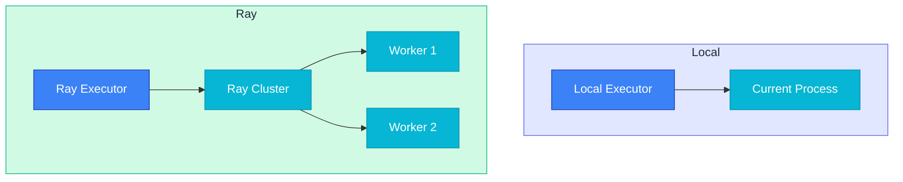

# Local Execution

Local Execution runs plugin actions synchronously in the current process. It requires no Ray cluster and provides immediate feedback, making it ideal for development and testing.

## Overview

LocalExecutor is an in-process execution engine designed for fast feedback loops during development. Test and debug actions in your local environment without any cluster setup.

### At a Glance

| Characteristic | Local | Task (Ray Actor) | Job (Ray Jobs API) | Remote |
|----------------|-------|------------------|-------------------|--------|
| **Location** | Current process | Ray cluster Actor | Ray Jobs API | Synapse Backend |
| **Startup Time** | Immediate | < 1s (worker reuse) | Deferred (cluster submission) | Network latency |
| **Return Value** | Result immediately | Result immediately | Job ID (async) | Result via API |
| **Logging** | ConsoleLogger (immediate) | Ray worker logs | Log streaming | Backend logs |
| **Use Case** | Development, debugging | Fast repeated tasks | Heavy/long-running workloads | Production deployment |
| **Requirements** | None | Ray cluster | Ray cluster | Authentication |

> **Good to know**:
> - Local mode fully supports Python debuggers (pdb, breakpoint)
> - All output displays immediately in the console for rapid feedback

## LocalExecutor

`LocalExecutor` executes actions synchronously in the current process.

### Signature

```python filename="synapse_sdk/plugins/executors/local.py"
class LocalExecutor:
    def __init__(
        self,
        env: PluginEnvironment | dict[str, Any] | None = None,
        job_id: str | None = None,
    ) -> None

    def execute(
        self,
        action_cls: type[BaseAction],
        params: dict[str, Any],
        **kwargs: Any,
    ) -> Any
```

### Parameters

#### `__init__` Parameters

| Parameter | Type | Required | Default | Description |
|-----------|------|----------|---------|-------------|
| `env` | `PluginEnvironment \| dict \| None` | No | `None` | Environment config. Loads from `os.environ` if `None`. Passed as `PluginEnvironment` to RuntimeContext. |
| `job_id` | `str \| None` | No | `None` | Job identifier for tracking |

#### `execute` Parameters

| Parameter | Type | Required | Description |
|-----------|------|----------|-------------|
| `action_cls` | `type[BaseAction]` | Yes | BaseAction subclass to execute |
| `params` | `dict[str, Any]` | Yes | Parameter dictionary to pass to the action |

### Returns

Returns the result from the action's `execute()` method directly.

### Errors/Exceptions

| Exception | Condition |
|-----------|-----------|
| `ValidationError` | Parameters fail `params_model` schema validation |
| `ExecutionError` | Exception raised during action execution |

### Example

```python filename="examples/local_executor.py"
from synapse_sdk.plugins.executors.local import LocalExecutor
from my_plugin.actions import TrainAction

# Basic usage
executor = LocalExecutor()
result = executor.execute(TrainAction, {'epochs': 10})

# With custom environment and Job ID
executor = LocalExecutor(
    env={'API_KEY': 'xxx', 'DEBUG': 'true'},
    job_id='train-001'
)
result = executor.execute(TrainAction, {'epochs': 10, 'batch_size': 32})
```

## Using run_plugin

The `run_plugin` function is the main entry point for plugin execution, handling both discovery and execution in one call.

### Basic Usage

```python filename="examples/run_plugin_basic.py"
from synapse_sdk.plugins.runner import run_plugin

# Execute via module path
result = run_plugin('my_plugins.yolov8', 'train', {'epochs': 10})

# Execute via filesystem path
result = run_plugin('/path/to/plugin', 'train', {'epochs': 10})

# Execute via config.yaml path
result = run_plugin('/path/to/config.yaml', 'train', {'epochs': 10})
```

### Signature

```python filename="synapse_sdk/plugins/runner.py"
def run_plugin(
    plugin_code: str,
    action: str,
    params: dict[str, Any] | None = None,
    *,
    mode: Literal['local', 'task', 'job'] = 'local',
    **executor_kwargs: Any,
) -> Any
```

### Parameters

| Parameter | Type | Required | Default | Description |
|-----------|------|----------|---------|-------------|
| `plugin_code` | `str` | Yes | - | Module path (`'my_plugins.yolov8'`) or filesystem path (`'/path/to/plugin'`) |
| `action` | `str` | Yes | - | Action name to execute (e.g., `'train'`, `'infer'`) |
| `params` | `dict \| None` | No | `None` | Action parameter dictionary |
| `mode` | `Literal['local', 'task', 'job']` | No | `'local'` | Execution mode |

#### executor_kwargs

| Option | Type | Description |
|--------|------|-------------|
| `action_cls` | `type[BaseAction]` | Explicit action class (skips discovery) |
| `env` | `PluginEnvironment \| dict` | Environment configuration |
| `job_id` | `str` | Job identifier |

### With Custom Environment

```python filename="examples/run_plugin_env.py"
from synapse_sdk.plugins.runner import run_plugin
from synapse_sdk.plugins.context import PluginEnvironment

# Pass environment as dictionary
result = run_plugin(
    'my_plugins.yolov8',
    'train',
    {'epochs': 10},
    env={'API_KEY': 'xxx', 'DEBUG': 'true'}
)

# Pass as PluginEnvironment object
env = PluginEnvironment({'API_KEY': 'xxx', 'BATCH_SIZE': '64'})
result = run_plugin(
    'my_plugins.yolov8',
    'train',
    {'epochs': 10},
    env=env
)
```

### With Explicit Action Class

Skip plugin discovery by specifying the action class directly.

```python filename="examples/run_plugin_explicit.py"
from synapse_sdk.plugins.runner import run_plugin
from my_plugin.train import TrainAction

# Explicit action class (skips discovery)
result = run_plugin(
    'yolov8',  # plugin_code is ignored
    'train',
    {'epochs': 10},
    action_cls=TrainAction
)
```

## CLI Usage

Use `synapse plugin run` to execute plugins from the command line.

### Basic Command

```bash filename="terminal"
# Basic local execution
synapse plugin run train

# With parameters
synapse plugin run train --params '{"epochs": 10, "batch_size": 32}'

# Explicit local mode
synapse plugin run train --mode local
```

### Options

| Option | Type | Default | Description |
|--------|------|---------|-------------|
| `--plugin`, `-p` | `str` | Auto-detect | Plugin code (auto-detects from config.yaml) |
| `--path` | `Path` | `.` | Plugin directory path |
| `--params` | `JSON` | `{}` | Action parameters (JSON format) |
| `--mode`, `-m` | `local\|task\|job\|remote` | Interactive | Execution mode |
| `--ray-address` | `str` | `auto` | Ray cluster address (for task/job modes) |
| `--gpus` | `int` | - | Number of GPUs to request |
| `--cpus` | `int` | - | Number of CPUs to request |
| `--debug/--no-debug` | `bool` | `true` | Debug mode |

#### Remote Mode Options

| Option | Type | Default | Description |
|--------|------|---------|-------------|
| `--host` | `str` | - | Synapse API host (for remote mode) |
| `--token`, `-t` | `str` | - | Access token (for remote mode) |

#### Inference Options

| Option | Type | Default | Description |
|--------|------|---------|-------------|
| `--input`, `-i` | `JSON` | - | JSON input for inference (for infer action) |
| `--infer-path` | `str` | `/` | Inference endpoint path (for infer action) |

#### Development Options

| Option | Type | Default | Description |
|--------|------|---------|-------------|
| `--debug-sdk` | `bool` | `false` | Bundle local SDK with upload (for SDK development) |

### Examples

```bash filename="terminal"
# Test plugin in another directory
synapse plugin run train --path /path/to/plugin

# Specify mode explicitly
synapse plugin run train --mode local --params '{"epochs": 5}'

# Run on Ray cluster with GPU
synapse plugin run train --mode task --gpus 1

# Run via Ray Jobs API
synapse plugin run train --mode job --params '{"epochs": 10}'

# Run via Synapse Backend API (requires authentication)
synapse plugin run deploy --mode remote
```

## Environment Setup

### PluginEnvironment

`PluginEnvironment` manages environment variables and configuration.

```python filename="examples/plugin_environment.py"
from synapse_sdk.plugins.context import PluginEnvironment

# Load from os.environ
env = PluginEnvironment.from_environ()

# Load with prefix filtering
env = PluginEnvironment.from_environ(prefix='MYAPP_')

# Load from TOML file
env = PluginEnvironment.from_file('config.toml')

# Create directly from dictionary
env = PluginEnvironment({'API_KEY': 'xxx', 'DEBUG': True})
```

### Typed Accessors

Type-safe methods for accessing values.

```python filename="examples/env_accessors.py"
from synapse_sdk.plugins.context import PluginEnvironment

env = PluginEnvironment.from_environ()

# Type-specific getters
api_key = env.get_str('API_KEY')
batch_size = env.get_int('BATCH_SIZE', default=32)
debug = env.get_bool('DEBUG', default=False)
learning_rate = env.get_float('LEARNING_RATE', default=0.001)
tags = env.get_list('TAGS', default=[])  # Supports comma-separated strings
```

| Method | Return Type | Description |
|--------|-------------|-------------|
| `get(key, default)` | `Any` | Returns raw value |
| `get_str(key, default)` | `str \| None` | Converts to string |
| `get_int(key, default)` | `int \| None` | Converts to integer |
| `get_float(key, default)` | `float \| None` | Converts to float |
| `get_bool(key, default)` | `bool \| None` | Converts to boolean (`'true'`, `'1'`, `'yes'` supported) |
| `get_list(key, default)` | `list \| None` | Converts to list (comma-separated strings supported) |

### Environment Priority

Environment variables are applied in the following priority (later overrides earlier):

1. `os.environ` (default)
2. `config.yaml` `env` section
3. CLI `--env` option or `env` parameter passed in code

#### config.yaml env Section

Define environment variables directly in your plugin's `config.yaml`.

```yaml filename="config.yaml"
code: my-plugin
name: My Plugin

env:
  API_KEY: your-api-key
  DEBUG: "true"
  BATCH_SIZE: "32"
  LEARNING_RATE: "0.001"
```

#### Merging Environments in Code

```python filename="examples/env_merge.py"
from synapse_sdk.plugins.context import PluginEnvironment

# Merge multiple environments (later takes precedence)
base_env = PluginEnvironment.from_environ()
config_env = PluginEnvironment.from_file('config.toml')
override_env = PluginEnvironment({'DEBUG': 'true'})

merged = PluginEnvironment.merge(base_env, config_env, override_env)
```

## Debug Mode

### Python Debugger Support

LocalExecutor runs in the current process, enabling full Python debugger support.

```python filename="my_plugin/actions/train.py"
from synapse_sdk.plugins.action import BaseAction

class TrainAction(BaseAction[TrainParams]):
    def execute(self):
        # breakpoint() works
        breakpoint()

        # Or use pdb directly
        import pdb; pdb.set_trace()

        return {'status': 'done'}
```

### Console Logging

LocalExecutor uses `ConsoleLogger` by default, displaying all logs immediately in the console.

```python filename="my_plugin/actions/train.py"
class TrainAction(BaseAction[TrainParams]):
    def execute(self):
        # Progress display (immediate console output)
        for epoch in range(self.params.epochs):
            self.ctx.set_progress(epoch + 1, self.params.epochs)
            self.ctx.log('epoch_complete', {'epoch': epoch, 'loss': 0.1})

        # Record metrics (second argument is step name)
        self.ctx.set_metrics({'final_loss': 0.05}, 'training')

        return {'status': 'done'}
```

> **Good to know**: The `set_metrics()` method requires a step name as the second argument to categorize metrics.

## Limitations

### Local Execution Constraints

| Limitation | Description | Alternative |
|------------|-------------|-------------|
| **Single process** | No parallel/distributed processing | Use `mode='task'` or `mode='job'` |
| **No resource isolation** | Uses host resources directly | Use Ray cluster resource management |
| **No scalability** | Single machine constraint | Use Ray mode for production |
| **No GPU allocation** | `num_gpus` option not supported | Request GPUs in Ray mode |

> **Warning**: Use local mode only for development and testing. Ray-based execution modes are recommended for production environments.

### Local vs Ray Comparison



## Best Practices

### Development Workflow

1. **Test locally first**: Always start with local mode when developing new actions

```bash filename="terminal"
# Rapid iteration testing
synapse plugin run train --mode local --params '{"epochs": 1}'
```

2. **Use small datasets**: Validate with small sample data for local testing

```python filename="examples/small_dataset.py"
# Small dataset for development
result = run_plugin('my_plugin', 'train', {
    'epochs': 1,
    'batch_size': 4,
    'sample_size': 100  # Small sample
})
```

3. **Leverage debug mode**: Use breakpoints when issues occur

```python filename="examples/debug_mode.py"
env = {'DEBUG': 'true'}
result = run_plugin('my_plugin', 'train', params, env=env)
```

### Migration to Ray

Switch to Ray mode for scalability after local testing is complete.

```python filename="examples/migration.py"
from synapse_sdk.plugins.runner import run_plugin

# During development: local mode
result = run_plugin('my_plugin', 'train', params, mode='local')

# After testing: Ray Actor mode (fast startup)
result = run_plugin('my_plugin', 'train', params, mode='task')

# Production: Ray Job mode (heavy workloads)
job_id = run_plugin('my_plugin', 'train', params, mode='job')
```

> **Good to know**: Action code remains identical regardless of execution mode. Just change the `mode` parameter.

## Related Documentation

- [RuntimeContext](../runtime-context) — Runtime context API
- [Defining Actions](../defining-actions) — Action definition guide
- [Ray Execution](./ray-execution) — Ray-based distributed execution
- [Pipelines](../pipelines) — Action pipeline composition
