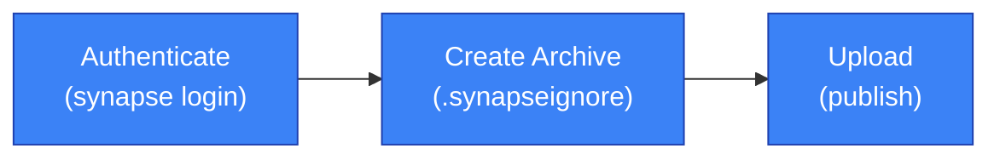

# Plugin Development

This guide walks you through the complete workflow of creating, testing, and publishing a Synapse plugin. Follow each step to build a production-ready plugin from scratch.

:::info[Prerequisites]

Before starting, familiarize yourself with the [Plugin System Overview](./index.md) to understand core concepts like actions, contexts, and execution modes.

:::

## Overview

Plugin development follows a structured workflow from template generation to production deployment.

### At a Glance

| Step | Tool | Command/Action |
|------|------|----------------|
| **1. Generate** | CLI | `synapse plugin create` |
| **2. Configure** | YAML | Edit `config.yaml` |
| **3. Implement** | Python | Create action classes |
| **4. Test** | CLI | `synapse plugin run --mode local` |
| **5. Publish** | CLI | `synapse plugin publish` |

## Plugin Structure

A typical plugin follows this directory structure:

```text
synapse-{plugin-code}-plugin/
├── config.yaml           # Plugin metadata and action definitions
├── plugin/               # Source code directory
│   ├── __init__.py
│   ├── train.py          # Training action implementation
│   └── inference.py      # Inference action implementation
├── requirements.txt      # Python dependencies
├── pyproject.toml        # Package configuration (optional)
├── wheels/               # Local wheel files (optional)
└── README.md             # Plugin documentation
```

| File | Purpose |
|------|---------|
| `config.yaml` | Defines plugin metadata, actions, and runtime configuration |
| `plugin/` | Contains action implementations and supporting modules |
| `requirements.txt` | Lists pip dependencies for installation |
| `pyproject.toml` | Optional package configuration for advanced setups |
| `wheels/` | Directory for bundling local `.whl` files |

## Creating a Plugin

### 1. Generate from Template

Use the CLI to scaffold a new plugin with the required structure.

```bash
synapse plugin create
```

**Options:**

| Option | Short | Description |
|--------|-------|-------------|
| `--path` | `-p` | Output directory (default: current directory) |
| `--name` | `-n` | Plugin display name |
| `--code` | | Plugin code identifier (slug) |
| `--category` | `-c` | Plugin category |
| `--yes` | `-y` | Skip confirmation prompts |

**Example:**

```bash
synapse plugin create \
  --name "YOLOv8 Object Detection" \
  --code yolov8 \
  --category neural_net \
  --path ./plugins
```

This creates a `synapse-yolov8-plugin/` directory with all required files.

### 2. Configure config.yaml

Define your plugin metadata and actions in `config.yaml`.

```yaml filename="config.yaml"
name: YOLOv8 Object Detection
code: yolov8
version: 0.1.0
category: neural_net
description: Train and deploy YOLOv8 object detection models
readme: README.md

# Package management
package_manager: pip
package_manager_options: []
wheels_dir: wheels

# Environment variables
env:
  CUDA_VISIBLE_DEVICES: "0"

# Action definitions
actions:
  train:
    entrypoint: plugin.train:TrainAction
    method: job
    description: Train YOLOv8 model on dataset
    input_type: yolo_dataset
    output_type: model_weights

  inference:
    entrypoint: plugin.inference:InferenceAction
    method: task
    description: Run inference on images
```

**Required Fields:**

| Field | Type | Description |
|-------|------|-------------|
| `name` | `str` | Human-readable plugin name |
| `code` | `str` | Unique identifier (lowercase, hyphens allowed) |
| `version` | `str` | Semantic version (e.g., `0.1.0`) |
| `category` | `str` | Plugin category (see [Plugin Categories](./index.md#plugin-categories)) |
| `actions` | `dict` | Action name to configuration mapping |

**Action Configuration:**

| Field | Type | Required | Description |
|-------|------|----------|-------------|
| `entrypoint` | `str` | Yes | Module path (`module.path:ClassName`) |
| `method` | `str` | No | Execution method: `job`, `task`, or `serve` |
| `description` | `str` | No | Human-readable description |
| `input_type` | `str` | No | Semantic input type |
| `output_type` | `str` | No | Semantic output type |

> **Good to know**: The `input_type` and `output_type` fields are automatically synced from your action class when you run `synapse plugin update-config`.

### 3. Implement Actions

Create action classes that inherit from the appropriate base class. For detailed guidance, see [Defining Actions](./defining-actions.md).

```python filename="plugin/train.py"
from pydantic import BaseModel, Field
from synapse_sdk.plugins import BaseTrainAction
from synapse_sdk.plugins.types import YOLODataset, ModelWeights
from synapse_sdk.plugins.enums import PluginCategory

class TrainParams(BaseModel):
    """Training parameters with validation."""
    dataset: int = Field(..., description="Dataset ID to train on")
    epochs: int = Field(default=100, ge=1, le=1000)
    batch_size: int = Field(default=16, ge=1)
    learning_rate: float = Field(default=0.01, gt=0, lt=1)

class TrainResult(BaseModel):
    """Training result schema."""
    model_path: str
    final_loss: float
    metrics: dict[str, float]

class TrainAction(BaseTrainAction[TrainParams]):
    """Train YOLOv8 model on a dataset."""

    category = PluginCategory.NEURAL_NET
    input_type = YOLODataset
    output_type = ModelWeights
    result_model = TrainResult

    def execute(self) -> TrainResult:
        # Log start
        self.ctx.log_message("Starting training...", "info")

        # Load dataset
        self.set_progress(0, 100, self.progress.DATASET)
        dataset = self.get_dataset()
        self.set_progress(100, 100, self.progress.DATASET)

        # Load checkpoint if resuming
        checkpoint = self.get_checkpoint()
        if checkpoint:
            self.ctx.log_message(
                f"Resuming from checkpoint: {checkpoint['category']}", "info"
            )

        # Training loop
        for epoch in range(self.params.epochs):
            # Update progress
            self.set_progress(epoch + 1, self.params.epochs, self.progress.TRAIN)

            # Training logic here
            loss = self._train_epoch(epoch)

            # Record metrics
            self.set_metrics({
                "epoch": epoch + 1,
                "loss": loss,
                "learning_rate": self.params.learning_rate,
            }, category="train")

        # Save and upload model
        self.set_progress(0, 100, self.progress.MODEL_UPLOAD)
        model_info = self.create_model("/models/best.pt", name="yolov8-trained")
        self.set_progress(100, 100, self.progress.MODEL_UPLOAD)

        return TrainResult(
            model_path=model_info["path"],
            final_loss=loss,
            metrics={"mAP50": 0.85, "mAP50-95": 0.72},
        )

    def _train_epoch(self, epoch: int) -> float:
        """Train one epoch and return loss."""
        # Your training logic here
        return 0.5 - (epoch * 0.005)
```

**Available Base Classes:**

| Base Class | Import | Use Case |
|------------|--------|----------|
| `BaseAction` | `synapse_sdk.plugins` | Generic actions |
| `BaseTrainAction` | `synapse_sdk.plugins` | Model training with dataset/checkpoint helpers |
| `BaseInferenceAction` | `synapse_sdk.plugins` | Model inference with model loading helpers |
| `BaseExportAction` | `synapse_sdk.plugins` | Data export operations |
| `BaseUploadAction` | `synapse_sdk.plugins` | File upload with step orchestration |
| `DatasetAction` | `synapse_sdk.plugins.actions.dataset` | Dataset download/conversion |

> **Tip**: Use `BaseTrainAction` for training workflows—it provides built-in helpers like `get_dataset()`, `get_checkpoint()`, and `create_model()`.

### 4. Add Dependencies

List your Python dependencies in `requirements.txt`.

```text filename="requirements.txt"
torch>=2.0.0
ultralytics>=8.0.0
numpy>=1.24.0
```

For complex dependency management, use `pyproject.toml`:

```toml filename="pyproject.toml"
[project]
name = "synapse-yolov8-plugin"
version = "0.1.0"
requires-python = ">=3.10"
dependencies = [
    "torch>=2.0.0",
    "ultralytics>=8.0.0",
]

[project.optional-dependencies]
dev = ["pytest>=7.0.0", "pytest-cov"]
```

> **Good to know**: Set `package_manager: uv` in `config.yaml` for faster dependency installation using [uv](https://github.com/astral-sh/uv).

## Testing

### Local Testing

Test your plugin locally before deploying to a cluster.

**Using CLI:**

```bash
synapse plugin run train --mode local --params '{"dataset": 123, "epochs": 5}'
```

**CLI Options:**

| Option | Short | Description |
|--------|-------|-------------|
| `--plugin` | `-p` | Plugin code (auto-detected from config.yaml) |
| `--path` | | Plugin directory (default: current) |
| `--params` | | JSON parameters |
| `--mode` | `-m` | Execution mode: `local`, `task`, `job`, or `remote` |
| `--debug/--no-debug` | | Enable debug output (default: enabled) |
| `--gpus` | | Number of GPUs |
| `--cpus` | | Number of CPUs |

**Using Python:**

```python filename="test_local.py"
from synapse_sdk.plugins.runner import run_plugin

result = run_plugin(
    plugin_code="yolov8",
    action="train",
    params={"dataset": 123, "epochs": 5},
    mode="local",
)

print(f"Result: {result}")
```

**Using LocalExecutor directly:**

```python filename="test_executor.py"
from synapse_sdk.plugins.executors.local import LocalExecutor
from plugin.train import TrainAction

executor = LocalExecutor(
    env={"DEBUG": "true"},
    job_id="local-test-001",
)

result = executor.execute(
    action_cls=TrainAction,
    params={"dataset": 123, "epochs": 5},
)
```

### Unit Testing

Write unit tests using pytest to validate your action logic.

```python filename="tests/test_train.py"
import pytest
from pydantic import ValidationError
from plugin.train import TrainAction, TrainParams
from synapse_sdk.plugins.executors.local import LocalExecutor

@pytest.fixture
def executor():
    return LocalExecutor(env={"TEST_MODE": "true"})

def test_train_params_validation():
    """Test parameter validation."""
    # Valid params
    params = TrainParams(dataset=123, epochs=10)
    assert params.epochs == 10

    # Invalid params
    with pytest.raises(ValidationError):
        TrainParams(dataset=123, epochs=-1)

def test_train_action_execution(executor):
    """Test action execution."""
    result = executor.execute(
        action_cls=TrainAction,
        params={"dataset": 123, "epochs": 2},
    )

    assert "model_path" in result
    assert result["final_loss"] < 1.0

def test_train_action_with_checkpoint(executor, mocker):
    """Test training with checkpoint resumption."""
    # Mock checkpoint
    mocker.patch.object(
        TrainAction,
        "get_checkpoint",
        return_value={"category": "base", "path": "/models/pretrained.pt"},
    )

    result = executor.execute(
        action_cls=TrainAction,
        params={"dataset": 123, "epochs": 2},
    )

    assert result is not None
```

Run tests:

```bash
pytest tests/ -v --cov=plugin
```

## Publishing

Deploy your plugin to the Synapse platform.

### Publish Workflow



### Publish Command

```bash
synapse plugin publish
```

**Options:**

| Option | Short | Description |
|--------|-------|-------------|
| `--path` | `-p` | Plugin directory (default: current) |
| `--config` | `-c` | Custom config file path |
| `--dry-run` | | Preview without uploading |
| `--debug` | | Skip backend validation |
| `--yes` | `-y` | Skip confirmation prompts |

### Exclude Files with .synapseignore

Create a `.synapseignore` file to exclude files from the published archive.

```text filename=".synapseignore"
# Development files
__pycache__/
*.pyc
.git/
.venv/
.env

# Test files
tests/
pytest.ini
.coverage

# Build artifacts
build/
dist/
*.egg-info/

# IDE files
.idea/
.vscode/
```

### Publish Example

```bash
# Preview files to be published
synapse plugin publish --dry-run

# Publish to platform
synapse plugin publish --yes
```

> **Warning**: Ensure sensitive files like `.env`, credentials, and API keys are excluded via `.synapseignore` before publishing.

## Error Handling

The SDK provides a hierarchy of error classes for precise error handling.

### Error Class Hierarchy

| Error | Parent | Description |
|-------|--------|-------------|
| `PluginError` | `Exception` | Base class for all plugin errors |
| `ValidationError` | `PluginError` | Parameter validation failed |
| `ActionNotFoundError` | `PluginError` | Action not found in plugin |
| `ExecutionError` | `PluginError` | Action execution failed |
| `PluginUploadError` | `PluginError` | Plugin upload failed |
| `ArchiveError` | `PluginError` | Archive creation failed |
| `BuildError` | `PluginError` | Wheel build failed |
| `ChecksumMismatchError` | `PluginError` | Checksum verification failed |
| `PluginRunError` | `PluginError` | Plugin run failed |

### Error Handling Pattern

```python filename="plugin/train.py"
from synapse_sdk.plugins.errors import PluginError, ValidationError, ExecutionError

class TrainAction(BaseTrainAction[TrainParams]):
    def execute(self) -> TrainResult:
        try:
            # Validate prerequisites
            if not self.ctx.client:
                raise ExecutionError(
                    "Backend client required for training",
                    details={"job_id": self.ctx.job_id},
                )

            # Training logic
            dataset = self.get_dataset()
            # ...

        except ValidationError as e:
            self.ctx.log_message(f"Validation failed: {e.message}", "danger")
            raise
        except Exception as e:
            raise ExecutionError(
                f"Training failed: {str(e)}",
                details={"epoch": current_epoch},
            )
```

## Common Patterns

### Checkpoint Loading

Load pretrained models or resume training from checkpoints.

```python filename="plugin/train.py"
def execute(self) -> TrainResult:
    checkpoint = self.get_checkpoint()

    if checkpoint:
        # Load pretrained or fine-tuned model weights
        model = load_model(checkpoint["path"])
        is_pretrained = checkpoint["category"] == "base"

        self.ctx.log_message(
            f"Loaded {'pretrained' if is_pretrained else 'fine-tuned'} model: {checkpoint.get('name', 'unknown')}",
            "info",
        )
    else:
        # Train from scratch
        model = create_new_model()

    for epoch in range(self.params.epochs):
        # Training logic
        pass
```

> **Good to know**: The `get_checkpoint()` method automatically resolves checkpoints from either `ctx.checkpoint` (remote mode) or `params.checkpoint` (local mode).

### Dataset Handling

Fetch and process datasets from the backend.

```python filename="plugin/train.py"
def execute(self) -> TrainResult:
    # Fetch dataset metadata
    dataset = self.get_dataset()

    # Dataset contains:
    # - dataset["id"]: Dataset ID
    # - dataset["name"]: Dataset name
    # - dataset["path"]: Local path after download
    # - dataset["splits"]: Train/val/test split info

    self.ctx.log_message(
        f"Loaded dataset: {dataset['name']} ({dataset['id']})",
        "info",
    )

    # Process dataset
    train_loader = create_dataloader(dataset["path"], split="train")
    val_loader = create_dataloader(dataset["path"], split="val")
```

### Model Saving

Upload trained models to the backend.

```python filename="plugin/train.py"
def execute(self) -> TrainResult:
    # Training complete, save model
    model_path = "/tmp/models/best.pt"
    save_model(model, model_path)

    # Upload to backend
    model_info = self.create_model(
        model_path,
        name="yolov8-detection",
        description="Trained on custom dataset",
        metrics={"mAP50": 0.85},
    )

    self.ctx.log_message(
        f"Model uploaded: {model_info['id']}",
        "success",
    )

    return TrainResult(
        model_path=model_info["path"],
        model_id=model_info["id"],
    )
```

## Troubleshooting

### Common Issues

| Problem | Cause | Solution |
|---------|-------|----------|
| `Config file not found` | Missing `config.yaml` | Run `synapse plugin create` or specify path with `--config` |
| `Action not found: train` | Incorrect entrypoint | Check `actions.train.entrypoint` in `config.yaml` |
| `ValidationError` | Invalid parameters | Verify JSON format: `--params '{"key": "value"}'` |
| `Not authenticated` | Missing credentials | Run `synapse login` first |
| `Ray connection failed` | Ray cluster not running | Start with `ray start --head` or check `--ray-address` |
| `ModuleNotFoundError` | Missing dependencies | Run `pip install -r requirements.txt` |
| `Backend client is None` | Local mode without backend | Use `--mode remote` or mock the client |

### Debug Mode

Enable verbose logging for troubleshooting:

```bash
synapse plugin run train --mode local --debug --params '{"dataset": 123}'
```

### Check Plugin Configuration

Validate your plugin configuration:

```bash
# Sync input/output types from code to config.yaml
synapse plugin update-config

# Preview publish without uploading
synapse plugin publish --dry-run
```

## Related

- [Plugin System Overview](./index.md) — Architecture and core concepts
- [Defining Actions](./defining-actions.md) — Detailed action definition guide
- [RuntimeContext](./runtime-context.md) — Context API reference
- [Steps & Workflow](./steps-workflow.md) — Step-based orchestration
- [Data Types](./data-types.md) — Semantic type system
- [Local Execution](./execution/local-execution.md) — Local development setup
- [Ray Execution](./execution/ray-execution.md) — Distributed execution guide
