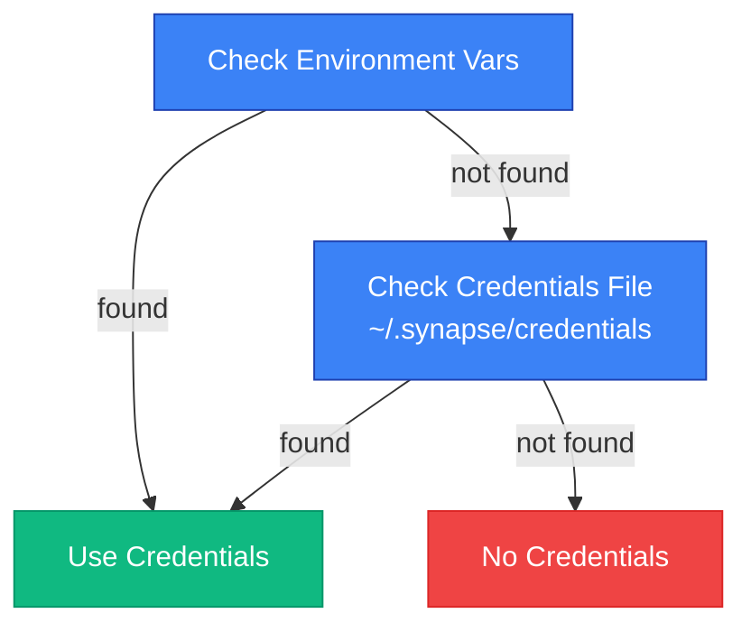

# Authentication Utilities

Credential loading utilities for SDK client authentication.

## Overview

The `synapse_sdk.utils.auth` module loads authentication information from environment variables or a credentials file. Credentials are automatically discovered when creating a BackendClient.

## Credential Priority

Credentials are searched in the following order:



1. **Environment variables**: `SYNAPSE_HOST`, `SYNAPSE_ACCESS_TOKEN`
2. **Credentials file**: `~/.synapse/credentials`

---

## Environment Variables

| Variable | Description | Required |
|----------|-------------|----------|
| `SYNAPSE_ACCESS_TOKEN` | API access token | Yes |
| `SYNAPSE_HOST` | API host URL | No (default: `https://api.synapse.sh`) |

### Configuration

```bash tab="bash"
export SYNAPSE_ACCESS_TOKEN="your-token"
export SYNAPSE_HOST="https://custom-api.example.com"
```

```bash tab="fish"
set -x SYNAPSE_ACCESS_TOKEN "your-token"
set -x SYNAPSE_HOST "https://custom-api.example.com"
```

```powershell tab="PowerShell"
$env:SYNAPSE_ACCESS_TOKEN = "your-token"
$env:SYNAPSE_HOST = "https://custom-api.example.com"
```

---

## Credentials File

If environment variables are not set, the module checks `~/.synapse/credentials`.

### File Format

```ini filename="~/.synapse/credentials"
# Synapse SDK Credentials
SYNAPSE_ACCESS_TOKEN=your-token-here
SYNAPSE_HOST=https://api.synapse.sh
```

> **Good to know**:
> - Lines starting with `#` are treated as comments
> - If an environment variable is set, the corresponding file value is ignored

### File Permissions

For security, restrict file permissions:

```bash
chmod 600 ~/.synapse/credentials
```

---

## Function Reference

### load_credentials()

Loads authentication information from environment variables or credentials file.

#### Signature

```python
def load_credentials() -> tuple[str | None, str | None]
```

#### Returns

| Index | Type | Description |
|-------|------|-------------|
| `[0]` | `str \| None` | Host URL (None if not found) |
| `[1]` | `str \| None` | Access token (None if not found) |

#### Example

```python filename="examples/auth_basic.py"
from synapse_sdk.utils.auth import load_credentials

host, token = load_credentials()

if token:
    print(f"Authenticated: {host}")
else:
    print("No credentials found")
```

---

### create_backend_client()

Creates a BackendClient if credentials are available.

#### Signature

```python
def create_backend_client() -> BackendClient | None
```

#### Returns

`BackendClient | None` - Client if credentials exist, None otherwise

#### Example

```python filename="examples/auto_client.py"
from synapse_sdk.utils.auth import create_backend_client

client = create_backend_client()

if client:
    # Credentials automatically loaded from environment
    project = client.get_project(project_id=1)
    print(f"Project: {project['name']}")
else:
    print("Set SYNAPSE_ACCESS_TOKEN to authenticate")
```

> **Good to know**: This function internally calls `load_credentials()`.

---

## Constants

| Constant | Value | Description |
|----------|-------|-------------|
| `ENV_SYNAPSE_HOST` | `'SYNAPSE_HOST'` | Host environment variable name |
| `ENV_SYNAPSE_ACCESS_TOKEN` | `'SYNAPSE_ACCESS_TOKEN'` | Token environment variable name |
| `DEFAULT_HOST` | `'https://api.synapse.sh'` | Default API host |
| `CREDENTIALS_FILE` | `~/.synapse/credentials` | Credentials file path |

---

## Full Example

```python filename="examples/auth_complete.py"
from synapse_sdk.utils.auth import (
    load_credentials,
    create_backend_client,
    ENV_SYNAPSE_ACCESS_TOKEN,
    DEFAULT_HOST,
)

# Method 1: Auto-create client
client = create_backend_client()
if client:
    print("Client created successfully")

# Method 2: Manual credential handling
host, token = load_credentials()
if token:
    from synapse_sdk.clients.backend import BackendClient

    custom_client = BackendClient(
        base_url=host or DEFAULT_HOST,
        access_token=token,
    )
```

---

## Troubleshooting

### Credentials Not Found

**Symptom**: `create_backend_client()` returns None

**Cause**: Token not found in both environment variables and credentials file

**Solution**:
1. Check environment variable: `echo $SYNAPSE_ACCESS_TOKEN`
2. Check file exists: `cat ~/.synapse/credentials`
3. Check file permissions: `ls -la ~/.synapse/credentials`

### Permission Denied on Credentials File

**Symptom**: `load_credentials()` returns `(None, None)` despite file existing

**Cause**: Insufficient read permissions on credentials file

**Solution**:
```bash
chmod 600 ~/.synapse/credentials
```

---

## Related

- [BackendClient](../api/clients/backend.md) - Client created by this module
- [Configuration](../configuration.md) - Full configuration guide
