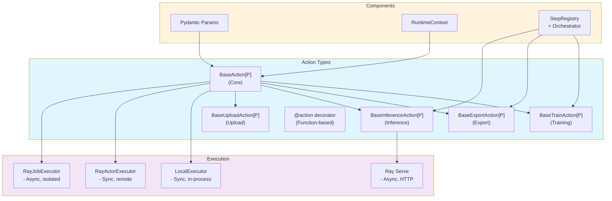
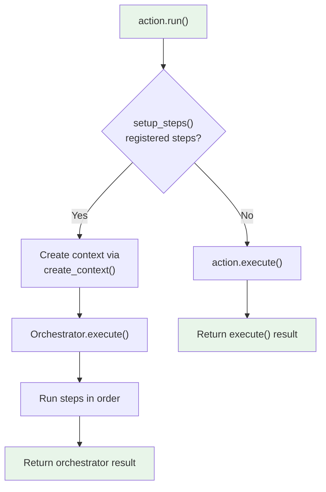

# Action Development Guide

Comprehensive guide for developing plugin actions in the Synapse SDK, including synchronous and asynchronous patterns.

## Overview

Actions are the fundamental units of work in the plugin system. This guide covers:
- Class-based and function-based action development
- Specialized action base classes
- Parameter validation and result schemas
- Progress tracking and logging
- Async execution patterns
- Step-based workflows within actions

## Architecture



---

## Class-Based Actions

### Basic Structure

Use `BaseAction[P]` for class-based actions with typed parameters:

```python
from synapse_sdk.plugins import BaseAction
from synapse_sdk.plugins.enums import PluginCategory
from pydantic import BaseModel, Field

class TrainParams(BaseModel):
    """Training parameters with validation."""
    epochs: int = Field(default=10, ge=1, le=1000)
    learning_rate: float = Field(default=0.001, gt=0, lt=1)
    batch_size: int = Field(default=32, ge=1)

class TrainResult(BaseModel):
    """Typed result schema."""
    weights_path: str
    final_loss: float
    epochs_completed: int

class TrainAction(BaseAction[TrainParams]):
    """Train a model with progress tracking."""

    # Optional metadata
    action_name = 'train'
    category = PluginCategory.NEURAL_NET

    # Optional: Enable result validation
    result_model = TrainResult

    def execute(self) -> TrainResult:
        # Access validated params
        epochs = self.params.epochs
        lr = self.params.learning_rate

        # Log start event
        self.log('train_start', {'epochs': epochs, 'lr': lr})

        # Training loop with progress
        for epoch in range(epochs):
            self.set_progress(epoch + 1, epochs, category='train')

            # Training logic...
            loss = train_epoch(epoch, lr)

            # Record metrics
            self.set_metrics({'loss': loss, 'epoch': epoch}, category='train')

        # Return typed result
        return TrainResult(
            weights_path='/model/weights.pt',
            final_loss=loss,
            epochs_completed=epochs,
        )
```

### BaseAction Class Attributes

| Attribute | Type | Description |
|-----------|------|-------------|
| `action_name` | `str | None` | Action identifier (from config if not set) |
| `category` | `PluginCategory | None` | Grouping category |
| `input_type` | `type[DataType] | None` | Semantic input type |
| `output_type` | `type[DataType] | None` | Semantic output type |
| `params_model` | `type[BaseModel]` | Auto-extracted from generic |
| `result_model` | `type[BaseModel] | NoResult` | Optional result schema |

### Instance Properties and Methods

```python
class MyAction(BaseAction[MyParams]):
    def execute(self) -> dict:
        # Params access
        value = self.params.some_field

        # Context access
        ctx = self.ctx
        logger = self.logger  # Shortcut to ctx.logger

        # Logging shortcuts
        self.log('event', {'data': value})
        self.set_progress(50, 100, category='process')
        self.set_metrics({'accuracy': 0.95}, category='eval')

        # ML framework autolog (ultralytics supported)
        self.autolog('ultralytics')

        return {'status': 'done'}
```

---

## Function-Based Actions

> **⚠️ DEPRECATED**: Function-based actions using the `@action` decorator are deprecated and will be removed in a future version. Please use class-based actions (extending `BaseAction`) instead. See the migration guide below.

Use the `@action` decorator for simple, stateless operations:

```python
from synapse_sdk.plugins import action
from synapse_sdk.plugins.context import RuntimeContext
from pydantic import BaseModel

class ConvertParams(BaseModel):
    input_format: str
    output_format: str
    file_path: str

class ConvertResult(BaseModel):
    output_path: str
    converted: bool

@action(
    name='convert',
    description='Convert file between formats',
    params=ConvertParams,
    result=ConvertResult,
)
def convert(params: ConvertParams, context: RuntimeContext) -> ConvertResult:
    """Convert a file from one format to another."""

    context.set_progress(0, 100)

    # Conversion logic
    output_path = convert_file(
        params.file_path,
        params.input_format,
        params.output_format,
    )

    context.set_progress(100, 100)

    return ConvertResult(output_path=output_path, converted=True)
```

### Decorator Parameters

| Parameter | Type | Description |
|-----------|------|-------------|
| `name` | `str | None` | Action name (defaults to function name) |
| `description` | `str` | Human-readable description |
| `params` | `type[BaseModel] | None` | Parameter validation model |
| `result` | `type[BaseModel] | None` | Result validation model |
| `category` | `PluginCategory | None` | Plugin category |

### When to Use Each Style

| Aspect | Class-Based | Function-Based |
|--------|-------------|----------------|
| Complexity | Complex, multi-method | Simple, single function |
| State | Instance state allowed | Stateless |
| Type declarations | `input_type`, `output_type` | Not supported |
| Autolog | `self.autolog()` | Not available |
| Step workflows | Via `setup_steps()` | Not supported |
| Testing | Easier mocking | Direct function calls |

### Migration Guide: Function to Class-Based Actions

To migrate from function-based to class-based actions:

**Before (Deprecated):**
```python
from synapse_sdk.plugins import action
from synapse_sdk.plugins.context import RuntimeContext

@action(params=ConvertParams, result=ConvertResult)
def convert(params: ConvertParams, context: RuntimeContext) -> ConvertResult:
    context.set_progress(0, 100)
    output_path = convert_file(params.file_path)
    context.set_progress(100, 100)
    return ConvertResult(output_path=output_path, converted=True)
```

**After (Recommended):**
```python
from synapse_sdk.plugins import BaseAction

class ConvertAction(BaseAction[ConvertParams]):
    result_model = ConvertResult  # Optional result validation

    def execute(self) -> ConvertResult:
        self.set_progress(0, 100)
        output_path = convert_file(self.params.file_path)
        self.set_progress(100, 100)
        return ConvertResult(output_path=output_path, converted=True)
```

**Benefits of class-based actions:**
- Better IDE support and type checking
- Support for step-based workflows
- Can use `input_type` and `output_type` for pipeline validation
- Access to `self.autolog()` for ML framework integration
- Easier to extend and maintain

---

## Specialized Base Actions

### BaseTrainAction

For ML training workflows with dataset fetching and model upload:

```python
from synapse_sdk.plugins.actions.train import BaseTrainAction, BaseTrainParams

class MyTrainParams(BaseTrainParams):
    """Extends base with custom fields."""
    dataset: int
    epochs: int = 100

class MyTrainAction(BaseTrainAction[MyTrainParams]):
    action_name = 'train'

    def execute(self) -> dict:
        # Use built-in helpers
        dataset = self.get_dataset()  # Fetches params.dataset
        checkpoint = self.get_checkpoint()  # Optional resume

        # Standard progress categories
        self.set_progress(1, 3, self.progress.DATASET)
        self.set_progress(2, 3, self.progress.TRAIN)
        self.set_progress(3, 3, self.progress.MODEL_UPLOAD)

        # Upload model
        model = self.create_model('./model', name='trained-model')

        return {'model_id': model['id']}
```

**Built-in Methods:**

| Method | Description |
|--------|-------------|
| `get_dataset()` | Fetch dataset via `params.dataset` |
| `get_checkpoint()` | Get training checkpoint (base model or resume) |
| `create_model(path, **kwargs)` | Upload trained model to backend |
| `get_model(model_id)` | Retrieve model metadata |
| `setup_steps(registry)` | Register step-based workflow |

### BaseExportAction

Full step-based export workflow with 6 built-in steps and automatic rollback:

```python
from synapse_sdk.plugins.actions.export import BaseExportAction, ExportParams, ExportContext
from synapse_sdk.plugins.steps import StepRegistry

class MyExportAction(BaseExportAction[ExportParams]):
    action_name = 'export'

    # Option 1: Use built-in 6-step workflow (default with DefaultExportAction)
    # No override needed

    # Option 2: Customize workflow
    def setup_steps(self, registry: StepRegistry[ExportContext]) -> None:
        # Add/remove/reorder steps as needed
        registry.register(MyCustomStep())
        super().setup_steps(registry)  # Add built-in steps
```

**Built-in Steps** (6 total):
1. `InitializeStep`: Storage/path setup, output directory creation
2. `FetchResultsStep`: Target handler data retrieval
3. `PrepareExportStep`: Export params build, project config retrieval
4. `ConvertDataStep`: Data conversion (before_convert -> convert_data -> after_convert)
5. `SaveFilesStep`: File saving (original_file + data_file)
6. `FinalizeStep`: Additional file saving, error list, cleanup

**Context**: `ExportContext` with results, export_items, converted_items, exported_count, failed_count

**Progress Categories**: `FETCH`, `DATASET_CONVERSION`, `ORIGINAL_FILE`, `DATA_FILE`

**Simple Execute Mode** (deprecated):

```python
from synapse_sdk.plugins.actions.export import BaseExportAction

class ExportParams(BaseModel):
    filter: dict
    output_format: str

class MyExportAction(BaseExportAction[ExportParams]):
    action_name = 'export'

    def get_filtered_results(self, filters: dict) -> tuple[Any, int]:
        # Override for your target type
        return self.client.get_assignments(filters)

    def execute(self) -> dict:
        results, count = self.get_filtered_results(self.params.filter)

        self.set_progress(0, count, self.progress.DATASET_CONVERSION)

        for i, item in enumerate(results, 1):
            # Process and export item
            self.set_progress(i, count)

        return {'exported': count}
```

**Built-in Methods:**

| Method | Description |
|--------|-------------|
| `get_filtered_results(filters)` | Fetch filtered results for export (override for your target type) |
| `get_storage(storage_id)` | Fetch storage configuration from backend |
| `get_project(project_id)` | Retrieve project metadata |
| `get_project_configuration(project_id)` | Get project configuration dict |
| `setup_steps(registry)` | Register step-based workflow |
| `create_context()` | Create ExportContext for workflow |

### BaseInferenceAction

For model inference workflows:

```python
from synapse_sdk.plugins.actions.inference import BaseInferenceAction

class InferParams(BaseModel):
    model_id: int
    inputs: list[dict]

class MyInferenceAction(BaseInferenceAction[InferParams]):
    action_name = 'infer'

    def infer(self, model: Any, inputs: list[dict]) -> list[dict]:
        # Override with your inference logic
        return [{'prediction': model.predict(inp)} for inp in inputs]

    def execute(self) -> dict:
        # Use built-in model loading
        model_info = self.load_model(self.params.model_id)
        model_path = model_info['path']

        self.set_progress(1, 3, self.progress.MODEL_LOAD)

        # Load your specific model
        import torch
        model = torch.load(f'{model_path}/model.pt')

        self.set_progress(2, 3, self.progress.INFERENCE)

        results = self.infer(model, self.params.inputs)

        return {'results': results}
```

**Built-in Methods:**

| Method | Description |
|--------|-------------|
| `get_model(model_id)` | Retrieve model metadata |
| `download_model(model_id, output_dir)` | Download and extract model artifacts |
| `load_model(model_id)` | Download + return model info with path |
| `infer(model, inputs)` | Override for inference logic |

### DatasetAction

Unified action for dataset download and conversion operations:

```python
from synapse_sdk.plugins.actions import DatasetAction, DatasetOperation, DatasetParams

class MyDatasetParams(DatasetParams):
    dataset: int
    operation: DatasetOperation = DatasetOperation.DOWNLOAD
    target_format: str | None = None

class MyDatasetAction(DatasetAction[MyDatasetParams]):
    action_name = 'dataset'

# Usage - download
result = run_plugin('plugin', 'dataset', {'dataset': 123, 'operation': 'download'})

# Usage - convert
result = run_plugin('plugin', 'dataset', {
    'dataset': 123,
    'operation': 'convert',
    'target_format': 'yolo'
})
```

**Operations:**
- `DOWNLOAD`: Download dataset from backend
- `CONVERT`: Convert dataset to target format

**Progress Categories**: `DATASET_DOWNLOAD`, `DATASET_CONVERSION`

### BaseUploadAction

Full step-based upload workflow with 7 built-in steps and automatic rollback:

```python
from synapse_sdk.plugins.actions.upload import BaseUploadAction, UploadParams, UploadContext
from synapse_sdk.plugins.steps import StepRegistry

class S3UploadAction(BaseUploadAction[UploadParams]):
    action_name = 'upload'

    # Option 1: Use built-in 7-step workflow (default)
    # No override needed

    # Option 2: Customize workflow
    def setup_steps(self, registry: StepRegistry[UploadContext]) -> None:
        # Add/remove/reorder steps as needed
        registry.register(MyCustomStep())
        super().setup_steps(registry)  # Add built-in steps
```

**Built-in Steps** (7 total):
1. `InitializeStep`: Set up upload context
2. `ValidateFilesStep`: Verify files exist and are accessible
3. `AnalyzeCollectionStep`: Analyze data collection structure
4. `OrganizeFilesStep`: Organize files for upload
5. `GenerateDataUnitsStep`: Generate data unit metadata
6. `UploadFilesStep`: Upload files to storage
7. `ProcessMetadataStep`: Process and save metadata
8. `CleanupStep`: Clean up temporary files

**Context**: `UploadContext` with organized_files, uploaded_files, data_units

### AddTaskDataAction

Pre-annotation workflows for task data preparation:

```python
from synapse_sdk.plugins.actions import AddTaskDataAction, AddTaskDataMethod, AddTaskDataParams

class MyAddTaskDataParams(AddTaskDataParams):
    method: AddTaskDataMethod = AddTaskDataMethod.FILE
    task_ids: list[int]
    # FILE method fields
    file_path: str | None = None
    # INFERENCE method fields
    model_id: int | None = None

class MyAddTaskDataAction(AddTaskDataAction[MyAddTaskDataParams]):
    action_name = 'add_task_data'
    # Built-in step orchestration included
```

**Methods:**
- `FILE`: Add task data from file annotations
- `INFERENCE`: Add task data from inference results

**Progress Category**: `ANNOTATE_TASK_DATA`

### BaseDeploymentAction

Ray Serve deployment workflows with deployment management:

```python
from synapse_sdk.plugins.actions.inference import BaseDeploymentAction, DeploymentContext

class MyDeploymentAction(BaseDeploymentAction[DeploymentParams]):
    action_name = 'deploy'

    def execute(self) -> dict:
        # Initialize Ray
        self.ray_init()

        # Deploy serve application
        app_name, app_id = self.deploy(
            deployment_class=MyServeDeployment,
            route_prefix='/predict',
        )

        # Register with backend
        self.register_serve_application(app_name, app_id)

        return {'app_name': app_name, 'app_id': app_id}
```

**Built-in Methods:**
- `ray_init()`: Initialize Ray cluster connection
- `deploy()`: Deploy Ray Serve application
- `register_serve_application()`: Register deployment with backend

### BaseServeDeployment

Ray Serve inference endpoint with model multiplexing:

```python
from synapse_sdk.plugins.actions.inference import BaseServeDeployment
from ray import serve
from fastapi import FastAPI

app = FastAPI()

@serve.deployment(num_replicas=2)
@serve.ingress(app)
class MyServeDeployment(BaseServeDeployment):
    """Async inference service with model caching."""

    async def _get_model(self, model_info: dict):
        """Load model from extracted artifacts."""
        import torch
        model_path = model_info['path'] / 'model.pt'
        return torch.load(model_path)

    async def infer(self, inputs: list[dict]) -> list[dict]:
        """Run inference on inputs."""
        model = await self.get_model()  # Cached, multiplexed loading
        return [{'prediction': model.predict(inp)} for inp in inputs]

    @app.post('/predict')
    async def predict(self, request: dict) -> dict:
        results = await self.infer(request['inputs'])
        return {'results': results}
```

**Features:**
- **Model Multiplexing**: JWT-based model selection per request
- **Model Caching**: Automatic model caching for performance
- **Async Support**: Full async/await pattern

**Built-in Methods:**
- `_get_model(model_info)`: Abstract - implement model loading
- `infer(inputs)`: Abstract - implement inference logic
- `get_model()`: Get current model (cached, multiplexed)
- `_load_model_from_token()`: Load model from JWT token

---

## Step-Based Workflows

Specialized actions support step-based execution via `setup_steps()`:

```python
from synapse_sdk.plugins.actions.train import BaseTrainAction, TrainContext
from synapse_sdk.plugins.steps import BaseStep, StepResult, StepRegistry

class LoadDatasetStep(BaseStep[TrainContext]):
    @property
    def name(self) -> str:
        return 'load_dataset'

    @property
    def progress_weight(self) -> float:
        return 0.2

    def execute(self, context: TrainContext) -> StepResult:
        # Load dataset into context
        context.dataset = load_dataset(context.params['dataset'])
        return StepResult(success=True, data={'count': len(context.dataset)})

class TrainStep(BaseStep[TrainContext]):
    @property
    def name(self) -> str:
        return 'train'

    @property
    def progress_weight(self) -> float:
        return 0.7

    def execute(self, context: TrainContext) -> StepResult:
        epochs = context.params.get('epochs', 100)

        for epoch in range(epochs):
            context.set_progress(epoch + 1, epochs)
            # Training logic...

        return StepResult(success=True)

class MyTrainAction(BaseTrainAction[MyParams]):
    def setup_steps(self, registry: StepRegistry[TrainContext]) -> None:
        """Register workflow steps."""
        registry.register(LoadDatasetStep())
        registry.register(TrainStep())
        # Step-based execution replaces execute()
```

**Execution Flow:**



---

## Async Execution Patterns

### Ray Serve Deployments

For HTTP inference endpoints with async handling:

```python
from ray import serve
from fastapi import FastAPI
from synapse_sdk.plugins.actions.inference import BaseServeDeployment

app = FastAPI()

@serve.deployment(num_replicas=2)
@serve.ingress(app)
class MyInferenceService(BaseServeDeployment):
    """Async inference service with model multiplexing."""

    async def _get_model(self, model_info: dict) -> Any:
        """Load model from extracted artifacts."""
        import torch
        model_path = model_info['path'] / 'model.pt'
        return torch.load(model_path)

    async def infer(self, inputs: list[dict]) -> list[dict]:
        """Run inference on inputs."""
        model = await self.get_model()  # Multiplexed model loading
        results = []
        for inp in inputs:
            prediction = model.predict(inp['data'])
            results.append({'prediction': prediction.tolist()})
        return results

    @app.post('/predict')
    async def predict(self, request: dict) -> dict:
        results = await self.infer(request['inputs'])
        return {'results': results}

# Deploy
deployment = MyInferenceService.bind(backend_url='https://api.example.com')
serve.run(deployment)
```

### Async Progress Streaming

For async progress monitoring:

```python
from synapse_sdk.plugins.pipelines import ActionPipeline
from synapse_sdk.plugins.pipelines.display import display_progress_async
from synapse_sdk.plugins.executors.ray import RayPipelineExecutor

async def run_pipeline_async():
    pipeline = ActionPipeline([DownloadAction, ProcessAction, UploadAction])
    executor = RayPipelineExecutor(
        ray_address='auto',
        pipeline_service_url='http://localhost:8100',
    )

    # Submit pipeline
    run_id = pipeline.submit({'dataset': 123}, executor)

    # Async progress streaming with Rich display
    final = await display_progress_async(
        executor.stream_progress_async(run_id)
    )

    print(f"Pipeline completed: {final.status}")
    return final
```

### Async Iteration Pattern

Manual async progress handling:

```python
async def monitor_progress(executor, run_id):
    """Custom async progress monitoring."""
    async for progress in executor.stream_progress_async(run_id):
        print(f"Status: {progress.status}")
        print(f"Progress: {progress.overall_progress}%")

        if progress.current_action:
            action = progress.actions[progress.current_action]
            print(f"Current: {action.name} - {action.progress * 100}%")

        # Custom handling
        if progress.status in ('COMPLETED', 'FAILED'):
            break

    return progress
```

---

## Execution Modes

### Local Execution

Synchronous, in-process execution for development:

```python
from synapse_sdk.plugins import run_plugin

result = run_plugin(
    plugin_code='my_plugin',
    action='train',
    params={'epochs': 10},
    mode='local',
)
```

Or with explicit executor:

```python
from synapse_sdk.plugins.executors import LocalExecutor

executor = LocalExecutor(
    env={'DEBUG': 'true'},
    job_id='dev-123',
)
result = executor.execute(TrainAction, {'epochs': 10})
```

### Ray Task Execution

Fast startup with persistent actor:

```python
from synapse_sdk.plugins.executors.ray import RayActorExecutor

executor = RayActorExecutor(
    ray_address='auto',
    working_dir='/path/to/plugin',
    num_gpus=1,
    include_sdk=True,  # For local SDK development
)

result = executor.execute(TrainAction, {'epochs': 100})
executor.shutdown()  # Clean up actor
```

### Ray Job Execution

Full isolation for production workloads:

```python
from synapse_sdk.plugins.executors.ray import RayJobExecutor

executor = RayJobExecutor(
    dashboard_url='http://ray-cluster:8265',
    working_dir='/path/to/plugin',
)

# Async submission
job_id = executor.submit('train', {'epochs': 100})

# Monitor status
status = executor.get_status(job_id)
logs = executor.get_logs(job_id)

# Wait for completion
result = executor.wait(job_id, timeout_seconds=3600)
```

### Ray Jobs API Execution

Modern Ray Jobs API with improved cluster compatibility:

```python
from synapse_sdk.plugins.executors.ray import RayJobsApiExecutor

executor = RayJobsApiExecutor(
    dashboard_url='http://ray-cluster:8265',
    working_dir='/path/to/plugin',
    runtime_env={
        'pip': ['ultralytics>=8.0'],
    },
)

# Same interface as RayJobExecutor
job_id = executor.submit('train', {'epochs': 100})
status = executor.get_status(job_id)
result = executor.wait(job_id, timeout_seconds=3600)
```

**Note**: `RayJobsApiExecutor` provides better compatibility with newer Ray clusters. Use this for production deployments with Ray 2.0+.

### Execution Mode Comparison

| Mode | Startup | Isolation | Use Case |
|------|---------|-----------|----------|
| `local` | Instant | None | Development, testing |
| `task` | <1s | Process | Fast parallel tasks |
| `job` | ~30s | Full | Production, heavy workloads |
| Ray Serve | Variable | Container | HTTP inference endpoints |

---

## Parameter Validation

### Pydantic Models

Use Pydantic v2 for comprehensive validation:

```python
from pydantic import BaseModel, Field, field_validator, model_validator

class TrainParams(BaseModel):
    """Training parameters with validation."""

    # Required with constraints
    dataset: int = Field(..., gt=0, description='Dataset identifier')

    # Optional with defaults
    epochs: int = Field(default=100, ge=1, le=10000)
    learning_rate: float = Field(default=0.001, gt=0, lt=1)
    batch_size: int = Field(default=32, ge=1, le=512)

    # String validation
    model_name: str = Field(default='yolov8n', pattern=r'^yolov8[nsmlx]$')

    # List validation
    augmentations: list[str] = Field(default_factory=list)

    @field_validator('augmentations')
    @classmethod
    def validate_augmentations(cls, v):
        valid = {'flip', 'rotate', 'scale', 'mosaic'}
        invalid = set(v) - valid
        if invalid:
            raise ValueError(f"Invalid augmentations: {invalid}")
        return v

    @model_validator(mode='after')
    def validate_batch_epochs(self):
        if self.batch_size > 256 and self.epochs > 1000:
            raise ValueError("Large batch + many epochs may OOM")
        return self
```

### Accessing Validated Params

```python
class MyAction(BaseAction[TrainParams]):
    def execute(self) -> dict:
        # Params are already validated
        dataset = self.params.dataset  # int, > 0
        epochs = self.params.epochs  # int, 1-10000

        # Type hints work correctly
        lr: float = self.params.learning_rate

        return {'trained': True}
```

---

## Result Validation

### Defining Result Models

```python
from pydantic import BaseModel

class TrainResult(BaseModel):
    """Typed training result."""
    weights_path: str
    final_loss: float
    epochs_completed: int
    metrics: dict[str, float] = {}

class MyAction(BaseAction[TrainParams]):
    result_model = TrainResult  # Enable validation

    def execute(self) -> TrainResult:
        # Return typed result
        return TrainResult(
            weights_path='/model/weights.pt',
            final_loss=0.05,
            epochs_completed=100,
            metrics={'accuracy': 0.95},
        )
```

### Warning-Only Validation

Result validation is warning-only by default:

```python
class MyAction(BaseAction[MyParams]):
    result_model = TrainResult

    def execute(self) -> dict:
        # This returns dict, not TrainResult
        # Warning logged, but execution continues
        return {'weights_path': '/model.pt'}
        # Warning: Result validation warning for TrainResult: ...
```

---

## Progress Tracking

### Basic Progress

```python
def execute(self) -> dict:
    total = 100

    for i in range(total):
        self.set_progress(i + 1, total)
        # Process item...

    return {'processed': total}
```

### Multi-Phase Progress

```python
def execute(self) -> dict:
    # Phase 1: Download
    self.set_progress(0, 100, category='download')
    for i in range(100):
        self.set_progress(i + 1, 100, category='download')
        # Download chunk...

    # Phase 2: Process
    self.set_progress(0, 50, category='process')
    for i in range(50):
        self.set_progress(i + 1, 50, category='process')
        # Process item...

    return {'status': 'done'}
```

### Standard Progress Categories

Specialized actions provide standard category names:

```python
class MyTrainAction(BaseTrainAction[MyParams]):
    def execute(self) -> dict:
        # Use standard categories
        self.set_progress(1, 3, self.progress.DATASET)      # 'dataset'
        self.set_progress(2, 3, self.progress.TRAIN)        # 'train'
        self.set_progress(3, 3, self.progress.MODEL_UPLOAD) # 'model_upload'
```

---

## Logging and Metrics

### Event Logging

```python
def execute(self) -> dict:
    # Structured event logging
    self.log('train_start', {
        'epochs': self.params.epochs,
        'learning_rate': self.params.learning_rate,
    })

    # Log with file association
    self.log('checkpoint_saved', {'epoch': 50}, file='/model/ckpt_50.pt')

    # Final event
    self.log('train_complete', {'final_loss': 0.05})

    return {'status': 'done'}
```

### Metrics Recording

```python
def execute(self) -> dict:
    for epoch in range(self.params.epochs):
        loss = train_epoch(epoch)

        # Record metrics per category
        self.set_metrics({
            'loss': loss,
            'accuracy': compute_accuracy(),
            'epoch': epoch,
        }, category='train')

    return {'final_loss': loss}
```

### Context Methods

Access via `self.ctx` for additional logging:

```python
def execute(self) -> dict:
    # User-facing message
    self.ctx.log_message('Starting training...', context='info')
    self.ctx.log_message('Training complete!', context='success')
    self.ctx.log_message('Low accuracy detected', context='warning')

    # Developer debug events (not shown to end users)
    self.ctx.log_dev_event('Checkpoint saved', {'path': '/ckpt/model.pt'})

    return {'status': 'done'}
```

---

## Config.yaml Integration

Define actions in `config.yaml` for discovery:

```yaml
# my_plugin/config.yaml
name: My Plugin
code: my_plugin
version: 0.1.0
category: neural_net

actions:
  train:
    name: Train Model
    description: Train a model with custom parameters
    entrypoint: my_plugin.actions:TrainAction
    method: task

  export:
    name: Export Model
    description: Export model to various formats
    entrypoint: my_plugin.actions:ExportAction
    method: local

  infer:
    name: Run Inference
    description: Run batch inference
    entrypoint: my_plugin.actions:InferAction
    method: job
```

**Discovery:**

```python
from synapse_sdk.plugins.discovery import PluginDiscovery

# From config path
discovery = PluginDiscovery.from_path('/path/to/plugin')

# List actions
actions = discovery.list_actions()  # ['train', 'export', 'infer']

# Get action class
TrainAction = discovery.get_action_class('train')
```

---

## Best Practices

### Action Design

1. **Single Responsibility**: One action = one task
2. **Idempotent Operations**: Safe to retry on failure
3. **Progress Updates**: Update frequently for user feedback
4. **Structured Logging**: Use consistent event names

### Error Handling

```python
from synapse_sdk.plugins.errors import ExecutionError, ValidationError

def execute(self) -> dict:
    # Validate early
    if not Path(self.params.input_path).exists():
        raise ValidationError(f"Input not found: {self.params.input_path}")

    try:
        result = process_data(self.params.input_path)
    except IOError as e:
        raise ExecutionError(f"Processing failed: {e}") from e

    return result
```

### Resource Cleanup

```python
def execute(self) -> dict:
    temp_dir = None
    try:
        temp_dir = Path(tempfile.mkdtemp())
        # Use temp_dir...
        return {'status': 'done'}
    finally:
        if temp_dir and temp_dir.exists():
            shutil.rmtree(temp_dir)
```

### Testing Actions

```python
import pytest
from synapse_sdk.plugins.executors import LocalExecutor
from synapse_sdk.loggers import NoOpLogger
from synapse_sdk.plugins.context import RuntimeContext, PluginEnvironment

def test_train_action():
    """Test action with mock context."""
    executor = LocalExecutor(
        env={'DEBUG': 'true'},
        job_id='test-123',
    )

    result = executor.execute(
        TrainAction,
        {'epochs': 5, 'learning_rate': 0.01},
    )

    assert result['epochs_completed'] == 5
    assert 'weights_path' in result
```

---

## Module Reference

| Module | Classes | Purpose |
|--------|---------|---------|
| `synapse_sdk.plugins` | `BaseAction`, `action`, `run_plugin` | Core action API |
| `synapse_sdk.plugins.actions` | `ActionRegistry`, `ActionSpec`, `ActionType` | Action registry system |
| `synapse_sdk.plugins.actions.dataset` | `DatasetAction`, `DatasetOperation` | Dataset download/conversion |
| `synapse_sdk.plugins.actions.train` | `BaseTrainAction`, `BaseTrainParams`, `TrainContext` | Training workflows |
| `synapse_sdk.plugins.actions.export` | `BaseExportAction`, `ExportContext` | Export workflows |
| `synapse_sdk.plugins.actions.upload` | `BaseUploadAction`, `UploadContext` | Upload workflows (7 steps) |
| `synapse_sdk.plugins.actions.add_task_data` | `AddTaskDataAction`, `AddTaskDataMethod` | Pre-annotation workflows |
| `synapse_sdk.plugins.actions.inference` | `BaseInferenceAction`, `BaseDeploymentAction`, `BaseServeDeployment` | Inference/deployment workflows |
| `synapse_sdk.plugins.context` | `RuntimeContext`, `PluginEnvironment` | Action context |
| `synapse_sdk.plugins.executors` | `LocalExecutor` | Local execution |
| `synapse_sdk.plugins.executors.ray` | `RayActorExecutor`, `RayJobExecutor`, `RayJobsApiExecutor` | Ray execution |
| `synapse_sdk.plugins.pipelines` | `ActionPipeline`, `PipelineProgress` | Multi-action pipelines |
| `synapse_sdk.plugins.schemas` | `TrainResult`, `InferenceResult`, `UploadResult` | Standard result types |
| `synapse_sdk.utils.converters` | `FromDMConverter`, `ToDMConverter`, `get_converter` | Dataset format converters |

---

## Related Documentation

- **[PLUGIN_STRUCTURE_GUIDE.md](PLUGIN_STRUCTURE_GUIDE.md)** - Complete plugin structure with step orchestration
- **[OVERVIEW.md](OVERVIEW.md)** - Plugin system introduction
- **[ARCHITECTURE.md](ARCHITECTURE.md)** - Technical architecture
- **[STEP.md](STEP.md)** - Step implementations
- **[LOGGING_SYSTEM.md](LOGGING_SYSTEM.md)** - Logging and progress
- **[PIPELINE_GUIDE.md](PIPELINE_GUIDE.md)** - Multi-action pipelines
