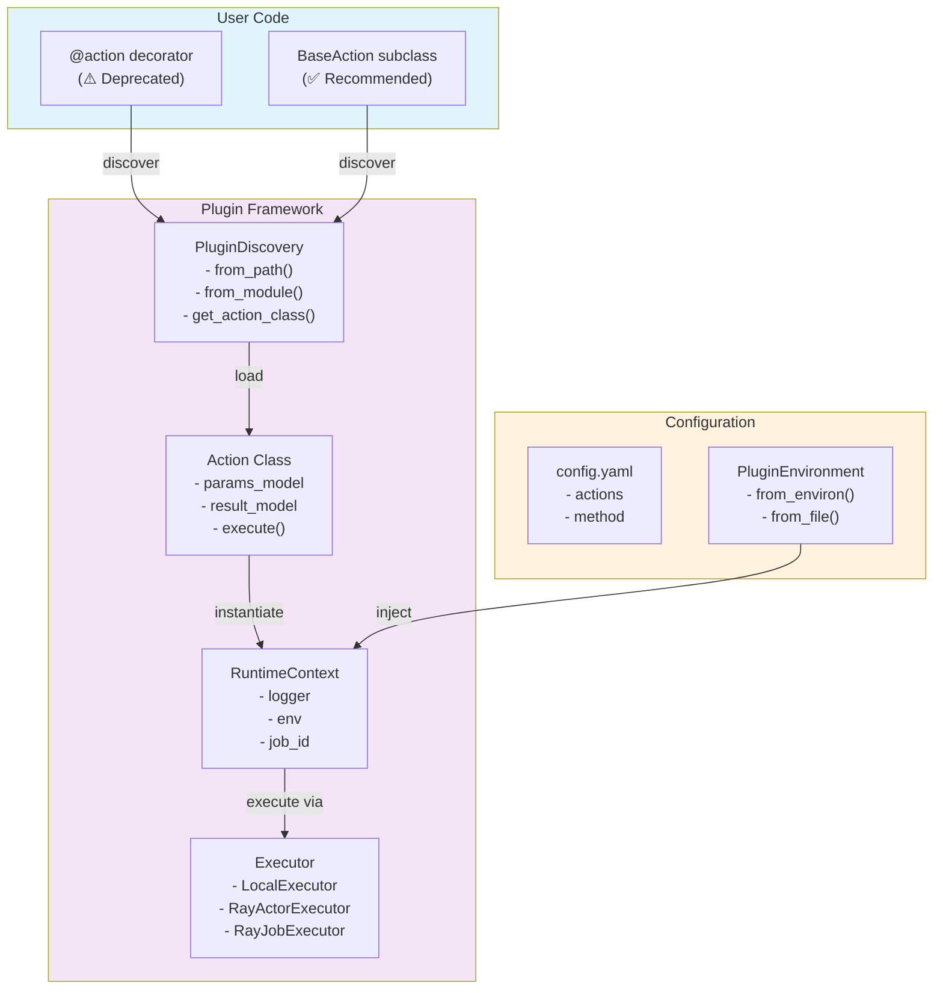
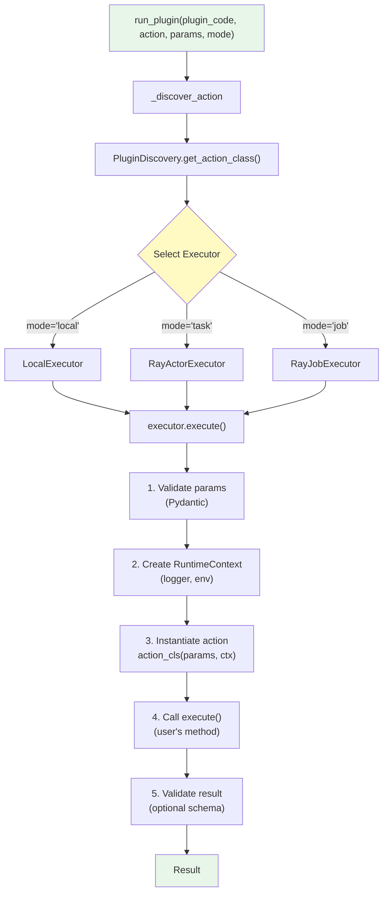
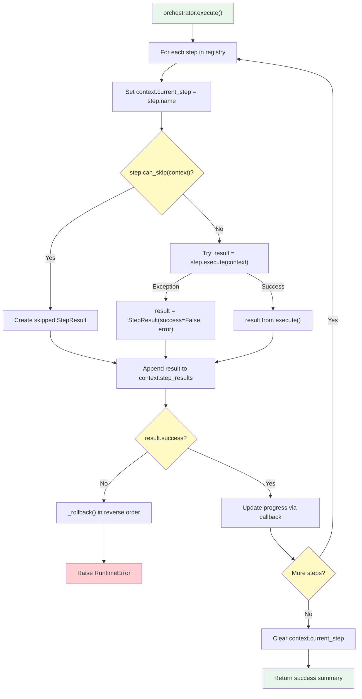

# Plugin System Architecture

This document provides a detailed technical overview of the Synapse SDK plugin system architecture, covering all major components, their interactions, and extension points.

---

## System Architecture

### High-Level Overview



### Component Interaction Flow



---

## Core Components

### BaseAction[P] - Action Base Class

Location: `synapse_sdk/plugins/action.py`

The `BaseAction` class is a generic abstract base class parameterized by a Pydantic model type `P` representing the action's parameters.

#### Class Definition

```python
from abc import ABC, abstractmethod
from typing import Generic, TypeVar
from pydantic import BaseModel

P = TypeVar('P', bound=BaseModel)

class BaseAction(ABC, Generic[P]):
    # Class attributes (optional, can be injected from config)
    action_name: str | None = None
    category: PluginCategory | None = None

    # Semantic type declarations for pipeline validation
    input_type: type[DataType] | None = None
    output_type: type[DataType] | None = None

    # Auto-extracted from generic parameter
    params_model: type[P]

    # Optional result schema for validation
    result_model: type[BaseModel] | type[NoResult] = NoResult

    # Instance attributes (set in __init__)
    params: P
    ctx: RuntimeContext

    @abstractmethod
    def execute(self) -> Any:
        """Execute the action logic."""
        ...
```

#### Generic Parameter Extraction

The `params_model` is automatically extracted from the generic type parameter via `__init_subclass__`:

```python
class TrainParams(BaseModel):
    epochs: int = 10

class TrainAction(BaseAction[TrainParams]):  # P = TrainParams
    pass

# After class creation:
TrainAction.params_model  # == TrainParams (auto-extracted)
```

#### Complete Implementation Example

```python
from synapse_sdk.plugins import BaseAction
from synapse_sdk.plugins.enums import PluginCategory
from synapse_sdk.plugins.types import YOLODataset, ModelWeights
from pydantic import BaseModel, Field

class TrainParams(BaseModel):
    """Training parameters."""
    epochs: int = Field(default=100, ge=1, le=1000)
    batch_size: int = Field(default=16, ge=1, le=256)
    learning_rate: float = Field(default=0.001, gt=0)
    model_size: str = Field(default='n', pattern='^[nsmlx]$')

class TrainResult(BaseModel):
    """Training result."""
    weights_path: str
    final_loss: float
    best_map: float

class YOLOTrainAction(BaseAction[TrainParams]):
    """Train a YOLO model on a dataset."""

    # Metadata (optional, can come from config.yaml)
    action_name = 'train'
    category = PluginCategory.NEURAL_NET

    # Semantic types for pipeline compatibility
    input_type = YOLODataset
    output_type = ModelWeights

    # Enable result validation
    result_model = TrainResult

    def execute(self) -> TrainResult:
        # Enable automatic framework logging
        self.autolog('ultralytics')

        # Access parameters
        epochs = self.params.epochs
        batch_size = self.params.batch_size

        # Log start event
        self.log('train_start', {
            'epochs': epochs,
            'batch_size': batch_size,
        })

        # Training loop with progress tracking
        model = self._create_model()

        for epoch in range(epochs):
            loss = self._train_epoch(model, epoch)
            self.set_progress(epoch + 1, epochs, category='train')
            self.set_metrics({'loss': loss}, category='epoch')

        # Save model
        weights_path = self._save_model(model)

        # Log completion
        self.log('train_complete', {'weights_path': weights_path})

        return TrainResult(
            weights_path=weights_path,
            final_loss=model.final_loss,
            best_map=model.best_map,
        )

    def _create_model(self):
        # Model creation logic
        ...

    def _train_epoch(self, model, epoch):
        # Training epoch logic
        ...

    def _save_model(self, model):
        # Model saving logic
        ...
```

#### Method Reference

| Method | Description |
|--------|-------------|
| `execute()` | Abstract. Implement your action logic here. |
| `log(event, data, file=None)` | Log a structured event. |
| `set_progress(current, total, category=None)` | Update progress tracking. |
| `set_metrics(value, category)` | Record metrics for a category. |
| `autolog(framework)` | Enable automatic logging for ML frameworks. |

| Property | Description |
|----------|-------------|
| `logger` | Access the logger from context. |
| `params` | Validated parameters (Pydantic model instance). |
| `ctx` | RuntimeContext with services. |

---

### RuntimeContext - Dependency Injection Container

Location: `synapse_sdk/plugins/context/__init__.py`

The `RuntimeContext` provides runtime services to actions.

#### Structure

```python
from dataclasses import dataclass
from typing import Any

@dataclass
class RuntimeContext:
    """Runtime context for action execution."""

    logger: BaseLogger          # Logging interface
    env: dict[str, Any]        # Environment variables
    job_id: str | None = None  # Job tracking ID
    client: BackendClient | None = None  # API client
    agent_client: AgentClient | None = None  # Ray operations
    checkpoint: dict | None = None  # Pretrained model info
```

#### Usage Patterns

```python
def execute(self) -> dict:
    # Logging
    self.ctx.logger.info('Starting execution')
    self.ctx.logger.warning('Rate limit approaching')
    self.ctx.logger.error('Failed to connect')

    # Environment access
    api_key = self.ctx.env.get('API_KEY', '')
    debug_mode = self.ctx.env.get('DEBUG', 'false') == 'true'

    # Structured logging
    self.ctx.log('process_start', {'input_size': 1000})

    # Progress tracking (with optional category)
    self.ctx.set_progress(50, 100)  # 50% complete
    self.ctx.set_progress(5, 10, category='download')  # Category-specific

    # Metrics recording
    self.ctx.set_metrics({'loss': 0.05}, category='train')
    self.ctx.set_metrics({'accuracy': 0.95}, category='eval')

    # User-visible messages
    self.ctx.log_message('Model training complete!')

    # Developer debug events
    self.ctx.log_dev_event('checkpoint_saved', {'epoch': 10})

    # Finalize logging
    self.ctx.end_log()

    return {'status': 'done'}
```

---

### PluginEnvironment - Configuration Management

Location: `synapse_sdk/plugins/context/env.py`

Type-safe configuration loading from environment or files.

#### Loading Methods

```python
from synapse_sdk.plugins.context.env import PluginEnvironment

# From environment variables with prefix
# PLUGIN_API_KEY=xxx, PLUGIN_BATCH_SIZE=32, etc.
env = PluginEnvironment.from_environ(prefix='PLUGIN_')

# From TOML file
env = PluginEnvironment.from_file('config.toml')

# From explicit dictionary
env = PluginEnvironment({'API_KEY': 'xxx', 'BATCH_SIZE': 32})

# Merge environments (later values override)
merged = env1.merge(env2)
```

#### Type-Safe Getters

```python
# String (required - raises if missing)
api_key = env.get_str('API_KEY')

# String with default
mode = env.get_str('MODE', default='production')

# Integer
batch_size = env.get_int('BATCH_SIZE', default=32)

# Float
learning_rate = env.get_float('LEARNING_RATE', default=0.001)

# Boolean (true/false, 1/0, yes/no)
debug = env.get_bool('DEBUG', default=False)

# List (comma-separated string or actual list)
tags = env.get_list('TAGS', default=[])
```

---

### PluginConfig & ActionConfig

Location: `synapse_sdk/plugins/config.py`

Configuration models for plugin metadata.

#### ActionConfig

```python
from pydantic import BaseModel
from synapse_sdk.plugins.enums import RunMethod

class ActionConfig(BaseModel):
    name: str                           # Display name
    description: str = ''               # Human-readable description
    entrypoint: str                     # Module path (module:Class or module.Class)
    method: RunMethod = RunMethod.TASK  # Execution method
    params_schema: type[BaseModel] | None = None  # Parameter schema
    input_type: str | None = None       # Semantic input type name
    output_type: str | None = None      # Semantic output type name
```

#### PluginConfig

```python
class PluginConfig(BaseModel):
    name: str                           # Plugin display name
    code: str                           # Unique identifier
    version: str = '0.1.0'              # Semantic version
    category: PluginCategory            # Plugin category

    # Package management
    package_manager: PackageManager = PackageManager.PIP
    package_manager_options: list[str] = []
    wheels_dir: str = 'wheels'

    # Runtime configuration
    env: dict[str, Any] = {}            # Default environment
    runtime_env: dict[str, Any] = {}    # Ray runtime_env

    # Data type configuration
    data_type: DataType | None = None   # IMAGE, TEXT, VIDEO, etc.
    tasks: list[str] = []               # Supported annotation tasks

    # Smart tool configuration
    annotation_category: AnnotationCategory | None = None
    annotation_type: AnnotationType | None = None
    smart_tool: SmartToolType | None = None

    # Actions
    actions: dict[str, ActionConfig] = {}
```

#### config.yaml Example

```yaml
name: YOLO Training Plugin
code: yolo_train
version: 1.0.0
category: neural_net
data_type: image
package_manager: uv

env:
  DEFAULT_MODEL: yolov8n.pt
  MAX_EPOCHS: 300

runtime_env:
  pip:
    - ultralytics>=8.0.0
    - torch>=2.0.0

actions:
  train:
    name: Train YOLO Model
    description: Train a YOLO model on a labeled dataset
    entrypoint: yolo_plugin.actions:TrainAction
    method: job
    input_type: YOLODataset
    output_type: ModelWeights

  export:
    name: Export Model
    description: Export trained model to ONNX format
    entrypoint: yolo_plugin.actions:ExportAction
    method: task
    input_type: ModelWeights
    output_type: ONNXModel
```

---

## Step-Based Workflow System

For complex multi-phase operations, use the step-based workflow system.

### BaseStep[C] - Step Base Class

Location: `synapse_sdk/plugins/steps/base.py`

```python
from abc import ABC, abstractmethod

class BaseStep[C: BaseStepContext](ABC):
    """Abstract base for workflow steps."""

    @property
    @abstractmethod
    def name(self) -> str:
        """Unique step identifier."""
        ...

    @property
    @abstractmethod
    def progress_weight(self) -> float:
        """Weight for progress calculation (0.0-1.0)."""
        ...

    @abstractmethod
    def execute(self, context: C) -> StepResult:
        """Execute the step."""
        ...

    def can_skip(self, context: C) -> bool:
        """Optional skip condition."""
        return False

    def rollback(self, context: C, result: StepResult) -> None:
        """Optional cleanup on workflow failure."""
        pass
```

### StepResult - Step Outcome

```python
from dataclasses import dataclass, field
from datetime import datetime
from typing import Any

@dataclass
class StepResult:
    success: bool = True
    data: dict[str, Any] = field(default_factory=dict)
    error: str | None = None
    rollback_data: dict[str, Any] = field(default_factory=dict)
    skipped: bool = False
    timestamp: datetime = field(default_factory=datetime.now)
```

### Creating Custom Steps

```python
from synapse_sdk.plugins.steps import BaseStep, StepResult, BaseStepContext
from dataclasses import dataclass, field

# 1. Define context with shared state
@dataclass
class UploadContext(BaseStepContext):
    """Context for upload workflow."""
    files: list[str] = field(default_factory=list)
    uploaded_urls: list[str] = field(default_factory=list)
    total_bytes: int = 0

# 2. Implement steps
class ValidateFilesStep(BaseStep[UploadContext]):
    @property
    def name(self) -> str:
        return 'validate_files'

    @property
    def progress_weight(self) -> float:
        return 0.1  # 10% of workflow

    def execute(self, context: UploadContext) -> StepResult:
        # Validate each file exists
        missing = []
        for path in context.files:
            if not os.path.exists(path):
                missing.append(path)

        if missing:
            return StepResult(
                success=False,
                error=f"Missing files: {missing}",
            )

        # Calculate total size
        context.total_bytes = sum(
            os.path.getsize(f) for f in context.files
        )

        return StepResult(
            success=True,
            data={'total_bytes': context.total_bytes},
        )


class UploadFilesStep(BaseStep[UploadContext]):
    @property
    def name(self) -> str:
        return 'upload_files'

    @property
    def progress_weight(self) -> float:
        return 0.8  # 80% of workflow

    def execute(self, context: UploadContext) -> StepResult:
        uploaded = []

        for i, path in enumerate(context.files):
            # Report per-file progress
            context.set_progress(i, len(context.files))

            url = upload_to_storage(path)
            uploaded.append(url)
            context.uploaded_urls.append(url)

        return StepResult(
            success=True,
            data={'urls': uploaded},
            rollback_data={'urls': uploaded},  # For cleanup
        )

    def rollback(self, context: UploadContext, result: StepResult) -> None:
        # Clean up uploaded files on failure
        for url in result.rollback_data.get('urls', []):
            try:
                delete_from_storage(url)
            except Exception:
                context.errors.append(f"Failed to delete: {url}")


class FinalizeStep(BaseStep[UploadContext]):
    @property
    def name(self) -> str:
        return 'finalize'

    @property
    def progress_weight(self) -> float:
        return 0.1  # 10% of workflow

    def can_skip(self, context: UploadContext) -> bool:
        # Skip if nothing was uploaded
        return len(context.uploaded_urls) == 0

    def execute(self, context: UploadContext) -> StepResult:
        # Register uploads in database
        register_uploads(context.uploaded_urls)

        return StepResult(
            success=True,
            data={'finalized': True},
        )
```

### StepRegistry - Step Management

Location: `synapse_sdk/plugins/steps/registry.py`

```python
from synapse_sdk.plugins.steps import StepRegistry

# Create registry
registry = StepRegistry[UploadContext]()

# Register steps in order
registry.register(ValidateFilesStep())
registry.register(UploadFilesStep())
registry.register(FinalizeStep())

# Dynamic insertion
registry.insert_after('validate_files', CompressionStep())
registry.insert_before('finalize', VerifyStep())

# Remove step
registry.unregister('compression')

# Access steps
steps = registry.get_steps()  # Returns copy of step list
total = registry.total_weight  # Sum of all progress weights
```

### Orchestrator - Step Execution

Location: `synapse_sdk/plugins/steps/orchestrator.py`

```python
from synapse_sdk.plugins.steps import Orchestrator, StepRegistry

# Setup
registry = StepRegistry[UploadContext]()
registry.register(ValidateFilesStep())
registry.register(UploadFilesStep())
registry.register(FinalizeStep())

# Create context
context = UploadContext(
    runtime_ctx=runtime_ctx,
    files=['/data/file1.jpg', '/data/file2.jpg'],
)

# Optional progress callback
def on_progress(current: int, total: int):
    print(f"Progress: {current}/{total}%")

# Execute workflow
orchestrator = Orchestrator(
    registry=registry,
    context=context,
    progress_callback=on_progress,
)

try:
    result = orchestrator.execute()
    # {'success': True, 'steps_executed': 3, 'steps_total': 3}
    print(f"Uploaded: {context.uploaded_urls}")
except RuntimeError as e:
    print(f"Workflow failed: {e}")
    # Rollback already performed automatically
```

### Orchestrator Execution Flow



### Utility Steps

#### LoggingStep - Execution Logging

```python
from synapse_sdk.plugins.steps.utils import LoggingStep

# Wrap any step with logging
logged_upload = LoggingStep(UploadFilesStep())

# Will log:
# - step_start: {step: 'logged_upload_files'}
# - step_end: {step: 'logged_upload_files', elapsed: 1.23, success: True}
```

#### TimingStep - Execution Timing

```python
from synapse_sdk.plugins.steps.utils import TimingStep

# Wrap any step with timing
timed_upload = TimingStep(UploadFilesStep())

# Result will include:
# result.data['duration_seconds'] = 1.234567
```

#### ValidationStep - Context Validation

```python
from synapse_sdk.plugins.steps.utils import ValidationStep

def validate_files_exist(context: UploadContext) -> tuple[bool, str | None]:
    if not context.files:
        return False, "No files provided"
    return True, None

# Create validation step
validate_step = ValidationStep(
    validator=validate_files_exist,
    name='validate_input',
    progress_weight=0.05,
)
```

---

## Action Specializations

### BaseTrainAction

Location: `synapse_sdk/plugins/actions/train/`

Base class for ML training actions with step-based workflow support.

```python
from synapse_sdk.plugins.actions.train import BaseTrainAction, TrainContext
from synapse_sdk.plugins.steps import StepRegistry

class MyTrainAction(BaseTrainAction[TrainParams]):
    def setup_steps(self, registry: StepRegistry[TrainContext]) -> None:
        """Override to register training steps."""
        registry.register(PrepareDatasetStep())
        registry.register(InitModelStep())
        registry.register(TrainStep())
        registry.register(SaveModelStep())

    def execute(self) -> dict:
        # Base class handles step orchestration
        return super().execute()
```

TrainContext provides:
- `dataset`: Loaded dataset reference
- `model_path`: Path to model weights
- `model`: Model instance
- Progress categories: `DATASET`, `TRAIN`, `MODEL_UPLOAD`

### BaseExportAction

Location: `synapse_sdk/plugins/actions/export/`

Base class for export workflows with step-based orchestration support.

```python
from synapse_sdk.plugins.actions.export import BaseExportAction, ExportContext
from synapse_sdk.plugins.steps import StepRegistry

class MyExportAction(BaseExportAction[ExportParams]):
    def setup_steps(self, registry: StepRegistry[ExportContext]) -> None:
        registry.register(InitializeStep())
        registry.register(FetchResultsStep())
        registry.register(PrepareExportStep())
        registry.register(ConvertDataStep())
        registry.register(SaveFilesStep())
        registry.register(FinalizeStep())
```

ExportContext provides:
- `results`: Fetched results to export
- `export_items`: Generator of items to export
- `converted_items`: List of converted data items
- `exported_count`: Number of successfully exported items
- `failed_count`: Number of failed items
- Progress categories: `FETCH`, `DATASET_CONVERSION`, `ORIGINAL_FILE`, `DATA_FILE`

**Built-in Steps** (6 total):

#### 1. InitializeStep
- **Purpose**: Storage/path setup and output directory creation
- **Progress Weight**: 0.05
- **Context Updates**: storage, path_root, unique_export_path, output_paths
- **Rollback**: Removes created export directories

#### 2. FetchResultsStep
- **Purpose**: Target handler data retrieval from API
- **Progress Weight**: 0.10
- **Context Updates**: handler, results, total_count
- **Validation**: Checks target parameter, handles API errors

#### 3. PrepareExportStep
- **Purpose**: Build export params, retrieve project configuration
- **Progress Weight**: 0.10
- **Context Updates**: export_params, configuration, export_items
- **Skip Condition**: No results to export (total_count == 0)

#### 4. ConvertDataStep
- **Purpose**: Data conversion pipeline (before_convert -> convert_data -> after_convert)
- **Progress Weight**: 0.30
- **Context Updates**: converted_items
- **Features**: Iterates through export_items, applies conversion pipeline

#### 5. SaveFilesStep
- **Purpose**: Save original files and JSON data files
- **Progress Weight**: 0.35
- **Context Updates**: errors_json, errors_original, exported_count, failed_count
- **Features**: Parallel file saving, metrics tracking

#### 6. FinalizeStep
- **Purpose**: Additional file saving, error list generation, cleanup
- **Progress Weight**: 0.10
- **Context Updates**: output_path
- **Features**: Calls exporter's additional_file_saving, saves error list

**Simple Execute Mode** (deprecated):

```python
from synapse_sdk.plugins.actions.export import BaseExportAction, ExportContext

class ONNXExportAction(BaseExportAction[ExportParams]):
    def execute(self) -> dict:
        # Load model
        model = load_model(self.params.model_path)

        # Export to ONNX
        self.set_progress(0, 100, category='export')
        output_path = export_to_onnx(model, self.params.output_path)
        self.set_progress(100, 100, category='export')

        return {'output_path': output_path}
```

### BaseUploadAction

Location: `synapse_sdk/plugins/actions/upload/`

```python
from synapse_sdk.plugins.actions.upload import BaseUploadAction, UploadContext

class S3UploadAction(BaseUploadAction[UploadParams]):
    def setup_steps(self, registry: StepRegistry[UploadContext]) -> None:
        registry.register(ValidateFilesStep())
        registry.register(UploadToS3Step())
        registry.register(VerifyUploadStep())
```

UploadContext provides:
- `organized_files`: Files prepared for upload
- `uploaded_files`: Successfully uploaded file references
- `data_units`: Data unit tracking
- Progress categories: `VALIDATION`, `UPLOAD`, `FINALIZATION`

### BaseInferenceAction & BaseDeploymentAction

Location: `synapse_sdk/plugins/actions/inference/`

```python
from synapse_sdk.plugins.actions.inference import (
    BaseInferenceAction,
    BaseDeploymentAction,
    InferenceContext,
)

class YOLOInferenceAction(BaseInferenceAction[InferenceParams]):
    def execute(self) -> dict:
        # Load model
        self.set_progress(0, 100, category='model_download')
        model = load_model(self.params.model_path)
        self.set_progress(100, 100, category='model_download')

        # Run inference
        results = []
        images = self.params.images
        for i, image in enumerate(images):
            self.set_progress(i, len(images), category='inference')
            result = model.predict(image)
            results.append(result)

        return {'predictions': results}
```

### DatasetAction

Location: `synapse_sdk/plugins/actions/dataset/`

Unified action for dataset download and conversion workflows.

```python
from synapse_sdk.plugins.actions.dataset import (
    DatasetAction,
    DatasetOperation,
    DatasetParams,
)

class MyDatasetAction(DatasetAction[DatasetParams]):
    def execute(self) -> dict:
        if self.params.operation == DatasetOperation.DOWNLOAD:
            # Download dataset from backend
            dataset_path = self.download_dataset(self.params.dataset)
            return {'dataset_path': dataset_path}

        elif self.params.operation == DatasetOperation.CONVERT:
            # Convert dataset to target format
            output_path = self.convert_dataset(
                self.params.dataset,
                self.params.target_format
            )
            return {'output_path': output_path, 'format': self.params.target_format}
```

**Operations:**
- `DOWNLOAD`: Download dataset from backend
- `CONVERT`: Convert dataset between formats

**Progress Categories**: `DATASET_DOWNLOAD`, `DATASET_CONVERSION`

### AddTaskDataAction

Location: `synapse_sdk/plugins/actions/add_task_data/`

Pre-annotation workflows for task data preparation with FILE and INFERENCE methods.

```python
from synapse_sdk.plugins.actions.add_task_data import (
    AddTaskDataAction,
    AddTaskDataMethod,
    AddTaskDataContext,
)

class MyAddTaskDataAction(AddTaskDataAction[AddTaskDataParams]):
    # Built-in step workflows for FILE and INFERENCE methods
    # Automatically configured based on params.method
    pass
```

**Methods:**
- `FILE`: Load annotations from file and add to tasks
- `INFERENCE`: Run inference to generate annotations for tasks

**Built-in Steps:**
- FILE method: ValidateFileStep, LoadAnnotationsStep, ProcessTasksStep, UploadAnnotationsStep
- INFERENCE method: LoadModelStep, RunInferenceStep, FormatResultsStep, UploadAnnotationsStep

**Progress Category**: `ANNOTATE_TASK_DATA`

### BaseServeDeployment

Location: `synapse_sdk/plugins/actions/inference/serve.py`

Ray Serve deployment class for async inference endpoints with model multiplexing.

```python
from synapse_sdk.plugins.actions.inference import BaseServeDeployment
from ray import serve
from fastapi import FastAPI

app = FastAPI()

@serve.deployment(num_replicas=2)
@serve.ingress(app)
class YOLOServeDeployment(BaseServeDeployment):
    """YOLO inference service with model multiplexing."""

    async def _get_model(self, model_info: dict):
        """Load model from extracted artifacts."""
        from ultralytics import YOLO
        model_path = model_info['path'] / 'best.pt'
        return YOLO(str(model_path))

    async def infer(self, inputs: list[dict]) -> list[dict]:
        """Run inference on inputs."""
        model = await self.get_model()  # Cached, multiplexed
        results = []
        for inp in inputs:
            result = model.predict(inp['image'])
            results.append({'predictions': result[0].boxes.data.tolist()})
        return results

    @app.post('/predict')
    async def predict(self, request: dict) -> dict:
        results = await self.infer(request['inputs'])
        return {'results': results}
```

**Features:**
- **Model Multiplexing**: JWT token-based model selection per request
- **Model Caching**: Automatic caching of loaded models
- **Async Inference**: Full async/await support for concurrent requests
- **Backend Integration**: Automatic model download and extraction

**Built-in Methods:**
- `_get_model(model_info)`: Abstract - implement model loading logic
- `infer(inputs)`: Abstract - implement inference logic
- `get_model()`: Get current model (multiplexed via JWT, cached)
- `_load_model_from_token()`: Load model from JWT token
- `infer_remote(request)`: Remote inference endpoint handler

---

## Executor System

### LocalExecutor

Location: `synapse_sdk/plugins/executors/local.py`

Synchronous, in-process execution for development.

```python
from synapse_sdk.plugins.executors import LocalExecutor

executor = LocalExecutor(
    env={'DEBUG': 'true', 'API_KEY': 'xxx'},
    job_id='local-test-001',
)

result = executor.execute(
    action_cls=TrainAction,
    params={'epochs': 10, 'batch_size': 32},
)

# Result is returned directly
print(result)
```

### RayActorExecutor

Location: `synapse_sdk/plugins/executors/ray/task.py`

Persistent Ray Actor for serial task execution.

```python
from synapse_sdk.plugins.executors.ray import RayActorExecutor

executor = RayActorExecutor(
    working_dir='/path/to/plugin',  # Plugin source code
    num_gpus=1,                      # GPU allocation per task
    num_cpus=4,                      # CPU allocation per task
    runtime_env={                    # Additional Ray runtime_env
        'pip': ['torch>=2.0'],
    },
)

# Execute action on Ray cluster
result = executor.execute(
    action_cls=TrainAction,
    params={'epochs': 100},
)

# Cleanup actor
executor.shutdown()
```

### RayJobExecutor

Location: `synapse_sdk/plugins/executors/ray/job.py`

Full job isolation via Ray Job API.

```python
from synapse_sdk.plugins.executors.ray import RayJobExecutor

executor = RayJobExecutor(
    dashboard_url='http://ray-head:8265',
    working_dir='/path/to/plugin',
    runtime_env={
        'pip': ['ultralytics>=8.0'],
        'env_vars': {'CUDA_VISIBLE_DEVICES': '0'},
    },
)

# Submit job (returns immediately)
job_id = executor.submit(
    action_name='train',
    params={'epochs': 100},
)

# Monitor status
status = executor.get_status(job_id)
# Returns: 'PENDING', 'RUNNING', 'SUCCEEDED', 'FAILED', 'STOPPED'

# Stream logs
for line in executor.stream_logs(job_id):
    print(line)

# Wait for completion with timeout
result = executor.wait(job_id, timeout_seconds=3600)

# Or get logs after completion
logs = executor.get_logs(job_id)
```

### RayJobsApiExecutor

Location: `synapse_sdk/plugins/executors/ray/jobs_api.py`

Modern Ray Jobs API with improved cluster compatibility (recommended for Ray 2.0+).

```python
from synapse_sdk.plugins.executors.ray import RayJobsApiExecutor

executor = RayJobsApiExecutor(
    dashboard_url='http://ray-head:8265',
    working_dir='/path/to/plugin',
    runtime_env={
        'pip': ['ultralytics>=8.0'],
    },
)

# Same interface as RayJobExecutor
job_id = executor.submit('train', {'epochs': 100})
status = executor.get_status(job_id)
result = executor.wait(job_id, timeout_seconds=3600)
```

**Advantages over RayJobExecutor:**
- Better compatibility with Ray 2.0+ clusters
- Improved error handling and job status tracking
- Uses official Ray Jobs API endpoints

### RayPipelineExecutor

Location: `synapse_sdk/plugins/executors/ray/pipeline.py`

Multi-action workflow execution. See [PIPELINE_GUIDE.md](PIPELINE_GUIDE.md) for details.

```python
from synapse_sdk.plugins.pipelines import ActionPipeline
from synapse_sdk.plugins.executors.ray import RayPipelineExecutor

# Define pipeline
pipeline = ActionPipeline([
    DownloadAction,
    PreprocessAction,
    TrainAction,
    ExportAction,
])

# Create executor
executor = RayPipelineExecutor(
    ray_address='auto',
    working_dir='/path/to/plugin',
    pipeline_service_url='http://localhost:8100',
)

# Submit pipeline
run_id = pipeline.submit({'dataset': 123}, executor)

# Monitor progress
progress = executor.get_progress(run_id)

# Wait for result
result = pipeline.wait(run_id, executor)
```

---

## Plugin Discovery System

Location: `synapse_sdk/plugins/discovery.py`

### PluginDiscovery Class

```python
from synapse_sdk.plugins.discovery import PluginDiscovery

# Load from config file
discovery = PluginDiscovery.from_path('/path/to/plugin')

# Load from Python module
discovery = PluginDiscovery.from_module('my_plugin')

# List available actions
actions = discovery.list_actions()
# ['train', 'export', 'inference']

# Get action class with metadata injection
action_cls = discovery.get_action_class('train')
# action_cls.action_name == 'train' (injected from config)
# action_cls.category == PluginCategory.NEURAL_NET

# Get params model for validation
params_model = discovery.get_action_params_model('train')

# Get result model
result_model = discovery.get_action_result_model('train')

# Get semantic types
input_type = discovery.get_action_input_type('train')  # YOLODataset
output_type = discovery.get_action_output_type('train')  # ModelWeights
```

### UI Schema Generation

Generate FormKit UI schemas from Pydantic models:

```python
# Get UI schema for action params
ui_schema = discovery.get_action_ui_schema('train')

# Returns FormKit-compatible schema:
# {
#     '$formkit': 'group',
#     'children': [
#         {
#             '$formkit': 'number',
#             'name': 'epochs',
#             'label': 'Epochs',
#             'value': 10,
#             'validation': 'required|min:1|max:1000',
#         },
#         ...
#     ]
# }
```

### Config Synchronization

Update config.yaml from discovered code:

```python
# Discover actions and update config file
PluginDiscovery.sync_config_file('/path/to/plugin/config.yaml')

# This will:
# 1. Scan Python files for BaseAction subclasses
# 2. Extract entrypoints, input_type, output_type
# 3. Add new actions to config.yaml
# 4. Update existing action entrypoints
```

### Static Discovery (AST-Based)

Discover actions without importing (safer for broken modules):

```python
# Returns list of discovered action info
actions = PluginDiscovery.discover_actions('/path/to/plugin')

# Each action contains:
# {
#     'name': 'train',
#     'entrypoint': 'my_plugin.actions:TrainAction',
#     'input_type': 'YOLODataset',
#     'output_type': 'ModelWeights',
# }
```

---

## Type System

Location: `synapse_sdk/plugins/types.py`

### DataType Hierarchy

```python
class DataType:
    """Base class for semantic data types."""
    name: ClassVar[str]
    format: ClassVar[str | None] = None
    description: ClassVar[str] = ''

    @classmethod
    def is_compatible_with(cls, other: type[DataType]) -> bool:
        """Check if this type is compatible with another."""
        return issubclass(cls, other) or issubclass(other, cls)

# Built-in types
class Dataset(DataType):
    name = 'dataset'

class YOLODataset(Dataset):
    name = 'yolo_dataset'
    format = 'yolo'

class COCODataset(Dataset):
    name = 'coco_dataset'
    format = 'coco'

class Model(DataType):
    name = 'model'

class ModelWeights(Model):
    name = 'model_weights'

class ONNXModel(Model):
    name = 'onnx_model'
    format = 'onnx'
```

### Creating Custom Types

```python
from synapse_sdk.plugins.types import DataType

class CustomDataset(DataType):
    name = 'custom_dataset'
    format = 'custom'
    description = 'My custom dataset format'

class CustomModel(DataType):
    name = 'custom_model'
    format = 'custom'
```

### Pipeline Compatibility

Types enable automatic pipeline validation:

```python
from synapse_sdk.plugins.pipelines import ActionPipeline

# This validates that:
# - Action1.output_type is compatible with Action2.input_type
# - etc.
pipeline = ActionPipeline([Action1, Action2, Action3])
```

---

## Directory Structure

```
synapse_sdk/plugins/
├── __init__.py                 # Public API exports (136 items)
├── action.py                   # BaseAction[P], NoResult, validate_result
├── decorators.py               # @action decorator (⚠️ deprecated)
├── config.py                   # PluginConfig, ActionConfig
├── discovery.py                # PluginDiscovery class
├── runner.py                   # run_plugin() entry point
├── types.py                    # DataType hierarchy
├── enums.py                    # PluginCategory, RunMethod, etc.
├── errors.py                   # Exception hierarchy
├── utils.py                    # Utility functions
│
├── context/
│   ├── __init__.py             # RuntimeContext
│   └── env.py                  # PluginEnvironment
│
├── steps/
│   ├── __init__.py             # Step exports
│   ├── base.py                 # BaseStep[C], StepResult
│   ├── context.py              # BaseStepContext
│   ├── registry.py             # StepRegistry[C]
│   ├── orchestrator.py         # Orchestrator[C]
│   └── utils/
│       ├── __init__.py
│       ├── logging.py          # LoggingStep
│       ├── timing.py           # TimingStep
│       └── validation.py       # ValidationStep
│
├── actions/
│   ├── __init__.py             # Action exports
│   ├── train/                  # BaseTrainAction, TrainContext
│   ├── export/                 # BaseExportAction, ExportContext
│   ├── upload/                 # BaseUploadAction, UploadContext
│   ├── inference/              # BaseInferenceAction, BaseDeploymentAction
│   └── dataset/                # DatasetAction
│
├── executors/
│   ├── __init__.py             # ExecutorProtocol, LocalExecutor
│   ├── local.py                # LocalExecutor
│   └── ray/
│       ├── __init__.py         # Ray executor exports
│       ├── base.py             # BaseRayExecutor
│       ├── task.py             # RayTaskExecutor, RayActorExecutor
│       ├── job.py              # RayJobExecutor
│       ├── pipeline.py         # RayPipelineExecutor
│       └── packaging.py        # Dependency packaging
│
├── pipelines/
│   ├── __init__.py             # Pipeline exports
│   ├── action_pipeline.py      # ActionPipeline
│   ├── context.py              # PipelineContext
│   ├── display.py              # Progress display utilities
│   └── (see docs/PIPELINE_GUIDE.md)
│
├── models/
│   ├── logger.py               # LogLevel, ActionProgress, PipelineProgress
│   └── pipeline.py             # RunStatus, ActionStatus
│
├── schemas/
│   └── results.py              # WeightsResult, TrainResult, etc.
│
├── datasets/
│   ├── formats/                # Format definitions (DM, YOLO)
│   └── converters/             # Format converters
│
├── templates/                  # Plugin generation templates
│   └── base/                   # Base plugin templates
│
└── testing/
    └── sample_actions.py       # Test fixtures
```

---

## Next Steps

- **[OVERVIEW.md](OVERVIEW.md)**: Quick start and tutorials
- **[PLUGIN_STRUCTURE_GUIDE.md](PLUGIN_STRUCTURE_GUIDE.md)**: Complete plugin structure with step orchestration
- **[ACTION_DEV_GUIDE.md](ACTION_DEV_GUIDE.md)**: Action development guide
- **[STEP.md](STEP.md)**: Step implementations guide
- **[LOGGING_SYSTEM.md](LOGGING_SYSTEM.md)**: Logging and progress tracking
- **[README.md](README.md)**: Extension guide and best practices
- **[PIPELINE_GUIDE.md](PIPELINE_GUIDE.md)**: Multi-action pipelines
