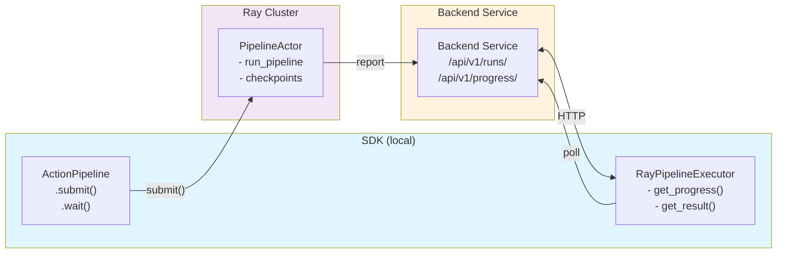

# Remote Pipeline Execution

Multi-action pipeline execution on Ray clusters with progress tracking and checkpointing.

## Architecture



**Key Design Decision:** Ray Workflows is deprecated. We use a single persistent Ray actor + custom orchestration via a backend service.

## Quick Start

```python
from synapse_sdk.plugins.pipelines import ActionPipeline
from synapse_sdk.plugins.executors.ray import RayPipelineExecutor

pipeline = ActionPipeline([DownloadAction, ConvertAction, TrainAction])

executor = RayPipelineExecutor(
    ray_address='auto',
    working_dir='/path/to/plugin',
    pipeline_service_url='http://localhost:8100',
)

# Remote execution
run_id = pipeline.submit({'dataset': 123}, executor)
progress = executor.get_progress(run_id)
result = pipeline.wait(run_id, executor)

# Stream progress with Rich display (sync)
from synapse_sdk.plugins.pipelines import display_progress
final = display_progress(executor.stream_progress(run_id))

# Stream progress with Rich display (async)
from synapse_sdk.plugins.pipelines import display_progress_async
final = await display_progress_async(executor.stream_progress_async(run_id))

# Resume from a failed run
new_run_id = pipeline.submit({'dataset': 123}, executor, resume_from=run_id)

# Local execution (unchanged)
result = pipeline.execute(params, ctx)
```

## File Structure

```
synapse_sdk/
├── plugins/pipelines/
│   ├── action_pipeline.py   # ActionPipeline with submit()/wait()
│   ├── context.py           # PipelineContext (shared working dir)
│   ├── display.py           # Rich console progress display
│   └── models.py            # PipelineProgress, ActionProgress, RunStatus
├── clients/pipeline/
│   └── client.py            # PipelineServiceClient (backend client, SSE streaming)
└── plugins/executors/ray/
    └── pipeline.py          # RayPipelineExecutor, _PipelineExecutorActor
```

## API Reference

### SDK Classes

| Class/Function | Location | Purpose |
|----------------|----------|---------|
| `ActionPipeline` | `plugins/pipelines/action_pipeline.py` | Chain actions, local or remote |
| `RayPipelineExecutor` | `plugins/executors/ray/pipeline.py` | Submit to Ray, track progress |
| `PipelineServiceClient` | `clients/pipeline/client.py` | Communicate with backend service |
| `PipelineContext` | `plugins/pipelines/context.py` | Shared working directory |
| `PipelineProgress` | `plugins/pipelines/models.py` | Progress state model |
| `display_progress()` | `plugins/pipelines/display.py` | Rich console progress (sync) |
| `display_progress_async()` | `plugins/pipelines/display.py` | Rich console progress (async) |
| `stream_progress()` | `RayPipelineExecutor` method | SSE progress generator (sync) |
| `stream_progress_async()` | `RayPipelineExecutor` method | SSE progress generator (async) |

## Design Decisions

| Decision | Choice | Rationale |
|----------|--------|-----------|
| Orchestration | Custom (not Ray Workflows) | Ray Workflows deprecated |
| Execution | Single persistent Ray actor | Shared filesystem, simpler state |
| Working dir | `/tmp/synapse_pipelines/{id}` | Ephemeral, auto-cleanup on reboot |
| Progress store | External backend service | Decoupled from Ray, queryable |
| Checkpointing | Yes | Enable resume on failure |

## Remaining Work

### Phase 2: Progress Streaming (Complete)
- [x] SSE endpoint: `GET /runs/{id}/progress/stream`
- [x] `executor.stream_progress()` generator
- [x] Rich console progress display (`display_progress()`)

### Phase 3: Checkpointing & Resume (Complete)
- [x] `submit(resume_from=run_id)` - Resume from latest checkpoint of a previous run
- [x] Skip completed actions on resume (marks them as SKIPPED)
- [x] Restore accumulated params from checkpoint's `params_snapshot`

### Phase 4: DAG Pipelines (Future)
- [ ] Parallel action branches
- [ ] Per-action resource requirements
- [ ] Dependency graph execution

## Troubleshooting

**Ray actor fails to import actions:**
- Ensure `working_dir` contains the plugin code
- Check `include_sdk=True` if using local SDK changes
- Actions must be in a proper module (not `__main__`), importable on the remote worker

**Remote cluster connectivity:**
- Use `actor_pipeline_service_url` parameter for the URL the actor should use
- The local SDK uses `pipeline_service_url` (e.g., `localhost:8100`)
- The remote actor uses `actor_pipeline_service_url` (e.g., internal network address)

```python
executor = RayPipelineExecutor(
    ray_address="ray://remote-cluster:10001",
    pipeline_service_url="http://localhost:8100",  # Local SDK access
    actor_pipeline_service_url="http://internal-service:8100",  # Actor access
    include_sdk=True,
)
```
