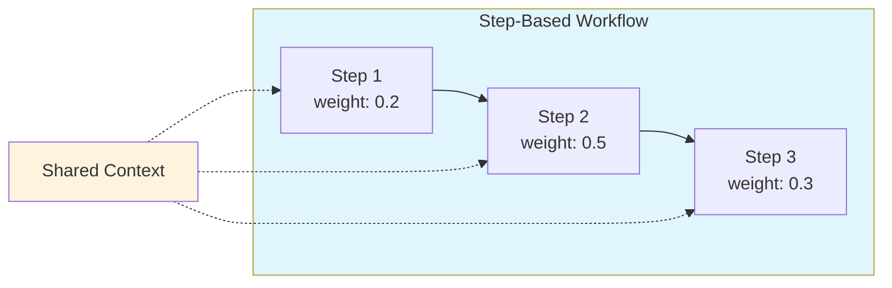
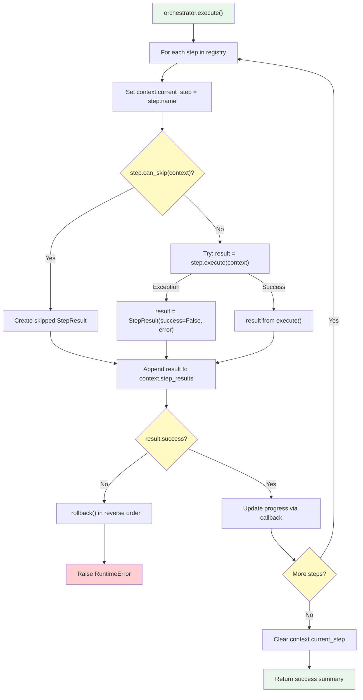

# Step Implementation Guide

Step-based workflows enable complex multi-phase operations with progress tracking, conditional execution, and automatic rollback on failure.

## Overview

Steps are composable building blocks for workflows. Each step:
- Has a unique name and progress weight
- Executes independently with shared context
- Can be skipped conditionally
- Supports rollback on workflow failure



---

## Core Components

### BaseStep[C]

Location: `synapse_sdk/plugins/steps/base.py`

Abstract base class for all workflow steps. Generic type `C` must extend `BaseStepContext`.

```python
from abc import ABC, abstractmethod
from synapse_sdk.plugins.steps import BaseStep, StepResult

class BaseStep[C: BaseStepContext](ABC):
    @property
    @abstractmethod
    def name(self) -> str:
        """Unique step identifier."""
        ...

    @property
    @abstractmethod
    def progress_weight(self) -> float:
        """Weight for progress calculation (0.0-1.0)."""
        ...

    @abstractmethod
    def execute(self, context: C) -> StepResult:
        """Execute the step logic."""
        ...

    def can_skip(self, context: C) -> bool:
        """Optional: Return True to skip this step."""
        return False

    def rollback(self, context: C, result: StepResult) -> None:
        """Optional: Cleanup when a later step fails."""
        pass
```

### StepResult

Location: `synapse_sdk/plugins/steps/base.py`

Dataclass representing step execution outcome.

```python
from dataclasses import dataclass, field
from datetime import datetime
from typing import Any

@dataclass
class StepResult:
    success: bool = True                              # Did step complete successfully?
    data: dict[str, Any] = field(default_factory=dict)  # Output data
    error: str | None = None                          # Error message if failed
    rollback_data: dict[str, Any] = field(default_factory=dict)  # Data for rollback
    skipped: bool = False                             # Was step skipped?
    timestamp: datetime = field(default_factory=datetime.now)
```

### BaseStepContext

Location: `synapse_sdk/plugins/steps/context.py`

Base class for shared state between steps.

```python
from dataclasses import dataclass, field
from synapse_sdk.plugins.context import RuntimeContext

@dataclass
class BaseStepContext:
    runtime_ctx: RuntimeContext                    # Logger, env, clients
    step_results: list[StepResult] = field(default_factory=list)
    errors: list[str] = field(default_factory=list)
    current_step: str | None = None               # Set by Orchestrator

    def log(self, event: str, data: dict, file: str | None = None) -> None:
        """Log an event via runtime context."""
        self.runtime_ctx.log(event, data, file)

    def set_progress(self, current: int, total: int, category: str | None = None) -> None:
        """Set progress. Uses current_step as category if not provided."""
        effective_category = category or self.current_step
        self.runtime_ctx.set_progress(current, total, effective_category)

    def set_metrics(self, value: dict, category: str | None = None) -> None:
        """Set metrics. Uses current_step as category if not provided."""
        effective_category = category or self.current_step
        self.runtime_ctx.set_metrics(value, effective_category)
```

### StepRegistry[C]

Location: `synapse_sdk/plugins/steps/registry.py`

Manages ordered collection of steps.

```python
from synapse_sdk.plugins.steps import StepRegistry, BaseStep

registry = StepRegistry[MyContext]()

# Register steps in order
registry.register(Step1())
registry.register(Step2())
registry.register(Step3())

# Dynamic insertion
registry.insert_after('step1', NewStep())   # Insert after step1
registry.insert_before('step3', NewStep())  # Insert before step3

# Remove step
registry.unregister('step_name')

# Access
steps = registry.get_steps()      # Returns copy of step list
total = registry.total_weight     # Sum of all progress weights
```

### Orchestrator[C]

Location: `synapse_sdk/plugins/steps/orchestrator.py`

Executes steps with progress tracking and automatic rollback.

```python
from synapse_sdk.plugins.steps import Orchestrator, StepRegistry

orchestrator = Orchestrator(
    registry=registry,
    context=context,
    progress_callback=lambda curr, total: print(f"{curr}%"),
)

result = orchestrator.execute()
# Returns: {'success': True, 'steps_executed': 3, 'steps_total': 3}
```

---

## Creating Custom Steps

### Step 1: Define Context

Create a context class with fields for shared state:

```python
from dataclasses import dataclass, field
from synapse_sdk.plugins.steps import BaseStepContext

@dataclass
class ImageProcessingContext(BaseStepContext):
    """Context for image processing workflow."""

    # Input parameters
    input_dir: str = ''
    output_dir: str = ''
    resize_width: int = 800

    # Shared state populated by steps
    image_paths: list[str] = field(default_factory=list)
    processed_images: list[str] = field(default_factory=list)
    failed_images: list[str] = field(default_factory=list)
    total_bytes_saved: int = 0
```

### Step 2: Implement Steps

```python
import os
from synapse_sdk.plugins.steps import BaseStep, StepResult

class DiscoverImagesStep(BaseStep[ImageProcessingContext]):
    """Find all images in input directory."""

    @property
    def name(self) -> str:
        return 'discover_images'

    @property
    def progress_weight(self) -> float:
        return 0.1  # 10% of workflow

    def execute(self, context: ImageProcessingContext) -> StepResult:
        # Find images
        images = []
        for file in os.listdir(context.input_dir):
            if file.lower().endswith(('.jpg', '.jpeg', '.png')):
                images.append(os.path.join(context.input_dir, file))

        if not images:
            return StepResult(
                success=False,
                error=f"No images found in {context.input_dir}",
            )

        # Store in context for next steps
        context.image_paths = images

        return StepResult(
            success=True,
            data={'image_count': len(images)},
        )


class ResizeImagesStep(BaseStep[ImageProcessingContext]):
    """Resize all discovered images."""

    @property
    def name(self) -> str:
        return 'resize_images'

    @property
    def progress_weight(self) -> float:
        return 0.7  # 70% of workflow

    def execute(self, context: ImageProcessingContext) -> StepResult:
        processed = []
        failed = []
        bytes_saved = 0

        for i, path in enumerate(context.image_paths):
            # Report progress within step
            context.set_progress(i + 1, len(context.image_paths))

            try:
                output_path, saved = self._resize_image(
                    path,
                    context.output_dir,
                    context.resize_width,
                )
                processed.append(output_path)
                bytes_saved += saved
            except Exception as e:
                failed.append(path)
                context.log('resize_failed', {'path': path, 'error': str(e)})

        # Update context
        context.processed_images = processed
        context.failed_images = failed
        context.total_bytes_saved = bytes_saved

        return StepResult(
            success=True,
            data={
                'processed': len(processed),
                'failed': len(failed),
                'bytes_saved': bytes_saved,
            },
            rollback_data={'output_files': processed},  # For cleanup
        )

    def rollback(self, context: ImageProcessingContext, result: StepResult) -> None:
        """Delete processed files on failure."""
        for path in result.rollback_data.get('output_files', []):
            try:
                os.remove(path)
            except OSError:
                context.errors.append(f"Failed to delete: {path}")

    def _resize_image(self, path: str, output_dir: str, width: int) -> tuple[str, int]:
        # Image resizing implementation
        ...


class GenerateReportStep(BaseStep[ImageProcessingContext]):
    """Generate summary report."""

    @property
    def name(self) -> str:
        return 'generate_report'

    @property
    def progress_weight(self) -> float:
        return 0.2  # 20% of workflow

    def can_skip(self, context: ImageProcessingContext) -> bool:
        # Skip if nothing was processed
        return len(context.processed_images) == 0

    def execute(self, context: ImageProcessingContext) -> StepResult:
        report = {
            'total_images': len(context.image_paths),
            'processed': len(context.processed_images),
            'failed': len(context.failed_images),
            'bytes_saved': context.total_bytes_saved,
        }

        # Log report
        context.log('processing_complete', report)

        return StepResult(success=True, data=report)
```

### Step 3: Run Workflow

```python
from synapse_sdk.plugins.steps import StepRegistry, Orchestrator

def process_images(runtime_ctx, input_dir: str, output_dir: str) -> dict:
    # Create registry and register steps
    registry = StepRegistry[ImageProcessingContext]()
    registry.register(DiscoverImagesStep())
    registry.register(ResizeImagesStep())
    registry.register(GenerateReportStep())

    # Create context
    context = ImageProcessingContext(
        runtime_ctx=runtime_ctx,
        input_dir=input_dir,
        output_dir=output_dir,
    )

    # Execute with progress callback
    def on_progress(current: int, total: int):
        runtime_ctx.set_progress(current, total, category='overall')

    orchestrator = Orchestrator(
        registry=registry,
        context=context,
        progress_callback=on_progress,
    )

    try:
        result = orchestrator.execute()
        return {
            'success': True,
            'processed': len(context.processed_images),
            'failed': len(context.failed_images),
        }
    except RuntimeError as e:
        return {
            'success': False,
            'error': str(e),
            'errors': context.errors,
        }
```

---

## Orchestrator Execution Flow



### Key Behaviors

1. **Sequential Execution**: Steps run in registration order
2. **Auto-Category**: `context.current_step` is set automatically for logging/metrics
3. **Progress Calculation**: Based on cumulative step weights
4. **Automatic Rollback**: On failure, `rollback()` called in reverse order
5. **Best-Effort Rollback**: Rollback errors logged but don't stop other rollbacks

---

## Utility Steps

### LoggingStep

Wraps any step with start/end logging:

```python
from synapse_sdk.plugins.steps.utils import LoggingStep

# Wrap a step
logged_step = LoggingStep(ResizeImagesStep())

# Logs:
# - step_start: {step: 'logged_resize_images'}
# - step_end: {step: 'logged_resize_images', elapsed: 1.23, success: True}
```

### TimingStep

Wraps any step to measure execution duration:

```python
from synapse_sdk.plugins.steps.utils import TimingStep

timed_step = TimingStep(ResizeImagesStep())

# Result includes:
# result.data['duration_seconds'] = 1.234567
```

### ValidationStep

Validates context state before proceeding:

```python
from synapse_sdk.plugins.steps.utils import ValidationStep

def validate_input(context: ImageProcessingContext) -> tuple[bool, str | None]:
    if not context.input_dir:
        return False, "input_dir is required"
    if not os.path.isdir(context.input_dir):
        return False, f"Directory not found: {context.input_dir}"
    return True, None

validate_step = ValidationStep(
    validator=validate_input,
    name='validate_input',
    progress_weight=0.05,
)

registry.register(validate_step)
registry.register(DiscoverImagesStep())
# ...
```

### Composing Utility Steps

```python
from synapse_sdk.plugins.steps.utils import LoggingStep, TimingStep

# Combine wrappers
step = LoggingStep(TimingStep(ResizeImagesStep()))

# Result: logged + timed step
# Logs start/end AND measures duration
```

---

## Built-in Action Steps

Several specialized action classes provide pre-built steps for common workflows.

### BaseUploadAction Built-in Steps

The `BaseUploadAction` includes 7 comprehensive built-in steps for upload workflows:

#### 1. InitializeStep
- **Purpose**: Set up upload context and validate initial parameters
- **Progress Weight**: 0.05
- **Context Updates**: Initializes storage client, project, data collection

#### 2. ValidateFilesStep
- **Purpose**: Verify all files exist and are accessible
- **Progress Weight**: 0.10
- **Validation**: Checks file existence, permissions, and size
- **Rollback**: N/A (no resources created)

#### 3. AnalyzeCollectionStep
- **Purpose**: Analyze data collection structure
- **Progress Weight**: 0.05
- **Context Updates**: Collection metadata and structure

#### 4. OrganizeFilesStep
- **Purpose**: Organize files based on upload mode (single/multi-path)
- **Progress Weight**: 0.15
- **Context Updates**: `organized_files` dictionary
- **Rollback**: Cleans up temporary organization files

#### 5. GenerateDataUnitsStep
- **Purpose**: Generate data unit metadata for backend
- **Progress Weight**: 0.10
- **Context Updates**: `data_units` list
- **Rollback**: N/A (metadata only)

#### 6. UploadFilesStep
- **Purpose**: Upload files to storage with progress tracking
- **Progress Weight**: 0.50
- **Context Updates**: `uploaded_files` list
- **Rollback**: Deletes uploaded files from storage
- **Features**: Parallel upload support, retry logic

#### 7. ProcessMetadataStep
- **Purpose**: Process and save Excel metadata if provided
- **Progress Weight**: 0.05
- **Skip Condition**: No Excel metadata provided
- **Context Updates**: Metadata processing results

Usage example:

```python
from synapse_sdk.plugins.actions.upload import BaseUploadAction, UploadContext

class MyUploadAction(BaseUploadAction[UploadParams]):
    # Uses all 7 built-in steps by default
    # No setup_steps() override needed

    # OR customize:
    def setup_steps(self, registry: StepRegistry[UploadContext]) -> None:
        # Option 1: Use parent's built-in steps
        super().setup_steps(registry)

        # Option 2: Add custom steps before/after
        registry.insert_before('upload_files', MyPreUploadStep())
        registry.insert_after('upload_files', MyPostUploadStep())

        # Option 3: Replace specific steps
        registry.unregister('process_metadata')
        registry.register(MyCustomMetadataStep())
```

### BaseExportAction Built-in Steps

The `BaseExportAction` (specifically `DefaultExportAction`) includes 6 comprehensive built-in steps for export workflows:

#### 1. InitializeStep
- **Purpose**: Storage/path setup and output directory creation
- **Progress Weight**: 0.05
- **Context Updates**: storage, path_root, unique_export_path, output_paths (json, origin_files)
- **Rollback**: Removes created export directories

#### 2. FetchResultsStep
- **Purpose**: Target handler data retrieval from API
- **Progress Weight**: 0.10
- **Context Updates**: handler, results, total_count
- **Validation**: Checks target parameter, handles API errors
- **Rollback**: Clears results and handler

#### 3. PrepareExportStep
- **Purpose**: Build export params and retrieve project configuration
- **Progress Weight**: 0.10
- **Context Updates**: export_params, configuration, project_id, export_items
- **Skip Condition**: No results to export (total_count == 0)
- **Rollback**: Clears export_params and configuration

#### 4. ConvertDataStep
- **Purpose**: Data conversion pipeline (before_convert -> convert_data -> after_convert)
- **Progress Weight**: 0.30
- **Context Updates**: converted_items list
- **Skip Condition**: No results to convert
- **Rollback**: Clears converted_items

#### 5. SaveFilesStep
- **Purpose**: Save original files and JSON data files with metrics tracking
- **Progress Weight**: 0.35
- **Context Updates**: errors_json, errors_original, exported_count, failed_count
- **Skip Condition**: No items to save
- **Rollback**: Clears error lists and counts

#### 6. FinalizeStep
- **Purpose**: Additional file saving, error list generation, cleanup
- **Progress Weight**: 0.10
- **Context Updates**: output_path
- **Features**: Calls exporter's additional_file_saving(), saves error list file
- **Always Runs**: Cannot be skipped

Usage example:

```python
from synapse_sdk.plugins.actions.export import DefaultExportAction, ExportContext
from synapse_sdk.plugins.steps import StepRegistry

class MyExportAction(DefaultExportAction):
    # Uses all 6 built-in steps by default
    # No setup_steps() override needed
    pass

    # OR customize:
    def setup_steps(self, registry: StepRegistry[ExportContext]) -> None:
        # Option 1: Use parent's built-in steps
        super().setup_steps(registry)

        # Option 2: Add custom steps before/after
        registry.insert_before('convert_data', MyValidationStep())
        registry.insert_after('save_files', MyNotificationStep())

        # Option 3: Replace specific steps
        registry.unregister('finalize')
        registry.register(MyCustomFinalizeStep())
```

### AddTaskDataAction Built-in Steps

The `AddTaskDataAction` includes step-based workflows for FILE and INFERENCE methods:

#### FILE Method Steps:
1. **ValidateFileStep**: Verify file exists and format
2. **LoadAnnotationsStep**: Load annotations from file
3. **ProcessTasksStep**: Process and validate task data
4. **UploadAnnotationsStep**: Upload task annotations to backend

#### INFERENCE Method Steps:
1. **LoadModelStep**: Load inference model
2. **RunInferenceStep**: Execute inference on tasks
3. **FormatResultsStep**: Format predictions as annotations
4. **UploadAnnotationsStep**: Upload generated annotations

Usage example:

```python
from synapse_sdk.plugins.actions import AddTaskDataAction, AddTaskDataMethod

class MyAddTaskDataAction(AddTaskDataAction[AddTaskDataParams]):
    # Built-in steps are automatically configured based on method
    # No manual step registration needed
    pass
```

### Dataset Conversion Steps

The `DatasetAction` includes conversion steps:

#### ConvertDatasetStep
- **Purpose**: Convert dataset between formats (DM ↔ YOLO, COCO, etc.)
- **Progress Weight**: Configurable
- **Features**: Multi-format support via converter registry

#### ExportDatasetStep
- **Purpose**: Export dataset from backend to local file system
- **Progress Weight**: Configurable
- **Features**: Streaming download, progress tracking

Usage example:

```python
from synapse_sdk.plugins.actions.dataset import DatasetAction, DatasetOperation

# Conversion is handled automatically based on operation
result = run_plugin('plugin', 'dataset', {
    'dataset': 123,
    'operation': DatasetOperation.CONVERT,
    'target_format': 'yolo'
})
```

---

## Integration with Actions

### BaseTrainAction Example

```python
from synapse_sdk.plugins.actions.train import BaseTrainAction, TrainContext
from synapse_sdk.plugins.steps import StepRegistry

class MyTrainAction(BaseTrainAction[TrainParams]):
    def setup_steps(self, registry: StepRegistry[TrainContext]) -> None:
        """Override to register training steps."""
        registry.register(PrepareDatasetStep())
        registry.register(InitializeModelStep())
        registry.register(TrainModelStep())
        registry.register(SaveCheckpointStep())
        registry.register(UploadModelStep())

    def execute(self) -> dict:
        # BaseTrainAction handles orchestration
        return super().execute()
```

### BaseUploadAction Example

```python
from synapse_sdk.plugins.actions.upload import BaseUploadAction, UploadContext
from synapse_sdk.plugins.steps import StepRegistry

class MyUploadAction(BaseUploadAction[UploadParams]):
    def setup_steps(self, registry: StepRegistry[UploadContext]) -> None:
        registry.register(ValidateFilesStep())
        registry.register(OrganizeFilesStep())
        registry.register(UploadFilesStep())
        registry.register(VerifyUploadStep())
```

---

## Progress Weight Guidelines

Progress weights should reflect **perceived duration** for better UX:

| Step Type | Typical Weight | Notes |
|-----------|---------------|-------|
| Validation | 0.05 - 0.10 | Quick checks |
| Data loading | 0.10 - 0.20 | I/O bound |
| Processing | 0.50 - 0.80 | Main work |
| Cleanup/Report | 0.05 - 0.10 | Finalization |

**Example Distribution:**

```python
class ValidateStep(BaseStep):
    progress_weight = 0.05   # 5%

class LoadDataStep(BaseStep):
    progress_weight = 0.15   # 15%

class ProcessStep(BaseStep):
    progress_weight = 0.70   # 70%

class SaveResultsStep(BaseStep):
    progress_weight = 0.10   # 10%
# Total: 1.0 (100%)
```

---

## Best Practices

### Context Design

```python
# Good: Clear field purposes
@dataclass
class GoodContext(BaseStepContext):
    # Input (set at creation)
    config_path: str

    # Intermediate state (populated by steps)
    loaded_data: dict = field(default_factory=dict)

    # Output (final results)
    results: list = field(default_factory=list)
```

### Error Handling

```python
def execute(self, context: MyContext) -> StepResult:
    try:
        result = self._do_work(context)
        return StepResult(success=True, data=result)
    except ValidationError as e:
        # Expected error - return failure
        return StepResult(success=False, error=str(e))
    except Exception as e:
        # Unexpected error - log and return failure
        context.log('unexpected_error', {'error': str(e)})
        return StepResult(success=False, error=f"Unexpected: {e}")
```

### Rollback Design

```python
def execute(self, context: MyContext) -> StepResult:
    created_files = []

    for item in context.items:
        path = self._create_file(item)
        created_files.append(path)

    return StepResult(
        success=True,
        rollback_data={'files': created_files},  # Save for cleanup
    )

def rollback(self, context: MyContext, result: StepResult) -> None:
    for path in result.rollback_data.get('files', []):
        try:
            os.remove(path)
        except OSError as e:
            # Log but continue rollback
            context.errors.append(f"Rollback failed for {path}: {e}")
```

### Step Independence

```python
# Good: Step reads from context, writes to context
class ProcessStep(BaseStep[MyContext]):
    def execute(self, context: MyContext) -> StepResult:
        # Read from context (set by previous step)
        data = context.loaded_data

        # Process
        results = self._process(data)

        # Write to context (for next step)
        context.results = results

        return StepResult(success=True)
```

---

## File Structure

```
synapse_sdk/plugins/steps/
├── __init__.py          # Public exports
├── base.py              # BaseStep, StepResult
├── context.py           # BaseStepContext
├── registry.py          # StepRegistry
├── orchestrator.py      # Orchestrator
└── utils/
    ├── __init__.py
    ├── logging.py       # LoggingStep
    ├── timing.py        # TimingStep
    └── validation.py    # ValidationStep
```

---

## Related Documentation

- **[PLUGIN_STRUCTURE_GUIDE.md](PLUGIN_STRUCTURE_GUIDE.md)** - Complete plugin structure with step orchestration examples
- **[ARCHITECTURE.md](ARCHITECTURE.md)** - Overall plugin system architecture
- **[OVERVIEW.md](OVERVIEW.md)** - Getting started with plugins
- **[README.md](README.md)** - Quick reference and extension guide
