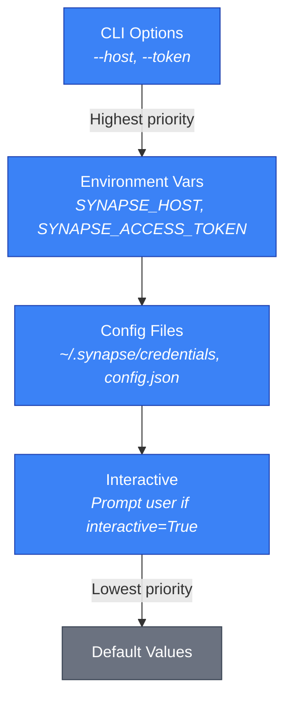
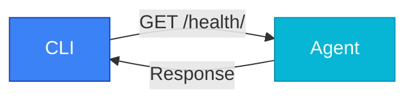

# Configuration

Configure Synapse SDK for your environment and use cases.

:::info[Prerequisites]

Complete the [Installation Guide](./installation.md) before configuring Synapse SDK.

:::

## Overview

Synapse SDK provides multiple configuration methods to suit different workflows. All configuration files are stored in `~/.synapse/` with secure permissions (`0o600`).

### At a Glance

| Method | Best For | Command/File |
|--------|----------|--------------|
| CLI | Interactive setup, first-time configuration | `synapse login`, `synapse agent select` |
| Environment Variables | CI/CD pipelines, containers | `SYNAPSE_HOST`, `SYNAPSE_ACCESS_TOKEN` |
| Configuration Files | Persistent settings, multi-environment | `~/.synapse/credentials`, `config.json`, `config.yaml` |

### Configuration Files

| File | Format | Purpose |
|------|--------|---------|
| `~/.synapse/credentials` | Text | Backend authentication (host, access token) |
| `~/.synapse/config.json` | JSON | Agent configuration (ID, URL, token) |
| `~/.synapse/config.yaml` | YAML | MCP multi-environment settings |

## Configuration Priority

The SDK resolves configuration values in the following order (highest to lowest priority):



**Example Scenario**:

If you have `SYNAPSE_HOST` set in your environment and also in `~/.synapse/credentials`:

```bash
# Environment variable
export SYNAPSE_HOST="https://env.synapse.sh"

# Credentials file contains: SYNAPSE_HOST=https://file.synapse.sh

# Result: SDK uses https://env.synapse.sh (environment variable wins)
```

## Configuration Methods

### CLI Configuration

The CLI provides interactive commands for configuration.

#### Authentication

Run `synapse login` to authenticate with the Synapse backend:

```bash
synapse login
```

You will be prompted to enter:
- **Host**: Backend API URL (default: `https://api.synapse.sh`)
- **Access Token**: Your Synapse API token

The credentials are saved to `~/.synapse/credentials`.

#### Agent Selection

Select an agent using the interactive interface:

```bash
synapse agent select
```

This command:
1. Fetches available agents from the backend
2. Displays agents in a table format
3. Prompts you to select an agent by ID
4. Tests the connection automatically
5. Saves the configuration to `~/.synapse/config.json`

> **Good to know**: Connection tests only run when configuring settings, not on CLI startup.

#### View Current Configuration

Display the current agent configuration:

```bash
synapse agent show
```

#### Clear Configuration

Remove the stored agent configuration:

```bash
synapse agent clear
```

### Environment Variables

Environment variables take precedence over configuration files.

| Variable | Description | Default |
|----------|-------------|---------|
| `SYNAPSE_HOST` | Backend API URL | `https://api.synapse.sh` |
| `SYNAPSE_ACCESS_TOKEN` | API access token | None |

Set environment variables in your shell:

```bash filename="~/.bashrc"
export SYNAPSE_HOST="https://api.synapse.sh"
export SYNAPSE_ACCESS_TOKEN="your-token-here"
```

Or use them inline:

```bash
SYNAPSE_ACCESS_TOKEN="your-token" synapse agent select
```

> **Tip**: Use environment variables in CI/CD pipelines to avoid storing credentials in files.

### Configuration Files

Configuration files provide persistent storage for your settings.

## Configuration File Reference

### Credentials File

The credentials file stores backend authentication.

**Location**: `~/.synapse/credentials`

**Format**:

```text filename="~/.synapse/credentials"
SYNAPSE_HOST=https://api.synapse.sh
SYNAPSE_ACCESS_TOKEN=your-access-token-here
```

> **Warning**: This file contains sensitive credentials. Ensure it has restrictive permissions (`chmod 600 ~/.synapse/credentials`).

### Agent Configuration

The agent configuration stores your selected agent details.

**Location**: `~/.synapse/config.json`

**Schema**:

```json filename="~/.synapse/config.json"
{
  "agent": {
    "id": 123,
    "name": "My Development Agent",
    "url": "https://agent.synapse.sh",
    "token": "your-agent-token"
  }
}
```

**Fields**:

| Field | Type | Required | Description |
|-------|------|----------|-------------|
| `agent.id` | `int` | Yes | Unique agent identifier |
| `agent.name` | `string` | No | Human-readable agent name |
| `agent.url` | `string` | No | Agent API endpoint URL |
| `agent.token` | `string` | No | Agent authentication token |

### MCP Configuration

The MCP (Model Context Protocol) configuration supports multiple environments.

**Location**: `~/.synapse/config.yaml`

**Schema**:

```yaml filename="~/.synapse/config.yaml"
default_environment: development

environments:
  development:
    backend_url: https://api.synapse.sh
    access_token: your-dev-token
    tenant: dev-tenant
    agent_id: 123
    agent_name: Dev Agent
    agent_url: https://dev-agent.synapse.sh
    agent_token: dev-agent-token
    plugin_paths:
      - ./plugins
      - ~/my-plugins

  production:
    backend_url: https://api.synapse.sh
    access_token: your-prod-token
    tenant: prod-tenant
    agent_id: 456
    agent_name: Prod Agent
    agent_url: https://prod-agent.synapse.sh
    agent_token: prod-agent-token
    plugin_paths:
      - /opt/synapse/plugins
```

**Environment Fields**:

| Field | Type | Description |
|-------|------|-------------|
| `backend_url` | `string` | Backend API URL |
| `access_token` | `string` | Backend access token |
| `tenant` | `string` | Tenant identifier |
| `agent_id` | `int` | Agent ID |
| `agent_name` | `string` | Agent display name |
| `agent_url` | `string` | Agent endpoint URL |
| `agent_token` | `string` | Agent authentication token |
| `plugin_paths` | `list[string]` | Directories to search for plugins |

#### Initialize MCP Configuration

Create a new MCP configuration file with example values:

```bash
synapse mcp init
```

#### Managing Multiple Environments

Switch between environments programmatically:

```python filename="examples/switch_environment.py"
from synapse_sdk.mcp.config import ConfigManager

config = ConfigManager()

# Get active environment
env = config.get_active_environment()
print(f"Active: {env.backend_url}")

# Switch environment
config.set_active_environment("production")
```

> **Good to know**: Each environment maintains separate backend and agent configurations, allowing seamless switching between development and production.

## Troubleshooting

### Connection Testing

The SDK tests connections to agents using the `/health/` endpoint.

When you configure an agent, the CLI automatically tests the connection:



| Status Code | Result |
|-------------|--------|
| 200 | Connection successful |
| 401 | Invalid agent token |
| 403 | Access forbidden |
| Timeout | Connection timeout (>5s) |
| Error | Connection failed |

#### Manual Connection Test

Test agent connectivity programmatically:

```python filename="examples/test_connection.py"
from synapse_sdk.cli.agent.select import check_agent_connection

result = check_agent_connection(
    url="https://agent.synapse.sh",
    token="your-agent-token",
    timeout=5
)

if result.success:
    print(f"Connected: {result.message}")
else:
    print(f"Failed: {result.message}")
```

### Authentication Failed (401)

**Symptom**: "Invalid agent token" error

**Cause**: The access token or agent token is incorrect or expired.

**Solution**:
1. Verify your token is correct
2. Re-authenticate using `synapse login`
3. Re-select the agent using `synapse agent select`

### Access Forbidden (403)

**Symptom**: "Access forbidden" error

**Cause**: The token is valid but lacks permissions.

**Solution**:
1. Check your tenant configuration
2. Verify the agent is accessible to your account
3. Contact your administrator for permissions

### Connection Timeout

**Symptom**: "Connection timeout" error

**Cause**: The agent is unreachable or slow to respond.

**Solution**:
1. Check if the agent URL is correct
2. Verify network connectivity
3. Ensure the agent service is running
4. Check firewall settings

### Permission Denied on Config Files

**Symptom**: "Permission denied" when reading/writing config files

**Cause**: Incorrect file permissions on `~/.synapse/` directory or files.

**Solution**:

```bash
# Fix directory permissions
chmod 700 ~/.synapse

# Fix file permissions
chmod 600 ~/.synapse/credentials
chmod 600 ~/.synapse/config.json
chmod 600 ~/.synapse/config.yaml
```

### Environment Variable Not Applied

**Symptom**: Environment variable settings are ignored

**Cause**: Variable names are incorrect or not exported.

**Solution**:
1. Verify variable names match exactly (`SYNAPSE_HOST`, `SYNAPSE_ACCESS_TOKEN`)
2. Ensure variables are exported: `export SYNAPSE_ACCESS_TOKEN="token"`
3. Check for typos in variable values

## Related

- [CLI Usage](./operations/cli-usage.md) - Complete CLI command reference
- [Quickstart](./quickstart.md) - Getting started with Synapse SDK
- [Plugins](./plugins/index.md) - Plugin development guide
